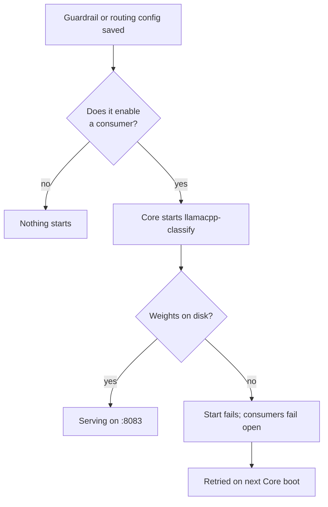

Several parts of Ryu need a model to answer a small, structured question rather than hold a
conversation: *is this turn a prompt injection?*, *which routing rule does this message match?*,
*does this response leak PII?* Those questions want a model that is cheap, local, and always
warm — the opposite of the model you chat with.

The classifier tier is that model. It is a dedicated `llama.cpp` instance serving one small
instruction-tuned model on its own loopback port, so a classification never competes with chat
for memory or a GPU.

## Why a separate tier

Ryu's chat engine is a **mutually-exclusive resident** — one `llama-server` process serves one
model at a time. A classifier that shared it would either evict your chat model or, worse,
silently run the classification *on* your chat model: `llama-server` serves whatever weights it
loaded and ignores the `model` field in a request, so a small-model id sent to the chat port
resolves to the big model with no error anywhere.

So the classifier gets its own process and its own port, exactly as embeddings and reranking do.

| Tier | Port (release) | Serves |
|---|---|---|
| Chat engine | 8080 | The resident chat model (mutually exclusive) |
| Embeddings | 8081 | The embedding model for RAG and semantic ranking |
| Reranker | 8082 | The cross-encoder for neural reranking |
| **Classifier** | **8083** | **The small instruction-tuned classifier** |

Every port is profile-aware, so a dev profile shifts them by 1000 (`9083` for the classifier).
See [Environment variables](/docs/start-here/environment-variables).

## What consumes it

Three call sites, all of which need a verdict in well under a second and all of which
**fail open** — availability wins over enforcement:

| Consumer | What it asks | Where |
|---|---|---|
| Firewall LLM inspector | Is this inbound turn an injection, or does it leak PII/secrets? | [Gateway security](/docs/gateway/security) |
| Smart-routing classifier | Which natural-language routing rule does this message match? | [Routing](/docs/gateway/routing) |
| LLM-judge evaluators | Does this response violate the rubric (toxicity, bias, PII leakage)? | [Evals and audit](/docs/gateway/evals-audit) |

Fail-open matters for understanding the tier's behaviour: if the classifier is not running,
the inspector produces **no verdict** and the turn proceeds under the regex firewall alone; smart
routing leaves the originally requested model untouched. A cold classifier degrades the
guardrail, it never blocks a request.

## The model

The default is **Gemma 3 270M** (instruction-tuned, quantization-aware-trained Q4_0), about
241 MB on disk. Google names its intended uses as *sentiment analysis, entity extraction, query
routing, unstructured-to-structured text processing, and compliance checks* — and states plainly
that it is **not** designed for complex conversational use. That is precisely the shape of the
three questions above.

### Choosing a different model

The model is a registry default, not a constant. Any GGUF that `llama.cpp` can serve and that
follows instructions well enough to answer a yes/no question with a short JSON object will work.

| Override | Effect |
|---|---|
| `RYU_LOCAL_CLASSIFIER_MODEL_ID` | Storage key and filename stem in `~/.ryu/models/<id>.gguf` |
| `RYU_LOCAL_CLASSIFIER_MODEL_URL` | Direct HTTPS URL to the GGUF (must be publicly reachable) |
| `RYU_LOCAL_CLASSIFIER_MODEL_SHA256` | Expected digest; empty disables verification |

These are **environment variables only** — deliberately not `registry.json` keys. Three
consumers read this model at three different moments in one process: onboarding downloads the
GGUF at boot, the Gateway publishes the resolved id at spawn and re-resolves on every config
push, and the sidecar resolves the weight path when a push lazily starts it. An environment
variable is frozen process-wide, so all three agree by construction. A file re-read per call
would let an operator edit the id mid-session and have the Gateway route to a model whose
weights were never downloaded — the sidecar then fails to start and every consumer fails open,
which is exactly the silent-guardrail failure this tier exists to prevent.

Core publishes the resolved id to the Gateway alongside the tier's URL, so the Gateway's
inspector and router follow your override rather than a second hardcoded copy of the default.

<Callout type="info">
Two model families are worth knowing about because they look like better fits than they are.

**FunctionGemma 270M** is a real first-party Google release and its weights run on `llama.cpp`
unchanged, but it emits function calls in a bespoke special-token format rather than JSON, and
`llama.cpp`'s server does not parse that format into structured tool calls. Google also
describes it as a fine-tuning base rather than a finished model — their own benchmark reports
58% out of the box against 85% after fine-tuning. It is a good starting point for a
*fine-tuned, task-specific* tool caller; it is not a drop-in classifier.

**Cactus Needle** is a 26M encoder-decoder built for single-shot function calling. It requires
the Cactus inference engine — there is no GGUF, ONNX, or `transformers` path — and its authors
specify at least 120 training examples *per tool* for it to generalize. Adopting it means
adopting a second runtime, not swapping a model id.
</Callout>

## Lifecycle

The classifier is **lazy and off by default**. It is not in the startup order, so it consumes
nothing until something needs it.

Core starts the tier when a Gateway config it pushes actually **enables** one of the three
consumers — enabling the inspector, enabling smart routing, or enabling an LLM-judge evaluator.
Naming the classifier model without enabling anything that would call it does not start a
process.

The weights are fetched by onboarding alongside the embedding and reranker models. That download
is non-fatal: if it fails, the binary is still installed and the tier simply cannot serve until a
later boot retries it. The desktop surfaces this state rather than reporting the tier as ready.

Because the tier is adopted rather than duplicated, an already-running server on the port is
reused instead of being competed with.

## How requests reach it

Core publishes the tier's loopback URL and resolved model id into the Gateway's environment at
spawn. The Gateway registers it as a provider named `classify`, distinct from the `local`
provider that points at the chat engine, and routes the classifier model id to it.

Routing precedence is worth knowing if you maintain your own model map: an operator's **explicit
model-map entry always wins**. That is deliberate — it is how you point classification at a
hosted model instead, if you would rather pay for it than run it. It also means a broad wildcard
entry of your own can capture the classifier id, so prefer exact entries when mapping model
families. See [Routing](/docs/gateway/routing).

## Running it against a remote Gateway

The tier is a *local* process. When Core is configured against a remote Gateway, that Gateway
dials its own loopback and will not find this node's classifier — so the tier is not started for
a remote data plane. A remote deployment wants the classifier on the Gateway's own host. See
[Managed data plane](/docs/gateway/managed-data-plane).

## Related

- [Gateway security](/docs/gateway/security) — the firewall and the LLM inspector
- [Routing](/docs/gateway/routing) — smart routing and classifier strategies
- [Model catalog](/docs/core/model-catalog) — how local models are registered and resolved
- [Swappable layers](/docs/core/swappable-layers) — the general pattern this tier follows
- [Spaces and RAG](/docs/core/spaces-rag) — the embedding and reranker tiers
