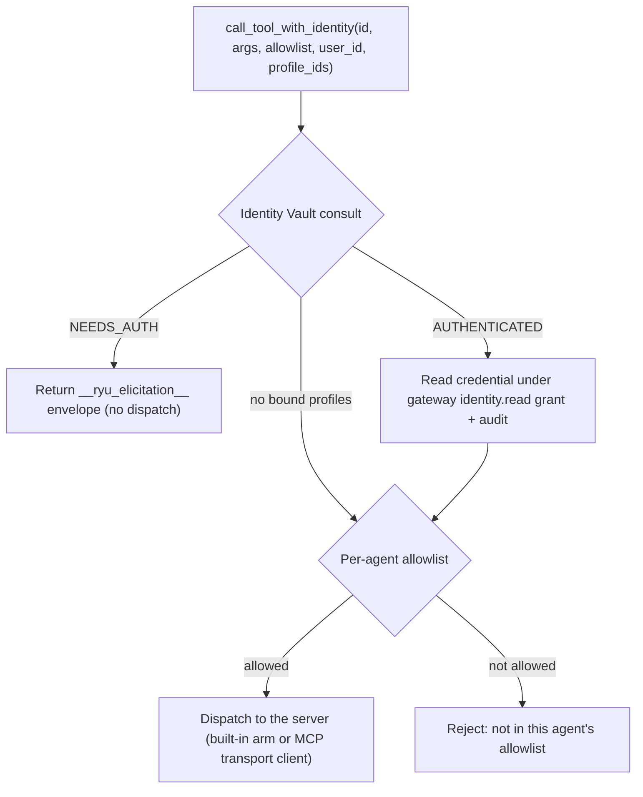

The MCP registry (`apps/core/src/sidecar/mcp/mod.rs`, `McpRegistry`) is Core's catalog of tool
servers available to agents. It speaks the Model Context Protocol, merges built-in servers with
user-configured ones, and dispatches every call through a per-agent allowlist. It is the single
tool-dispatch chokepoint: chat (ACP and openai-compat), workflows, monitors, recipes, and
programmatic tool calling all reach tools through this registry.

This page covers the registry mechanics, the built-in servers, and the governed call path. For the
search and execution layer built on top of it (the gateway tool-search front and `POST /v1/exec/tool`),
see [Unified tool catalog](/docs/core/unified-tool-catalog). For model-authored fan-out across many
tools, see [Programmatic tool calling](/docs/core/programmatic-tool-calling).

## How servers are registered

The registry always starts from the built-in servers, then overlays the user's config from
`~/.ryu/mcp.json` on top (`load_merged_servers`). A user entry with the same `name` as a config-file
built-in wins, so you can repoint or disable one. The config file uses the common `mcpServers` map
shape, so an existing MCP host config can be pasted in. Ryu accepts local stdio servers, current
Streamable HTTP servers, and legacy HTTP+SSE servers.

When Ryu updates `~/.ryu/mcp.json`, it changes only the server entry involved. Top-level metadata,
schema markers, alternate config keys, and unknown fields inside existing entries are preserved, and
concurrent settings changes are serialized before the file is atomically replaced. This lets Ryu
share a config with another MCP host without silently discarding that host's settings.

### Transport configuration

Each entry uses `type` when the source config declares it. The accepted values are:

| `type` | Connection behavior |
|---|---|
| `stdio` | Spawn `command` and exchange newline-delimited JSON-RPC over stdin/stdout. |
| `streamable-http` | POST JSON-RPC to `url`; responses may be JSON or request-scoped SSE. `http` is accepted as a compatibility alias. |
| `sse` | Open the configured SSE URL, read its `endpoint` event, then POST JSON-RPC messages to that endpoint. |

When `type` is omitted, Ryu infers stdio from `command` and Streamable HTTP from `url`.
Remote `headers` are sent on each request. Core owns protocol headers such as `Accept`,
`Content-Type`, session, and negotiated-version headers; a configured header cannot override them.
Remote URLs are screened before network access and redirects are not followed. HTTP failure details
redact configured header values before Core returns or logs them. If a legacy SSE
server announces a different-origin message endpoint, Core keeps the connection but does not
forward configured credentials to that second origin.

```json
{
  "mcpServers": {
    "local-files": {
      "type": "stdio",
      "command": "npx",
      "args": ["-y", "@modelcontextprotocol/server-filesystem", "/tmp"]
    },
    "hosted": {
      "type": "streamable-http",
      "url": "https://mcp.example.com/mcp",
      "headers": { "Authorization": "Bearer <token>" }
    },
    "legacy-hosted": {
      "type": "sse",
      "url": "https://legacy.example.com/sse"
    }
  }
}
```

| Action | Route |
|---|---|
| List registered servers | `GET /api/mcp/servers` |
| Register a server | `POST /api/mcp/servers` |
| Update a user-owned server | `PUT /api/mcp/servers/:name` |
| Remove a user-owned server | `DELETE /api/mcp/servers/:name` |
| List tools (optionally per agent) | `GET /api/mcp/tools?agent=<id>` |
| Call a tool | `POST /api/mcp/tools/call` |

User servers are hot-reloaded with no process restart (`McpRegistry::reload` re-derives built-ins,
re-overlays `mcp.json`, and clears the tool cache). A worked registration example lives in
[Register an MCP server](/docs/extend/develop/extensions/mcp-server).

Writing `mcp.json` is an administrative node mutation: registering, updating, or removing a
user-owned server requires the caller's `gateway.configure` permission. The check is applied at
Core's mutation routes, so a direct API caller cannot bypass the desktop's settings UI.

The server summary also reports whether authentication is required and whether static credentials are
configured. A conventional credential header such as `Authorization` or `X-API-Key`, or a credential
environment variable such as `OPENAI_API_KEY`, is classified as static authentication; a manifest OAuth
declaration is classified as OAuth. Credential values are never included in the summary. OAuth
connection state is managed separately through Marketplace Connections, while local `env` and `headers`
values remain on the Core node and are only shown as masked fields in the desktop settings form.

### Tool ids

Every tool has a fully-qualified id of the form `<server>.<tool>` (`TOOL_ID_SEP = "."`). A configured
server key may contain dots (for example, `io.github.acme/files`); Core resolves the longest
registered server prefix before dispatch. The legacy `server__tool` spelling is accepted only at
compatibility ingress, while new registry rows and allowlist entries use dotted ids. The id is the
unit of allowlisting and the unit of dispatch end to end.

## Built-in servers

Two kinds of built-in exist. **Ghost** is a real config-file server (`builtin_servers`) spawned per
request. The rest are **reserved providers** synthesized only in `server_summaries()` and
`list_all_tools()` and dispatched by a name-matched arm in `call_tool_with_identity` (they are not in
the `servers` map; `contains_server` checks them by name). Most degrade gracefully when their backend
is absent.

| Server | What it does | Backend / availability |
|---|---|---|
| `ghost` | Desktop automation: screen perception + input control (about 30 tools) | Spawned per request as `~/.ryu/bin/ghost mcp`. Cross-platform; unavailable until the `ghost` sidecar is installed |
| `shadow` | Screen/audio/input capture + semantic search | Uses the authenticated Shadow sidecar connection. Cross-platform; reports unavailable when Shadow is not running |
| `spider` | Web crawling / scraping | Shells out to the `spider` binary. Degrades gracefully when not installed |
| `exa` | Neural web search | Provider-configured credentials. Degrades gracefully when unavailable |
| `web_fetch` | Authenticated web fetch over HTTPS | Built-in. Injects the user's [Identity Vault](/docs/core/identity-vault) session for the URL's host server-side (acts as the user; the credential never reaches the model) |
| `search_conversations` | Semantic search over the user's past chat messages | Built-in. Backed by the message index; see [Search and recall](/docs/surfaces/desktop/user-guide/search-and-recall) |
| `threads` | Coordinator threads: spin up and manage worker threads (8 tools) | Built-in. See [Coordinator threads](/docs/core/coordinator-threads) |
| `sandbox` | Run a selected WASM, container, microVM, or remote execution backend with default-deny capabilities | Built-in backend selector; explicit backend names never silently fall back. The historical server name remains for compatibility. See [Execution backends](/docs/core/sandbox) |
| `notify` | Show a native desktop notification | Built-in, in-process |
| `channel` | Post a message to a Slack/Discord incoming-webhook URL | Built-in, HTTP |
| `artifact` | Create and render files and rich artifact cards | Built-in, in-process; writes are governed by the calling Space and approval policy |
| `ui` | Render an interactive JSON UI card in chat | Built-in, in-process; rendering is not a permission grant |
| `web`, `browser`, `computer`, `memory` | Stable provider-neutral facade verbs | Host-owned facades; advertised only when a matching enabled provider is bound |
| `composio` | Searchable-not-listed catalog of Composio actions | Dispatched by the `composio.<slug>` id prefix; see [Unified tool catalog](/docs/core/unified-tool-catalog) |

Ghost's node-wide permission lives in the Gateway's `[computer_use]` section. In the
desktop this is **Computer settings** for the selected computer; `locked_use` is an
explicit opt-in and does not itself unlock a machine. The operating system and the
provider still decide whether a locked-session path is available, so unsupported
platforms remain foreground-only.

The reserved `web`, `browser`, `computer`, and `memory` names are facades, not vendor servers.
Their stable verbs are advertised only when the enabled provider set resolves the corresponding
capability and the selected provider declares that verb. Provider-native ids remain registered for
compatibility, so adopting a facade is additive. The facade re-enters the normal provider tool
dispatch; it does not create a second execution authority.

Capability discovery distinguishes enabled providers from providers that are merely installable.
Use `GET /api/capabilities` to inspect `providers`, `available`, `bound`, `serves_verbs`, and
`serves_route`. Availability answers “could this provider serve the slot if enabled?”; permission
answers “may this caller perform the operation?” They are intentionally separate.

For the complete built-in tool-id inventory — including agent control, self-build, agent-builder,
workflow-builder, and dashboard-builder tools — see the [built-in tools reference](/docs/core/built-in-tools).

### Default MCP plugins

Ryu also ships manifest-owned MCP plugins alongside its bundled skills. They are
installed and enabled by default on a fresh node, then started lazily when an
agent lists or calls their tools. Both use a local Node.js process and therefore
need Node.js plus network access for their first `npx` download.

| Plugin | Server | What it does | Command |
|---|---|---|---|
| [Expect](/docs/plugins/expect) | `expect` | Runs browser QA plans against the current agent changes | `npx -y expect-cli@latest mcp` |
| [Agentation](/docs/plugins/agentation) | `agentation` | Reads and updates visual annotations from a running web app | `npx -y agentation-mcp server` |

Their tools use the same fully-qualified id rule as every registry server:
`expect.<tool>` and `agentation.<tool>`. Disable either plugin from the App
store when its local bridge is not wanted.

<Callout type="warn">
  Ghost and Shadow are cross-platform and many built-ins are opt-in or require a sidecar or provider
  configuration. A server
  that fails to start is logged and skipped, so one unavailable built-in never hides the rest. Live
  desktop-automation (the actual click/capture against a real window) is not exercised in CI; it needs
  a display.
</Callout>

## The governed call path

`call_tool_with_identity` is the boundary every plane funnels through. `call_tool` and
`call_tool_with_user` delegate to it; the chat/ACP and PTC planes call it directly so they can pass
the caller's bound [Identity Vault](/docs/core/identity-vault) profiles.



1. **Identity Vault consult.** For a bound agent, a call targeting a domain that is `NEEDS_AUTH`
   returns the `__ryu_elicitation__` envelope as its result (the caller pauses for login, no
   dispatch). An `AUTHENTICATED` domain reads the credential through the gateway-governed
   `identity.read` grant plus audit at this boundary, never exposing it to the LLM. No-op when the
   agent has no bound profiles.
2. **Allowlist.** The call is dispatched only if the tool passes the agent's allowlist.
3. **Dispatch.** A built-in reserved provider routes to its name-matched arm; a config server routes
   through a short-lived MCP client using its configured stdio, Streamable HTTP, or legacy SSE
   transport.

## The per-agent allowlist

The allowlist is the governance boundary. Registering a server grants no agent access to it; you must
allowlist its tools for the agents that should use them. The MCP bridge filters every registered tool
through the agent's allowlist before injecting it into a session, and an empty allowlist means no
tools are offered.

`tool_allowed` matches a list entry against the tool's fully-qualified id, its bare name, or its
owning server name, so an entry of `exa` allowlists every Exa tool while `exa.search` allowlists just
one.

<Callout type="info">
  Two paths are deliberately stricter and match the fully-qualified id only (no bare name or server
  fallback): Composio (`composio.<slug>`) and the `app.`-namespaced app tools. This closes a
  cross-plane allowlist bypass where a broad server-name entry could reach a tool the author never
  intended.
</Callout>

## Behavior and guarantees

- **One chokepoint, both planes.** Tool execution on the ACP and openai-compat planes is allowlist-gated
  and audited through this same dispatch, closing the ACP/registry tool-egress bypass (epic #473). The
  ACP subprocess's own LLM provider calls still bypass the gateway; only tool egress is governed here.
- **No lock held across an await.** Server config is extracted under a short read lock that is dropped
  before any `.await`, so a slow or hung server can never poison the registry lock.
- **Cached tool lists.** Per-server `tools/list` results are cached and cleared on `reload`, so newly
  registered servers advertise their tools on the next `GET /api/mcp/tools`.

## Related

<Cards>
  <DocCard href="/docs/core/unified-tool-catalog" />
  <DocCard href="/docs/core/programmatic-tool-calling" />
  <DocCard href="/docs/core/identity-vault" />
  <DocCard href="/docs/extend/develop/extensions/mcp-server" />
</Cards>
