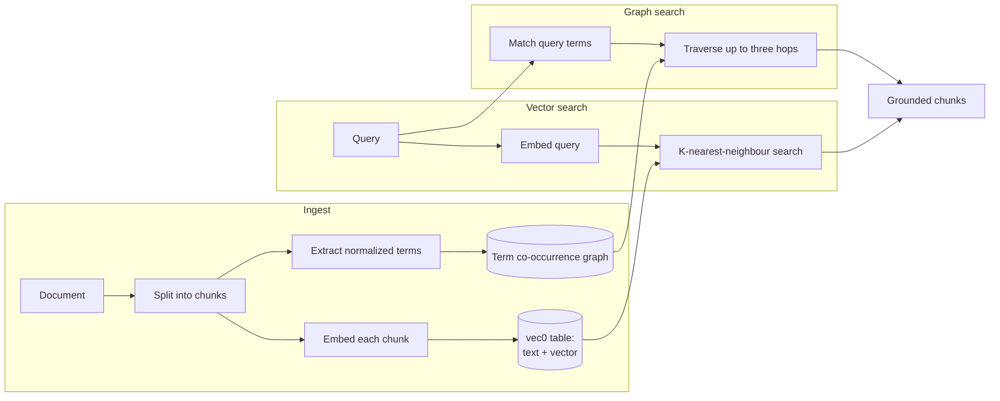

A **Space** is a document collection used for retrieval-augmented generation (RAG). Attach a Space to
an agent and it can pull relevant passages from your documents to ground its answers, instead of
relying on the model's training alone. Core stores Spaces locally and uses sqlite-vec for their
vector indexes.

## Retrieval modes

Each Space stores its own `retrieval_mode`. Choose a mode when you create the Space, or omit it to
use the node default. The default on a new installation is `vector`.

- **Vector** searches the Space's chunk embeddings by nearest-neighbour distance.
- **Graph** runs the shipped GraphRAG path. Core extracts normalized, noun-like terms from each
  chunk and connects every pair that occurs in that chunk. A search matches terms from the query,
  then follows the stored graph for at most three hops to find grounded chunks.

Graph extraction is deterministic and works offline. The only supported extractor ID is
`local-cooccurrence`. Its edges mean "these terms occurred in the same chunk." They are not
semantic relations inferred by an LLM, such as "works for" or "located in." Setting
`graph_extraction_model` to any other value makes Core reject the configuration at startup. This
is deliberate: Ryu will not accept a model ID and then silently run a different extractor.

Both modes obey the requested result limit and return document-backed chunks. Graph traversal also
bounds each next-hop frontier, so a dense graph cannot grow without limit. The same query over the
same stored graph follows a deterministic order.

Graph construction has explicit resource limits. Core extracts at most 64 unique terms from one
chunk or query, ignores terms larger than 128 UTF-8 bytes, accepts at most 256 chunks in one
document while a Space is in Graph mode, and caps a Space at 2,000,000 graph node-plus-edge rows.
Oversized writes and rebuilds fail with an actionable error while the previous mode remains active.
Wiki-link expansion adds at most 16 linked documents and 32 linked chunks to a search.

On an organization-bound node, visibility is applied inside vector selection, graph seeding and
traversal, and link expansion. Private rows cannot steer a shared result or consume its candidate
budget. Every verified team membership is considered; JWT team ordering does not change results.

### Change a Space's retrieval mode

Changing a mode is an asynchronous index operation, not a metadata toggle.

- Switching to **Graph** builds a fresh term co-occurrence graph from every existing chunk. New and
  edited documents update the graph after the switch completes.
- Switching to **Vector** removes the term graph. Existing vectors remain in place, so changing
  modes never requires re-embedding the Space.
- The previous mode and graph remain active until the replacement is ready. Cancelling a rebuild
  leaves them unchanged.

`POST /api/spaces/:id/retrieval-mode` accepts the change and returns `202` with a `job_id`. Poll
`GET /api/spaces/:id/retrieval-mode/status?job_id=...` for progress and the final counts. To stop a
running rebuild, send that `job_id` to `POST /api/spaces/:id/retrieval-mode/cancel`. Starting another
mode change while one is running returns a conflict.

Rebuild job records belong to the running Core process. If Core restarts, the staged graph is
discarded and the previously committed mode remains active. Refresh the Space to read that mode,
then submit the change again if it is still needed.

## Embeddings

Embeddings are a swappable default. Core can embed in two ways:

- **Local** - a deterministic, dependency-free embedder, or the bundled llama.cpp embedding engine.
  See [Engines](/docs/surfaces/desktop/engines/chat-engines).
- **Remote** - a self-hosted OpenAI-compatible embeddings endpoint, configured through the
  node environment. Cloud providers should use the Gateway-backed provider path so provider
  selection and credentials stay in Gateway rather than in Core.

RAG defaults to the local embedding engine, so it works without an API key.

Changing the embedding model is an index migration, not a display preference. Core tags every
vector with its model and dimensionality, installs the new provider only after it has a valid
configuration, and re-embeds stale rows in Spaces, unified retrieval, and encrypted message
search. The migration is resumable and also resumes after a restart; until a row is re-embedded,
it is excluded from search rather than compared across vector spaces.

For cloud embeddings, set the model's provider to `gateway`. Core then calls the local or managed
Gateway at `POST /v1/embeddings`; Gateway authenticates the request, routes the model through its
provider map, and keeps the upstream key server-side. Reranking follows the same boundary at
`POST /v1/rerank`. Both endpoints reject oversized batches before forwarding them.

## Working with Spaces

| Action | Endpoint |
|---|---|
| List Spaces | `GET /api/spaces` |
| Create a Space | `POST /api/spaces` |
| Rename a Space | `POST /api/spaces/:id/name` |
| Delete a Space | `DELETE /api/spaces/:id` |
| List documents | `GET /api/spaces/:id/documents` |
| Ingest a document | `POST /api/spaces/:id/documents` |
| List import history | `GET /api/spaces/:id/imports` |
| Import a file as pages or databases | `POST /api/spaces/:id/imports/files` |
| Import connected-app data | `POST /api/spaces/:id/imports/composio` |
| Start a retrieval-mode change | `POST /api/spaces/:id/retrieval-mode` |
| Read mode-change progress | `GET /api/spaces/:id/retrieval-mode/status?job_id=...` |
| Cancel a mode change | `POST /api/spaces/:id/retrieval-mode/cancel` |
| Search within a Space | `POST /api/spaces/:id/search` |
| Change embedding provider/model | `POST /api/embeddings/model` |
| Re-embed stale vectors | `POST /api/embeddings/reindex` |
| Re-embed progress | `GET /api/embeddings/reindex/status` |

Ingesting a document splits it into chunks, embeds each chunk, and stores both the text and the
vector. In Graph mode, ingestion also writes the chunk's term nodes and co-occurrence edges. A
Space search returns grounded chunks with `chunk_id`, `document_id`, `content`, and `distance`.

File and connected-app imports use the same document lifecycle after conversion. Document-like
files become editable pages, while delimited and spreadsheet data becomes a database whose cell
text is flattened for embedding. The import history records the conversion result; the created
documents remain ordinary Space documents and follow the same visibility and retrieval rules.

## Portable source and local retrieval

Portable Space packages exchange the source layer, not the retrieval layer. A package contains
Markdown pages, YAML frontmatter, database schema files, and Markdown row files. It does not carry
embedding vectors, sqlite-vec tables, provider identifiers, or model-specific dimensions.

Importing a package creates a new private Space without vectors. Run the manual embedding re-index
when you want RAG; the target node's current embedding and retrieval configuration is used then.
This keeps a shared package portable across local, remote, and Gateway-backed embedding setups. If
the package is edited outside Ryu, import it again to create a fresh source snapshot; changing the
node's embedding model remains a normal local re-index operation.

## Source history and realtime collaboration

Space page and database source saves are checkpointed in the node-local Git repository under
`~/.ryu/source-history/spaces/`. The existing generic `VersionHistory` control and version endpoints
remain the UI/API contract, so diffs and restores continue to work without exposing Git details to
the editor. Git commit ids are the source version ids for documents created after this migration;
older SQLite snapshots remain readable as a compatibility fallback. A successful SQLite document
mutation is not rolled back if the local Git projection is temporarily unavailable; Core logs the
degraded checkpoint and keeps the document write available for repair.

Yjs/CRDT is still the realtime collaboration and merge primitive. SQLite `document_versions` remains
the bounded conflict/retry and legacy snapshot primitive, but it is not a second user-facing history
once Git checkpoints exist. Neither Git history nor portable packages include embeddings, vectors,
credentials, or chat/session state.

## Unified retrieval

Beyond per-Space search, Core exposes one retrieval endpoint that spans both Spaces and encrypted
[memory](/docs/core/memory).

- `POST /api/retrieval/index` adds a chunk to retrieval.
- `POST /api/retrieval/search` searches across memory and selected Spaces, with options for
  `top_k`, `space_ids`, `include_memory`, and a `min_score` threshold.

This is also the path used for chat recall. When an agent has Space IDs in its memory settings,
Core searches those Spaces under each Space's stored mode, then merges their results with eligible
long-term memory. A Graph Space therefore uses the same bounded graph traversal in chat that it
uses in the Space search screen.

## GraphRAG and the wiki graph are different

GraphRAG stores chunk-level term co-occurrence. The wiki graph stores explicit page-to-page links
created with `[[wikilinks]]`, mentions, and page hierarchy. Wiki links power backlinks and the
Knowledge Graph view. They can also expand retrieval to linked pages, but they do not create or
replace the GraphRAG term graph. A Space can use both during one search.
