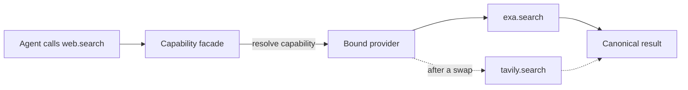

A **layer** is a capability with more than one provider you can pick between: web search, page
extraction, crawling, browser control, device control, memory. Selecting a different provider
re-points a stable set of tools at it. The agent keeps calling `web.search`; only who answers
changes.

The desktop calls these **Toolkits** (the node dropdown's Toolkits block); "layer" and
"capability" are the internal vocabulary in Core and in manifests. This page explains the
mechanism. To change a provider, use that block or `PUT /api/capabilities/bindings`.

## The facade is the whole idea

Core registers a fixed table of **canonical verbs** (`apps/core/src/sidecar/mcp/capability_tools.rs`).
`web.search`, `browser.snapshot`, `computer.click` and `memory.store` are Core's own tool ids
with Core's own schemas. They do not belong to any provider.

At call time the facade resolves the capability to its bound provider, reads that provider's
binding, renames the arguments, re-enters tool dispatch on the provider's real tool, and maps the
response back into the canonical shape.



Because the verb id and its schema never move, a swap changes no prompt, no allowlist and no
agent definition.

## What ships today

| Capability | Providers | Notes |
|---|---|---|
| `web.search` | exa (default, **on by default**), tavily, brave, firecrawl, serper | exa needs no API key, see below |
| `web.extract` | spider (default), tavily, firecrawl, serper | |
| `web.crawl` | spider (default), spidercloud, firecrawl | |
| `memory` | @ryu/memory (default), mem0, honcho | |
| `browser.control` | @ryu/browser (default), agentbrowser, Cloudflare Browser Run | Cloudflare is hosted; its canonical adapters are URL-scoped snapshot, navigate and screenshot operations |
| `computer.control` | ghost (default), bytebot | The two drive **different machines**, see below |

<Callout type="warn">
Outside the Chromium browser sidecar, none of this has been driven against a live Core yet. The
bindings are contract-tested and every field was checked against published vendor docs, but no
provider swap has been performed in a running app. Cloudflare Browser Run is external and opt-in;
it does not silently replace the local browser.
</Callout>

## A hosted browser provider

**Cloudflare Browser Run** is a remote `browser.control` provider. Install and enable its external
plugin, then select **Cloudflare Browser Run** in the same Toolkit/layer picker used for Agent
Browser and Ego Browser. The canonical adapters keep the stable Ryu verbs intact while sending the
URL to Cloudflare's Browser Run MCP server:

| Canonical verb | Cloudflare operation | Boundary |
|---|---|---|
| `browser.navigate` | `cloudflare.get_url_snapshot` | Opens a URL-scoped remote page and returns a snapshot |
| `browser.snapshot` | `cloudflare.get_url_snapshot` | Reads a URL-scoped accessibility snapshot |
| `browser.screenshot` | `cloudflare.get_url_screenshot` | Returns the remote page image |

The provider also exposes Cloudflare's native HTML, Markdown, PDF, JSON, links, crawl, and browser
session tools under the `cloudflare.*` namespace. Click/type/scroll and tab persistence remain
native session operations until a session-backed adapter is selected, so the layer card describes
exactly what is swappable rather than promising local-Chromium parity. The remote server uses OAuth
and the external badge in the Store makes that boundary visible.

## Which provider gets picked

A capability marked `selectable` resolves deterministically
(`apps/core/src/plugins/binding.rs`):

1. Your override, if you set one
2. The only provider, if exactly one is enabled
3. The provider that declares `"default": true`
4. The lexicographically lowest provider id

A capability that is **not** selectable (`rag`, `engines`) treats a second enabled provider as an
`Ambiguous` refusal instead. Selectability is a property of the capability, so every provider of
one must agree on the flag; a mixed declaration is rejected at load.

## A provider says which machine it acts on

Swapping a search provider changes who answers the same question. Swapping `computer.control`
changes **which device gets typed on**: `ghost` drives the machine Ryu runs on, `bytebot` drives
the desktop its `bytebotd` daemon runs on, which in the shipped Bytebot product is a containerized
Linux desktop.

Providers of a machine-controlling capability therefore declare a `target` in their manifest:

| Value | Meaning |
|---|---|
| `local-machine` | Acts on the machine Ryu is running on |
| `remote-desktop` | Acts on a separate machine or virtual desktop |

Absent means not applicable, which is the honest reading for `web.search` and `memory`. The picker
shows the label only when a capability's providers actually disagree, so `browser.control` (both
local) stays quiet and `computer.control` reads "this device" against "remote desktop".

On a node that runs the [Virtual Desktop](/docs/surfaces/desktop/user-guide/virtual-desktop), Ghost's
`computer.control` tools drive the same headless X display the desktop panel streams — so an agent
opening a browser or typing a command is something you can watch live and take over with your own
mouse and keyboard.

## Binding a provider: declarative first

Most providers are a rename plus a field map, and that is expressed as JSON in the provider's own
`manifest.json` with no code:

```json
"provides": [
  {
    "capability": "web.search",
    "version": "1.0.0",
    "selectable": true,
    "tools": {
      "web.search": {
        "tool": "firecrawl.search",
        "args": { "limit": "limit" },
        "response": {
          "results": "data.web",
          "fields": { "title": "title", "url": "url", "snippet": "description" }
        }
      }
    }
  }
]
```

| Field | Purpose |
|---|---|
| `tool` | The provider's own tool id this verb forwards to |
| `args` | Canonical argument name to the provider's name. Map to `""` to drop it |
| `arg_defaults` | Constant arguments merged into every call. A `pref:` value is read per install |
| `arg_template` | A request body template for providers needing a nested shape |
| `arg_clamp` | Per-argument numeric limits the provider can actually honour |
| `response` | Where the result array lives and how to rename each item's fields |

## Adapters: when no JSON can express the shape

Some provider shapes are beyond any declarative field. An async job API starts work at one endpoint
and reads results from another. A token vocabulary needs normalizing. A request body needs a value
that only exists per install.

For those, a provider ships an **adapter**: JavaScript that receives the canonical arguments and
returns the canonical result, running in the same Deno sandbox as an `inline_deno` plugin tool.

```json
"web.crawl": {
  "tool": "firecrawl.crawl_start",
  "adapter": {
    "tools": ["firecrawl.crawl_status"],
    "code": "// starts the job, polls, returns pages"
  }
}
```

The adapter is handed three things:

- `input` - the canonical arguments, layer defaults already applied
- `defaults` - the provider's `arg_defaults` with `pref:` tokens **already resolved**. This is the
  one thing `arg_template` cannot do, since a template expands from the caller's arguments and so
  never sees a resolved preference
- `callTool(args)` and `callNamed(id, args)` - the provider's own tools

An adapter **replaces** the declarative mapping for its verb. Declaring both describes the same
transformation twice and only one runs.

### Why an adapter is not an escape hatch

Its authority is a strict subset of the declarative path it replaces:

- `callTool(args)` takes **no tool id**. The target is fixed from the manifest before the sandbox
  starts, so sandboxed code cannot redirect the call.
- `callNamed(id, args)` reaches only ids the manifest listed in `adapter.tools`, checked host-side
  in `CapabilityAdapterBridge::resolve_target`. The facade itself is never re-enterable.
- No `host.*` surface: no side model, no `runAgent`, no storage.
- Deny-all sandbox with no network of its own. The provider's HTTP egress still happens inside the
  bound tool, where the Gateway grant governs it.
- Gated on the `tool:execute` grant, read from the Gateway-approved set for a Community-tier
  plugin, so a third party cannot self-authorize shipping code.

<Callout type="warn">
The sandbox bounds **active compute** (`DEFAULT_DEADLINE_SECS`, 30s) and awaiting a tool call
spends that budget. An adapter polling an async job cannot wait out a job larger than the budget:
Firecrawl's crawl adapter returns the pages that completed, flagged `complete: false`, rather than
being killed at the wall clock with nothing.
</Callout>

## Layer defaults

Per-capability argument defaults ("web search returns 25 results", "crawl at most 50 pages") are
merged **under** the caller's own arguments, so an explicit argument always wins. They are read
per call rather than cached with the verb resolution, because preferences change through the
generic preferences API which knows nothing about layers.

## Reading the current state

`GET /api/capabilities` returns every capability, its candidate providers, which one is bound and
whether that came from an override, plus the verb ids the facade currently serves.

```bash
curl http://localhost:7980/api/capabilities
```

A provider that serves **nothing** still joins resolution and can win the pick, which would make
that layer disappear with no error. The read model reports two flags so a picker can show such a
provider as unselectable instead — and it must read **both**:

- `serves_verbs` — the provider binds capability verbs (`web.search` and friends).
- `serves_route` — the provider is served by Core calling its sidecar route directly, with no verbs
involved. `document.parse` works entirely this way: all five parsers declare an empty `tools` map
  and every one of them functions.

The question a picker asks is `serves_verbs || serves_route`. Gating on `serves_verbs` alone marks
every route-backed provider dead, which is exactly what happened to the document parsers.

### Capabilities with no enabled provider still appear

`capabilities[].providers` lists the **enabled** candidates; `capabilities[].available` lists
providers that serve the capability but are switched off. A capability whose providers are all
disabled is still reported, with an empty `providers` and a populated `available`.

That distinction is load-bearing. Most providers ship opt-in, so deriving the response from the
enabled set alone made a whole toolkit vanish: `web.search` had five providers and none enabled by
default, so on a fresh install there was no `web.search` tool, no row in the picker, and nothing
telling you the Store had candidates. `web.extract` and `web.crawl` only escaped it because
`spider` happens to ship on.

## Web search works with no API key

`exa` is the only search provider seeded **enabled** on a fresh install, and it is the only one
that needs no credential. Its `web.search` binding is an adapter that calls Exa's keyed REST API
first and falls back to Exa's public MCP endpoint (`mcp.exa.ai`, free and rate-limited) when
`RYU_EXA_API_KEY` is unset.

The fallback fires **only** on the no-key signal: `fail_open` turns a 401/403 into
`{available:false, …}`, and any other failure is passed through untouched, so a broken key or an
outage costs one request rather than two. Add a key in the Exa settings tab and every search uses
the keyed path automatically, with higher limits and richer fields.

The other four search providers are BYOK-only and stay opt-in, because enabling them unkeyed would
ship a tool that can do nothing until you paste a key.

## Related

<Cards>
  <DocCard href="/docs/extend/develop/extensions/capability-broker" />
  <DocCard href="/docs/core/unified-tool-catalog" />
  <DocCard href="/docs/core/memory" />
  <DocCard href="/docs/extend/develop/extensions/plugin-json-manifest" />
</Cards>
