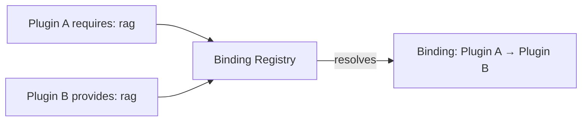

The capability broker is how plugins declare abstract capabilities and how Core resolves them to
concrete provider apps. It is the platform decomposition layer: apps become swappable capability
packages.

## The concept

A plugin declares what it needs (`requires`) and what it offers (`provides`). The binding registry
resolves the abstract requirements to concrete providers at enable time.



## Declaring capabilities in manifest.json

### Providing a capability

```json
{
  "id": "com.ryu.rag",
  "provides": [
    {
      "capability": "rag",
      "version": "1.0.0",
      "sidecar": "ryu-rag",
      "route": "/api/rag",
      "grant": "rag:use"
    }
  ]
}
```

| Field | Purpose |
|---|---|
| `capability` | The abstract capability name (e.g., `rag`, `tts`, `stt`, `image`) |
| `version` | Semver version of the capability |
| `sidecar` | The sidecar process name to spawn |
| `route` | The HTTP route prefix for the capability |
| `grant` | The Gateway grant required to use this capability |
| `selectable` | Opt in to the user-picks-one flavour instead of an ambiguity error |
| `default` | Preferred pick among the providers of a selectable capability |
| `target` | For a capability that controls a machine, whether that machine is this one (`local-machine`) or a separate one (`remote-desktop`) |
| `tools` | Canonical verb to this provider's tool, the seam that keeps tool ids stable across a swap |

### Requiring a capability

```json
{
  "id": "com.example.my-plugin",
  "requires": {
    "capabilities": ["rag"]
  }
}
```

When this plugin is enabled, the binding registry resolves `rag` to a concrete provider.

## Two flavours: strict and selectable

The binding registry (`apps/core/src/plugins/binding.rs`) has two resolution modes, and a
capability picks one with the `selectable` flag.

**Strict** (the original, used by `rag` and `engines`) refuses to guess:

1. **Override** - a user-configured override for this capability wins
2. **Single provider** - if exactly one installed plugin provides the capability, use it
3. **Ambiguous** - multiple providers exist, so error and make the operator pick
4. **Missing** - no providers, so `MissingDependency`

**Selectable** (`"selectable": true`) is for capabilities the user is *meant* to pick between, and
never errors on a second provider:

1. Override
2. Sole provider
3. The provider declaring `"default": true`
4. Lexicographically lowest provider id

Selectability is a property of the capability, not the provider, so every provider of one must
agree on the flag. The loader rejects a mixed declaration.

<Callout type="warn">
If any provider of a capability omits `"selectable": true`, the capability resolves to nothing and
the whole layer stops serving, with no error and no refused enable.
</Callout>

## Built-in capabilities

Strict capabilities, resolved to one provider:

| Capability | Default provider | Description |
|---|---|---|
| `rag` | `com.ryu.rag` | Embedding, vector storage, retrieval |
| `tts` | `com.ryu.tts` | Text-to-speech synthesis |
| `stt` | `com.ryu.stt` | Speech-to-text transcription |
| `image` | `com.ryu.image` | Image generation |
| `storage` | `com.ryu.storage` | File and blob storage |
| `sandbox` | `com.ryu.sandbox` | Code execution sandbox |

Selectable capabilities, which the user swaps at runtime: `web.search`, `web.extract`,
`web.crawl`, `memory`, `browser.control`, `computer.control`. These also bind **canonical verbs**,
so swapping the provider does not change the tool ids an agent calls. See
[Swappable Layers](/docs/core/swappable-layers) for that mechanism, the declarative binding fields,
and adapters.

## Setting overrides

Override which provider fulfills a capability:

```json
{
  "overrides": {
    "rag": "com.custom.rag",
    "tts": "com.custom.tts"
  }
}
```

Or via the API (`apps/core/src/server/mod.rs`, `set_capability_bindings`):

```bash
curl -X PUT http://localhost:7980/api/capabilities/bindings \
  -H 'Content-Type: application/json' \
  -d '{ "overrides": { "rag": "com.custom.rag" } }'
```

`GET` the same route to read the current override map, and `GET /api/capabilities` for the full
read model (candidate providers, which one is bound, and the verbs it serves).

## How it connects to the dependency graph

Once resolved, the binding is lowered to a bare app-id edge. The existing plugin dependency graph
(`apps/core/src/plugins/graph.rs`) handles:

- **Topological ordering** - providers are enabled before consumers
- **Cycle detection** - circular dependencies are rejected
- **Cascade** - disabling a provider cascades to consumers

## Error handling

| Error | Meaning | Fix |
|---|---|---|
| `Ambiguous` | Multiple providers for one capability | Set an override |
| `MissingDependency` | No provider for a required capability | Install a provider plugin |
| `VersionMismatch` | Provider version doesn't satisfy requirement | Update the provider |

## Related

<Cards>
  <DocCard href="/docs/core/swappable-layers" />
  <DocCard href="/docs/core/app-manifest-lifecycle" />
  <DocCard href="/docs/develop/extensions/plugin-json-manifest" />
  <DocCard href="/docs/start-here/architecture/platform-decomposition" />
  <DocCard href="/docs/start-here/architecture/capability-layers" />
  <DocCard href="/docs/develop/sdk/plugin-api" />
</Cards>
