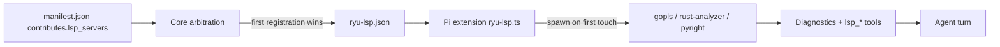

A plugin can declare **language servers** in its `manifest.json`, and Core spawns them. The agent
then gets compiler-grade answers instead of guesses: diagnostics after every edit, go-to-definition
that resolves imports and overloads, and a reference list that is actually complete.

The declaration is Claude Code's language-server config field-for-field, camelCase on the wire, so
the same JSON body loads in either host. The contract lives in
`crates/core/kernel-contracts/src/manifest.rs` (`Contributes::lsp_servers`,
`LspServerContribution`); arbitration lives in `apps/core/src/lsp.rs`.



## Declare the servers

Add an `lsp_servers` map to `contributes`, keyed by a server name of your choosing. The required
fields are `command` and `extensionToLanguage`; everything else is optional.

```json
{
  "id": "com.example.go-tooling",
  "name": "Go Tooling",
  "version": "1.0.0",
  "runnables": [],
  "contributes": {
    "lsp_servers": {
      "go": {
        "command": "gopls",
        "args": ["serve"],
        "extensionToLanguage": { ".go": "go" },
        "settings": { "gopls": { "staticcheck": true } },
        "startupTimeout": 20000,
        "diagnostics": true
      },
      "python": {
        "command": "pyright-langserver",
        "args": ["--stdio"],
        "extensionToLanguage": { ".py": "python", ".pyi": "python" }
      }
    }
  }
}
```

A Claude Code `.lsp.json` is the **value** of `lsp_servers`, not the whole block: paste the file's
top-level map in as-is and every entry body works unchanged. Only the container key is Ryu's.
`lsp_servers` in snake_case, matching every sibling contribution, is the one accepted spelling. An
`lspServers` alias would parse in Core and then be stripped by the SDK's zod mirror
(`packages/sdk/src/manifest.ts`) at `ryu pack` time, before the manifest is signed, so the
alias is deliberately rejected rather than half-supported.

### Fields

| Field | Type | Default | Meaning |
|---|---|---|---|
| `command` | string | required | The server executable, resolved from `PATH` at spawn time |
| `extensionToLanguage` | map | required | File extension to LSP language id, e.g. `{ ".go": "go" }` |
| `args` | string list | `[]` | Arguments passed to `command` |
| `transport` | string | `"stdio"` | `stdio` is the only transport Core drives today, see below |
| `env` | map | `{}` | Extra environment variables, merged over the inherited environment |
| `initializationOptions` | any | none | Sent verbatim in the LSP `initialize` request |
| `settings` | any | none | Sent verbatim as `workspace/didChangeConfiguration` after initialize |
| `workspaceFolder` | string | session workspace root | Root directory the server is rooted at |
| `startupTimeout` | ms | `15000` | How long to wait for `initialize` to come back |
| `shutdownTimeout` | ms | `5000` | How long to wait for a clean `shutdown`/`exit` before killing |
| `restartOnCrash` | bool | `true` | Restart the server when it exits unexpectedly |
| `maxRestarts` | number | `3` | Restarts allowed before the server is left down |
| `diagnostics` | bool | `true` | Push this server's diagnostics into the model's context after edits |

Extension keys are normalised before lookup (trimmed, lowercased, exactly one leading dot), so
`go`, `.go` and `.GO` all resolve to the same entry. Unknown keys are dropped rather than rejected,
so a field from a newer Claude Code release costs your plugin nothing.

The three timing defaults (`startupTimeout`, `shutdownTimeout`, `maxRestarts`) are the spawn site's
own numbers, not values Claude Code documents. They live in
`apps/core/assets/pi-extensions/ryu-lsp.ts`; declare the field explicitly when you need a specific
one, and it is honoured verbatim.

<Callout type="warn">
One default knowingly parts from Claude Code. An unset `shutdownTimeout` means *no timeout* there,
so the host waits on a wedged server forever; Ryu applies a finite 5s, because Pi is spawned per
session and an unbounded wait would hold every teardown open behind one unresponsive process. An
explicitly declared value is honoured verbatim, so only the unset case differs.
</Callout>

## You install the binary, the plugin ships config

A plugin declares a language server. It never bundles one. `command` is resolved from `PATH` on the
machine the agent runs on, which means the user installs the toolchain:

```bash
rustup component add rust-analyzer
npm install -g pyright
npm install -g typescript-language-server typescript
```

`typescript-language-server` shells out to `tsserver`, so the `typescript` package alongside it is
not optional.

A `command` that is not on `PATH` is a **graceful skip with a visible reason**, never a hard
failure. The server is marked skipped permanently (so a missing binary cannot turn into retry spam),
one line is written to stderr, and Core logs the agent subprocess's stderr at WARN under the
`acp_subprocess` target:

```
[ryu-lsp] "gopls" is not on PATH; install it to enable language support for .go
```

Everything else about the node is unaffected: the other servers start, the plugin's runnables,
sidecars and tools are untouched, and the agent runs normally with no language support for that
extension.

## How declarations across plugins are resolved

Core arbitrates every enabled plugin's declarations into one table before anything spawns
(`resolve_lsp_servers`), applying Claude Code's rules:

1. **Invalid config is skipped, not fatal.** A server with no `command` or an empty
   `extensionToLanguage` is dropped with a reason, the other servers still start, and the skipped
   one does **not** claim its extensions, so a sibling declaring the same extension gets them.
2. **First registration wins per file extension.** If two enabled servers both claim `.go`, the
   first one registered owns it and the later one loses that extension, with a warning naming the
   owner. A server left with zero extensions of its own is dropped rather than spawned to handle
   nothing.
3. **Non-stdio transports are a separate gate.** A `socket` server is valid config that Core cannot
   drive today, since nothing in the field set carries a host or a port. It is refused *before* it
   claims anything, so a stdio sibling declaring the same extension stays alive.

Registration order is `(plugin id ascending, then server key ascending)`. Sorting by plugin `id` is
deliberate: the plugin list is built from compiled-in built-ins followed by a `read_dir` whose order
is not stable across machines, so two nodes with identical plugins would otherwise disagree about
who owns `.go`. That makes the tie-break deterministic but not byte-identical to Claude Code's,
whose order falls out of JS object insertion. Two servers fighting over one extension is a
misconfiguration in either host; what matters is that a node always resolves it the same way and
says who won.

The arbitrated table is written to `<PI_CODING_AGENT_DIR>/extensions/ryu-lsp.json`, keyed
`<plugin id>/<server name>`. It is read when Pi starts, so enabling an LSP-contributing plugin takes
effect on the **next spawn for a chat**, not the next turn. Disabling the last contributing plugin
deletes the file, which is the extension's documented no-op state.

## What the agent gets

### Diagnostics after every edit

After the agent edits or writes a file whose extension a server owns, that server's diagnostics are
appended to the tool result the model reads. Errors come first, capped at 20 with a trailing count,
because one syntax error can cascade into hundreds and an uncapped block would eat the context the
model needs to fix it:

```
Language server diagnostics (com.example.go-tooling/go):
  cmd/api/main.go:42:9: error: undefined: reqeust [compiler/UndeclaredName]
  cmd/api/main.go:51:2: warning: declared and not used: buf [compiler/UnusedVar]
```

A clean file appends nothing at all. That line would ride along on every edit for zero information,
and the absence of a block already says it.

Set `diagnostics: false` on a server to opt it out of pushing into context. Its navigation tools
stay fully usable, so this is the right switch for a noisy server you still want to query on demand.

<Callout type="info">
The first edit to a language spawns its server and reports nothing. Servers start lazily on the
first touch of a claimed extension, and a cold `gopls` or `rust-analyzer` routinely takes seconds to
answer `initialize` while it indexes. Waiting on that inside the edit handler would stall the turn,
so the spawn is kicked off without awaiting it and every edit after the handshake reports normally.
</Callout>

### Navigation tools

Four tools are registered, and only when at least one server survives resolution. Line and column
are 1-based.

| Tool | Parameters | Returns |
|---|---|---|
| `lsp_definition` | `path`, `line`, `column?` | Where the symbol is defined |
| `lsp_references` | `path`, `line`, `column?`, `includeDeclaration?` | Every reference to the symbol |
| `lsp_hover` | `path`, `line`, `column?` | Resolved type, signature and doc comment |
| `lsp_diagnostics` | `path?` | Diagnostics for one file, or for everything analysed so far when `path` is omitted. Capped at 60, since the model asked for these explicitly |

A crash is not the same fate as a slow start. A server that exits unexpectedly is restarted up to
`maxRestarts` times when `restartOnCrash` is on, then left down with a logged reason; a server that
misses `startupTimeout` is skipped permanently for the session, carrying its stderr tail so the
reason is readable.

## Scope today

<Callout type="warn">
Language servers are wired for the flagship **`ryu`** agent only, which Core runs as a managed Pi
(`@earendil-works/pi-coding-agent`) over ACP. The binding is a Pi extension Core ships and
configures (`apps/core/assets/pi-extensions/ryu-lsp.ts`). Other ACP agents are not wired yet: the
declaration and the arbitration in `apps/core/src/lsp.rs` are agent-neutral by design, so a second
agent adds a second binding rather than a second collector, but no such binding exists today. An
agent that has its own LSP support (Claude Code) keeps using it and ignores this contribution.
</Callout>

<Cards>
  <DocCard href="/docs/develop/extensions/plugin-json-manifest" />
  <DocCard href="/docs/core/app-manifest-lifecycle" />
  <DocCard href="/docs/develop/extensions/mcp-server" />
  <DocCard href="/docs/develop/agent-integration-guide" />
</Cards>
