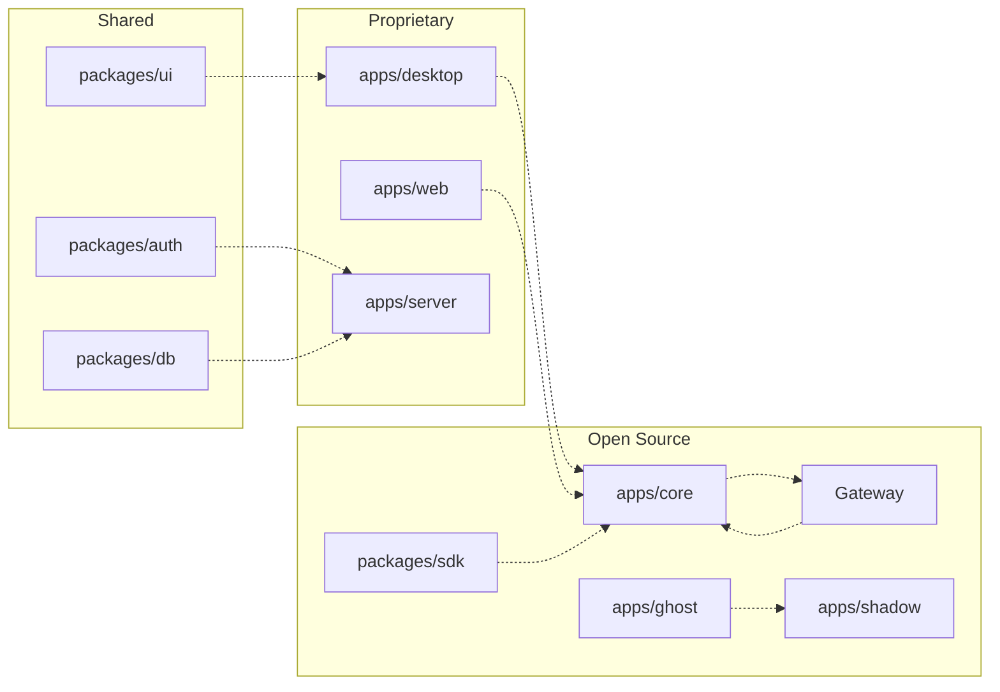

Ryu is an open-core project: the Rust **Core** and **Gateway** are Apache-2.0 and AGPL-3.0
respectively; the Desktop, Web, and Backend are proprietary. Contributions to the open-source parts
are welcome and follow the workflow described here.

## Repository layout

Ryu is a **Bun + Turborepo** monorepo. TypeScript apps and packages live under Bun workspaces; Rust
apps and crates form Cargo workspaces.



### Open-source units

| App / Crate | Stack | License |
|---|---|---|
| `apps/core` | Rust / Axum | Apache-2.0 |
| `apps/gateway` | Rust | AGPL-3.0 |
| `apps/cli` | Rust / ratatui | Apache-2.0 (DEPRECATED — use `apps/tui`) |
| `apps/ghost` + `crates/ghost/*` | Rust | Apache-2.0 |
| `apps/shadow` + `crates/ghost/shadow` | Rust | Apache-2.0 |
| `packages/sdk` | TypeScript | Apache-2.0 |
| `packages/create-ryu-app` | TypeScript | Apache-2.0 |
| `crates/sdk/core` + `ffi` + `napi` | Rust | Apache-2.0 |
| `crates/ghost/*` + `crates/ghost/shadow` | Rust | Apache-2.0 |

### Proprietary units

| App / Package | Stack |
|---|---|
| `apps/desktop` | Tauri v2 + React |
| `apps/web` | Next.js |
| `apps/server` | Hono / TS |
| `apps/native` | Expo / RN |
| `apps/island` | Electron |
| `packages/ui` | React / Tailwind CSS |

See [Open Core](/docs/start-here/architecture/open-core) for the full licensing boundary.

## Build system

### Prerequisites

- **Bun** 1.3.5+
- **Rust** (stable) for Core, Gateway, and Rust crates
- **Node.js** 18+ for TypeScript apps

### Common commands

```bash
# Install all dependencies
bun install

# Run everything (all apps in parallel)
bun run dev

# Run a specific app
bun run dev:core      # Core on :7980
bun run dev:gateway   # Gateway on :7981
bun run dev:desktop   # Desktop (Tauri)
bun run dev:web       # Web on :3001

# Build everything
bun run build

# Build just the API docs for fumadocs
bun run generate:docs
```

### Turborepo

The monorepo uses Turborepo for task orchestration. Tasks declared in `turbo.json` run in
dependency order with caching. The full-stack `bun run dev` command uses Turbo's parallel mode
because its development processes are independent and long-running, so it does not depend on a
fixed worker count. Run `turbo run build --filter=core` to build just Core and its dependencies.

## Documentation versions

Ryu Docs publishes one current documentation version. Versioned URLs such as
`/docs/0.1.15/...` identify the release that produced a link, while the bare
`/docs/...` form remains an alias for the current site. When a release moves
forward, older version-shaped links redirect to the matching page in the
current docs rather than pointing to a separately maintained historical site.

### Mermaid diagrams

Fenced `mermaid` blocks render as interactive diagrams in the docs site. Click a diagram to open
the full-screen viewer, use the mouse wheel over the diagram to zoom, drag to pan, and choose
**Fit** to restore the fitted view. Wheel zoom stays inside the viewer without moving the page.

## Code standards

### TypeScript

Ryu uses **Ultracite** (Biome-based) for formatting and linting:

```bash
bun x ultracite fix    # auto-fix formatting + lint issues
bun x ultracite check  # check without fixing
```

The repository also includes an additive, opinionated anti-slop audit powered by Oxlint:

```bash
bun run check:anti-slop
```

This audit is intentionally separate from the default Biome check. Use it when working on
type-boundary and evidence-related code; resolve its findings incrementally rather than
mechanically weakening the rules or changing the repository's primary formatter.

Key rules:
- Use `const` by default, `let` only when reassignment is needed
- Arrow functions for callbacks
- Optional chaining (`?.`) and nullish coalescing (`??`)
- No `console.log` in production code
- Semantic HTML and ARIA attributes for accessibility

### Rust

- `cargo fmt` for formatting
- `cargo clippy` for linting
- `cargo test` for unit tests
- Error types use `thiserror` for library code, `anyhow` for application code

### Core-vs-Gateway rule

When placing new code, apply the single design rule:

- **What runs** (which agent, session, workflow, tool) → **Core**
- **What is allowed, shared, measured, or paid for** (security, routing, budgets, audit) → **Gateway**

Core must never enforce policy inline; it routes every model call through the Gateway.

### Cross-surface consistency

New work follows one source of truth and explicit projections:

- **Core** owns what runs: agents, sessions, workflows, tools, local files, Git, and sidecar
  lifecycle.
- **Gateway** owns what is allowed, shared, measured, or paid for: authentication, routing,
  firewall, budgets, evaluations, and audit. Client-side checks are not authorization.
- **JSON** is the default for machine-managed, cross-language, signed, or API-shaped data.
  **TOML** is for human-authored service policy. New Ryu-native YAML is not introduced; YAML that
  an external ecosystem requires remains in its native format.
- `manifest.json` is the native plugin/app source of truth. Interop manifests, Marketplace views,
  and generated SDK or mirror artifacts are projections and must not become parallel authoring
  surfaces.
- New public contracts use `camelCase` JSON fields and define stable IDs, versioning, limits, errors,
  timestamps, retries, permissions, and migration behavior. Existing contracts keep their field
  spelling for compatibility. Cross-language shapes get a shared contract or fixture test.
- Fumadocs uses MDX with YAML front matter as page metadata, not runtime configuration. Section
  navigation is JSON in `meta.json`, API reference pages are generated from OpenAPI, and public
  content must not expose private or unverified internal details.
- A user-facing change updates Fumadocs in the same change. Visual changes include rendered proof;
  a focused test, build, health check, release object, and fresh deployment are reported as
  separate evidence.

The binding checklist is maintained with the repository's engineering documentation and applies
to new cross-surface work even when the implementation spans more than one package.

## PR workflow

### 1. Fork and branch

```bash
git checkout -b feat/my-feature
```

### 2. Make changes

- Keep changes focused: one logical unit per PR
- Write or update tests for new behavior
- Run the linter before committing

### 3. Verify

```bash
# TypeScript
bun x ultracite check

# Rust
cargo check --workspace
cargo test --workspace
cargo clippy --workspace
```

### 4. Commit

Use conventional commit messages:

```
feat(core): add new hook phase for notification filtering
fix(gateway): resolve circuit breaker not tripping on 503s
docs(develop): add hooks & lifecycle reference page
```

### 5. Open a PR

- Describe what changed and why
- Link any related issues
- Include screenshots for UI changes
- Note breaking changes explicitly

## Testing

### Unit tests

```bash
# Rust
cargo build -p ryu-core -p ryu-test-sidecar
cargo test --workspace --no-fail-fast -- --test-threads=1

# TypeScript workspaces
bun run test

# Fenced Raycast extension
(cd apps/raycast && bun run test)
```

### Integration tests

Core's test suite includes live sandbox tests (`plugin_host::tests::live_*`) that run real Deno
fixtures against the built-in double-check, goal, and advisor hooks.

### Smoke tests

Run the dev server and verify the flow manually:

```bash
bun run dev:core
# In another terminal:
curl http://localhost:7980/api/health
```

## Working on the Gateway

The Gateway is AGPL-3.0. Key paths:

- `apps/gateway/src/router/` — model routing (smart + deterministic)
- `apps/gateway/src/pipeline/` — request pipeline
- `apps/gateway/src/security/` — firewall, DLP, SSRF
- `apps/gateway/src/budgets/` — budget enforcement
- `apps/gateway/src/evals/` — eval scoring
- `apps/gateway/src/passthrough/` — Claude Code / Codex passthrough

## Working on Core

Key paths:

- `apps/core/src/server/mod.rs` — Axum routes + chat handler
- `apps/core/src/sidecar/` — sidecar lifecycle + ACP/OpenAI-compat adapters
- `apps/core/src/plugins/` — plugin manifest + lifecycle + binding registry
- `apps/core/src/plugin_host/` — turn hook runtime (Deno sandbox)
- `apps/core/src/workflow/` — DAG engine + durable execution
- `apps/core/src/tool_registry/` — unified tool catalog

## Working on the SDK

The TypeScript SDK (`packages/sdk/`) and Rust SDK (`crates/sdk/core`) share the Runnable contract.
The public source, binding projects, examples, and release workflow live in the
[SDK hub](https://github.com/amajorai/ryu-sdk); see [SDK Reference](/docs/extend/develop/sdk) for
the API surface.

```bash
# Build the native addon (required for model client)
cd crates/sdk/napi && npm run build

# Run SDK tests
cd packages/sdk && bun test

# Run the complete public-hub package gate
cd ../.. && bun run test:packages
```

## Community plugins

Third-party plugins are built via `manifest.json` + the SDK. The plugin runtime lives in OSS Core,
so the closed desktop stays extensible. See [Build an Extension](/docs/extend/develop/extensions) for the
three extension paths.

## Related

<Cards>
  <DocCard href="/docs/start-here/architecture/open-core" />
  <DocCard href="/docs/extend/develop/extensions" />
  <DocCard href="/docs/extend/develop/sdk" />
  <DocCard href="/docs/extend/develop/quickstart" />
</Cards>
