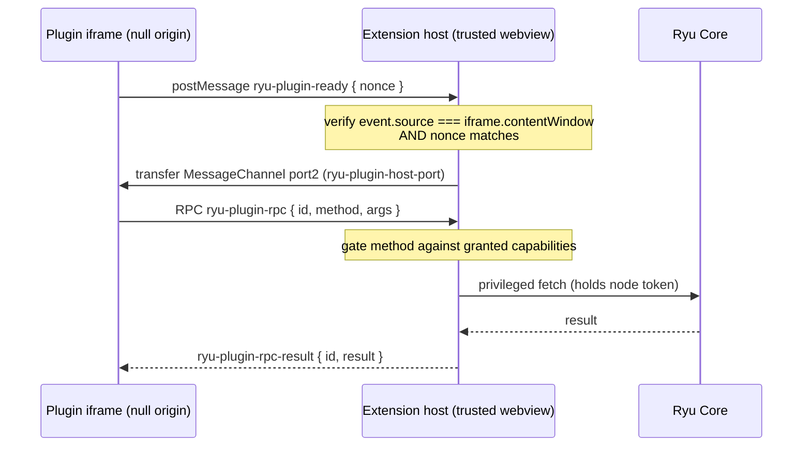

A **Companion** is a plugin surface that renders its own UI inside the desktop app: a sidebar
panel, an overlay, or a settings pane. Because plugin code is untrusted, the desktop runs it in a
sandboxed iframe and lets it reach Core only through a capability-gated RPC bridge. This guide
walks the contribution path end to end, using the built-in example plugin
(`apps/desktop/src/contributions/host/example-plugin.ts`) as the worked example.

`Companion` is one of the eight `RunnableKind` variants
(`apps/core/src/runnable/mod.rs`), so a Companion is declared in a `manifest.json` manifest like any
other Runnable. For the manifest schema and grant strings, see
[the manifest.json manifest reference](/docs/extend/develop/extensions/plugin-json-manifest).

<Callout type="warn">
The desktop extension host's RPC dispatch, handshake, and companion document policy are covered by
unit tests plus Chromium certificates (`e2e/companion-host.spec.ts` and
`e2e/artifact-csp.spec.ts`). Provider accounts, node permissions, and your own sidecar still need
an environment-specific end-to-end check.
</Callout>

## The three-tier UI model

Plugin UIs in Ryu follow a three-tier model, each with different trust and capability levels:

| Tier | Trust level | What it can do | Example |
|---|---|---|---|
| **Widget** (in-chat) | Lowest — sandboxed iframe, null origin | Render data from a tool call; call companion tools via `callTool` through the host | Checklist, chart, data grid |
| **Companion** (sidebar/overlay) | Medium — sandboxed iframe, capability-gated RPC | Read agent lists, call Core APIs through the gated bridge | Settings panel, extension page |
| **Full-page app** | Highest — iframe with host bridge | Deep Core integration via the RPC bridge; the host holds the node token | Extension pages, whiteboard |

All three tiers share the same security model: the iframe is null-origin, the host is the single
trusted proxy, and every RPC method is gated by a declared capability. The difference is the surface
area each tier exposes.

### Widget tier (in-chat)

Widgets render inline in a chat message. They are produced by a "render" tool and consume the
tool's arguments and output through `window.openai.toolInput` / `toolOutput`. See
[Ryu Apps](/docs/extend/develop/extensions/ryu-apps) for the full authoring path.

### Companion tier (sidebar/overlay)

Companions are sidebar panels or overlays that persist across turns. They use the same null-origin
iframe and RPC bridge as widgets, but they are not tied to a single tool call. A companion can
maintain state, subscribe to resource changes, and call multiple Core APIs.

### Full-page app tier

Full-page apps (also called "extension pages") render in the desktop's main content area. They
use the same ExtensionHost iframe and RPC bridge, but can present a richer UI since they have the
full page to work with. The host routes their RPC calls through the same capability-gated bridge.

## The security model

The host renders your plugin in an `<iframe sandbox="allow-scripts">` **without**
`allow-same-origin`, so the frame runs at a **null origin**
(`apps/desktop/src/contributions/host/ExtensionHost.tsx`). That has three consequences your plugin
must design around:

- The frame cannot read the parent DOM, cannot touch app storage, and does **not** receive
  `window.__TAURI__`. Tauri injects IPC into the app's own webview, never into a null-origin
  sandboxed frame.
- Your plugin reaches Core **only** by sending RPC envelopes to the host. The host (the trusted
  webview) is the single place that holds the Core node token and performs the privileged fetch.
  The plugin never sees the token.
- Each RPC method is gated by a declared **capability**. A call to a method whose capability the
  plugin was not granted is rejected before any service runs.
- Full-HTML companions and model-generated artifact documents receive their CSP and bridge shell
  before any app-controlled HTML is parsed, including scripts placed before a `<head>` element.
  Keep the frame's `connect-src 'none'` policy; direct network access is not a companion API.



<Callout type="info">
Because the frame is null-origin, `event.origin` is the literal string `"null"` and is useless as
an auth boundary - any null-origin context matches it. The real identity check is
`event.source === iframe.contentWindow` plus the host-generated nonce. Do not "harden" this with an
origin allowlist; it would be security theatre here.
</Callout>

## Step 1 - Announce readiness from your frame

The host bakes a per-mount nonce (a `crypto.randomUUID()`, host-generated, never plugin or user
input) into your document. Your frame echoes that nonce back in a `ryu-plugin-ready` message so
the host can verify the message came from the frame it created:

```js
const NONCE = /* baked in by the host */;
window.parent.postMessage({ kind: "ryu-plugin-ready", nonce: NONCE }, "*");
```

## Step 2 - Accept the channel port

After the host verifies your handshake it transfers one `MessagePort` into your frame, tagged with
the same nonce. Accept only the port carrying your nonce, then run all RPC over it:

```js
let port = null;
window.addEventListener("message", (ev) => {
  const msg = ev.data;
  if (!msg || msg.kind !== "ryu-plugin-host-port" || msg.nonce !== NONCE) {
    return;
  }
  port = ev.ports?.[0];
  if (port) {
    port.onmessage = onPortMessage;
  }
});
```

Point-to-point ports sidestep the `targetOrigin: "*"` ambiguity that a null-origin frame would
otherwise force on every message.

## Step 3 - Call Core over the gated bridge

Send a request envelope over the port and correlate the reply by `id`. The envelope shape is
defined in `apps/desktop/src/contributions/host/rpc.ts`:

```js
let nextId = 1;
const pending = {};

function call(method, args) {
  return new Promise((resolve, reject) => {
    if (!port) {
      reject(new Error("bridge not ready"));
      return;
    }
    const id = nextId++;
    pending[id] = { resolve, reject };
    port.postMessage({ kind: "ryu-plugin-rpc", id, method, args: args ?? [] });
  });
}

// then: await call("core.listAgents", [])
```

The host replies with a `ryu-plugin-rpc-result` envelope carrying exactly one of `result` or
`error`.

## The RPC contract

These are the envelope kinds exchanged over the bridge (`rpc.ts`):

| Kind | Direction | Payload |
|---|---|---|
| `ryu-plugin-ready` | frame to host | `{ nonce }` |
| `ryu-plugin-host-port` | host to frame | `{ nonce }` + a transferred `MessagePort` |
| `ryu-plugin-rpc` | frame to host | `{ id, method, args }` |
| `ryu-plugin-rpc-result` | host to frame | `{ id, result }` or `{ id, error }` |

The host validates every inbound payload with `asRpcRequest`, so any message not shaped like the
envelope is dropped before it reaches dispatch.

## Capabilities

Every callable method is mapped to a required capability in `METHOD_CAPABILITY` (`rpc.ts`). A
method that is not in that map is **unknown** and always rejected (never default-allow).

| Method | Capability | Result |
|---|---|---|
| `core.listAgents` | `core.listAgents` | The agents on the active node |
| `catalog.snapshot` | `core.listAgents` | The shared provider, model, agent, app, and hook catalog |
| `catalog.models` | `core.listAgents` | Server-side model discovery for one provider lane |
| `model.complete` | `model.complete` | One Gateway-governed model completion |
| `agent.run` | `agent.run` | One bounded, Core-mediated agent task |

### App-owned realtime rooms

An app that needs a live room may request the `app:realtime` capability and use the typed
`window.ryu.tokenTable` bridge. `connect({ roomId })` returns the room id, access level, member id,
and initial presence; the returned handle exposes `publish`, `publishPresence`, and `close`, while
callbacks receive named events, presence snapshots, close notifications, and errors. The host
keeps the opaque connection handle, node token, and realtime credentials out of the null-origin
frame. The host also bounds queued events and coalesces replaceable presence snapshots, so a
stalled companion is closed instead of retaining an unbounded stream.

Unknown methods (not in the capability map) are always rejected — there is no default-allow path.

## The shared runtime catalog

Apps that need a model, provider, or agent choice should consume the same Ryu catalog instead of
calling a provider API or building a private list. Declare the read-only `core:list_agents` grant,
then read the catalog through the host bridge:

```ts
const catalog = await window.ryu.catalog.snapshot();

for (const provider of catalog.providers) {
  console.log(provider.label, provider.authKind, provider.suggestedModels);
}

const liveModels = await window.ryu.catalog.models({ providerId: "openai" });
```

The projection includes provider authentication kind (`subscription`, `api-key`, or another
host-defined value), configured/managed state, routing hints, model suggestions,
agents, enabled app summaries, and hook/event declarations with enabled state. Providers whose
models are discovered dynamically still appear as provider lanes even when their suggestion list
is empty; `catalog.models` asks Core to discover that lane server-side and returns only model ids
and display names. It never includes API keys, OAuth tokens, provider endpoints, hook code, or
plugin grants, provider account identifiers, account labels, or account timestamps.
The shared Ryu model/agent picker consumes
this projection and returns a controlled selection value; it does not change provider settings.

Valid plugins held back by an unmet host-version floor also appear as `compatible: false` metadata
with disabled hook/event rows. They are discoverable for explanation, but never runnable until the
host can satisfy their declared floor.

Execution remains a separate decision. `model.complete` sends a model intent through Ryu's normal
Core/Gateway route. `agent.run` asks Core to run a bounded agent and is the lane that can preserve
an authorized native agent session. BYOK and managed providers are resolved behind Core/Gateway;
subscription-preserving passthrough is not a URL an app can call. It remains a loopback-only,
Core-controlled agent transport as described in [the Gateway route guide](/docs/gateway/loopback-routes).

The catalog also exposes safe metadata about enabled apps and hooks so a shared picker or workflow
surface can discover the ecosystem. Hook execution stays ownership-bound: an app can run its own
declared hook when separately granted, and an app event can be emitted only by its declaring app.
The catalog does not turn one app into a caller for another app's code or secrets.

## Realtime app resources

Apps that edit shared resources can use the generic application-room bridge instead of polling. Add
`app:realtime` to the manifest's `permission_grants`, then join a room whose id is stable for that
resource. The trusted host owns the node token, user identity, and WebSocket; the sandbox receives
only the opaque `window.ryu.realtime` connection.

The `@ryu/app-host/realtime` helper keeps your governed API authoritative. A realtime event tells
peers to refetch, suppresses the exact sender's echo, and automatically refetches after a lag signal:

```tsx
import { openRealtimeResource } from "@ryu/app-host/realtime";

const channel = await openRealtimeResource({
  roomId: documentId,
  onChanged: () => loadDocument(documentId),
  onPresence: (presence) => showCollaborator(presence),
});

await saveDocument(documentId, nextDocument);
await channel.publishChanged();
```

Call `channel.close()` when the resource unmounts. Use `publishPresence()` only for ephemeral state
such as the active selection or pointer; durable state still belongs in your app API. Canvas,
Whiteboard, Workflows, and Dashboards use this same contract.

## Try it

The example plugin runs live in the desktop today. Open **Extensions**
(`apps/desktop/src/pages/ExtensionsPage.tsx`): the panel at the top is the example plugin running
in its sandboxed null-origin iframe. Click **List agents** to watch a real `core.listAgents` call
travel over the gated bridge and render the result.

<TryInRyu page="extensions" />

## Next steps

<Cards>
  <DocCard href="/docs/extend/develop/extensions/plugin-json-manifest" />
  <DocCard href="/docs/extend/develop/extensions/typescript-sdk" />
  <DocCard href="/docs/core/app-manifest-lifecycle" />
</Cards>
