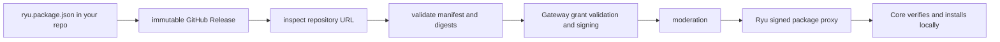
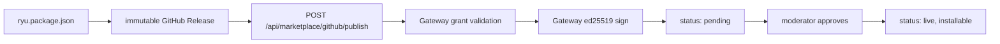

You have built a package and want others to install it. This page walks the GitHub-backed publish
path end to end: add `ryu.package.json`, create an immutable `.ryupack` Release, bind the repository
to Ryu, let the Gateway sign it, and (optionally) price it. Everything here is the author side. For
the buyer experience see [The Marketplace](/docs/surfaces/desktop/user-guide/marketplace).

If you have not built a plugin yet, start at
[manifest.json manifest](/docs/extend/develop/extensions/plugin-json-manifest) and the
[TypeScript SDK](/docs/extend/develop/extensions/typescript-sdk). Before choosing your release
tree, read [Extension schemas & folder layouts](/docs/extend/develop/extensions/schemas-and-layouts)
for the native manifest, Agent Plugins interop files, `ryu.package.json` envelope, and bundle
boundaries.

## GitHub is the package source of truth

The marketplace does not copy new package contents into a server-side artifact registry or require
you to maintain a central index. Tag a standalone repository with `ryu-app` or `ryu-plugin`, or tag
a collection repository with `ryu-marketplace`. Ryu scans collection folders containing
`ryu.package.json` and creates a listing for each package. You submit a repository or package-folder
URL from the seller flow.

The supported package kinds are apps, plugins, skills, **Agent Templates**, workflows, themes, output styles,
Spaces, profiles, and bundles. The package manifest is validated locally and again by Ryu. A release
must contain a deterministic `<id>-<version>.ryupack` asset whose digest matches the source tree.
For the folder, archive, GitHub, import, export, redaction, and update contract, see
[Portable packages](/docs/extend/develop/extensions/portable-packages).

The package/API kind for an Agent Template remains `agent` for compatibility. The Marketplace calls
it an **Agent Template** because it is a customized definition that can be shared and published,
not an ACP runtime from the **Agents** catalog.

## Publish a clear support and extension story

The Marketplace shows three separate facts from a package:

| Field | Author it with | Meaning |
| --- | --- | --- |
| **Support** | `surfaces` (or legacy `targets`) | The hosts where the package can appear, plus the support level for each host. |
| **Extends** | `provides` and `contributes` | The existing capability or shell slot the package adds to. For example, `browser.control` extends the Browser capability, while `dock_panels` extends the shared Ryu shell. |
| **Where it lives** | `runnables`, `contributes`, `mcp_servers`, and `sidecars` | The implementation boundary: Core runtime, shared Ryu shell, or the package's sidecar. |

The Web app, Mobile app, and Browser extension reuse the Desktop shell contract. A support row may
therefore say **inherited from Desktop**. That is shared shell composition, not access to Desktop-only
native APIs. Keep the package's actual process and capability ownership in its own satellite or
plugin directory; do not add a bespoke Core route simply to make a contribution visible on another
wrapper host.

The detail page derives these disclosures from the signed manifest and keeps the raw executable
bindings out of the public catalog projection. A marketplace description should explain the user
outcome; the support/extension rows explain where that outcome is hosted.

## The GitHub release workflow



1. Add the package manifest and declared artifact files to your repository.
2. Create an immutable GitHub Release with the deterministic `.ryupack` asset.
3. Submit the repository URL through `POST /api/marketplace/github/inspect`, then
   `POST /api/marketplace/github/publish`.
4. Ryu pins the repository, commit, release, asset digest, and package digest; it validates
   capabilities through the Gateway and signs the manifest together with that immutable package
   descriptor before moderation.
5. Configure `POST /api/marketplace/github/webhook` for release/push notifications, or use
   `POST /api/marketplace/github/resync` after a release change.

On the web, open Marketplace → **Sell** after Stripe Connect onboarding. The **Publish from
GitHub** panel uses the same repository URL, offer types, private-repository App handoff, and
moderation flow as the desktop publisher; buyers still install through Ryu without GitHub setup.

Private repositories require a one-time GitHub App installation for the seller. Ryu stores the
installation binding and uses a short-lived installation token only for validation and proxying.
Buyers never authenticate with GitHub or install anything there.

## Organization ownership and publishing states

Marketplace listings belong to an **organization**, not to the user who submitted them. The
publishing user is retained as the actor for audit and attribution, while the organization controls
the listing, pricing, Connect payout account, republish rights, and transfer decisions. This applies
to free listings as well as paid listings.

The listing lifecycle is presented as:

| User-facing state | Meaning |
| --- | --- |
| **Draft** | The organization is preparing a listing and it is not submitted for review. |
| **Submitted** | The listing has passed the publisher-side checks and is awaiting moderation. |
| **Published** | Moderation approved the listing and it is live in the catalog. |
| **Rejected** | Moderation returned the listing for changes. |
| **Unlisted** | The listing is not discoverable but its ownership and history remain intact. |

The storage layer keeps its existing compatibility states (`draft`, `pending`, `live`, `rejected`,
and `unlisted`). Organization verification and listing moderation remain separate decisions.

## Public and organization-private marketplaces

Any authenticated organization publisher with `marketplace.publish` can create a Marketplace
collection and submit packages. Identity verification is not required to publish. A public
collection is discoverable on Ryu; each package still passes the normal validation and moderation
flow before it becomes installable. Free packages do not need Stripe Connect payouts.

An organization-private collection is visible only to members of its owning organization. Use it
for internal plugins, MCP servers, and skills that should be available to the organization without
appearing in the public catalog. The package remains tied to the publishing organization and is
not made public by assigning it to nodes.

From the organization Marketplace surface, an administrator can assign a private package at
organization scope. Ryu imports the signed package into the Fleet control plane, records the
organization's desired assignment, and enrolled nodes reconcile that assignment locally. The
same package can therefore be installed across different nodes without copying credentials or
making each node use a separate Marketplace source. Marketplace visibility and node install
authorization are separate checks: being able to browse a collection does not grant access to an
organization's nodes.

## Publisher trust marks

Publisher identity is a separate signal from code review and release-signature verification. The
catalog uses one shared check mark and these meanings:

| Mark | Meaning |
| --- | --- |
| **Gold** | Ryu staff officially verified the publisher. |
| **Blue** | Stripe Connect verified the organization's identity. This is not a Ryu endorsement. |
| **Muted** | The publisher is not verified. Publishing is still allowed, but the listing is treated as community-published. |

Stripe identity state is materialized from the organization's Connect account updates. A publisher
can publish without opening Connect, and a completed Connect identity check automatically produces
the blue mark. Ryu staff verification is a separate decision and upgrades the mark to gold.

Select a publisher mark to open its verification details. When a date is available, the popover
shows when the primary publisher mark was established along with the public methods behind it, such
as **Ryu review**, **Stripe identity**, **Verified email**, or **Verified domain**. Email and domain checks are supporting
identity signals; they do not turn an unreviewed listing into code-reviewed software.

When a buyer installs a listing with the muted mark, Ryu shows a two-step community disclosure with
the publisher health score and its observable signals. The buyer must explicitly acknowledge the
risk before the install begins. The score is a review aid, not a security guarantee; install-time
signature and permission checks still apply.

Public user profiles use the same disclosure pattern. A plain shield-check means the profile has a
publicly shareable verification signal, and its popover lists methods such as a verified email or a
verified organization domain without revealing the email address or domain value.

## Organization Marketplace settings and transfers

Open **Organization Settings → Marketplace & payouts** to configure the organization’s Stripe
Connect seller account. The Marketplace page remains the place to browse and manage listings, and its
organization switcher selects which organization owns the listing you are editing. A personal seller
settings link redirects to the organization-scoped Marketplace settings tab.

Transferring a listing requires three approvals: the source organization owner, a target organization
owner or admin, and a Ryu admin. The listing changes ownership only after all three decisions are
recorded. Rejected, cancelled, or expired requests remain in the audit history and cannot be reused.
Existing versions, licenses, purchases, and moderation history remain attached to the listing.

Each request, approval or rejection, completion, cancellation, and expiry also produces a
transactional organization activity notification. The server sends it to the owner/admin roster
of both organizations involved and writes a row to each recipient&apos;s Ryu inbox. The organization
activity email switch controls email delivery; it does not remove the server-side inbox record.

## How distribution works

Every catalog in Ryu is browsed and installed through one swappable seam. The Ryu-hosted marketplace
is the billing and commerce bridge behind that seam. New GitHub-backed records store the repository
binding and release metadata; GitHub owns the package contents. Legacy server-stored artifacts remain
read-only compatibility data while they are verified.



Two rules shape the flow:

- Publishing is **Better Auth authenticated**. The write surface is not anonymous (browse is).
- Signing and grant validation are the **Gateway's** job. Core decides what runs; the Gateway
  decides what is allowed and signs what ships. See
  [Gateway governance](/docs/gateway/governance) for the grant + signing ceremony.

## Legacy server artifacts

The old `POST /api/marketplace/publish` endpoint is now a read-only compatibility boundary. New
writes receive `410 github_source_required`; existing server-stored records can still be browsed while
they are verified and migrated. Use the GitHub release workflow above for every new listing and
release.

Use `ryu package pack <dir> <asset>.ryupack` to create the deterministic release asset locally. The
older `bunx ryu pack` command remains available for plugin-manifest validation, but neither command
uploads package contents into Ryu. The package and release asset must live in the seller's repository.

## Step 4 - install-time verification (what buyers get)

At install time Core verifies the signature against a **pinned** Marketplace key, or the Gateway's
resident key, never the manifest's self-attested key, so a forged manifest cannot vouch for itself.
Verification is fail-closed: a present-but-invalid signature is rejected; an absent signature installs
with a warning. You do not configure any of this as a publisher, but it is why the signing step above
is mandatory rather than cosmetic.

## Monetization (paid items)

A paid package needs a seller org with Stripe Connect payouts enabled. Complete seller onboarding
first (`POST /api/seller/onboard`); a paid publish from an org that has not enabled payouts is
refused with a clear error. The server resolves the publishing org and applies the platform fee, so
pricing is set under server policy, not by the manifest. Buyers purchase through hosted Stripe
Checkout. Offers may be one-time, monthly, yearly, or bounded-update. A bounded-update offer is a
one-time charge with a seller-defined `maxUpdates` allowance. Recurring invoices refresh the
commercial record. The access-first GitHub download proxy validates the requested signed release
without requiring a purchase.

The publish payload uses the stored offer rather than trusting a buyer-supplied price. For example,
the bounded form is:

```json
{
  "pricing": {
    "model": "bounded_updates",
    "amountMinor": 2900,
    "currency": "usd",
    "maxUpdates": 3,
    "distribution": "github_release"
  }
}
```

### A Major Pass publisher-pool opt-in

An **app** with a paid offer may opt into the recurring A Major Pass publisher pool with
`pricing.membershipOptIn: true`. The publisher checkbox is the normal authoring path; the server
sanitizes the value and accepts it only for live paid apps whose publisher organization has Stripe
Connect payouts enabled. Free items, plugins, organization-private listings, and community-origin
listings do not become pool-eligible. This metadata never gates browsing, installation,
updates, enablement, or runtime use. A one-time or bounded-update item sale remains direct
commerce; the publisher can still opt that paid app into the recurring pool.

The **A Major Pass** remains a **$20/month or $200/year** catalog and publisher-pool offer for one individual user,
and eligible listings retain their ticket badge. Both are presentation/commerce
metadata; they do not gate browsing, installation, updates, enablement, or runtime use.

For each paid A Major Pass recurring period, Ryu freezes a default **70% publisher pool**. First-use signals are
recorded once per buyer, app, and period. The pool is split by deterministic price-tier weights and
paid to each publisher's existing Stripe Connect account with an idempotency key stable across
retries. The publisher report shows eligible apps, pending totals, paid totals, failed transfers,
and usage-signal counts; no buyer-level usage data is exposed.

<Callout type="info">
  Stripe Connect owns seller onboarding, Marketplace item checkout, transfers, and payouts. Polar
  owns Ryu's recurring plans and the publisher-pool settlement. Ryu remains
  authoritative for the GitHub package binding, signature, digest, and node ACL. A free or paid
  package uses the same access-first install path; checkout and publisher-pool participation are
  optional commerce flows.
</Callout>

## Node-scoped lifecycle permissions

Every package kind uses the same independent permissions:

```text
app.install   app.update   app.enable   app.disable   app.uninstall
```

The node must be in the caller's organization, team, or personal ownership scope before ACL
resolution. Team and member access is explicit, deny entries win at the same scope, and personal
node ownership is not bypassed by an org administrator. A failed mutation returns a structured
`403` containing the required permission and node scope. The desktop can read the explanation from
`GET /api/plugins/lifecycle-capabilities`; ACL management is exposed at
`GET/PUT /api/acl/resources/node/:nodeId`.

## Reference

| Surface | Where | Notes |
|---|---|---|
| `ryu package pack <dir> <asset>.ryupack` | Portable package CLI | Create the deterministic GitHub Release asset |
| `bunx ryu pack <dir>` | TypeScript SDK | Validate a plugin manifest; does not upload to the Marketplace |
| `ryu package <command>` | Portable package CLI | Validate, inspect, pack, unpack, import, export, or check a package for publishing |
| `POST /api/marketplace/github/inspect` | `packages/api/src/routers/marketplace.ts` | Validate a seller repository/package URL |
| `POST /api/marketplace/github/publish` | `packages/api/src/routers/marketplace.ts` | Pin, sign, and submit a GitHub-backed listing |
| `POST /api/marketplace/membership/usage` | `packages/api/src/routers/marketplace.ts` | Record one idempotent first-use signal for an eligible listing |
| `GET /api/marketplace/membership/publisher-report` | `packages/api/src/routers/marketplace.ts` | Read the active publisher organization's A Major Pass totals |
| `POST /api/marketplace/publish` | `packages/api/src/routers/marketplace.ts` | Deprecated; read-only compatibility boundary (410 for writes) |
| `POST /v1/grants/validate` | Gateway | Fail-closed grant check before publish |
| `POST /v1/manifests/sign` | Gateway | Loopback-only ed25519 signing |
| Pinned Marketplace public key | Core configuration | Key Core verifies installs against |

For the full grant catalog and the signing/verification endpoints, see
[Gateway governance](/docs/gateway/governance). For how the marketplace federates across all four
catalog kinds, see [the unified tool catalog](/docs/core/unified-tool-catalog).

<Cards>
  <DocCard href="/docs/extend/develop/extensions/schemas-and-layouts" />
  <DocCard href="/docs/extend/develop/extensions/plugin-json-manifest" />
  <DocCard href="/docs/extend/develop/extensions/typescript-sdk" />
  <DocCard href="/docs/surfaces/desktop/user-guide/marketplace" />
  <DocCard href="/docs/gateway/governance" />
</Cards>
