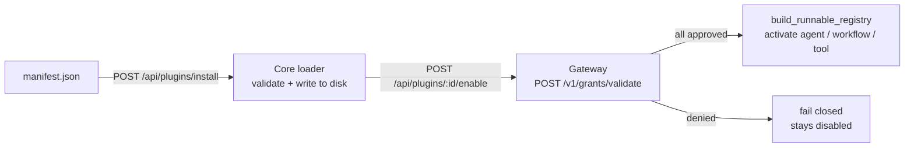

A Ryu **Plugin** is a bundle of one or more [Runnables](/docs/start-here/architecture/runnable-model)
plus the permission grants they need, described by a single declarative `manifest.json`. This page
walks you through assembling that file and installing it to Core. It is a thin descriptor naming
everything the plugin contributes.

The full field-by-field schema (all eight Runnable kinds, per-kind `config`, `contributes`,
`activation_events`, `engines.ryu`) lives in the reference. This page does not re-state it.

For the relationship between the native manifest, generated Agent Plugins files, `skills/`,
portable `ryu.package.json`, and app/plugin folder layouts, see
[Extension schemas & folder layouts](/docs/extend/develop/extensions/schemas-and-layouts).

<Cards>
  <DocCard href="/docs/extend/develop/sdk/plugin-api" />
  <DocCard href="/docs/start-here/architecture/runnable-model" />
</Cards>

## 1. Write the manifest skeleton

Create a `manifest.json` with the three required top-level fields plus an empty `runnables` array.
The `id` is a reverse-domain identifier, `version` must be valid semver, and `name` is the display
label shown in the plugin store.

```json
{
  "id": "@example/research-assistant",
  "name": "Research Assistant",
  "version": "1.0.0",
  "runnables": [],
  "permission_grants": []
}
```

The loader (`apps/core/src/plugin_manifest/mod.rs`) rejects a manifest whose `version` is not valid
semver. The canonical file name is `manifest.json`; the legacy `ryu.json` is still read for plugins
installed before the apps-to-plugins rename.

`ryu pack` and `ryu publish` preserve the complete Core manifest while validating it. Top-level
`permission_levels`, `sidecars`, `stability`, and `surfaces` declarations remain in the signed
package rather than being reduced to the SDK's convenience vocabulary. Forward-compatible
top-level fields are preserved for Core, which remains the authoritative manifest validator.

`surfaces` answers **where the package is supported**; `provides` and `contributes` answer **what it
extends**. The Marketplace detail projection also labels **where the implementation lives**. The
Web app, Mobile app, and Browser extension reuse the Desktop shell contract, so their support rows
may be marked as inherited from Desktop without implying Desktop-only native APIs. See
[Contribution surfaces](/docs/extend/develop/extensions/contribution-surfaces#support-extension-and-implementation-are-different-facts)
for the full three-axis model.

## 1a. Add Store presentation metadata

The native manifest also owns the safe, user-facing fields shown by the Marketplace and Library:
`tagline`, `author`, `homepage`, `repository`, `keywords`, `tags`, `category`, `license`, `icon` /
`iconUrl`, `iconDither`, `iconBackground`, `banner`, `screenshots`, `examplePrompts`, and policy
links. `tags` is the curated `string[]` used by the Store's tag filter; `keywords` remains the
broader search vocabulary. `external: true` marks a provider whose runtime lives outside the local
Ryu process. It is a provenance label, not permission; the remote endpoint still needs an explicit
`mcp_servers` entry and Gateway grants.

```json
{
  "id": "@example/research-assistant",
  "name": "Research Assistant",
  "version": "1.0.0",
  "description": "Drafts a literature review from a folder of PDFs.",
  "tagline": "Turn a reading pile into a cited outline",
  "author": { "name": "Example Labs", "url": "https://example.com" },
  "homepage": "https://example.com/research-assistant",
  "repository": "https://github.com/example/research-assistant",
  "privacyPolicyUrl": "https://example.com/privacy",
  "termsOfServiceUrl": "https://example.com/terms",
  "license": "MIT",
  "keywords": ["research", "writing"],
  "tags": ["research", "writing", "citations"],
  "screenshots": ["https://cdn.example.com/research-assistant.png"],
  "banner": { "style": "gradient", "colors": ["#1d4ed8", "#7c3aed"] },
  "examplePrompts": ["Compare these papers and group their methods."],
  "runnables": [],
  "permission_grants": []
}
```

Ryu also reads compatible GitHub descriptors at `.codex-plugin/plugin.json` and
`.claude-plugin/plugin.json`. Codex-style nested `interface` fields such as `displayName`,
`shortDescription`, `longDescription`, `websiteURL`, `composerIcon`, `logo`, `screenshots`, and
`defaultPrompt` map to the same presentation contract. This is GitHub discovery metadata: the
server hydrates and scrubs it for cards and detail views, but it never imports executable code,
permission grants, MCP endpoints, or install artifacts from an unsigned descriptor. A compatible
descriptor does not replace a Ryu `manifest.json` when you want to install and run the plugin.

Screenshots and banners are declared URLs, so the GitHub repository (or another HTTPS asset host)
is the source of truth for listing art. Ryu does not need a new server-side image upload for a new
listing. Existing hosted marketplace media remains a compatibility fallback for older records; the
legacy upload endpoint and database columns are still present for older publisher clients, but
manifest-declared presentation wins whenever it is available.

`provides` is also summarized as a non-executable **swappable layer** on cards and detail views.
Declare the capability and its canonical verbs there; the binding and adapter code remain in the
native signed manifest.

## 2. Add your Runnables

Each entry in `runnables` carries an `id`, a `name`, a `kind`, and an optional per-kind `config`.
The TypeScript SDK's `RunnableKindSchema` enumerates five kinds — `agent`, `workflow`, `tool`,
`skill`, and `companion` — of Core's eight (`channel`, `engine`, and `policy` are the three it does
not yet type). The example below is taken from the built-in `sample.manifest.json` fixture.

```json
{
  "id": "@example/research-assistant",
  "name": "Research Assistant",
  "version": "1.0.0",
  "runnables": [
    {
      "id": "agent-researcher",
      "name": "Researcher",
      "kind": "agent",
      "config": {
        "system_prompt": "You are a research assistant.",
        "model": "gemma4",
        "tools": ["web_search"]
      }
    },
    {
      "id": "tool-web-search",
      "name": "Web Search",
      "kind": "tool",
      "config": { "slug": "web_search" }
    }
  ],
  "permission_grants": ["mcp:web_search"]
}
```

The agent `model` field routes through the Gateway registry and is never hardcoded; an agent's
`tools` are a subset of the plugin's `permission_grants`. A `tool` entry wraps a single MCP tool
slug. For the exact `config` shape of every kind, see the
[plugin-api reference](/docs/extend/develop/sdk/plugin-api).

### Workspace-scoped command paths

A command-backed tool that reads caller-selected files must mark those argument names with
`workspace_path_args`, for example:

```json
{
  "slug": "search",
  "backend": "command",
  "bin": "rg",
  "command_args": ["--", "{pattern}", "{path}"],
  "workspace_path_args": ["path"]
}
```

Core resolves each marked value against the active conversation workspace immediately before
spawning the allowlisted binary. It refuses missing paths, traversal that escapes the workspace,
symlink components, and protected host data such as Ryu's node directory or agent credential
directories. A command tool must not use an unrestricted absolute path as a substitute for this
declaration.

<Callout type="warn">
  All eight Runnable kinds now have an activation handler. Agents, workflows, tools, skills,
  engines, channels, and companions register into their corresponding Core contribution/store
  surface. A `policy` entry is validated by Core and coordinated through the policy pass; the
  Gateway remains the authority for policy enforcement. Enable still reports per-Runnable errors,
  so a bad entry is visible without aborting unrelated entries.
</Callout>

## 3. Declare permission grants

`permission_grants` are strings the plugin declares it needs, for example `mcp:web_search`. They
are declarations only. Enforcement is the Gateway's job: on enable, Core calls the Gateway's
`POST /v1/grants/validate` for each declared grant
(`validate_grants_via_gateway`, `apps/core/src/plugins/lifecycle.rs`) and fails closed if any grant
is denied. This keeps the Core-vs-Gateway split intact - Core decides what runs, the Gateway
decides what is allowed. See [governance](/docs/gateway/governance) for the grant model.

## 4. (Optional) Add contribution points and an engine pin

Two VS-Code-style blocks tune how the plugin loads. Both are optional and default off.

`contributes` is a declare-by-id block naming which of your `runnables` surface as commands, tools,
agents, workflows, or policies. Every id you reference must exist in `runnables` or the loader
rejects the manifest at load (a typo is caught immediately).

`engines.ryu` is a semver requirement string (e.g. `">=0.3.0"`); the loader rejects the manifest if
the running Core version does not satisfy it, mirroring `engines.vscode`.

```json
{
  "contributes": {
    "tools": [{ "id": "tool-web-search", "title": "Search the web" }]
  },
  "activation_events": ["onStartup"],
  "engines": { "ryu": ">=0.0.1" }
}
```

`activation_events` lazily wake the plugin. Recognised tokens are `"*"` (eager), `"onStartup"`,
`"onChat"`, and `"onCommand:<id>"`. An empty list (the default) means eager activation, so existing
manifests keep activating on enable.

<Callout type="warn">
  Activation-event firing is partly wired. `onStartup` fires at boot
  (`fire_activation_event`, called from `main.rs`), so a plugin declaring it is genuinely woken
  lazily. The wiring that fires `onChat` and `onCommand` from the chat and command-palette paths is
  a follow-on (`apps/core/src/runnable/mod.rs`). The TypeScript SDK's `RunnableKindSchema`
  (`packages/sdk/src/manifest.ts`) enums five kinds (`agent`, `workflow`, `tool`, `skill`,
  `companion`); if you author `channel`, `engine`, or `policy` entries — the three Core kinds it
  does not type — write the `manifest.json` directly rather than relying on the SDK type for those.
</Callout>

## 4a. (Optional) Hide tools with `tool_filters`

A plugin can withdraw tools from the model's view without touching the tool itself. The
`contributes.tool_filters` array is a list of `{ "tool": ..., "reason"?: ... }` entries. When an
enabled plugin declares one, the matched tool is removed from the list offered to the model, so the
model never spends a round-trip discovering it is unavailable.

```json
{
  "contributes": {
    "tool_filters": [
      { "tool": "shell.exec", "reason": "Shell execution is disabled while this policy is on" },
      { "tool": "shadow.*", "reason": "Removes the entire shadow server namespace" }
    ]
  }
}
```

The `tool` id is fully-qualified: `<server>.<tool>` (e.g. `browser.navigate`). The namespace is
mandatory — a bare `navigate` is ambiguous across servers and is rejected at import. A trailing `*`
is the only wildcard position allowed and hides every tool with that prefix (`shadow.*` hides a
whole server); an interior or leading `*` is rejected because it would silently match far more than
the author pictured. An exact pattern (no `*`) matches exactly one tool id and does not behave as a
prefix. `reason` is optional and surfaces in the plugin's listing, so a user can see what a plugin
removes before installing it.

## Declare a managed sidecar

Optionally, a manifest can declare `sidecars[]` - long-running child processes Core downloads or
provisions, spawns, and health-checks. Reach for this when your app wraps a binary or a Python
service (an Audio engine, a capture daemon) rather than a stdio MCP server. The field is `SidecarSpec` in
`apps/core/src/plugin_manifest/schema.rs`.

```json
{
  "sidecars": [
    {
      "name": "engine",
      "process": {
        "kind": "binary",
        "url": "https://example.com/dl/my-engine",
        "sha256": "…",
        "version": "1.2.3",
        "args": ["--port", "8321"]
      },
      "port": 8321,
      "health_path": "/health"
    }
  ],
  "permission_grants": ["sidecar:process"]
}
```

`process.kind` is `binary` (a downloaded, checksum-verified executable or archive), `python` (a
provisioned venv running `python -m <entry>`), or `local`/`node` (a program already on the machine).
A Community-tier plugin must declare the `sidecar:process` grant, which the Gateway must approve on
enable before Core will download or spawn anything (a Core-tier plugin is auto-allowed). The `port`
is bind-probed to reject a collision before the process starts.

The example above repeats `8321` in `args` because a `binary` sidecar has no way to be *told* its
port. The `local` and `python` kinds do: `port_env` names an environment variable Core sets on the
child, and the process reads the port from there instead of repeating it.
[Pick a Sidecar Port](/docs/extend/develop/extensions/sidecar-ports) covers which kinds support that, why
the injected value is not always the number in the manifest, and which port ranges are safe to pick
from.

The download, checksum, port-claim, and boot-reconcile behaviour - and the `may_run_sidecar` gate -
are documented once in
[App Manifest & Lifecycle](/docs/core/app-manifest-lifecycle#manifest-declared-managed-sidecars).
This page only declares the field.

## 5. Install and enable

Host the `manifest.json` at a URL, then install it by URL and enable it.

```bash
# Install: Core fetches the manifest, validates the schema, writes it under
# ~/.ryu/plugins/, and hot-reloads (no restart needed).
curl -X POST http://localhost:7980/api/plugins/install \
  -H 'content-type: application/json' \
  -d '{"url": "https://example.com/research-assistant/manifest.json"}'

# Enable: validate grants via the Gateway, then activate the Runnables.
curl -X POST http://localhost:7980/api/plugins/@example/research-assistant/enable
```

After install the plugin appears in `GET /api/plugins` immediately. The lifecycle routes are
`POST /api/plugins/:id/{enable,disable,update}` (`apps/core/src/server/mod.rs`, backed by
`apps/core/src/plugins/lifecycle.rs`). Enable fails closed if any declared grant is denied by the
Gateway. The `/api/apps*` aliases still resolve to the same handlers but are deprecated.

<TryInRyu page="store" />

## What runs where



## Related

<Cards>
  <DocCard href="/docs/extend/develop/extensions/hooks-lifecycle" />
  <DocCard href="/docs/extend/develop/extensions/mcp-server" />
  <DocCard href="/docs/extend/develop/extensions/typescript-sdk" />
  <DocCard href="/docs/extend/develop/extensions/marketplace" />
  <DocCard href="/docs/core/app-manifest-lifecycle" />
</Cards>
