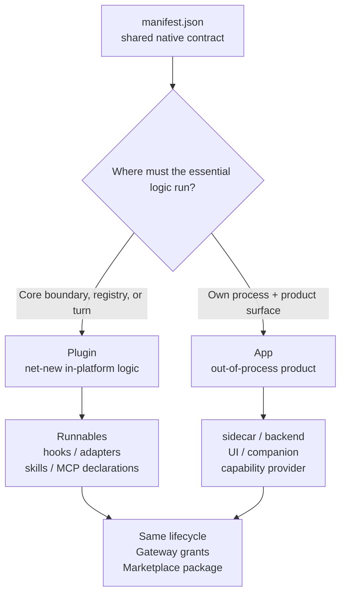

Two words get thrown around in the Ryu docs: **plugin** and **app**. They are easy to blur,
partly because both are `manifest.json` bundles you install and enable the same way, and partly
because there are two unrelated things called "app." This page draws the line.

The `apps-store/` and `plugins-store/` paths below name the canonical monorepo source layout. In
the public projections, feature-app source lives in its `amajorai/ryu-<app>` satellite and full
plugin source lives in `amajorai/ryu-marketplace`. The main `amajorai/ryu` runtime hub may carry
only generated manifest and embedded-asset inputs under `generated/ryu-runtime/`; that directory is
not an authoring checkout.

<Callout type="info">
  **The one-line distinction.** A **plugin** extends capabilities: it contributes net-new logic
  (tools, agents, workflows, skills, turn hooks, adapters) that runs inside the platform. An
  **app** builds on pre-built primitives: it ships a product process and/or surface (for example a
  sidecar, backend, widget, or companion) and reaches the platform through generic seams (the
  ext-proxy, capability broker, sidecar lifecycle, and UI bridges), never through in-process code
  added to Core.
</Callout>

<Callout type="info">
  The native manifest and package formats are intentionally layered: `manifest.json` is the
  shared plugin/app runtime contract, `plugin.json` and `mcp.json` are generated Agent Plugins
  interop files, and `ryu.package.json` is the portable Marketplace envelope. See
  [Extension schemas & folder layouts](/docs/extend/develop/extensions/schemas-and-layouts) for
  the diagrams, field map, and canonical source trees.
</Callout>

## Describe an extension on three axes

“Plugin” and “app” describe the package shape, not every place it can be used. For a complete
Marketplace description, keep these facts separate:

| Axis | Question | Ryu declaration or projection |
| --- | --- | --- |
| **Support** | Where can the package appear? | `surfaces` / legacy `targets`, with a support level. |
| **Extends** | What existing Ryu capability or UI slot does it add to? | `provides` for capability layers and `contributes` for shell slots. |
| **Implementation** | Where does the feature actually run? | Core runtime, shared Ryu shell, or the package sidecar, projected from the manifest. |

The browser-hosted Web app, Mobile app, and Browser extension are wrappers around the shared Desktop
shell contract. They can consume a package's shell contribution while still omitting Desktop-only
native APIs. A row that says “Mobile — Limited — inherited from Desktop” is therefore describing
shell reuse, not a promise of native window or filesystem support.

The Browser app is a useful example: it extends `browser.control` and contributes a Browser dock
panel, while its Chromium session lives in the app sidecar. Core owns the generic lifecycle, proxy,
grant, and capability seams; the Browser package owns browser behavior.

## One manifest, two ownership models

Your instinct ("plugins extend capabilities, apps build on pre-built primitives") is right, with
one nuance: apps **do** add capabilities. The Browser app provides `browser.control`, the Mail app
provides `mail:crud`. But they add them *through the pre-built seam*, not with bespoke Core code.
The real question is not *whether* you add a capability, but *where the contribution lives*: logic
that runs in Core, or a process and a surface that live outside it.

## Plugins extend capabilities

A plugin is a `manifest.json` that bundles one or more
[Runnables](/docs/start-here/architecture/runnable-model) plus the `permission_grants` they need.
The plugin's contribution is **code that runs**: sandboxed JS turn hooks
(`apps/core/src/plugin_host/`), capability adapters under `plugins-store/{plugins,lsp,external_plugins}/<plugin>/adapters/`, and
Runnables that Core activates when the plugin is enabled. Install and enable it live over
`POST /api/plugins/install` / `.../enable`, with every grant validated by the Gateway and every
hook executed in the same deny-by-default Deno sandbox as programmatic tool calling.

| | Plugin |
|---|---|
| Contributes | Net-new logic: tools, agents, workflows, skills, turn hooks, adapters |
| Where logic runs | Inside the platform (Core sandbox, MCP registry, agent store) |
| Code lives in | The manifest + `code_file` bodies (`hooks/*.js`, `adapters/*.js`) |
| Core touch | Nothing — install and enable through the public API |
| Security | Grants enforced by the Gateway; hooks capability-gated and fail-open |
| Examples | `double-check`, `goal`, `advisor`, `agent-comms`, `firewall` |

Think of a plugin as *teaching the agent something new*: a new tool it can call, a review it runs
after each turn, a workflow it can orchestrate.

See [Bundle Runnables with manifest.json](/docs/extend/develop/extensions/plugin-json-manifest) and
[Plugin Runtime](/docs/extend/develop/extensions/plugin-runtime).

## Apps build on pre-built primitives

An app is a self-contained product under `apps-store/<app>/` (`manifest.json`, an out-of-process
`sidecar/` or `backend/`, and an optional `ui/` surface) published as its own satellite repo
(`tools/mirror-satellites.sh`). Its contribution is **a process and a surface**, not runtime code in
Core. The platform hosts it through primitives that already exist:

| Pre-built primitive | What it does for an app |
|---|---|
| **Ext-proxy** (`capability` + `grant`) | The app declares a capability (`provides`), and the desktop/agents reach the sidecar through the generic `/api/ext/<id>/*` proxy — no per-app Core route |
| **Capability broker** | `provides` / `requires` resolution, canonical verbs, swappable providers |
| **Sidecar lifecycle** | Core downloads or spawns the sidecar, health-checks it, lazy-starts and idle-stops it |
| **Widget / companion / full-page surfaces** | The app's UI renders in the sandboxed iframe tier and talks to the host over a capability-gated bridge |

The one thing that legitimately lives in Core is the registration: a single `include_str!` row in
the signed marketplace package (or, for system components, `BUILTIN_MANIFESTS` in
`apps/core/src/plugin_manifest/mod.rs`) that supplies the app's own manifest
straight from its package directory. Everything else stays in the satellite.

| | App |
|---|---|
| Contributes | A full surface: out-of-process sidecar + widget/companion/full-page UI |
| Where logic runs | Outside the platform (its own process, its own repo, its own release cycle) |
| Code lives in | `apps-store/<app>/sidecar/` (or `backend/`) and `apps-store/<app>/ui/` |
| Core touch | One `include_str!` registration line, nothing else |
| Security | Loopback sidecars, per-app bearer (`RYU_EXT_TOKEN`), capability grants, sandboxed UI |
| Examples | `browser`, `mail`, `clips`, `research`, `monitors`, `meetings` |

Think of an app as *shipping a product*: a browser the agent can drive, a mail client the agent
owns. The platform provides the hosting, governance, and UI plumbing; the app provides
the process and the interface.

See [Author a Ryu App](/docs/extend/develop/extensions/ryu-apps) for the widget-authoring path and
[Capability Broker](/docs/extend/develop/extensions/capability-broker) for the swap seam.

## The nuance: apps also provide capabilities

This is the part that makes "plugins extend capabilities / apps build on primitives" feel
inconsistent. An app *does* extend the platform: `browser.control`, `mail:crud`, `rag`, `tts` are
all capabilities apps provide. The difference is the **mechanism**. The app reaches the platform
through the generic `capability` + `grant` seam and the ext-proxy, so Core never needs a bespoke
`browser_client.rs` or a hardcoded `/api/browser` route. Swap the sidecar for any implementation of
the same contract and nothing in Core changes.

A plugin, by contrast, can add capability code directly: a turn hook that runs in the Core sandbox
is *impossible* to ship as an app, because that logic has to run where the turn happens. That is the
hard boundary:

| The contribution must... | Ship a | Because |
|---|---|---|
| Run inside the turn (hooks, adapters, tools that Core executes) | **Plugin** | Apps can't run in-process code in Core |
| Run outside Core (a service, a binary, a long-lived process) | **App** (or a plugin with a `sidecars[]` entry) | The sidecar lifecycle and ext-proxy host it |
| Render an in-chat widget or a desktop panel backed by a sidecar | **App** | The widget/companion surfaces exist for that |

## A quick word on the name "app"

"App" is overloaded in Ryu. When you read it, disambiguate:

| Term | What it means |
|---|---|
| **apps-store app** | A self-contained satellite product (`apps-store/<app>/`) — the subject of this page |
| **Ryu App** (widget) | An in-chat interactive widget (OpenAI-Apps-SDK compatible) — see [Ryu Apps](/docs/surfaces/desktop/user-guide/apps) |
| **Legacy "app"** | The old name for what is now a **plugin** (the apps-to-plugins rename; the legacy `ryu.json` is still read for plugins installed before it) |

Today the user-facing term for an installable bundle of Runnables is **plugin**. The Store page, the
manifest guide, and the lifecycle APIs all say plugin. "App" now means a satellite or a widget.

## Decision guide

| You want to... | Ship a |
|---|---|
| Contribute a tool, agent, workflow, or skill the agent can use | **Plugin** |
| React to chat turns (double-check, goal, firewall) | **Plugin** (turn hook) |
| Ship a long-lived service or binary the agent/desktop drives | **App** (or a plugin with `sidecars[]`) |
| Render an interactive widget inside a reply | **Ryu App** widget |
| Add a desktop panel or settings surface | **App** companion |
| Provide or consume a swappable capability (`rag`, `browser.control`, `tts`) | **App** via the capability broker |
| Publish on the Ryu Marketplace | Either — both publish as a signed `manifest.json` bundle |

The two are not mutually exclusive. Both are manifests, both install and enable through the same
lifecycle, and both get their grants validated and signed by the Gateway. A plugin can declare a
sidecar; an app can contribute a companion or a widget; both can `provides` a capability. When the
surface you want doesn't need in-process turn logic, prefer the app. It keeps Core untouched and
the product independently shippable.

For the complete bundle matrix, remember the split: hooks and adapters hydrate from `code_file`
into the signed manifest, UI entries can become hashed `ui_code`, while `skills/`, Pi extensions,
sidecar source, and other resources remain package-tree artifacts. MCP can be declared natively in
`mcp_servers` and projected to a portable `mcp.json`. The [schemas and layouts guide](/docs/extend/develop/extensions/schemas-and-layouts#what-can-be-bundled) shows each boundary.

<Cards>
  <DocCard href="/docs/extend/develop/extensions/plugin-json-manifest" title="Plugins & manifest.json" description="Declare Runnables and permission grants in a manifest." />
  <DocCard href="/docs/extend/develop/extensions/plugin-runtime" title="Plugin runtime" description="Sandboxed turn hooks that run in Core." />
  <DocCard href="/docs/extend/develop/extensions/ryu-apps" title="Author a Ryu App" description="Build an in-chat widget with defineApp." />
  <DocCard href="/docs/extend/develop/extensions/capability-broker" title="Capability broker" description="Provide and require abstract capabilities." />
  <DocCard href="/docs/extend/develop/extensions/desktop-companion" title="Desktop companions" description="Contribute desktop UI from a manifest." />
  <DocCard href="/docs/extend/develop/extensions/schemas-and-layouts" title="Schemas & folder layouts" description="Map native manifests, interop files, package envelopes, and source trees." />
  <DocCard href="/docs/start-here/architecture/platform-decomposition" title="Platform decomposition" description="The apps-store model and the six proven patterns." />
</Cards>
