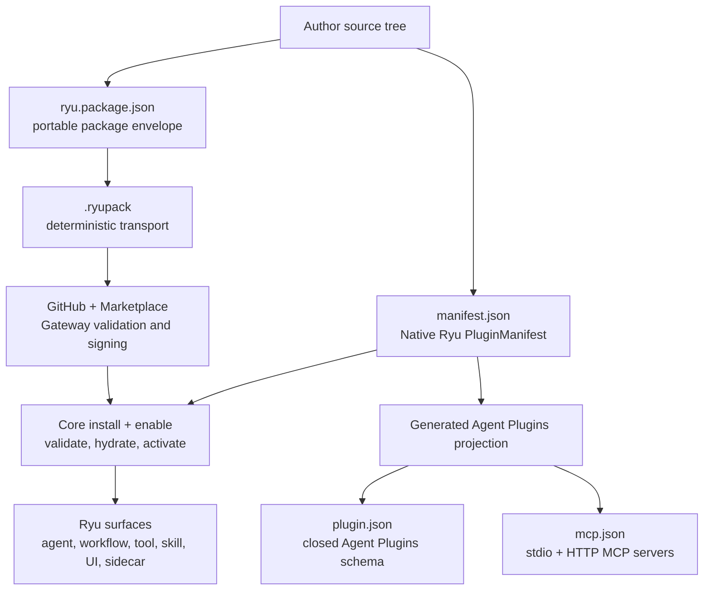
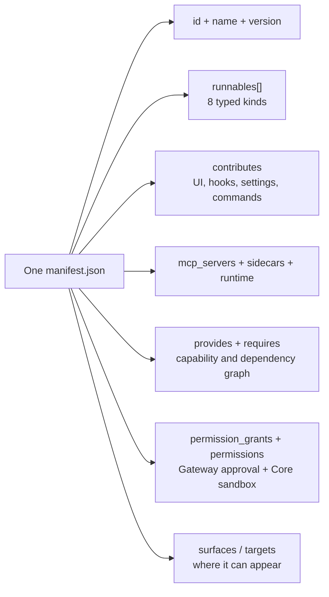
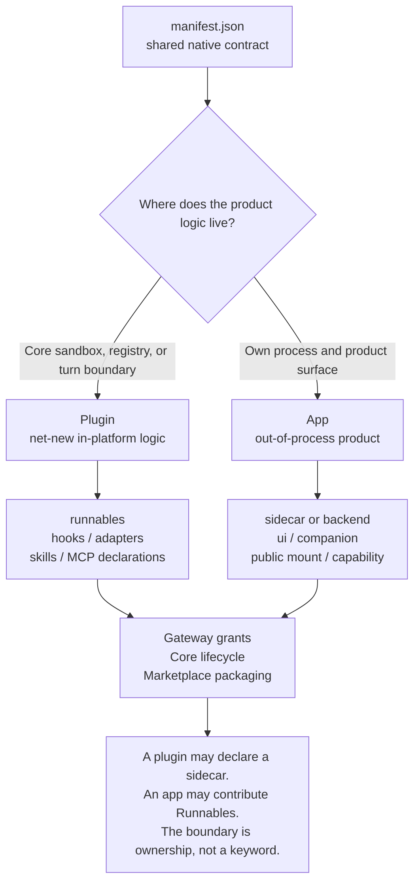
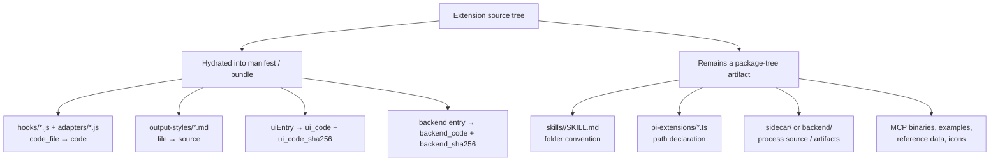
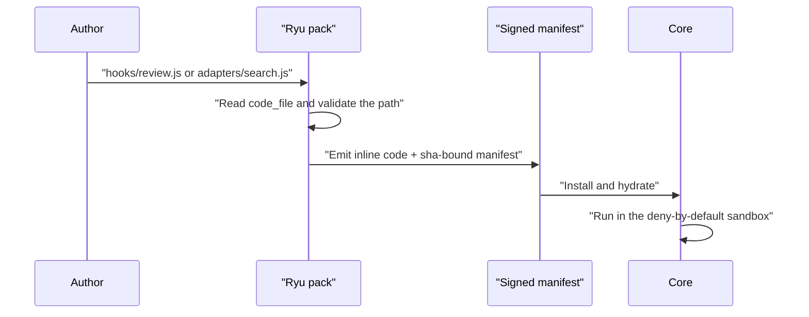
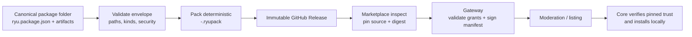

Ryu extensions have several files that look like manifests. They are related, but they are not
interchangeable. The safest mental model is: `manifest.json` describes what Ryu runs,
`plugin.json` and `mcp.json` are the portable Agent Plugins projection, and `ryu.package.json`
describes how a package moves through folders, archives, GitHub, and the Marketplace.

<Callout type="info">
  **One source of truth.** Author the native Ryu contract in `manifest.json`. `plugin.json` and
  `mcp.json` are generated interop files; do not hand-edit them in a Ryu package. The outer
  `ryu.package.json` is a separate envelope for portable distribution and can contain a native
  manifest as one of its declared artifacts.
</Callout>

## The three layers



These layers answer different questions:

| File or layer | Question it answers | Source-of-truth rule |
|---|---|---|
| `manifest.json` | What does this Ryu plugin/app declare and how can Core activate it? | Native Ryu truth. |
| `plugin.json` | What portable Agent Plugins metadata can another compatible host read? | Derived projection; the Agent Plugins schema is intentionally closed. |
| `mcp.json` | Which stdio or remote MCP servers can a compatible host use? | Derived from native `mcp_servers` when exporting; it is not the native Ryu grant boundary. |
| `skills/<slug>/SKILL.md` | What reusable instruction bundle can a Skills-compatible host discover? | Folder convention; the skill body remains a file in the package tree. |
| `ryu.package.json` | What is this package, what files belong to it, and where may it be applied? | Portable package truth for the envelope. |
| `.ryupack` | How are the same files transported reproducibly? | Deterministic archive of the package tree. |

## Native `manifest.json`: the plugin and app contract

Plugins and apps use the same native manifest schema. The difference is where their product logic
lives and how it is distributed, not a second “app schema.” A manifest may be surface-only, so
`runnables` can be empty when the useful contribution is a sidecar, a capability provider, or a
declarative UI surface.



The required native identity is `id`, `name`, `version`, and `runnables`. The important optional
blocks are:

| Block | Use it for | Boundary to remember |
|---|---|---|
| `runnables` | Declare agents, workflows, tools, skills, companions, channels, engines, and policies. | The per-kind `config` is validated before activation. |
| `contributes` | Add hooks, widgets, views, settings tabs, composer controls, message actions, output styles, LSP servers, and other pre-built surfaces. | A contribution is a declaration; it does not grant arbitrary UI or Core code execution. |
| `mcp_servers` | Register declarative stdio or remote HTTP MCP servers owned by the plugin. | The server still needs the appropriate Gateway grant and tool allowlist; OAuth belongs in the native manifest. |
| `sidecars` | Describe a managed process Core can download, provision, spawn, health-check, and stop. | The process runs outside Core through the generic lifecycle/proxy seams. |
| `provides` / `requires` | Publish or consume a swappable capability and declare plugin dependencies. | Capability versions are not the same as plugin versions. |
| `permission_grants` | Ask the Gateway for host capabilities such as MCP, sidecar, storage, model access, or host-rendered declarative HTTP/toast surfaces. | A declaration is not approval; enable fails closed when a required grant is denied. |
| `permissions` | Describe the typed runtime sandbox set for filesystem, network, child-process, and tool access. | This is Core enforcement, distinct from Gateway grants and human-facing `permission_levels`. |
| `surfaces` / `targets` | State whether the extension supports desktop, web, mobile, CLI, and other hosts, including `full`, `limited`, `list`, or `commands` support. | An explicit `surfaces` map wins over legacy `targets`; the Marketplace also shows Web, Mobile, and Browser-extension rows as shared Desktop-shell wrappers when applicable. |
| `runtime` | Provision an external runtime such as a Python environment when the extension needs one. | Runtime provisioning is a separate process boundary with its own security review. |

The full per-field and per-kind contract lives in [Plugin API Reference](/docs/extend/develop/sdk/plugin-api).
The worked authoring path is [Bundle Runnables with manifest.json](/docs/extend/develop/extensions/plugin-json-manifest).

### Read the support contract in the Marketplace

The catalog keeps **support**, **extension**, and **implementation** separate:

- **Support** is the host matrix from `surfaces`. It is a compatibility and presentation fact;
  install and enable still run through Core's signed manifest and lifecycle gates.
- **Extends** is derived from the existing `provides` and `contributes` declarations. A provider of
  `browser.control` extends the Browser capability; a `dock_panels` contribution extends the shared
  Ryu shell. It does not mean the package edits the host application.
- **Where it lives** groups the runtime boundary: Core for registered runnables and hook/capability
  contracts, the shared shell for host-rendered UI, and the package sidecar for its own process.

The Web app, Mobile app, and Browser extension use the Desktop shell's contribution vocabulary with
their own host bridges. Their Marketplace support row may show `inherited from Desktop`; that means
shared shell composition only, not access to Desktop-only native APIs.

### The eight Runnable kinds

The native schema accepts eight peer kinds. They are not a hierarchy, and a single manifest may
declare more than one.

| Kind | What it contributes | Where the current handler lands it |
|---|---|---|
| `agent` | A configured model loop with tools and persona. | The agent store, namespaced to the package. |
| `workflow` | A reusable workflow definition. | The workflow store/executor. |
| `tool` | A callable tool binding, including supported MCP/backend forms. | The MCP/tool registry. |
| `skill` | A named reusable instruction reference. | The app-skill registry; the body is supplied by the bundled `skills/` tree when present. |
| `companion` | A desktop overlay or sidebar surface. | The app-contribution registry and desktop host. |
| `channel` | A messaging-platform adapter declaration. | The channel contribution registry; credentials and routing remain operator configuration. |
| `engine` | A selectable model/inference engine binding. | The engine contribution registry; model calls remain Gateway-routed. |
| `policy` | A switch for a Gateway/Core policy such as firewall, routing, compression, or sandbox. | Core validates and coordinates the state; the Gateway owns policy enforcement where applicable. |

Every handler reports its own result. A malformed or unsupported entry does not silently turn the
whole package into an apparently successful install; enable exposes per-entry failures.

<Callout type="warn">
  The native runtime accepts all eight kinds, but the current TypeScript SDK only provides typed
  `defineAgent`, `defineWorkflow`, `defineTool`, and `defineSkill` factories. Declare companion,
  channel, engine, or policy entries with the native manifest shape and their per-kind config; do
  not assume that every runtime kind has an SDK builder yet.
</Callout>

## Plugin versus app: same schema, different ownership



Use **plugin** when the essential behavior must run at a turn boundary or inside a Ryu registry:
turn hooks, adapters, in-process tool bindings, agents, workflows, or policies. Use **app** when
you are shipping a product process and a surface: a browser, research service, desktop companion,
or capability provider. Both still declare grants, both are enabled through the same lifecycle, and
both can be published as Marketplace packages.

There are two app names worth separating:

| Term | Meaning |
|---|---|
| **Apps-store app** | A self-contained satellite product with its own `backend/` or `sidecar/`, optional `ui/`, and one native manifest. |
| **Ryu App widget** | An in-chat widget produced by a manifest tool and packed into `ui_code`; it is a surface a plugin/app may ship, not a separate manifest schema. |

For the decision guide and the generic ext-proxy/capability seams, see [Plugins vs Apps](/docs/extend/develop/extensions/plugins-vs-apps).

## What can be bundled

An extension can combine declarative contributions, code fragments, resources, processes, and UI.
The important distinction is whether `ryu pack` inlines a source file into a signed JSON bundle or
whether the file must remain in the portable source tree.



| Authoring path | Native declaration | Packed or installed form | Practical rule |
|---|---|---|---|
| `hooks/<name>.js` | `contributes.turn_hooks[].code_file` | Hydrated `code` body | Keep exactly one of `code_file` or inline `code`; the body is part of the signed manifest after packing. |
| `adapters/<verb>.js` | `provides[].tools[].adapter.code_file` | Hydrated adapter body | The adapter can only call the tools allowlisted by its provider declaration. |
| `output-styles/<name>.md` | `contributes.output_styles[].file` | Inlined `source` text | Front matter and body stay together so one parser owns the style metadata. |
| `skills/<slug>/SKILL.md` | `runnables[].config.skill_id` plus folder convention | Copied into the canonical Skills home on enable | A single JSON bundle does not invent the missing directory; publish the skill tree as package artifacts. |
| `mcp_servers` | Native manifest map | Registered by Core on enable | The native map and Agent Plugins projection support stdio, Streamable HTTP, and legacy SSE; the native map additionally carries Ryu-only grants and OAuth metadata. |
| `ui/` or `uiEntry` | Companion/widget contribution | Self-contained `ui_code` plus hash for packed UI | Build a single self-contained HTML payload; no external iframe chunk. |
| `sidecar/` or `backend/` | `sidecars[]` and optional backend fields | Managed process or package-tree artifact | The process reaches Ryu through generic proxy/capability seams, never a bespoke Core route. |
| `pi-extensions/*.ts` | `contributes.pi_extensions[].file` | Path remains a source-tree dependency | Treat this as a source-tree/built-in lane until a pack format carries the file explicitly. |

### Hooks and adapters: source form versus wire form

This distinction is easy to miss when reviewing a package:



`code_file` is the readable, reviewable authoring form. `code` is the wire form that keeps the
executed body inside the signed surface. Never leave a `code_file` unresolved in a published JSON
bundle.

## Canonical folder layouts

### A plugin source tree

```text
my-plugin/
├── manifest.json                 # native Ryu source of truth
├── README.md
├── hooks/                        # optional turn-hook bodies
│   └── review.js
├── adapters/                     # optional capability adapters
│   └── search.js
├── skills/                       # optional Agent Skills
│   └── research/
│       ├── SKILL.md
│       └── examples/             # optional skill resources
├── output-styles/                # optional Markdown styles
│   └── plain-technical.md
├── mcp.json                      # generated Agent Plugins interop, when needed
├── plugin.json                   # generated Agent Plugins interop manifest
├── pi-extensions/                # optional source-tree Pi extensions
│   └── monitor.ts
├── ui/                           # optional companion/widget source
└── ryu.package.json              # only when publishing as a portable package
```

`plugin.json` is not a second native manifest. The generator projects safe metadata, the true Ryu
id, and MCP compatibility data into the Agent Plugins extension namespace. A compatible host can
still read the portable `skills/` and `mcp.json` conventions even if it does not understand Ryu's
full `manifest.json`.

### An apps-store satellite

```text
my-app/
├── manifest.json                 # same native PluginManifest schema
├── README.md
├── backend/                      # optional Rust or other service
│   └── ...
├── sidecar/                      # optional packaged process/runtime
│   └── ...
├── ui/                           # optional companion or full-page UI
│   └── ...
├── hooks/                        # optional flat sandbox fragments
├── skills/                       # optional bundled Skills
├── mcp.json                      # generated interop when MCP is declared
├── plugin.json                   # generated interop manifest
└── output-styles/                # optional contributed styles
```

An app satellite owns its process and UI in its own package/repository. The host owns lifecycle,
grant validation, generic ext-proxy routing, capability binding, and surface mounting. Keep the
sidecar independent of Core; declare its public mount and capabilities in the manifest.

### A portable package or collection

```text
my-package/
├── ryu.package.json              # outer envelope
├── manifest.json                 # if kind is plugin or app
├── agent.json / workflow.json    # artifact for standalone kinds
├── skills/<slug>/SKILL.md        # if the package carries a Skill
└── assets/                       # declared, traversal-safe artifacts

my-collection/
├── agents/research/ryu.package.json
├── plugins/review/ryu.package.json
├── external_plugins/cloudflare/ryu.package.json
└── apps/browser/ryu.package.json
```

The folder is canonical. A `.ryupack` is a deterministic transport of that tree, and a collection
repository is discovered by scanning package folders rather than maintaining a generated central
index. Keep local providers under `plugins/` and hosted or otherwise outside-the-machine providers
under `external_plugins/`; the native manifest's explicit `external` flag is what the Marketplace
uses to show that boundary. See [Portable packages](/docs/extend/develop/extensions/portable-packages).

## `plugin.json`, `mcp.json`, and Skills interop

Ryu implements the Agent Plugins v1 floor as a projection and importer:

| Interop file | Shape | What Ryu exports | What Ryu imports |
|---|---|---|---|
| `plugin.json` | Closed manifest with `$schema`, name/version/description, author, links, keywords, and `extensions` | Native id/display data plus notes under `com.ryuhq.ryu` | Derives a namespaced native id and then applies normal manifest validation |
| `mcp.json` | `$schema` plus `mcpServers` stdio, Streamable HTTP, or legacy SSE entries | Native declarations that satisfy the portable shape | Remote URLs and headers remain explicit; Ryu-only grants and OAuth metadata stay native |
| `skills/<slug>/SKILL.md` | Universal folder convention | Carries the files in the source tree | Materializes into Ryu's Skills home with ownership-safe copy/deactivate/remove behavior |

The projection is deliberately lossy. A foreign host cannot understand Ryu's Gateway grants,
sidecar lifecycle, surfaces, or capability broker, so those remain native Ryu declarations. A Ryu
host never treats a portable `plugin.json` as permission approval; install/enable still applies the
normal trust and Gateway checks.

## The portable package envelope

`ryu.package.json` is the contract for moving a package. Its required fields are:

| Field | Meaning |
|---|---|
| `schemaVersion` | Envelope version; current package contract is `1`. |
| `id`, `name`, `version` | Stable package identity and release version. |
| `kind` | One of `plugin`, `app`, `skill`, `agent`, `workflow`, `theme`, `output_style`, `space`, `profile`, or `bundle`. |
| `artifacts` | Relative files that make up the package tree. |
| `targets` | Host/product targets such as desktop, node, or a custom target label. |
| `scopes` | Safe application scopes: `desktop`, `node`, `gateway`, `agent`, `space`, or `workflow`. |
| `requires` | Package dependency/version requirements. |
| `capabilities` | Human-readable capabilities the package provides or expects. |
| `includes` | Optional included package references for a bundle. |
| `source` | Provenance: local folder, archive, or pinned GitHub repository/path/ref/commit/checksum. |
| `security` | Redaction and risk flags: secrets, private content, permissions, and whether the tree is redacted. |
| `metadata` | Safe presentation metadata for a Marketplace card; it is not an execution permission. |

Use the [Ryu package JSON Schema](https://raw.githubusercontent.com/amajorai/ryu-marketplace/HEAD/schema/ryu.package.schema.json)
for machine validation, then use the package CLI for tree-level checks. The package envelope does
not replace `manifest.json`; it tells Ryu how to validate, move, scope, and publish the artifacts
inside it.

## Marketplace and signing flow



The Marketplace stores the source binding, release metadata, entitlement, and moderation state;
GitHub remains the package and release source of truth. A package can be discovered through a
public topic, but a reviewed Marketplace install still requires a validated immutable release.
Publishing details are in [Publish to the Marketplace](/docs/extend/develop/extensions/marketplace),
and collection discovery is in [Publish via GitHub Topics](/docs/extend/develop/extensions/github-topic-discovery).

## A checkable author workflow

1. Start with `manifest.json`; choose plugin or app from the ownership boundary, not from the file name.
2. Declare only the Runnables and contributions you actually ship. Add grants and typed sandbox permissions separately.
3. Keep hook/adapter bodies in flat `hooks/` or `adapters/` files and hydrate them during packing.
4. Put Skills in `skills/<slug>/SKILL.md`; include their resources in the package tree.
5. Declare native MCP servers under `mcp_servers`; let the Agent Plugins projection generate `mcp.json`.
6. For apps, keep `backend/` or `sidecar/` independent of Core and use generic capability/ext-proxy seams.
7. Validate the native manifest, run `bunx ryu pack <dir>` for the plugin bundle, and run `ryu package validate` / `ryu package pack` for a portable Marketplace release.
8. Run the generated-file check before publishing so `plugin.json` and `mcp.json` cannot drift from `manifest.json`.

<Cards>
  <DocCard href="/docs/extend/develop/extensions/plugins-vs-apps" />
  <DocCard href="/docs/extend/develop/extensions/plugin-json-manifest" />
  <DocCard href="/docs/extend/develop/extensions/agent-skills" />
  <DocCard href="/docs/extend/develop/extensions/mcp-server" />
  <DocCard href="/docs/extend/develop/extensions/portable-packages" />
  <DocCard href="/docs/extend/develop/sdk/plugin-api" />
</Cards>
