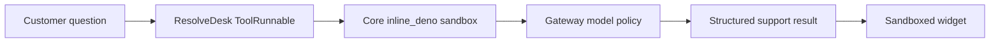

This is the concrete version of the Ryu platform promise: a software team owns the
customer-support experience, while Ryu runs the tool, governs its model calls, and mounts the
structured result as a widget.

The repository example is [`examples/support-widget`](https://github.com/amajorai/ryu/tree/main/examples/support-widget).
It is called **ResolveDesk** and covers a small help center for refunds, exports, and workspace
access.

## The shape



The app author writes the behavior and the UI. Ryu supplies the runtime boundary:

| App-owned | Ryu-owned at runtime |
| --- | --- |
| Help-center grounding and support voice | Core sandbox and lifecycle |
| `defineTool` input/output contract | Gateway routing, grants, budget, and audit |
| `widget.html` customer experience | Widget isolation and host bridge |
| Release bundle | Install, enable, disable, and update |

## 1. Define the executable support tool

`defineTool` gives the support behavior a typed schema. The same function is runnable locally with
`ctx.gateway`; when packed into a Ryu App, Core invokes the serialized body with `input` and the
grant-gated `host` surface. That lets the tool call `host.sideModel` without shipping a provider SDK
or provider credential.

```ts
import { defineTool } from "@ryuhq/sdk";

const supportRenderTool = defineTool({
  id: "resolvedesk.render",
  name: "ResolveDesk support answer",
  schema: {
    type: "object",
    properties: { message: { type: "string" } },
    required: ["message"],
  },
  async run(input, context) {
    const host = context as unknown as {
      sideModel?: (args: { prompt: string; system?: string }) => Promise<string>;
    };
    const answer = host.sideModel
      ? await host.sideModel({
          system: "You are a careful support agent. Use only verified help-center content.",
          prompt: `Answer this question from the verified help center: ${input.message}`,
        })
      : "A grounded answer for local development.";

    return {
      content: [{ type: "text", text: answer }],
      isError: false,
      structuredContent: { answer, sources: [] },
    };
  },
});
```

Keep the body self-contained because Core runs the serialized source in a deny-by-default
`inline_deno` sandbox. Use `host.sideModel` for model work and the other host capabilities for
governed platform operations; do not import a provider or call the network directly.

## 2. Attach the tool to a widget app

Pass the `ToolRunnable` to the `defineApp` render tool. The SDK carries its executable body into the
tool config, adds `tool:execute`, and adds the `widget:render` grant for the widget contribution.

```ts
import { defineApp } from "@ryuhq/sdk";

export default defineApp({
  id: "com.example.resolvedesk",
  title: "ResolveDesk",
  version: "0.1.0",
  slug: "resolvedesk",
  uiEntry: "src/widget.html",
  grants: ["hook:side-model"],
  tools: [
    {
      name: "render",
      description: "Answer a customer support question from the verified help center.",
      runnable: supportRenderTool,
    },
  ],
});
```

The resulting manifest has an `inline_deno` render tool, a `contributes.widgets[]` binding for
`ui://widget/resolvedesk.html`, and the grants needed for Core to run and promote it. A widget
tool can return `structuredContent`; the host places that value in `window.openai.toolOutput`.

## 3. Build the customer surface

`uiEntry` is a self-contained HTML document. The widget cannot fetch a provider or Core directly;
it reads the structured result and uses the host bridge for follow-ups and handoffs.

```html
<form id="composer">
  <input id="message" aria-label="Support question" />
  <button type="submit">Ask</button>
</form>
<div id="answer" aria-live="polite"></div>
<script type="module">
  const bridge = window.ryu ?? window.openai;
  const answer = document.querySelector("#answer");

  function render() {
    answer.textContent = bridge?.toolOutput?.answer ?? "Ask a support question.";
  }

  document.querySelector("#composer").addEventListener("submit", (event) => {
    event.preventDefault();
    const message = document.querySelector("#message").value.trim();
    if (message) bridge?.sendFollowUpMessage?.({ prompt: message });
  });

  render();
</script>
```

The host runs this document in a null-origin sandbox. Keep CSS and JavaScript inline, read values
with `textContent`, and use `notifyIntrinsicHeight` after layout changes. See [Build an Inline
Widget](/docs/extend/develop/extensions/inline-widget) for the complete bridge and CSP contract.

## 4. Pack and run it

From the example directory:

```bash
bun install
bun run build-manifest
bun run pack
bun run dev
```

The sample's browser preview works without credentials using its grounded help-center path. A
Gateway-backed run uses the same SDK code with the Gateway configured for the node. The preview
labels the two modes separately so a local fallback is never presented as a provider-backed call.

`ryu pack` produces `dist/plugin.bundle.json`. The bundle carries both the manifest and the
self-contained widget HTML. Install it on a node through the local bundle endpoint, then enable the
app through the normal lifecycle:

```bash
# Replace YOUR_NODE_URL with the URL of the Ryu node that should run the app.
curl -X POST "$YOUR_NODE_URL/api/plugins/install-bundle" \
  -H 'content-type: application/json' \
  --data @dist/plugin.bundle.json

curl -X POST "$YOUR_NODE_URL/api/plugins/com.example.resolvedesk/enable"
```

After enable, an agent that can call widget-bearing tools may invoke `resolvedesk.render`; Core
executes the tool, routes model work through the Gateway, and mounts the result inline in chat.

## What this proves—and what it does not

This example proves the complete SDK authoring and local runtime path: typed tool behavior, manifest
generation, executable Core backend configuration, packed widget HTML, structured output, and a
working customer interaction.

It does not claim that every agent engine emits widgets or that a hosted provider account is
configured. Those are deployment and engine-specific proof boundaries. The widget contract itself
is the same on a managed Ryu node and a self-hosted node.

<Cards>
  <DocCard href="/docs/extend/develop/sdk" />
  <DocCard href="/docs/extend/develop/extensions/ryu-apps" />
  <DocCard href="/docs/extend/develop/extensions/inline-widget" />
  <DocCard href="/docs/start-here/architecture/core-vs-gateway" />
</Cards>
