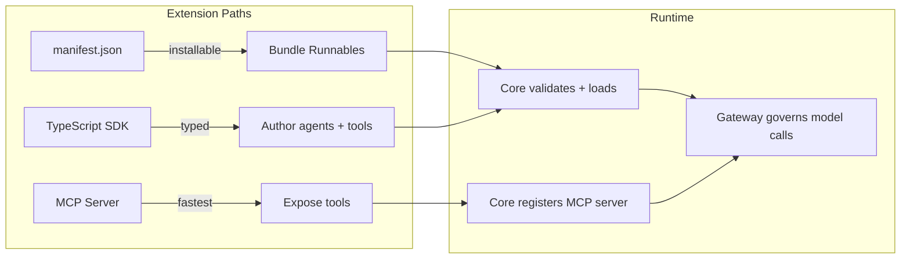

The Develop section covers everything needed to build on top of Ryu. Core runs locally on port 7980
and exposes a JSON + SSE HTTP API. The Gateway on port 7981 is the LLM control plane you route
model calls through.

There are **three extension paths**, in increasing order of structure:

1. **MCP (Model Context Protocol) servers** — expose tools over the protocol. No manifest, no restart.
2. **`manifest.json` manifests** — bundle Runnables + permission grants into an installable plugin.
3. **TypeScript SDK** — define agents, workflows, tools, and skills as typed Runnables with Gateway-mandatory model calls.

## What you can build

| Category | What | Guide |
|---|---|---|
| **Core APIs** | Stable HTTP and MCP surfaces for integrating with Ryu | [API Reference](/docs/extend/develop/api-reference) |
| **Plugins vs Apps** | When to ship net-new capability logic vs a full surface on pre-built primitives | [Plugins vs Apps](/docs/extend/develop/extensions/plugins-vs-apps) |
| **Plugins** | Installable bundles of agents, tools, workflows, skills | [manifest.json](/docs/extend/develop/extensions/plugin-json-manifest) |
| **Turn hooks** | React to chat events (pre/post turn, tool use, sessions) | [Hooks & Lifecycle](/docs/extend/develop/extensions/hooks-lifecycle) |
| **MCP servers** | Expose any tool over the Model Context Protocol | [MCP Server](/docs/extend/develop/extensions/mcp-server) |
| **Agent skills** | Reusable prompt patterns as SKILL.md files | [Agent Skills](/docs/extend/develop/extensions/agent-skills) |
| **Ryu apps** | Interactive in-chat widgets | [Ryu Apps](/docs/extend/develop/extensions/ryu-apps) |
| **Desktop companions** | Contribute UI into the desktop app | [Desktop Companion](/docs/extend/develop/extensions/desktop-companion) |
| **Channel bots** | Messaging-platform bot adapters | [Channel Bot](/docs/extend/develop/extensions/channel-bot) |
| **Actions** | Define governed business operations with typed input/output contracts | [Build Actions](/docs/extend/develop/extensions/author-actions) |
| **Workflows** | Orchestrate agents as a DAG in TypeScript | [Author Workflows](/docs/extend/develop/extensions/author-workflows) |
| **UI** | Consistent components, themes, and hooks | [Ryu UI](/docs/ui) |

<Callout type="info">
  Both `@ryuhq/sdk` and `@ryu/client` are in the Ryu monorepo at `workspace:*` today. Public npm
  releases are in progress.
</Callout>

<Cards>
  <DocCard href="/docs/extend/develop/quickstart" title="Quickstart" description="Scaffold a plugin with create-ryu-app, define a tool, and install it into Core in under five minutes." />
  <DocCard href="/docs/extend/develop/extensions" title="Extensions" description="Plugins, hooks, skills, apps, MCP servers, desktop companions, channel bots, and the marketplace." />
  <DocCard href="/docs/extend/develop/sdk" title="SDK Reference" description="TypeScript SDK (defineAction / defineAgent / defineWorkflow / defineTool / defineSkill), the client library, and the Rust SDK." />
  <DocCard href="/docs/ui" title="Ryu UI" description="Shared components, hooks, theme presets, and semantic tokens for consistent UI across surfaces." />
  <DocCard href="/docs/extend/develop/contributing" title="Contributing" description="How to contribute code, docs, and plugins to the Ryu project." />
  <DocCard href="/docs/extend/develop/api-reference" title="API Reference" description="Interactive OpenAPI reference for both the Core API (port 7980) and the Gateway API (port 7981)." />
</Cards>
