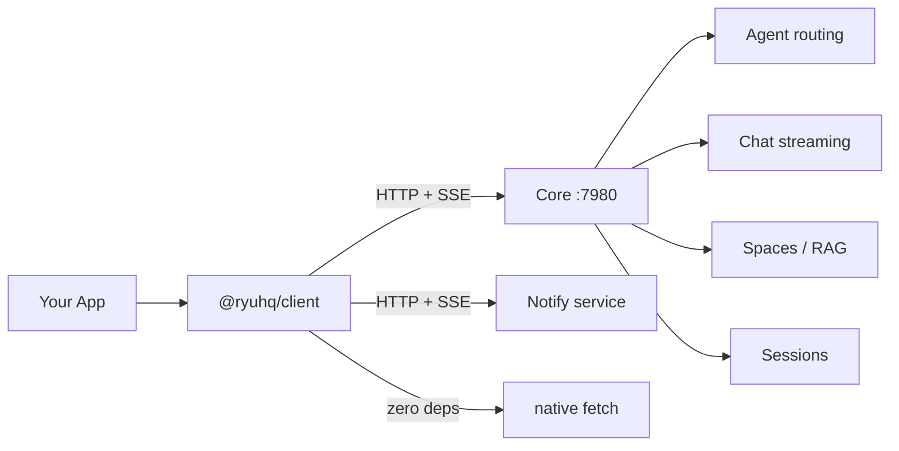

`@ryuhq/client` (`packages/client/`) is the TypeScript client SDK for calling a running Ryu **Core**
node over its HTTP API. Where [`@ryuhq/sdk`](/docs/extend/develop/sdk) is for authoring Runnables and
packing them into a plugin, `@ryuhq/client` is for calling a Core node - create a client, pick an
agent, stream, or operate a [durable harness run](/docs/extend/develop/sdk/harness).

For the **full** Core surface — plugins, models, skills, MCP servers, spaces, workflows, gateway
config — see [`@ryuhq/core-client`](/docs/extend/develop/sdk/core-client), the shared client the desktop
app, CLI/TUI, and mobile app run on. `@ryuhq/client` is the lightweight subset for embedded agent
chat plus the optional standalone Notify event API.

It has zero runtime dependencies (native `fetch` only), so it works in Node 18+, Bun, Deno, modern
browsers, and React Native. Pass an alternate `fetch` implementation when a mobile runtime needs
one for response-body streaming.

<Callout type="warn">
  A client token is a Ryu Core node token. It is not a provider API key. Keep it in the app's
  secure storage, and keep provider credentials in the Gateway.
</Callout>

## Architecture



`@ryuhq/client` is a thin typed wrapper over `fetch`. It calls Core and Notify HTTP APIs directly
with no runtime dependencies — works in Node 18+, Bun, Deno, and browsers.

## Install

```bash
npm install @ryuhq/client
# or
bun add @ryuhq/client
```

## React Native / Expo

The same client is the React Native library. Expo apps can inject `expo/fetch` for streaming:

```tsx
import { fetch as expoFetch } from "expo/fetch";
import { createRyuClient, type RyuFetch } from "@ryuhq/client";

const client = createRyuClient({
  baseUrl: "http://192.168.1.10:7980",
  token: nodeToken,
  fetch: expoFetch as RyuFetch,
});

const reply = await client.agents.run("pi", [
  { role: "user", content: "Hello from Expo." },
]);
```

For the full Core management surface, use [`@ryuhq/core-client`](/docs/extend/develop/sdk/core-client)
with an `{ url, token, fetch }` target.

## Create a client

`createRyuClient(options)` returns a `RyuClient` with typed `agents`, `sessions`, `harness`,
`spaces`, and `mail` namespaces. Pass the optional `notify` connection to add a tenant-scoped
`notify` namespace; its API key is deliberately separate from the Core node token.

```typescript
import { createRyuClient } from "@ryuhq/client";

const client = createRyuClient({ baseUrl: "http://localhost:7980" });

// Authenticated / remote node:
const remote = createRyuClient({
  baseUrl: "https://my-node.example.com",
  token: process.env.RYU_TOKEN,
});
```

```typescript
interface RyuClientOptions {
  baseUrl: string; // Base URL of the Core server, e.g. "http://localhost:7980"
  fetch?: RyuFetch; // Optional Expo/RN fetch implementation
  token?: string;  // Optional bearer token for authenticated nodes
  mailRealtime?: "core" | "standalone"; // Core WS by default; direct sidecar WS for standalone Mail
  notify?: { baseUrl: string; apiKey: string; fetch?: RyuFetch }; // Optional standalone Notify
}
```

## `client.notify`

```typescript
const client = createRyuClient({
  baseUrl: "http://127.0.0.1:7980",
  token: coreToken,
  notify: { baseUrl: "https://notify.example", apiKey: notifyTenantKey },
});

const event = await client.notify?.publish(
  { title: "Deploy complete", topic: "deployments", source: "ci" },
  "deploy-184",
);
for await (const item of client.notify?.stream({ topic: "deployments" }) ?? []) {
  if (item.type === "notification") console.log(item.event.title);
}
```

The Notify namespace also exposes topic publishing, acknowledgement/archive, interactive
responses, live activities, destinations and delivery history, preferences, silences, groups,
and analytics. See [Ryu Notify](/docs/standalone/notify) for the standalone service contract.

## `client.agents`

Agent CRUD and chat streaming over Core's `/api/agents` and `/api/chat/stream` endpoints.

| Method | Returns | Calls |
|---|---|---|
| `list()` | `AgentSummary[]` | `GET /api/agents` |
| `get(id)` | `Agent` | `GET /api/agents/:id` |
| `run(id, messages)` | `string` | `POST /api/chat/stream` (buffered) |
| `stream(id, messages)` | `AsyncGenerator<StreamChunk>` | `POST /api/chat/stream` |

### List and fetch agents

```typescript
const agents = await client.agents.list();
for (const agent of agents) {
  console.log(agent.id, agent.name);
}

// Full record (tools, engine binding, version) for one agent:
const pi = await client.agents.get("pi");
```

### Stream a chat turn

`stream()` yields a `StreamChunk` for every text fragment as it arrives from Core's SSE stream, then
a final `{ type: "done" }` chunk.

```typescript
const messages = [{ role: "user", content: "Write a haiku about Rust." }];

for await (const chunk of client.agents.stream("pi", messages)) {
  if (chunk.type === "text") {
    process.stdout.write(chunk.content ?? "");
  }
  if (chunk.type === "done") {
    break;
  }
}
```

### Buffer the whole reply

`run()` consumes the stream and returns the full text:

```typescript
const reply = await client.agents.run("pi", messages);
console.log(reply);
```

## `client.sessions`

Conversation listing and retrieval over Core's `/api/conversations` endpoints.

| Method | Returns | Calls |
|---|---|---|
| `list()` | `Conversation[]` | `GET /api/conversations` |
| `get(id)` | `Conversation` | `GET /api/conversations/:id` |

```typescript
const conversations = await client.sessions.list();
const detail = await client.sessions.get(conversations[0].id);
```

## `client.spaces`

Spaces / RAG search over Core's `/api/spaces` endpoints. A Space is a named document collection
backed by a sqlite-vec vector store.

| Method | Returns | Calls |
|---|---|---|
| `list()` | `Space[]` | `GET /api/spaces` |
| `search(id, query, limit?)` | `SpaceMatch[]` | `POST /api/spaces/:id/search` |

```typescript
const spaces = await client.spaces.list();
const matches = await client.spaces.search(spaces[0].id, "deployment steps", 5);
for (const match of matches) {
  console.log(match.content, match.distance);
}
```

Each `SpaceMatch` carries the chunk text plus a `distance` (squared L2 distance - smaller is closer).
Embeddings are computed server-side by Core's RAG pipeline.

## `client.mail`

Agent Inboxes use the same `/api/mail/*` paths whether Core is proxying the
self-host sidecar or the caller is using the hosted organization API. The
namespace normalizes the sidecar's snake_case response fields to camelCase.

| Method | Returns | Calls |
|---|---|---|
| `listInboxes()` / `createInbox()` | `MailInbox[]` / `MailInbox` | Inbox CRUD |
| `listMessages()` / `searchMessages()` / `getMessage()` | `MailMessage[]` / `MailMessage` | Message reads/search |
| `send()` / `reply()` / `replyAll()` / `forward()` | `MailMessage` | External mail send |
| `listThreads()` / `getThread()` | `MailThread[]` / `MailMessage[]` | Conversation views |
| `listDrafts()` / `createDraft()` / `sendDraft()` | `MailDraft[]` / `MailDraft` / `MailMessage` | Drafts and scheduling |
| `listWebhooks()` / `createWebhook()` | `MailWebhook[]` / `{ webhook, secret }` | Signed event subscriptions |
| `listEvents()` / `connectRealtime()` | `MailEvent[]` / `WebSocket` | Replay and low-latency events |

```typescript
const inbox = (await client.mail.listInboxes())[0];
const sent = await client.mail.send(inbox.id, {
  to: ["person@example.com"],
  subject: "Hello",
  text: "Sent through Ryu Mail.",
  attachments: [{
    filename: "report.txt",
    contentType: "text/plain",
    contentBase64: "cmVwb3J0",
  }],
}, "send-once-1");

const socket = client.mail.connectRealtime((event) => {
  console.log(event.eventType, event.messageId);
}, { eventTypes: ["message.received"], inboxIds: [inbox.id] });
```

`send()` and draft/reply variants accept an idempotency key where supported.
`connectRealtime()` targets Core's WebSocket tunnel by default; pass
`mailRealtime: "standalone"` when the base URL is a direct `ryu-mail` process.
Webhook signing secrets are returned only when a subscription is created or
rotated; later reads return header names, never header values.

## Types

All types are exported from the package root:

```typescript
import type {
  RyuClientOptions,
  Agent,
  AgentSummary,
  Message,
  StreamChunk,
  Space,
  SpaceMatch,
  Conversation,
  MailMessage,
  MailWebhook,
  NotificationEvent,
  NotifyActivity,
} from "@ryuhq/client";
```

```typescript
interface Message     { role: "user" | "assistant" | "system"; content: string }
interface StreamChunk { type: "text" | "done" | "error"; content?: string }

interface SpaceMatch {
  chunkId: string;
  documentId: string;
  content: string;
  distance: number; // squared L2 distance; smaller is closer
}
```

## Errors

Non-2xx responses throw an `Error` with the status code and response body:

```typescript
try {
  await client.agents.run("does-not-exist", messages);
} catch (err) {
  console.error(err.message); // "RyuClient: stream failed (404): ..."
}
```

## Other languages

The [Java library](/docs/extend/develop/sdk/java) is the application-facing Core client for Java.
The [language bindings](/docs/extend/develop/sdk/language-bindings) page covers the lower-level
Rust-kernel surface for Python, Swift, Kotlin, C#, and Go. Those bindings do not replace this
lightweight Core client: they expose manifest validation, Gateway-governed model/embedding calls,
and the shared binding contract. For another language that needs the complete Core control
surface, call the plain JSON + SSE HTTP API documented in the [Core API reference](/docs/extend/develop/api-reference/core).
