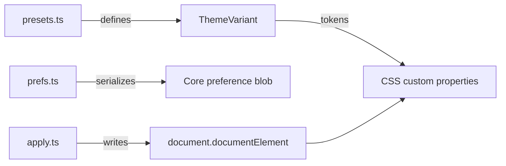

The theme system lets any Ryu surface switch between 30+ visual themes at runtime. Every theme is a set of CSS custom properties that override the design tokens, so components theme themselves automatically.

## Architecture



Three files, three responsibilities:

| File | Role | Import |
|---|---|---|
| `presets.ts` | Pure data: 30+ ThemeVariant objects with token maps. No DOM. | `@ryu/ui/theme/presets` |
| `apply.ts` | DOM engine: writes tokens to `<html>`, applies contrast curves, radius, fonts. | `@ryu/ui/theme/apply` |
| `prefs.ts` | Shared contract: normalizes the ThemePrefs blob exchanged through Core. | `@ryu/ui/theme/prefs` |

## Available presets

### Ryu (default)

| Preset ID | Mode | Description |
|---|---|---|
| `ryu-light` | Light | The default Ryu light theme |
| `ryu-light-mono` | Light | Ryu light with monochrome accents |
| `ryu-dark` | Dark | The default Ryu dark theme |
| `ryu-dark-mono` | Dark | Ryu dark with monochrome accents |

### Third-party themes

| Theme | Light | Dark |
|---|---|---|
| **Codex** | `codex-light` | `codex-dark` |
| **Claude** | `claude-light` | `claude-dark` |
| **Ayu** | `ayu-light` | `ayu-dark` |
| **Catppuccin** | `catppuccin-light` | `catppuccin-dark` |
| **Dracula** | `dracula-light` | `dracula-dark` |
| **GitHub** | `github-light` | `github-dark` |
| **Linear** | `linear-light` | `linear-dark` |
| **Nord** | `nord-light` | `nord-dark` |
| **Notion** | `notion-light` | `notion-dark` |
| **One** | `one-light` | `one-dark` |
| **Raycast** | `raycast-light` | `raycast-dark` |
| **Tokyo Night** | `tokyo-light` | `tokyo-dark` |
| **Gruvbox** | `gruvbox-light` | `gruvbox-dark` |
| **Solarized** | `solarized-light` | `solarized-dark` |
| **Rosé Pine** | `rose-pine-dawn` | `rose-pine`, `rose-pine-moon` |
| **Everforest** | `everforest-light` | `everforest-dark` |
| **Kanagawa** | `kanagawa-lotus` | `kanagawa-wave`, `kanagawa-dragon` |
| **Night Owl** | `night-owl-light` | `night-owl` |
| **Material** | `material-theme-lighter` | `material-theme`, `material-theme-darker`, `material-theme-ocean`, `material-theme-palenight` |
| **Min** | `min-light` | `min-dark` |
| **Slack** | `slack-ochin` | `slack-dark` |
| **Snazzy** | `snazzy-light` | (dark: none) |
| **Vitesse** | `vitesse-light` | `vitesse-dark`, `vitesse-black` |
| **Light Plus / Dark Plus** | `light-plus` | `dark-plus` |
| **Monokai** | (light: none) | `monokai` |
| **Synthwave '84** | (light: none) | `synthwave-84` |
| **Horizon** | `horizon-bright` | `horizon` |
| **Poimandres** | (light: none) | `poimandres` |
| **One Dark Pro** | (light: none) | `one-dark-pro` |
| **Vercel** | `vercel-light` | `vercel-dark` |
| **LaserWave** | (light: none) | `laserwave` |
| **Houston** | (light: none) | `houston` |
| **Plastic** | (light: none) | `plastic` |
| **Red** | (light: none) | `red` |
| **Andromeeda** | (light: none) | `andromeeda` |
| **AMOLED** | (none) | `amoled-dark` |

## ThemeVariant structure

Each preset is a `ThemeVariant` object:

```typescript
interface ThemeVariant {
  id: string;           // e.g. "ryu-dark"
  label: string;        // e.g. "Ryu Dark"
  mode: "light" | "dark";
  preview: {            // Color swatch for theme pickers
    bg: string;
    surface: string;
    primary: string;
    text: string;
  };
  tokens: Record<string, string>;  // CSS custom property overrides
}
```

## Applying a theme

Use the `apply` engine to write theme tokens to the DOM:

```tsx
import { applyVariant, applyRadius, applyFonts } from "@ryu/ui/theme/apply";
import { findVariantIn } from "@ryu/ui/theme/presets";

// Apply a preset
const theme = findVariantIn("ryu-light");
if (theme) applyVariant(theme);

// Customize radius
applyRadius(0.625);

// Set fonts
applyFonts("Inter", "Geist", "JetBrains Mono");
```

### Numeric and code typography

Numeric values such as line counts, prices, balances, and currency amounts use
the `font-mono` utility. Ryu maps that utility to the bundled Geist Mono face so
digits stay aligned without changing the heading face. Code blocks continue to
use the separate `font-code` token, which can follow the user's code-font
preference. Keep ordinary interface labels, headings, status text, and
descriptions in the sans or heading face; do not use a generic system mono for
decorative interface copy.

## Persisting preferences

The `prefs` module manages the `ThemePrefs` shape:

```typescript
interface ThemePrefs {
  mode: "light" | "dark" | "system";
  lightPreset: string;   // ThemeVariant id
  darkPreset: string;    // ThemeVariant id
  contrast: number;      // 0-100
  radius: number;        // rem
  spacing: number;       // rem, shared Tailwind base unit
  scale: number;         // whole-surface UI zoom
  cardSpacing: number | null; // rem, or derive from spacing
  pointerCursor: boolean;
  chromeShadows: boolean;
  dialogOverlayBlur: boolean;
  popupOverlayBlur: boolean;
  invertedBackgrounds: boolean;
  animationsEnabled: boolean;
  timezone?: string;      // effective IANA display zone
  locale?: string;        // effective BCP-47 display locale
  customThemes: ThemeVariant[];
  uiFont?: string;
  headingFont?: string;
  codeFont?: string;
}
```

The Desktop publishes this blob to Core so the separate Island process and its hosted apps can
resolve the same custom palette, appearance values, display timezone, and locale. A Companion
mounted in Desktop receives the same values through the host bridge, including live updates; it
does not need access to `localStorage`.

Use the shared timestamp helpers for app-visible dates and times:

```tsx
import { formatDateTime } from "@ryu/ui/lib/timezone";

formatDateTime(run.finishedAt);
```

The helpers read the host-projected `--ryu-timezone` and `--ryu-locale` tokens inside an isolated
Companion. `RyuAppShell` owns the repaint subscription, so apps do not create another preference
store or timezone listener.

## Custom themes

You can create user-defined themes by building a `ThemeVariant` from custom tokens:

```tsx
import {
  customTokensToVariant,
  variantToCustomTokens,
} from "@ryu/ui/theme/presets";

// Convert a variant to editable tokens
const tokens = variantToCustomTokens(myVariant);

// Modify tokens
tokens["--primary"] = "oklch(0.5 0.2 250)";

// Convert back to a variant
const custom = customTokensToVariant("my-theme", "My Theme", "dark", tokens);
```

## Contrast curves

The apply engine supports a `contrast` parameter that adjusts muted colors around a 50 midpoint using `color-mix`. Higher contrast pushes muted foreground colors further from the background:

```tsx
import { applyContrastToMuted } from "@ryu/ui/theme/apply";

// Adjust muted color contrast (0-100)
applyContrastToMuted(60);
```

## Reduced motion

All animations respect `prefers-reduced-motion: reduce`. When the OS setting is enabled, CSS transitions and keyframe animations are disabled automatically via the global stylesheet.

Continue with [UI package](/docs/extend/develop/ui-package), [Ryu UI](/docs/ui), [UI themes](/docs/ui/themes), [UI primitives](/docs/ui/primitives), and [UI components](/docs/ui/components).

## Status text and fills

Use `bg-success`, `bg-warning`, `bg-info`, and `bg-destructive` for status fills.
For small status labels, use `text-status-success`, `text-status-warning`,
`text-status-info`, or `text-status-destructive`. The text tones derive from the
selected status color and foreground, so they adapt to light, dark, and custom themes
without fixed Tailwind palette colors. The matching `--status-*` CSS variables are
available to Companion stylesheets.

Use ordinary foreground and muted-foreground tokens for neutral copy. Keep drawing,
chart category, syntax, and brand palettes separate from control and status styling.
