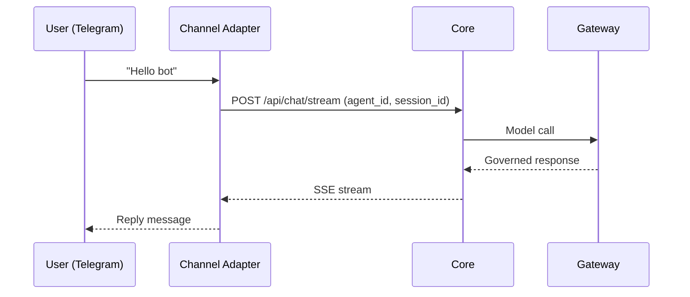

Ryu can run bots on messaging platforms through channel adapters. Each channel has its own adapter
that translates platform events into Core chat sessions and streams responses back. WhatsApp has
two separate channel types: the unofficial self-hosted OpenWA bridge for personal accounts and
the official Meta Cloud API for business accounts.

## Supported channels

| Channel | Adapter | Auth |
|---|---|---|
| Telegram | `apps/core/src/sidecar/adapters/telegram.rs` | `TELEGRAM_BOT_TOKEN` |
| Slack | `apps/core/src/sidecar/adapters/slack.rs` | `SLACK_APP_TOKEN` + `SLACK_BOT_TOKEN` |
| WhatsApp Personal | `openwa.rs` | Channel-level OpenWA URL, API key, session, and webhook secret |
| WhatsApp Business (Cloud API) | `whatsapp.rs` | `WHATSAPP_ACCESS_TOKEN` or channel-level Meta credentials |
| Discord | `apps/core/src/sidecar/adapters/discord.rs` | `DISCORD_BOT_TOKEN` |

## How it works



The channel adapter:
1. Receives the platform event (message, command, callback).
2. Maps it to a Core chat request with an `agent_id` and `session_id`.
3. Streams the response back to the platform.

## Gateway config for channels

Channel bot tokens are configured in `gateway.toml`:

```toml
[channels.telegram]
bot_token = "TELEGRAM_BOT_TOKEN"

[channels.slack]
app_token = "SLACK_APP_TOKEN"
bot_token = "SLACK_BOT_TOKEN"

[channels.discord]
bot_token = "DISCORD_BOT_TOKEN"
```

WhatsApp credentials are normally configured per channel in **Gateway -> Channels**. Choose
**WhatsApp Personal** to connect an OpenWA session (QR/pairing-code linking, webhook signing, and
optional self-chat mode), or **WhatsApp Business (Cloud API)** to connect a Meta Business phone
number (Phone Number ID, access token, App Secret, and Verify token). Personal OpenWA accounts are
unofficial and can be restricted by WhatsApp; use a dedicated number. See [Gateway Channels](/docs/gateway/channels)
for the webhook and feature details.

The desktop Channels dialog also supports managed Telegram pairing on deployments that provide it.
That path creates a user-owned Telegram bot and saves the resulting channel without asking the user
to copy a token. Headless and TOML integrations still use an explicit `TELEGRAM_BOT_TOKEN`; the
managed desktop flow does not change the adapter contract.

See [Gateway Channels](/docs/gateway/channels) for the full configuration.

## Multi-tenant routing

Channel bots can route messages to different Core nodes or agents based on the platform user.
The Gateway's `x-ryu-user-id` header carries the platform user identity, which drives per-user
budgets and audit.

## Related

<Cards>
  <DocCard href="/docs/gateway/channels" />
  <DocCard href="/docs/gateway/configuration" />
  <DocCard href="/docs/core/node-and-presence" />
  <DocCard href="/docs/extend/develop/extensions/channel-bot" />
</Cards>
