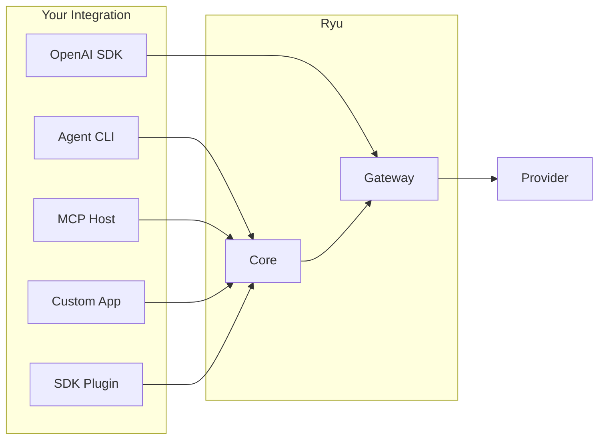

Ryu exposes **seven integration surfaces**. Each serves a different caller; none requires modifying Ryu
itself. Core-owned model calls use Ryu's normal routing and governance; an ACP subprocess or remote
A2A peer owns provider calls made inside that independent agent runtime.

## Integration surfaces

| Surface | Protocol | Who calls it | Gateway-governed? | Start here |
|---|---|---|---|---|
| **OpenAI-compat API** | OpenAI `/v1/chat/completions` | Any framework, SDK, or raw HTTP client that speaks OpenAI format | Yes (full pipeline) | [OpenAI-compat](/docs/extend/integrate/openai-compat) |
| **Anthropic & Gemini compat** | Anthropic `/v1/messages`, Gemini `/v1beta/models/{model}:generateContent` | Claude Code, Gemini CLI, native-format SDKs | Yes (full pipeline) | [Protocol compat](/docs/extend/integrate/protocol-compat) |
| **ACP agent protocol** | Subprocess + SSE events | Agent CLIs (Claude Code, Codex, Gemini, Pi, BYO) | Opt-in per agent | [ACP Integration](/docs/extend/integrate/acp-integration) |
| **A2A agent protocol** | A2A v1 JSON-RPC or HTTP+JSON, with SSE | Remote agents and other A2A hosts | Trust-gated per peer | [A2A Integration](/docs/extend/integrate/a2a) |
| **RNP continuity** | Authenticated Core HTTP + `ryu://handoff` locator | Ryu clients moving a reviewed chat snapshot between configured nodes | Node ACLs on both ends | [RNP continuity](/docs/extend/integrate/rnp) |
| **MCP server** | MCP over stdio (JSON-RPC) | MCP hosts (Claude Desktop, IDEs, other agents) | Yes (tool exec) | [MCP Integration](/docs/extend/integrate/mcp-integration) |
| **Core HTTP API** | REST + SSE | Custom apps, scripts, the `@ryuhq/client` SDK | Yes (via Gateway) | [API Reference](/docs/extend/develop/api-reference) |
| **TypeScript SDK** | `@ryuhq/sdk` (typed) | Plugin authors, extension builders | Yes (Gateway-mandatory) | [SDK Reference](/docs/extend/develop/sdk) |

## The decision matrix

```
Do you need a model call?
├─ Yes → Which protocol does your caller speak?
│   ├─ OpenAI-compatible → OpenAI-compat API
│   ├─ Anthropic Messages → Gateway Anthropic-compat endpoint
│   ├─ Gemini → Gateway Gemini-compat endpoint
│   ├─ ACP subprocess → ACP agent
│   ├─ Remote A2A agent → A2A peer
│   └─ MCP → MCP server
├─ Yes, but you want typed TypeScript → TypeScript SDK
├─ No, you want to continue a chat on another node → RNP continuity
├─ No, just tools/data → Core HTTP API or MCP
└─ No, you want to build a plugin → manifest.json manifest
```

## Architecture in one sentence

> **Core decides what runs; the Gateway decides what is allowed, measured, and paid for.**

Ryu's OpenAI-compatible and local model calls route through the Gateway, which applies firewall
(PII/DLP), budget enforcement, rate limiting, circuit breaking, caching, evals, and audit before
the request reaches a provider. ACP subprocesses and remote A2A hosts own their provider egress;
Ryu still governs the task boundary and any Ryu tools exposed to them.



## Quick start by role

### I'm building an AI agent
Start with [OpenAI-compat](/docs/extend/integrate/openai-compat) — point your agent at `http://localhost:7981/v1` and every model call is governed. Prefer a native dialect? Claude Code and Gemini clients can use the [Anthropic & Gemini endpoints](/docs/extend/integrate/protocol-compat) instead.

### I'm adding tools to an agent
Start with [MCP Integration](/docs/extend/integrate/mcp-integration) — expose tools over MCP and register them with Core.

### I'm extending Ryu itself
Start with [Build an Extension](/docs/extend/develop/extensions) — plugins, SDK, manifests, and hooks.

### I'm hosting Ryu for a team
Start with [Gateway Configuration](/docs/gateway/configuration) — auth, budgets, firewall, and routing.

## Related

<Cards>
  <DocCard href="/docs/extend/integrate/openai-compat" />
  <DocCard href="/docs/extend/integrate/acp-integration" />
  <DocCard href="/docs/extend/integrate/a2a" />
  <DocCard href="/docs/extend/integrate/rnp" />
  <DocCard href="/docs/extend/integrate/mcp-integration" />
  <DocCard href="/docs/extend/develop/extensions" />
  <DocCard href="/docs/gateway/configuration" />
  <DocCard href="/docs/start-here/architecture/core-vs-gateway" />
</Cards>
