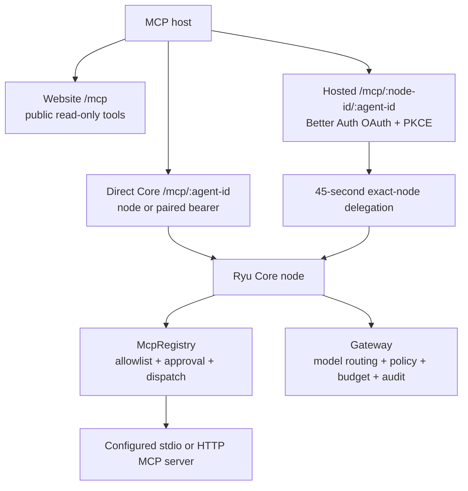

MCP (Model Context Protocol) is the wire format an AI host uses to discover and call tools. It does not decide who the user is or which Ryu node the host may access.

Ryu has several MCP-shaped surfaces because Ryu can be a public website, a node, a hosted service, or an MCP client. Choose the row that matches what you are trying to do.

| Surface | Use it for | Credential |
|---|---|---|
| `https://ryuhq.com/mcp` | Public website pages and Marketplace discovery | None; read-only |
| WebMCP on `https://ryuhq.com` | Read the current page and start a hosted checkout from the visitor's browser | Same-origin browser session; checkout tools are server-authorized |
| `https://docs.ryuhq.com/mcp` | Ryu documentation search and page retrieval | None; read-only |
| `POST https://<node>/mcp/<agent-id>` | A host calling one local, self-hosted, or directly selected managed Core node | Node bearer/pair; managed user JWT on an org-bound node; or hosted delegation |
| `https://<ryu-service>/mcp/<node-id>/<agent-id>` | A remote host calling a managed or organization-bound node | Better Auth OAuth with PKCE; the service exchanges it for a short-lived node delegation |
| Core MCP registry | Ryu calling another MCP server | The configured server header or Identity Vault connection |

## The request paths

The direct Core endpoint is the canonical node MCP endpoint. The `apps/mcp` package is a compatibility bridge for hosts that require a stdio process. It exposes a fixed set of `ryu_*` REST wrappers and points them at one Core URL.

## Authentication is separate from MCP

Ryu uses different credentials for different boundaries:

- A Better Auth session or device-grant token identifies a person to the Ryu control plane. It is used for website sign-in, account operations, and managed-node discovery.
- A node bearer admits a caller to one Core node. Local Core mints `node-auth.token`; operators can provide `RYU_TOKEN`; Core can also issue a scoped paired token.
- Desktop's managed-node discovery also returns a short-lived `userJwt`. A managed Core accepts it as a primary bearer only after verifying the control-plane signature and matching the node's organization, team, or personal owner scope. It is not accepted as a node credential on an unbound local or self-hosted node.
- A hosted MCP request starts with a Better Auth OAuth grant. The hosted service checks organization membership and scopes, then sends Core a short-lived Ed25519 delegation bound to one node and agent.
- A third-party MCP server's OAuth or API key is a credential Core uses when it acts as an MCP client. It does not authenticate a caller to Ryu.

Signing in through the website does not silently grant direct access to every node. The managed-node list is scope-filtered, and Core repeats that check. For local or self-hosted nodes, pairing or a node bearer is still the node-access step; for external managed MCP hosts, use hosted OAuth and delegation.

## What Core does after admission

Core validates the MCP JSON-RPC method, resolves the exact agent named in the URL, applies the agent's tool allowlist and approval policy, and dispatches through the shared registry. Tool discovery is progressive: `tools/list` stays short, while large app and Composio catalogs are reached through `tool_search` and `describe`.

For model calls, Core routes through the Gateway. The Gateway applies model routing, firewall rules, budgets, billing, and audit. MCP changes who starts the call, not those controls.

<Cards>
  <DocCard href="/docs/extend/mcp/webmcp" />
  <DocCard href="/docs/extend/mcp/quickstart" />
  <DocCard href="/docs/extend/mcp/configuration" />
  <DocCard href="/docs/extend/mcp/security" />
  <DocCard href="/docs/security/authentication-and-pairing" />
</Cards>
