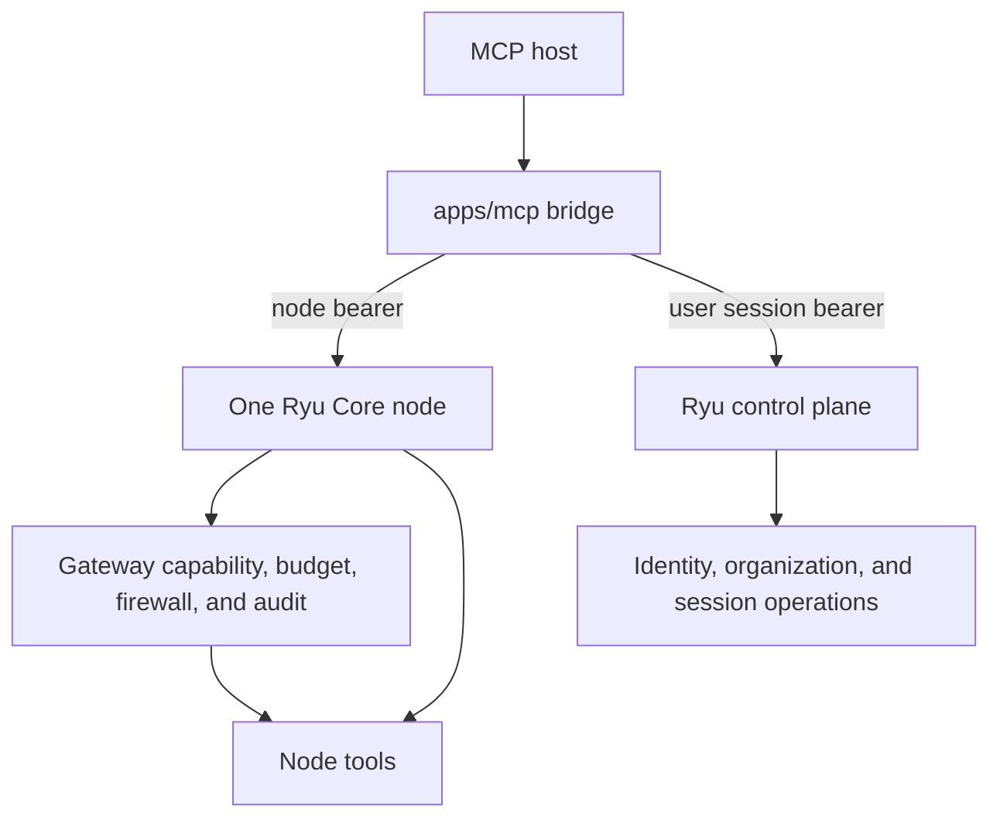

The MCP server is a bridge with real reach. It can drive your node as fully as the token you give it allows, so treat it like any other credentialed client.

The public website MCP endpoint is a separate, read-only surface. It accepts at most 64 KiB per
request and eight JSON-RPC messages per batch; batch messages count individually against the
short-window rate limit. It does not accept credentials or expose node tools, and oversized or
untrusted requests are rejected before any page rendering or marketplace lookup begins.

## Credentials stay separate

The bridge deals with two distinct credentials:

- **The paired node token** (`RYU_CORE_TOKEN`) authenticates a local bridge to one Core. It carries the approved capabilities and optional bindings for this host; it is not the owner recovery credential.
- **The user session token** comes from signing in (see below). It identifies the human to the control plane and powers `ryu_whoami`. It is **not** a Core node bearer, so it does not widen what the node tools can do.

Keep the node token out of source control and out of chat. It lives in the host's config (for example `claude_desktop_config.json`), which should be treated as a secret file. Prefer a per-host, per-node token where your node supports issuing them, so a compromised or retired host is one revocation rather than a node-wide rotation.

The two credentials travel to different owners and are checked for different purposes:

The node bearer admits the bridge to one Core instance. The user session bearer identifies the
human to the control plane. Neither credential silently replaces the other.

This is deliberately separate from the official Ryu MCP authorization service. A remote MCP client
connecting to that service uses OAuth 2.1, PKCE, organization-aware scopes, and a consent screen.
For each request, the hosted service validates the opaque grant and mints a short-lived Ed25519
delegation for one node and one agent. The delegation cannot be redirected to a sibling node or
agent, and Core applies method-level capabilities before dispatch. An account session alone does
not silently grant control of every node.

For the complete account, device, node, hardware, official MCP, plugin OAuth, organization, and
revocation map, see [Authentication and pairing](/docs/security/authentication-and-pairing).

## Signing in (device authorization)

`ryu-mcp login` runs the **OAuth 2.0 Device Authorization Grant (RFC 8628)** - the same flow the desktop, mobile, and CLI clients use - through Core's proxy. It opens your browser, you approve, and the resulting bearer is written to the shared `~/.ryu/auth.json`, so one sign-in covers every local Ryu client (single sign-on). `ryu-mcp logout` clears it.

The stored credential is a standard OAuth 2.0 Bearer token, which is the format MCP's own auth model expects. For a stdio server the host launches the process, so this user credential is carried out-of-band (the shared file), never over the MCP wire.

## The write tools have real effects

Most tools read. A few write, and they are the ones to think about before you let a host call them unattended:

- `ryu_ask` consumes model budget on the node's side-question model.
- `ryu_set_active_model` switches which model the local stack serves.
- `ryu_install_skill` installs a skill and hot-reloads Core's registry.
- `ryu_run_workflow` triggers a workflow, which can itself call agents, tools, and sub-workflows.
- `ryu_call_mcp_tool` invokes a tool on any MCP server the node has registered, scoped to a registered agent's allowlist.

A host that can call these can spend budget and change state on the node. That is the point of the bridge, but it means an over-eager or compromised host has the same reach. Scope the token, watch the audit log, and do not point an untrusted host at a node you care about.

<Callout type="warn">
  The bridge does not add a second layer of permission on top of the token. If you need finer control than the token gives, enforce it on the node: the Gateway's firewall, budgets, and audit apply to every model call a tool makes, including calls that originate from an MCP host.
</Callout>

## The Gateway still governs everything

Driving Core through MCP does not bypass the control plane. A `ryu_ask` from Claude Desktop is routed, budgeted, and audited exactly like a message from the desktop app, because the call still flows through the node's Gateway. The bridge changes who initiates a call, not who governs it. See [Gateway](/docs/gateway) for the controls that apply.
