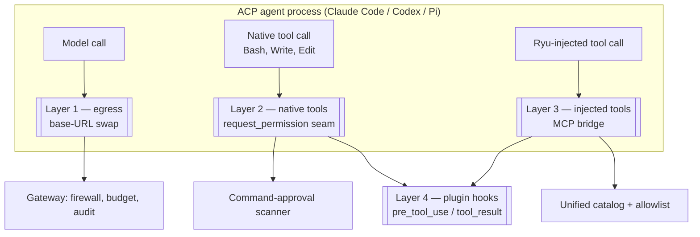

An ACP agent is not a model behind an API. It is a **whole harness**. Claude Code has its own
tool loop, its own `Bash` and `Edit` tools, its own permission prompts, and its own credentials.
Codex and Pi likewise. So "route it through the Gateway" is not one thing: an agent can have its
model traffic governed while its file writes are not, or the reverse.

Ryu governs an ACP agent in **four independent layers**.

## Layer 1 — Model egress

The agent's HTTP client is pointed at the Gateway instead of the provider, so completions pass
through the firewall, spend budgets, and the audit log.

The mechanism differs per agent family because the wire formats and credentials differ, and the
constraint throughout is that **the user's subscription must survive**. Full detail in
[Gateway for any agent](/docs/gateway/gateway-for-any-agent):

| Agent | Mechanism | Credential |
|---|---|---|
| Claude Code | `ANTHROPIC_BASE_URL` → `/passthrough/anthropic` | The user's own OAuth bearer, forwarded unchanged. An API key is **never** injected, because either `ANTHROPIC_API_KEY` or `ANTHROPIC_AUTH_TOKEN` would take precedence over Pro/Max OAuth and flip the account onto API-key billing |
| Codex | Isolated `CODEX_HOME` → `/passthrough/openai-responses` | OAuth bearer plus `ChatGPT-Account-ID`, forwarded unchanged |
| Pi (managed) | `OPENAI_BASE_URL` + gateway token, plus a `models.json` pin | Gateway token. The pin is required because Pi does not honour `OPENAI_BASE_URL` on its own |
| BYO OpenAI-compatible | `OPENAI_BASE_URL` + gateway token | Gateway token |

## Layer 2 — The agent's own native tools

Every ACP tool call passes through the **permission-request seam** before the agent is granted
permission to proceed, and Ryu scans it there. So Claude Code's own `Bash`, `Write`, and `Edit`
calls are governed, not merely the tools Ryu injected. A `deny` verdict rejects the permission
outright, including in a headless session that would otherwise auto-approve.

This covers file mutation, not just shell commands: native coding agents edit through
tools shaped `{ file_path, content }` with no command string at all, so Ryu synthesizes a
`write <path>` representation and scans that. Details, including the hardline blocklist and why Ryu
does not install hooks into each agent's own config files, in
[Command approval and HITL](/docs/security/command-approval).

## Layer 3 — Ryu-injected tools

When the bridge is active the agent also receives Ryu's meta-tools (`tool_search`, `describe`,
`execute`, `resume`, and the `skills__*` tools) over MCP. These resolve against the
[unified tool catalog](/docs/core/unified-tool-catalog) and are gated by the agent's allowlist on
the call path. Search is open; execution is allowlisted. See
[Tool governance](/docs/gateway/tools).

## Layer 4 — Plugin hooks

Installed plugins can intercept any tool call on either plane: `pre_tool_use` can `deny` it, and
`tool_result` can `transform` the result before the model sees it. This is where per-organization
policy that is too specific for a general scanner belongs. See
[Hooks and lifecycle](/docs/develop/extensions/hooks-lifecycle).

## Each layer has its own switch

The layers are genuinely independent, and that is the operational point:

- **Layer 1 is per agent family**, each with its own preference: `claude-gateway-routing`,
  `codex-gateway-routing`, the managed-Pi routing mode, and a generic per-agent toggle for BYO
  agents. They are separate because enabling them changes how a subscription credential flows, and
  that is a decision per agent, not per node.
- **Layer 2 is node-wide**, armed unless explicitly turned off.
- **Layer 3** follows whether the bridge is injected for that agent.
- **Layer 4** follows which plugins are installed and enabled.

<Callout type="warn">
An agent with Layer 1 off runs its model calls **straight to the provider**: unmetered,
unfiltered, and absent from the audit log. That is a legitimate choice (it is how you keep a
subscription agent entirely outside Ryu's egress path) but it is a choice, and it is per agent.
When you need a node where nothing is ungoverned, confirm Layer 1 for each installed agent rather
than assuming a node-level setting covers them.
</Callout>

## What this does not do

Ryu governs at seams the agent must pass through: its HTTP egress, its permission requests, its
injected tools. It does not contain a process that decides to ignore those seams. The
command scanner is accident prevention, not a sandbox. For untrusted code the isolation boundary is
[the sandbox](/docs/core/sandbox) and
[programmatic tool calling](/docs/core/programmatic-tool-calling), which run code in a separate
process with deny-by-default permissions.

The scanner is also **stateless per call**: it judges the command in front of it, not the session's
history. A policy like "require approval to push once this session has installed a new dependency"
is a stateful policy and is not expressible today.

## Related

- [Gateway for any agent](/docs/gateway/gateway-for-any-agent) — the base-URL swap and passthrough proxy in full
- [Command approval and HITL](/docs/security/command-approval) — Layer 2 in full
- [Agent hardening](/docs/gateway/agent-hardening) — tightening an agent's blast radius
- [Routing planes](/docs/gateway/routing-planes) — model routing vs agent routing
- [Credential and environment scrubbing](/docs/security/credential-scrubbing) — why ACP agents keep their own credentials
