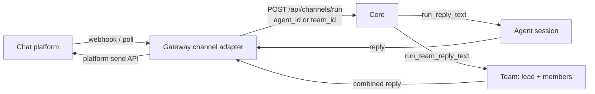

A channel bot turns a chat platform into a front door for Ryu. The Gateway runs the platform
listeners (`apps/gateway/src/channels/`); each inbound message is normalized and routed to a Core
agent or team, so a Telegram or Slack user talks to the same agent you talk to in the desktop, with
the same memory, tools, and Gateway governance on the path.

Channels are configured in **Gateway settings**, not on a Core node, and they are **account-global**.

## What each platform can do

Platforms differ enormously in what they can express, so each adapter declares its capabilities and
the shared path uses the best verb available, falling back to plain text. Nothing below is emulated —
a cell is only ticked where the platform has a real API for it.

| | Telegram | Slack | Discord | WhatsApp | iMessage |
|---|---|---|---|---|---|
| Typing indicator | Yes | Best-effort1 | Yes | Yes | Private API2 |
| Rich text replies | Yes | mrkdwn3 | - | - | - |
| Streaming drafts | DMs only4 | - | - | - | - |
| Threads / topics | Yes | Yes | Yes | - | - |
| Command menu | Yes | -5 | -6 | -7 | -7 |
| Voice replies | Yes | Yes | Yes | -8 | Private API |
| Attachments in | Yes | Yes | Yes | Yes | Yes |
| Reactions | Yes | Yes | Yes | Yes | Private API |

1. Slack bots cannot send a true typing indicator (only the retired RTM API could). The adapter uses
   the assistant thread status, which fails harmlessly for a plain bot.
2. BlueBubbles typing, read receipts and tapbacks need the Private API helper installed on the Mac.
3. Slack's mrkdwn is not CommonMark, so the adapter converts rather than emitting raw markdown that
   would render as literal asterisks.
4. `sendMessageDraft` is private-chat-only, and Core's channel endpoint is non-streaming today, so
   this shows a "Thinking..." draft and then the finished rich message - not live tokens.
5. A Slack slash command must be declared in the app manifest by the operator; the Gateway cannot
   register one at runtime.
6. Deliberate. Discord slash-command *invocation* needs an interactions webhook on a public HTTPS URL
   or an identified Gateway WebSocket, and this adapter is REST-polling. Registering a menu whose
   entries error on click is worse than no menu. Commands typed as text still work.
7. No command menu exists on the platform. Commands typed as text still work, and `/help` lists them.
8. WhatsApp's audio types exclude WAV, which is what Core's TTS emits, so a spoken reply there would
   be unplayable. The bot answers with text instead.

<Callout type="info">
  There is no bot "online" presence on Telegram, and Discord's green dot needs an identified Gateway
  WebSocket the REST-polling adapter does not open. What Ryu shows instead is its own liveness dot,
  driven by the adapter heartbeating the control plane - that reports whether the bot is actually
  running, which is the question the dot is usually being asked.
</Callout>

## How a bot turn works

Each platform has an adapter (`telegram.rs`, `slack.rs`, `whatsapp.rs`, `discord.rs`,
`bluebubbles.rs`) that owns only its transport and its platform verbs. Everything between - the
access gate, media ingest, the Core call, reply delivery - is shared, so adding a channel means
implementing the `Channel` trait and nothing else.

When the channel is bound to an agent or a team, the adapter routes the turn through Core's session
seam rather than a one-shot Gateway-pipeline call.

1. The platform delivers a message to the channel's adapter.
2. The adapter normalizes it and POSTs to `POST <core_url>/api/channels/run` with the channel's
   `agent_id` xor `team_id`. The sender id becomes the Core `conversation_id`, so every sender keeps
   a persistent conversation in `conversations.db`.
3. Core dispatches: a non-empty `team_id` invokes `run_team_reply_text` (the lead agent orchestrates
   members and returns one combined, attributed reply); otherwise `run_reply_text` runs the single
   agent. Both reuse the same ACP chat path, memory, and Gateway routing the desktop uses
   (`apps/core/src/sidecar/adapters/mod.rs`).
4. The model calls still flow Core to Gateway, so routing, firewall, budgets, and audit stay on the
   path.
5. The reply is sent back via the platform's send API.

A channel with neither `agent_id` nor `team_id` falls back to the legacy gateway-pipeline path (a
single non-streaming call with the channel's configured model and system prompt); the agent/team
seam is the recommended setup because it persists conversation history and reaches Core memory and
tools.

## Set up a bot

<TryInRyu page="channels" />

1. Get a bot token from the platform: a Telegram BotFather token, a Slack bot token, a WhatsApp
   Cloud API token, or a Discord bot token. For iMessage there is no token - you run
   [BlueBubbles Server](https://bluebubbles.app) on a Mac and paste its URL and password.
2. In the desktop, open **Gateway -> Channels** (`apps/desktop/src/components/gateway/ChannelsSection.tsx`,
   rendered inside `GatewayDialog.tsx`). You can also reach it from the command palette, a
   `ryu://...channels` deep link, or **Settings -> Advanced** - all open the dialog at the Channels
   section via the `useGatewayDialog` store.
3. Add a channel: pick the platform, paste the token, and set the **Routes to** target. The picker
   lists your agents and teams; a team is selected with a `team:` sentinel value and persisted as
   `teamId` (otherwise `agentId`) on the channel config.
4. Save. CRUD hits the control-plane server `:3000/api/channels` with a Better-Auth bearer; the
   Gateway listener then loads enabled channels from `/channels/gateway/enabled` and starts handling
   inbound messages.

For WhatsApp, front the webhook bind with a public HTTPS reverse proxy - Meta requires HTTPS for
webhook delivery (`crates/gateway/channels/src/whatsapp.rs`).

### iMessage, via BlueBubbles

iMessage has no bot API, so it is bridged: [BlueBubbles Server](https://bluebubbles.app) runs on a
Mac signed into Messages.app, and the Gateway talks to it over HTTP. That Mac has to stay awake and
online - if it sleeps, the channel is down. This is an ordinary in-process adapter like the other
four; there is no channel-sidecar mechanism and none is needed.

Inbound arrives by webhook, so point BlueBubbles Server (**Settings -> Webhooks**) at the Gateway's
BlueBubbles webhook URL. Typing indicators, read receipts and tapback reactions additionally need the
BlueBubbles **Private API** helper installed on the Mac; without it the bot still sends and receives
plain messages and attachments.

<Callout type="warn">
  BlueBubbles does not sign its webhooks, so the receiver cannot verify that a POST really came from
  your Mac. Bind it to loopback or a trusted LAN interface - do not expose it to the internet.
</Callout>

## Routing to an agent or a team

The **Routes to** picker decides what answers the bot:

| Target | Persisted field | Core dispatch | Reply shape |
|---|---|---|---|
| A single agent | `agentId` | `run_reply_text` | One agent reply |
| A team | `teamId` (`team:` sentinel) | `run_team_reply_text` | One combined, attributed reply |

A team's reply is produced by the lead agent orchestrating its members under the team's coordination
strategy (Broadcast, RoundRobin, DebateSynthesis, or Router). The strategies and how a team is built
live in [Agent Teams](/docs/core/agent-teams).

## Group chats: when the bot speaks

A bot in a busy group would be unbearable if it answered every message, so each channel carries a
`groupReplyMode` that gates only **group** chats. Direct messages always get a reply; the mode
decides the group case. The decision is a pure `decide_reply` helper in each connector
(`apps/gateway/src/channels/telegram.rs`, `apps/gateway/src/channels/discord.rs`), keyed off the
`GroupReplyMode` enum in `apps/gateway/src/config.rs`.

| `groupReplyMode` | Group behavior | DM behavior |
|---|---|---|
| `mentions` (default) | Reply only when the bot is addressed | Always reply |
| `all` | Reply to every message | Always reply |

The connector auto-detects group vs DM from the platform payload, so no manual per-chat flag is
needed. Telegram treats a chat as a group when its `type` is `group` or `supergroup`; Discord's
watched channels are always guild (multi-user) channels, so the mode applies to all of them.

In `mentions` mode a group message counts as addressed when it @mentions the bot, is a reply to one
of the bot's own messages (Telegram), or starts with a `/command` (Telegram). To resolve its own
identity the bot calls `getMe` once (Telegram) or `GET /users/@me` (Discord) at the start of its run
loop. If that call fails, mention detection is disabled until restart and the bot stays silent in
`mentions` mode - DMs and `all` mode are unaffected.

Before a matched group message is routed to Core, the connector rewrites it twice:

- **Mention stripping** - the bot's own `@username` / `<@id>` / `<@!id>` mention is removed so the
  agent sees a clean prompt, not the raw addressing token.
- **Speaker prefixing** - the sender's display name is prepended (`Ada: what is 2+2`) so Core can
  attribute turns in a multi-person chat.

<Callout type="info">
  The default is mentions-only, so a group bot stays quiet in a busy room unless addressed. Telegram,
  Discord and Slack each implement the gate in a pure `decide_reply` helper with its own tests.
  WhatsApp and iMessage do **not** gate groups yet - they carry the field but answer per their access
  policy - and the shared official-token front door (`apps/cloud-bot`) does its own mentions-only
  detection rather than reading this per-channel field.
</Callout>

## Commands: the same ones the desktop offers

A channel bot is the same assistant reached over a different wire, so it offers the same slash
commands. Core serves the union at `GET /api/channels/commands`: commands contributed by enabled
plugins, plus installed skills. Telegram publishes them with `setMyCommands`; platforms without a
menu recognise them as text and answer `/help` with the list.

Dispatch needed nothing new. A plugin command is intercepted by a `pre_user_turn` hook inside Core's
`run_reply_text`, which the channel path already runs - so the command text only has to *reach* Core
intact. What was missing was never execution, only discovery.

<Callout type="warn">
  A command from a *disabled* plugin is never published. The endpoint applies the same enabled-plugin
  filter as the desktop contributions endpoint, sharing one helper, so the two cannot drift into a bot
  advertising a command that does nothing.
</Callout>

## Voice, photos and files

Inbound media is normalized and folded into the turn:

- **Voice notes and audio** are downloaded and transcribed through Core's `POST /api/voice/transcribe`,
  and the transcript becomes the message text. A transcription failure degrades to a placeholder so
  the user still gets an answer that acknowledges the voice note.
- **Images, video and documents** are annotated onto the turn (`[attached image: cat.png]`) so the
  agent knows what arrived. An image with no caption becomes the whole prompt.
- Every download is capped, because a channel is an untrusted ingress.

Outbound speech is opt-in per bot: `never` (default), `mirror` (speak only when the user sent a voice
note), or `always`. A spoken reply is sent **alongside** the text, never instead of it - a voice note
you cannot skim is worse than one you can.

## Threads and topics

Threaded platforms need two ids to answer - the room and the thread - but Core takes one opaque
`conversation_id`. Slack solved this by packing `"<channel>:<thread_ts>"`; that convention is now
shared, so Telegram forum topics and Discord threads reuse it. The effect worth knowing: **each thread
keeps its own conversation history**, because the packed key is what Core stores against.

Discord can additionally open a thread per triggering message (`threadReplies`), which keeps a busy
channel readable. If the thread cannot be created the reply still lands in the parent channel.

## Where config lives

Channels are **account-global**, not scoped to the active Core node like the rest of the Gateway
dialog. CRUD goes to the control-plane server (`:3000/api/channels`, `packages/db` `channel.model.ts`,
`packages/api/src/routers/channels.ts`) under a Better-Auth bearer. The Gateway reads the enabled set
through the org-scoped `/channels/gateway/enabled` query, and `create` resolves the signed-in user's
active org for `organizationId`, so a bot you create from the desktop is served by the Gateway
listener in a multi-tenant deployment.

<Callout type="info">
  The standalone `/channels` desktop route was removed - channels now live entirely inside the
  Gateway settings dialog. The shared `ChannelsView` (`@ryu/blocks/desktop/channels`) backs the UI.
</Callout>

## Related

<Cards>
  <DocCard href="/docs/core/agent-teams" />
  <DocCard href="/docs/desktop/user-guide/agents" />
  <DocCard href="/docs/gateway/configuration" />
</Cards>
