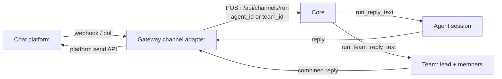

A channel bot turns a chat platform into a front door for Ryu. The Gateway runs the platform
listeners; each inbound message is normalized and routed to a Core agent or team, so a Telegram,
Discord, Slack, or BlueBubbles user talks to the same agent you talk to in the desktop, with the
same memory, tools, and Gateway governance on the path.

The transport and control details here follow the corresponding Hermes Agent messaging guides for
[Telegram](https://hermes-agent.nousresearch.com/docs/user-guide/messaging/telegram),
[Discord](https://hermes-agent.nousresearch.com/docs/user-guide/messaging/discord),
[Slack](https://hermes-agent.nousresearch.com/docs/user-guide/messaging/slack), and
[BlueBubbles](https://hermes-agent.nousresearch.com/docs/user-guide/messaging/bluebubbles),
adapted to Ryu's shared access policy and Core routing.

Channels are configured in **Gateway settings**, not on a Core node. They belong to your account
and, when an organization is active, are stored and served within that organization.

Members can see channels shared with their active organization. The creator can edit a shared
channel; editing another member's channel requires the `channel.manage` permission. Credentials
remain write-only and are never returned to the desktop in cleartext. Deleting a channel is a
separate `channel.delete` action and does not delete its shared Core conversation history.

## What each platform can do

Platforms differ enormously in what they can express, so each adapter declares its capabilities and
the shared path uses the best verb available, falling back to plain text. Nothing below is emulated —
a cell is only ticked where the platform has a real API for it.

| | Telegram | Slack | Discord | WhatsApp Personal | WhatsApp Business (Cloud API) | BlueBubbles / iMessage |
|---|---|---|---|---|---|---|
| Typing indicator | Yes | Best-effort<sup>1</sup> | Yes | Yes | Yes | Private API<sup>2</sup> |
| Rich text replies | Yes | mrkdwn<sup>3</sup> | Markdown | WhatsApp formatting | WhatsApp formatting | Plain text + media |
| Streaming drafts | DMs only<sup>4</sup> | - | - | - | - | - |
| Threads / topics | Yes | Yes | Yes | - | - | - |
| Command menu | Yes | Manifest slash commands<sup>5</sup> | Native slash commands | `/help` text | `/help` text | `/help` text |
| Voice replies | Yes | Yes | Audio attachment | Yes<sup>8</sup> | -<sup>9</sup> | Audio attachment |
| Attachments in | Yes | Yes | Yes | Yes | Yes | Yes |
| Reactions | Yes | Yes | Yes | Yes | Yes | Private API |

1. Slack bots cannot send a true typing indicator (only the retired RTM API could). The adapter uses
   the assistant thread status, which fails harmlessly for a plain bot.
2. BlueBubbles typing, read receipts and tapbacks need the Private API helper installed on the Mac.
3. Slack's mrkdwn is not CommonMark, so the adapter converts rather than emitting raw markdown that
   would render as literal asterisks.
4. `sendMessageDraft` is private-chat-only, and Core's channel endpoint is non-streaming today, so
   this shows a "Thinking..." draft and then the finished rich message - not live tokens.
5. A Slack slash command must be declared in the app manifest by the operator; the Gateway cannot
   register one at runtime.
6. Discord slash commands are registered as application commands and arrive over the identified
   Gateway WebSocket. Text commands remain available as a fallback.
7. BlueBubbles has no native command menu. Commands typed as text still work, and `/help` lists them.
8. OpenWA converts Core's WAV through its optional ffmpeg endpoint before sending an OGG/Opus voice note.
9. The Cloud API accepts audio but not Core's WAV output. The adapter answers with text instead of sending an
   unplayable file.

<Callout type="info">
  Telegram uses long polling by default and can switch to an authenticated webhook. Slack uses
  Socket Mode, while Discord keeps an identified Gateway WebSocket with heartbeats and an online
  presence. BlueBubbles receives webhook events from the Mac server and sends through its REST API.
  Ryu's liveness dot reports the adapter's control-plane heartbeat for all four.
</Callout>

## How a bot turn works

Each platform has an adapter that owns only its transport and platform verbs. Everything between -
the access gate, media ingest, the Core call, and reply delivery - is shared, so adding a channel
means implementing the channel contract and nothing else.

When the channel is bound to an agent or a team, the adapter routes the turn through Core's session
seam rather than a one-shot Gateway-pipeline call.



1. The platform delivers a message to the channel's adapter. Webhook deliveries are authenticated
   before parsing; OpenWA deliveries are also deduplicated by their idempotency key.
2. The adapter normalizes it and POSTs to `POST <core_url>/api/channels/run` with the channel's
   `agent_id` xor `team_id`. Store-backed channel records add their own channel identity to the
   platform chat id, so two bot records never accidentally share a transcript. Each sender keeps a
   persistent Core conversation that the desktop can open as well.
3. Core dispatches: a non-empty `team_id` invokes the team reply path (the lead agent orchestrates
   members and returns one combined, attributed reply); otherwise the single-agent reply path runs.
   Both reuse the same chat path, memory, and Gateway routing the desktop uses.
4. The model calls still flow Core to Gateway, so routing, firewall, budgets, and audit stay on the
   path.
5. The reply is sent back via the platform's send API.

A channel with neither `agent_id` nor `team_id` falls back to the legacy gateway-pipeline path (a
single non-streaming call with the channel's configured model and system prompt); the agent/team
seam is the recommended setup because it persists conversation history and reaches Core memory and
tools.

## Multiple bots and shared sessions

Every saved channel is an independent bot record. You can connect several Telegram bots, several
Discord bots, or several WhatsApp numbers, and give each record its own credentials, agent or team,
policies, and platform options. A channel record is not limited to one bot per platform.

When a channel message is routed through Core, the channel and platform chat are used to keep one
stable shared session. The same conversation can therefore be continued from the desktop chat and
from the channel, with the same history and agent context. Different bot records remain separate
even when they listen to the same platform.

When Ryu's managed provider inventory is enabled, managed Ryu Cloud nodes also get a dedicated
Telegram and Discord channel slot for the default Ryu agent. Each node receives its own provider
credential; Ryu never sends one customer's bot token to another customer's node, even when the nodes
are in the same organization. If the inventory is temporarily unavailable, the slot stays disabled
until it is ready, and you can paste your own token into that channel instead.

When a managed channel is ready, its channel card includes a platform action using that bot's public
identity. Telegram shows **Open in Telegram** and opens the dedicated bot's `t.me` link so you can
press **Start**. Discord shows **Install in Discord** and opens that dedicated application's install
flow so someone with **Manage Server** permission can choose a server. These actions are per-node
links, never expose the bot token, and do not create a second shared bot or transfer provider ownership.

Pasting a customer-owned token changes that channel to customer-managed credentials while keeping
the same agent binding and channel history. Provider ownership transfer is not an automatic part of
this switch: Telegram and Discord ownership changes remain subject to each platform's own account,
installation, and transfer rules.

Deleting an agent does not delete its channel records or their Core history. If one of those channels
receives a later message, Ryu routes that turn to the configured default agent and shows a warning on
the channel until you rebind it. Deleting a channel is separate: it removes the bot credentials and
configuration while keeping the shared Core conversation history.

## Set up a bot

<TryInRyu page="channels" />

### Telegram: create a bot for me

On deployments that provide managed Telegram pairing, choose **Telegram → Create a bot for me** in
the Channels dialog. You do not need to visit BotFather or copy a token:

1. Enter the channel name and choose the agent or team, model, prompt, group policy, and enabled
   state you want to save.
2. Open the QR code or deep link in Telegram. Telegram creates a bot that belongs to your Telegram
   account, and the dialog waits for the result.
3. Check the returned `@username`. Choose **Connect @username** only when it is the bot you just
   created. **Not mine — discard** or **Cancel** abandons the pairing and revokes the unaccepted bot
   credential. Pairing links expire after a short window.

The managed option is a desktop convenience and is not available on every deployment. If managed
pairing is unavailable, the node cannot reach the pairing service, or you want to reuse an existing
bot, use the manual token flow below.

### Manual credentials

1. Get the credential for the platform: a Telegram BotFather token, a Slack bot token, a Discord
   bot token, or one of the two WhatsApp setups below. For iMessage there is no token - you run
   [BlueBubbles Server](https://bluebubbles.app) on a Mac and paste its URL and password.
2. In the desktop, open **Gateway -> Channels**. You can also reach it from the command palette, a
   `ryu://...channels` deep link, or **Settings -> Advanced**; each opens the dialog at the Channels
   section.
3. Add a channel: pick the platform, paste the token, and set the **Routes to** target. The picker
   lists your agents and teams; a team is selected with a `team:` sentinel value and persisted as
   `teamId` (otherwise `agentId`) on the channel config.
4. Save. Ryu stores the channel configuration for the active account or organization, and the
   Gateway listener starts handling inbound messages when the channel is enabled.

Every WhatsApp credential set is stored on its own channel record. Two bots can therefore use
different WhatsApp numbers, OpenWA sessions, webhook secrets, agents, policies, and listener paths;
nothing is taken from a global provider setting.

## Let Ryu say hello first

Every channel can use the same assistant-first welcome as the desktop. Turn on **Say hello first**
and enter the chat address or phone number of a chat that is already approved for that bot. Ryu sends one short
welcome through the platform's normal message API, then asks what you would like help with. There is
no pretend user message in the conversation, so the experience feels like a real assistant starting
the chat.

The welcome is safe by default:

- it needs an explicit destination and an existing pairing or allowlist entry;
- it waits and retries when a local model is still being installed or starting;
- it uses one stable delivery key, so restarting the Gateway does not create another welcome;
- it never guesses a recipient or broadcasts to every chat.

The setting is shared by Telegram, Slack, Discord, WhatsApp Personal, WhatsApp Business, and
BlueBubbles. In a file-based Gateway setup the equivalent is:

```toml
[channels.telegram]
proactive_opening = true
proactive_target = "the-approved-chat-address-or-phone-number"
```

Use the same two keys under the channel you are configuring. For Discord and BlueBubbles,
`home_channel` can also provide the destination, but **Say hello first** still has to be enabled.
For paid or already-ready models the welcome can be sent immediately; local models remain quiet
until they are ready.

## Messaging parity controls

The common **Group replies**, DM/group access, typing, lifecycle reactions, read-receipt, rich-text,
voice-reply, command-publication, and agent/team routing settings apply to every adapter. The
platform-specific options below keep transport behavior on the channel record, so two bots on the
same platform can use different mention, thread, or delivery rules.

### Telegram

Telegram uses Bot API long polling by default, so a bot works without a public URL. Set the optional
webhook URL and webhook secret to switch to webhook delivery; the local bind and path are configurable
per channel. Custom Bot API and file endpoints are available for a proxy or a local Bot API server,
and **Local media mode** reads downloaded file paths from the Gateway host instead of fetching them.

In groups, Ryu supports bot mentions, replies to the bot, slash commands, additional
`mention_patterns`, `exclusive_bot_mentions`, and ignored forum-topic ids. Direct messages always
reply. Guest-query updates can be accepted with **Guest queries**, and the native Telegram command
menu is populated from the same Core command registry as the desktop (up to the configured menu
limit, clamped to Telegram's API limit). Rich replies use Telegram formatting; when streaming is
enabled, private chats receive a short thinking draft before the final response. Photos, files,
voice transcription, voice replies, reactions, topic sessions, and bot profile fields use Telegram's
native APIs where available.

### Discord

Discord uses an identified Gateway WebSocket with heartbeats, reconnect handling, an online presence,
and the required Message Content intent. The bot can serve DMs even when no guild channel is listed;
guild channels can be restricted with watched channel ids, **Allowed channels**, **Ignored channels**,
**Allowed roles**, or **Free-response channels**. Mentions are required in normal guild traffic by
default, while DMs always reply. Additional mention patterns, bot-message handling, and the **Mention
in threads** rule are configurable.

Replies can open a thread per triggering message, except in **No-thread channels**, and thread
follow-ups keep their own Core conversation. **Backfill after reconnect** fetches messages missed while
the Gateway was disconnected. Core commands are registered as native Discord application commands
and are also accepted as text. Replies are split at Discord's message limit; images, documents,
audio attachments, audio-file voice replies, reactions, and typing indicators are supported.

Ryu supports multiple Discord bot records, but each Discord application and bot must first be created
in the [Discord Developer Portal](https://docs.discord.com/developers/bots/overview). Discord's public
developer workflow does not provide a Ryu-managed equivalent of Telegram's bot-creation flow, so
choose **Paste a token** and add one record per Discord bot. For a managed-node record, use its
**Install in Discord** action instead of copying the token; the link installs that node's own
application and still requires a server member with **Manage Server** permission.

### Slack

Slack uses Socket Mode with an app-level `xapp-` token and a bot `xoxb-` token; it does not need an
inbound public URL. Enable Socket Mode, subscribe to the message events for the channels and DMs the
bot should hear, grant the matching history scopes, reinstall the app after scope changes, and invite
the bot to each channel. Native slash commands must be declared in the Slack app manifest; Ryu also
accepts those Socket Mode command frames and routes them through Core.

Channel replies default to threads, with optional broadcast-to-channel replies. DMs always reply;
channel behavior can be tuned with strict mentions, active-thread mention requirements, free-response
channels, mention-required channels, allow/ignore lists, additional mention patterns, and bot-message
handling. Slack `mrkdwn` is generated from the agent's Markdown. Optional rich blocks and feedback
buttons add native message actions; feedback buttons confirm with a reaction and do not create an
extra agent turn. Slack has assistant thread status as a best-effort typing indicator, file and audio
uploads, inbound voice transcription, reactions, and text chunking. It does not expose a true token
draft surface, so final replies remain complete messages.

### BlueBubbles (iMessage)

BlueBubbles runs on a Mac signed into Messages. Enter the BlueBubbles Server URL and password, keep
the Mac awake, and configure its webhook to the tokenized URL reported by the Gateway for this
channel. The receiver derives that webhook token from the channel password and accepts it in the URL,
query, or `x-ryu-webhook-token` header; keep the webhook on a trusted LAN or behind a private reverse
proxy. BlueBubbles does not provide a native mention entity, so group replies use the common group
mode plus `ryu`, `@ryu`, `hey ryu`, or custom mention patterns.

Text, images, video, documents, audio attachments, voice transcription, audio-file voice replies,
pairing, direct phone/email targets, and home-chat targeting are supported. Markdown is sent as plain
text because Messages does not render Slack/Telegram-style formatting. Install and enable the
BlueBubbles Private API helper for typing indicators, read receipts, and tapbacks; without it, text
and media messaging still works. There are no native threads or command menus, but Core text commands
and `/help` remain available.

### WhatsApp Personal (OpenWA)

[OpenWA](https://github.com/rmyndharis/OpenWA) is a self-hosted, unofficial WhatsApp Web bridge. It
uses a linked personal account rather than Meta's Business Cloud API. Ryu talks to the OpenWA REST
API with the BYOK operator key and registers the channel's webhook automatically when the Gateway
starts.

Before adding the channel:

1. Run OpenWA and create a session with a stable name. Start it from the OpenWA dashboard or REST
   API, then scan the QR code from WhatsApp **Linked devices** (or request a pairing code).
2. Keep the OpenWA session running and make sure the Ryu Gateway can reach its base URL.
3. Expose the Ryu webhook listener to OpenWA. The default listener is
   `0.0.0.0:8444/webhooks/whatsapp-personal`; use a distinct bind and path for each personal
   channel if the gateway hosts more than one.

In **Gateway -> Channels**, choose **WhatsApp Personal** and provide:

- OpenWA base URL, operator API key, and session id;
- the URL OpenWA should POST to, plus a random webhook secret;
- optionally `true` for **Self-chat mode** to accept only messages sent from the linked account to
  itself.

The adapter supports text, groups, media/voice transcription, typing, read receipts, reactions,
WhatsApp markdown, `/help`, and OpenWA session lifecycle/reconnects. OpenWA retries webhook
deliveries, so Ryu deduplicates them using `X-OpenWA-Idempotency-Key`. Voice replies require
OpenWA's optional media conversion feature (`MEDIA_CONVERSION_ENABLED=true`) so Core's WAV output
can become an OGG/Opus voice note.

This path is not an official WhatsApp integration. Use a dedicated number and accept the risk of
account restriction or banning from WhatsApp. For an official business number, use the Cloud API
setup instead.

### WhatsApp Business (Cloud API)

The official Meta Cloud API requires a Meta Business portfolio, WhatsApp Business Account, business
phone number, and a public HTTPS webhook. In **Gateway -> Channels**, choose **WhatsApp Business
(Cloud API)** and paste the credentials for that number:

- Phone Number ID (the numeric Meta id, not the displayed phone number);
- a Cloud API access token (use a permanent System User token for production);
- Meta App Secret for `X-Hub-Signature-256` verification;
- a random Verify token, entered again in Meta's webhook configuration.

Point Meta's callback URL at the channel's webhook path (default
`/webhooks/whatsapp`) and subscribe the app to `messages`. The default listener is
`0.0.0.0:8443`; the channel's **Advanced delivery** fields allow a different bind/path for another
Cloud API record on the same gateway. The Cloud API is DM-only, and Meta's 24-hour customer-service
window still applies: messages outside the window require an approved template. Ryu sends text,
images, video, documents, reactions, read receipts, typing indicators, and incoming voice notes;
Core transcribes inbound audio, while generated voice replies remain text-only because Core emits
WAV and the Cloud API does not accept that format.

### BlueBubbles setup details

iMessage has no bot API, so it is bridged: [BlueBubbles Server](https://bluebubbles.app) runs on a
Mac signed into Messages.app, and the Gateway talks to it over HTTP. That Mac has to stay awake and
online - if it sleeps, the channel is down. This is an ordinary in-process adapter like the other
channel adapters; there is no channel-sidecar mechanism and none is needed.

Inbound arrives by webhook, so point BlueBubbles Server (**Settings -> Webhooks**) at the tokenized
webhook URL reported by the Gateway for this channel. Typing indicators, read receipts and tapback
reactions additionally need the BlueBubbles **Private API** helper installed on the Mac; without it
the bot still sends and receives plain messages and attachments.

<Callout type="warn">
  BlueBubbles does not HMAC-sign its webhooks. Ryu adds a channel-derived bearer token to the
  webhook URL, but it must still stay on loopback or a trusted LAN interface - do not expose it
  directly to the internet.
</Callout>

## Routing to an agent or a team

The **Routes to** picker decides what answers the bot:

| Target | Persisted field | Core dispatch | Reply shape |
|---|---|---|---|
| A single agent | `agentId` | `run_reply_text` | One agent reply |
| A team | `teamId` (`team:` sentinel) | `run_team_reply_text` | One combined, attributed reply |

A team's reply is produced by the lead agent orchestrating its members under the team's coordination
strategy (Broadcast, RoundRobin, DebateSynthesis, or Router). The strategies and how a team is built
live in [Agent Teams](/docs/core/agent-teams).

## Group chats: when the bot speaks

A bot in a busy group would be unbearable if it answered every message, so each channel carries a
`groupReplyMode` that gates only **group** chats. Direct messages always get a reply; the mode
decides the group case. Each connector applies the decision from the channel's `groupReplyMode`
value.

| `groupReplyMode` | Group behavior | DM behavior |
|---|---|---|
| `mentions` (default) | Reply only when the bot is addressed | Always reply |
| `all` | Reply to every message | Always reply |

The connector auto-detects group vs DM from the platform payload, so no manual per-chat flag is
needed. Telegram treats a chat as a group when its `type` is `group` or `supergroup`; Discord's
watched channels are always guild (multi-user) channels, so the mode applies to all of them.

In `mentions` mode a group message counts as addressed when it @mentions the bot, is a reply to one
of the bot's own messages (Telegram), starts with a `/command` (Telegram or BlueBubbles), or matches
a configured platform pattern. Slack and Discord also keep an active reply thread available when
their thread-mention option is off. Telegram and Discord resolve their own identity at startup;
Slack uses `auth.test`. If an identity call fails, private chats and `all` mode remain available
while the mentions gate fails closed for the affected group surface.

Before a matched group message is routed to Core, adapters remove their native bot mention where
the platform exposes one, so the agent sees a clean prompt rather than the raw addressing token.
Telegram also prefixes the legacy pipeline text with the speaker's first name; Core-bound Telegram
and Discord turns carry the display name separately as conversation metadata. Slack and BlueBubbles
keep their platform sender id as the access identity and do not invent a display-name prefix.

<Callout type="info">
  The default is mentions-only, so a group bot stays quiet in a busy room unless addressed. Telegram,
  Discord, Slack, and BlueBubbles each apply the gate independently.
  WhatsApp Business is DM-only. WhatsApp Personal and BlueBubbles apply their group policy locally;
  hosted entry points may apply their own mentions-only detection rather than reading this per-channel
  field.
</Callout>

## Commands: the same ones the desktop offers

A channel bot is the same assistant reached over a different wire, so it offers the same slash
commands. Core serves the union at `GET /api/channels/commands`: commands contributed by enabled
plugins, plus installed skills. Telegram publishes them with `setMyCommands`; platforms without a
menu recognise them as text and answer `/help` with the list.

Dispatch needed nothing new. A plugin command is intercepted by a `pre_user_turn` hook inside Core's
`run_reply_text`, which the channel path already runs - so the command text only has to *reach* Core
intact. What was missing was never execution, only discovery.

<Callout type="warn">
  A command from a *disabled* plugin is never published. The endpoint applies the same enabled-plugin
  filter as the desktop contributions endpoint, sharing one helper, so the two cannot drift into a bot
  advertising a command that does nothing.
</Callout>

## Voice, photos and files

Inbound media is normalized and folded into the turn:

- **Voice notes and audio** are downloaded and transcribed through Core's `POST /api/voice/transcribe`,
  and the transcript becomes the message text. A transcription failure degrades to a placeholder so
  the user still gets an answer that acknowledges the voice note.
- **Images, video and documents** are annotated onto the turn (`[attached image: cat.png]`) so the
  agent knows what arrived. An image with no caption becomes the whole prompt.
- Every download is capped, because a channel is an untrusted ingress.

Outbound speech is opt-in per bot: `never` (default), `mirror` (speak only when the user sent a voice
note), or `always`. A spoken reply is sent **alongside** the text, never instead of it - a voice note
you cannot skim is worse than one you can. Telegram sends audio, Slack uploads an audio file, Discord
and BlueBubbles upload playable audio attachments, and WhatsApp Personal converts Core's WAV through
OpenWA. WhatsApp Business (Cloud API) intentionally stays text-only for generated speech.

## Threads and topics

Threaded platforms need two ids to answer - the room and the thread - but Core takes one opaque
`conversation_id`. Slack solved this by packing `"<channel>:<thread_ts>"`; that convention is now
shared, so Telegram forum topics and Discord threads reuse it. The effect worth knowing: **each thread
keeps its own conversation history**, because the packed key is what Core stores against.

Discord can additionally open a thread per triggering message (`threadReplies`), and messages that
arrive inside an existing Discord thread continue in that same thread and conversation history. If a
Discord thread cannot be created the reply still lands in the parent channel. Slack can keep replies
in the triggering thread or broadcast them back to the parent channel. Telegram forum and
private-message topics keep their native topic id; BlueBubbles and WhatsApp have no native thread
surface and answer in the chat.

## Where config lives

Channels are account-owned and not scoped to the active Core node like the rest of the Gateway
dialog. When an organization is active, the record is associated with that organization and the
Gateway reads only the enabled records for that organization. A bot you create from the desktop is
therefore served by the matching Gateway listener in a multi-tenant deployment.

<Callout type="info">
  The standalone `/channels` desktop route was removed - channels now live entirely inside the
  Gateway settings dialog. The shared `ChannelsView` (`@ryu/blocks/desktop/channels`) backs the UI.
</Callout>

## Related

<Cards>
  <DocCard href="/docs/core/agent-teams" />
  <DocCard href="/docs/surfaces/desktop/user-guide/agents" />
  <DocCard href="/docs/gateway/configuration" />
</Cards>
