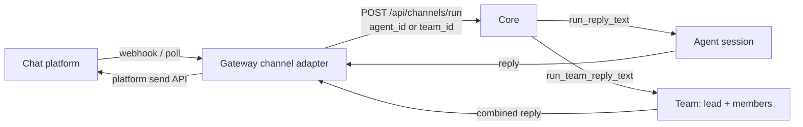

A channel bot turns a chat platform into a front door for Ryu. The Gateway runs the platform
listeners; each inbound message is normalized and routed to a Core agent or team, so a Telegram,
Discord, Slack, or BlueBubbles user talks to the same agent you talk to in the desktop, with the
same memory, tools, and Gateway governance on the path.

The transport and control details here follow the corresponding Hermes Agent messaging guides for
[Telegram](https://hermes-agent.nousresearch.com/docs/user-guide/messaging/telegram),
[Discord](https://hermes-agent.nousresearch.com/docs/user-guide/messaging/discord),
[Slack](https://hermes-agent.nousresearch.com/docs/user-guide/messaging/slack), and
[BlueBubbles](https://hermes-agent.nousresearch.com/docs/user-guide/messaging/bluebubbles),
adapted to Ryu's shared access policy and Core routing.

Channels are configured in **Gateway settings**, not on a Core node. They belong to your account
and, when an organization is active, are stored and served within that organization.

Members can see channels shared with their active organization. The creator can edit a shared
channel; editing another member's channel requires the `channel.manage` permission. Credentials
remain write-only and are never returned to the desktop in cleartext. Deleting a channel is a
separate `channel.delete` action and does not delete its shared Core conversation history.

Hosted channel bots require an active managed Pro, Max, Teams, or Business plan. A Major Pass
only grants supported paid Marketplace app access and cannot enable hosted channel users.

## What each platform can do

Platforms differ enormously in what they can express, so each adapter declares its capabilities and
the shared path uses the best verb available, falling back to plain text. Nothing below is emulated.
a cell is only ticked where the platform has a real API for it.

| | Telegram | Slack | Discord | WhatsApp Personal | WhatsApp Business (Cloud API) | BlueBubbles / iMessage |
|---|---|---|---|---|---|---|
| Typing indicator | Yes | Best-effort1 | Yes | Yes | Yes | Private API2 |
| Rich text replies | Yes | mrkdwn3 | Markdown | WhatsApp formatting | WhatsApp formatting | Plain text + media |
| Streaming drafts | DMs only4 | - | - | - | - | - |
| Threads / topics | Yes | Yes | Yes | - | - | - |
| Command menu | Yes | Manifest slash commands5 | Native slash commands | `/help` text | `/help` text | `/help` text |
| Voice replies | Yes | Yes | Audio attachment | Yes8 | -9 | Audio attachment |
| Attachments in | Yes | Yes | Yes | Yes | Yes | Yes |
| Reactions | Yes | Yes | Yes | Yes | Yes | Private API |

1. Slack bots cannot send a true typing indicator (only the retired RTM API could). The adapter uses
   the assistant thread status, which fails harmlessly for a plain bot.
2. BlueBubbles typing, read receipts and tapbacks need the Private API helper installed on the Mac.
3. Slack's mrkdwn is not CommonMark, so the adapter converts rather than emitting raw markdown that
   would render as literal asterisks.
4. `sendMessageDraft` is private-chat-only, and Core's channel endpoint is non-streaming today, so
   this shows a "Thinking..." draft and then the finished rich message - not live tokens.
5. A Slack slash command must be declared in the app manifest by the operator; the Gateway cannot
   register one at runtime.
6. Discord slash commands are registered as application commands and arrive over the identified
   Gateway WebSocket. Text commands remain available as a fallback.
7. BlueBubbles has no native command menu. Commands typed as text still work, and `/help` lists them.
8. OpenWA converts Core's WAV through its optional ffmpeg endpoint before sending an OGG/Opus voice note.
9. The Cloud API accepts audio but not Core's WAV output. The adapter answers with text instead of sending an
   unplayable file.

<Callout type="info">
  Telegram uses long polling by default and can switch to an authenticated webhook. Slack uses
  Socket Mode, while Discord keeps an identified Gateway WebSocket with heartbeats and an online
  presence. BlueBubbles receives webhook events from the Mac server and sends through its REST API.
  Ryu's liveness dot reports the adapter's control-plane heartbeat for all four.
</Callout>

## How a bot turn works

Each platform has an adapter that owns only its transport and platform verbs. Everything between -
the access gate, media ingest, the Core call, and reply delivery - is shared, so adding a channel
means implementing the channel contract and nothing else.

When the channel is bound to an agent or a group, the adapter routes the turn through Core's session
seam rather than a one-shot Gateway-pipeline call.

1. The platform delivers a message to the channel's adapter. Webhook deliveries are authenticated
   before parsing; OpenWA deliveries are also deduplicated by their idempotency key.
2. The adapter normalizes it and POSTs to `POST <core_url>/api/channels/run` with the channel's
   `agent_id` xor `team_id`. Store-backed channel records add their own channel identity to the
   platform chat id, so two bot records never accidentally share a transcript. Each sender keeps a
   persistent Core conversation that the desktop can open as well.
3. Core dispatches: a non-empty `team_id` invokes the team reply path (the lead agent orchestrates
   members and returns one combined, attributed reply); otherwise the single-agent reply path runs.
   Both reuse the same chat path, memory, and Gateway routing the desktop uses.
4. The model calls still flow Core to Gateway, so routing, firewall, budgets, and audit stay on the
   path.
5. The reply is sent back via the platform's send API.

A channel with neither `agent_id` nor `team_id` falls back to the legacy gateway-pipeline path (a
single non-streaming call with the channel's configured model and system prompt); the agent/team
seam is the recommended setup because it persists conversation history and reaches Core memory and
tools.

## Multiple bots and shared sessions

Every saved channel is an independent bot record. You can connect several Telegram bots, several
Discord bots, or several WhatsApp numbers, and give each record its own credentials, agent or team,
policies, and platform options. A channel record is not limited to one bot per platform.

When a channel message is routed through Core, the channel and platform chat are used to keep one
stable shared session. The same conversation can therefore be continued from the desktop chat and
from the channel, with the same history and agent context. Different bot records remain separate
even when they listen to the same platform.

When Ryu's managed provider inventory is enabled, managed Ryu Cloud nodes also get a dedicated
Telegram and Discord channel slot for the default Ryu agent. Each node receives its own provider
credential; Ryu never sends one customer's bot token to another customer's node, even when the nodes
are in the same organization. If the inventory is temporarily unavailable, the slot stays disabled
until it is ready, and you can paste your own token into that channel instead.

When a managed channel is ready, its channel card includes a platform action using that bot's public
identity. Telegram shows **Open in Telegram** and opens the dedicated bot's `t.me` link so you can
press **Start**. Discord shows **Install in Discord** and opens that dedicated application's install
flow so someone with **Manage Server** permission can choose a server. These actions are per-node
links, never expose the bot token, and do not create a second shared bot or transfer provider ownership.

Pasting a customer-owned token changes that channel to customer-managed credentials while keeping
the same agent binding and channel history. Provider ownership transfer is not an automatic part of
this switch: Telegram and Discord ownership changes remain subject to each platform's own account,
installation, and transfer rules.

### Ryu Cloud's shared WhatsApp front door

Ryu Cloud's managed service can operate one official WhatsApp Business number for every managed
organization. The hosted cloud-bot owns that single webhook and outbound sender, then uses the
admin-granted WhatsApp phone identity to select exactly one organization's managed node and agent.
Members do not create a Meta app, buy a phone number, or paste provider credentials. An unknown
phone receives onboarding information and is not assigned to an organization automatically.

This managed front door is separate from the per-node WhatsApp `ChannelConfig` used by self-hosted
or customer-managed Cloud API connections. Model and tool work performed on behalf of a routed
organization continues through its normal Gateway policy and organization credit wallet. The shared
phone line is Ryu platform infrastructure; it is not silently charged as a customer-owned number.

Deleting an agent does not delete its channel records or their Core history. If one of those channels
receives a later message, Ryu routes that turn to the configured default agent and shows a warning on
the channel until you rebind it. Deleting a channel is separate: it removes the bot credentials and
configuration while keeping the shared Core conversation history.

## Focused guides

Use the pages below to jump directly to the topic you need.

<Cards>
  <DocCard href="/docs/gateway/channel-setup" />
  <DocCard href="/docs/gateway/channel-controls" />
  <DocCard href="/docs/gateway/channel-routing" />
</Cards>

Continue with [Gateway](/docs/gateway), [channel setup](/docs/gateway/channel-setup), [channel controls](/docs/gateway/channel-controls), [channel routing](/docs/gateway/channel-routing), and [channel bots](/docs/learn/academy/cloud/channel-bots).
