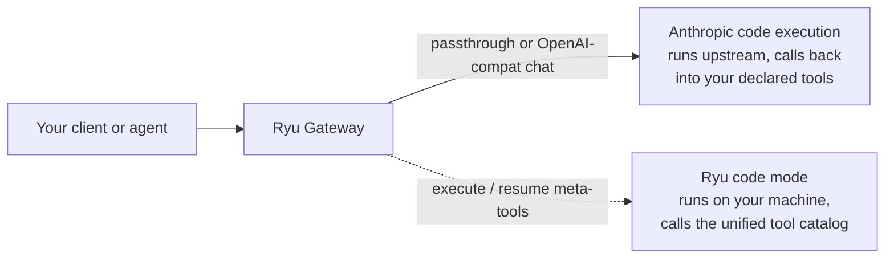

"Code mode" names two different things, and they meet at the Gateway. One is Anthropic's own
feature, where the model writes code in Anthropic's code-execution sandbox and calls your tools from
inside it. The other is Ryu's, where the model writes a program that Ryu runs locally and drives many
tools through an injected proxy. They solve the same problem (a tool loop that does not push every
intermediate result back into the context) on opposite sides of the network boundary.

## Anthropic programmatic tool calling

This is Anthropic's feature, not Ryu's. The caller declares Anthropic's code-execution tool in the
request, and marks each custom tool that generated code is allowed to invoke with `allowed_callers`.
The model then writes code that calls those tools inside Anthropic's sandbox, and only what the
program returns comes back as text.

Two properties are worth knowing before you wire it up.

- **No beta is ever inferred from your tools.** Anthropic gates these features behind opt-in beta
  identifiers sent on the `anthropic-beta` request header. Ryu forwards that header rather than
  deciding for you, and it never sniffs your tool types to guess which beta you meant. The one beta
  the Gateway adds on its own is the extended cache lifetime, and only when your own request asks for
  a longer prompt cache than the default.
- **Code execution can only call tools declared in the request.** Anthropic documents that its
  sandbox invokes the custom tools carried in that request's `tools` array, and that tools reached
  through an MCP server are not available to generated code. Anything the program must call has to be
  offered as a plain custom tool definition.

## Ryu code mode

Ryu's own version is the `execute` and `resume` meta-tools, and the difference that matters here is
where the program runs. It runs on your own machine against your own tool catalog, so it reaches
everything Ryu governs rather than only what one request declared.

The program model, the sandbox and its bounds, the pause and resume flow, and the Gateway
exec-budget bracket around it all live in
[Programmatic tool calling](/docs/core/programmatic-tool-calling). The tools a program can reach are
governed as described in [Tool governance](/docs/gateway/tools).

## Which route to use

For Anthropic's feature, pick the route by what your client speaks.

| Your client | Route | Why |
|---|---|---|
| A native Anthropic client, for example Claude Code | The Anthropic passthrough lane | The wire format is never translated and the `anthropic-beta` header is forwarded, so a feature Ryu has never heard of still reaches Anthropic |
| An OpenAI-compatible client pointed at an Anthropic model | The standard chat route | Ryu translates the tool surface in both directions (below) |

The passthrough lane is documented in full under
[Gateway for any agent](/docs/gateway/gateway-for-any-agent#subscription-preserving-passthrough-claude-code-codex),
including how to enable it, what it rewrites when the firewall is on, and the maturity caveat that
applies to it; its place among the non-standard endpoints is in
[Loopback and internal routes](/docs/gateway/loopback-routes). It is opt-in and loopback-only, so it
is the right lane for a local agent and the wrong one for a remote integration.

## What the chat route translates

The OpenAI-compatible chat route ([Routing](/docs/gateway/routing)) speaks OpenAI JSON to you and
Anthropic Messages to the provider, so a tool loop has to be carried across the two vocabularies. All
of this is inert for a request that names no tools: that request is byte-identical to what it was
before tool support existed.

On the way out:

| OpenAI field | Becomes |
|---|---|
| `tools[]` with a `function` body | Anthropic's `{name, description, input_schema}`. A tool that is already Anthropic-shaped, including Anthropic's own server-side tools, passes through verbatim |
| `allowed_callers`, `defer_loading`, `cache_control` on a tool | Carried to the tool's top level, where Anthropic reads them |
| `tool_choice` | `auto`, `none`, and `required` map to Anthropic's `auto`, `none`, and `any`; naming one function becomes `{"type": "tool", "name": …}` |
| `parallel_tool_calls: false` | `disable_parallel_tool_use` inside the resulting choice object |
| An assistant message carrying `tool_calls` | An assistant turn whose content is a block array, its text followed by one `tool_use` block per call |
| `role: "tool"` messages | `tool_result` blocks merged into a single user turn, which is the only shape Anthropic accepts |

And on the way back:

| Anthropic field | Becomes |
|---|---|
| `tool_use` blocks | `message.tool_calls`, with arguments re-encoded as the JSON string OpenAI callers parse |
| Blocks the OpenAI shape cannot hold, such as code-execution results | `message.ryu_content_blocks`, the original block array verbatim, attached only when one is present. Echo that assistant turn back as you received it and the blocks replay upstream, which is what lets a paused turn resume |
| `usage.server_tool_use` | Copied across unchanged, because it is how Anthropic bills server-side tools and OpenAI has no equivalent |
| `stop_reason: pause_turn` | A `finish_reason` of `pause_turn`, deliberately not an OpenAI value |

That last row is the one to code against. Anthropic pauses a long-running server-tool turn with
`pause_turn` and expects the caller to resume by sending the response back. Reporting it as `stop`
would present a truncated answer as a complete one, so the Gateway passes it through and leaves the
decision to you.

<Callout type="warn">
  The mapping above is exercised against a stand-in upstream rather than live Anthropic credentials,
  so treat it as the intended contract and expect to shake out details on your first real run. Ryu's
  own code mode depends on a JavaScript runtime that is provisioned on demand; if that provisioning
  fails, code mode stays unavailable and the `execute` and `resume` tools are simply not offered.
</Callout>

## Related

- [Programmatic tool calling](/docs/core/programmatic-tool-calling) - Ryu's own code mode end to end
- [Gateway for any agent](/docs/gateway/gateway-for-any-agent) - the passthrough lane in full
- [Governing an ACP agent](/docs/gateway/acp-agent-governance) - what is and is not governed when an agent brings its own tool loop
- [Tool governance](/docs/gateway/tools) - the allowlist a program inherits
