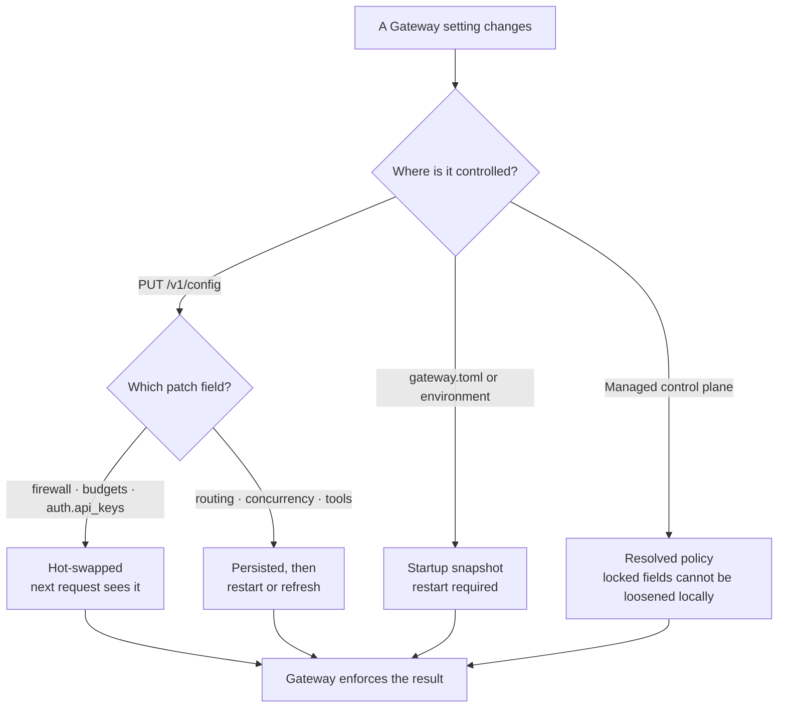

Part of the [Configuration & Auth](/docs/gateway/configuration) guide.

## Runtime config over the API

Read and edit config without restarting the process:

```bash
# Read the live config (secrets are redacted)
curl http://localhost:7981/v1/config \
  -H "Authorization: Bearer $GATEWAY_MASTER_KEY"

# Patch firewall settings live
curl -X PUT http://localhost:7981/v1/config \
  -H "Authorization: Bearer $GATEWAY_MASTER_KEY" \
  -H "Content-Type: application/json" \
  -d '{
    "firewall": {
      "enabled": true,
      "policy": "warn_and_continue"
    }
  }'

# Patch budget rules live
curl -X PUT http://localhost:7981/v1/config \
  -H "Authorization: Bearer $GATEWAY_MASTER_KEY" \
  -H "Content-Type: application/json" \
  -d '{
    "budgets": {
      "rules": [
        {
          "subject": "user:default",
          "token_limit": 100000,
          "window_secs": 3600
        }
      ]
    }
  }'
```

`GET /v1/config` returns the live firewall, budgets, routing, and a redacted view of providers and
auth - provider `api_key` fields become `"***"` and API key values are masked, so secrets never
leave the process (`ConfigView` / `redact_providers` / `redact_auth`, `apps/gateway/src/api/config.rs`).

`PUT /v1/config` accepts a partial patch with any of `firewall`, `budgets`, `auth`, or `routing`
(`ConfigPatch`). It persists first, then applies the live changes, so a failed file write leaves
the running config untouched.

### What applies live vs on restart



| Patch field | Effect |
|---|---|
| `firewall` | Hot-swapped live |
| `budgets` | Hot-swapped live |
| `auth.api_keys` | Hot-swapped live (full replacement: any key not in the list is removed) |
| `routing` | Persisted, but takes effect only on the next Gateway restart |

The `ModelRouter` holds a snapshot of `RoutingConfig` taken at startup and is not live-swappable, so
every routing change (model map, fallback chain, smart routing) is a write-then-restart operation.

`[concurrency]` is also snapshotted at startup and is not patchable over the API. Changes to
`local_max_in_flight` or `local_max_queued` require a Gateway restart.

Provider credentials, `master_key`, and `require_auth` are not writable through `PUT /v1/config` at
all - they require an environment-variable change.

<Callout type="info">
Routing changes follow a write-then-restart pattern: persist via `PUT /v1/config`, then restart the
Gateway. When Core manages the Gateway it does the restart for you via `gateway.refresh()` after a
routing or compression policy change, so the desktop surfaces feel live even though the process
re-snapshots its routing config on the way back up.
</Callout>

### Admin authorization

Both `GET` and `PUT /v1/config` are admin surfaces gated the same way as `GET /v1/audit`. The master
key always passes. Without it, the only path through is a loopback peer while `require_auth = false`
- a remote caller always needs the master key (`require_local_admin`, `apps/gateway/src/api/config.rs`).

<Callout type="warn">
Loopback trust is neutralized when the mesh is on. Under userspace networking, inbound tailnet peers
appear as `127.0.0.1`, so `admin_loopback_allowed` returns false when `mesh_enabled()` is true and
the admin surface then requires the master key. Do not rely on no-auth loopback access on a
node with `RYU_MESH_ENABLED` set.
</Callout>

## From Core

When the Gateway runs as a Core sidecar, the desktop never talks to `/v1/config` directly. Core
relays it:

| Core route | Relays to | Notes |
|---|---|---|
| `GET /api/gateway/config` | `GET /v1/config` | Proxies the Gateway's exact status; returns a `502` with `reachable: false` when the Gateway is down |
| `PUT /api/gateway/config` | `PUT /v1/config` | Writes a validated TOML subset (firewall, budgets, auth, routing) |
| `GET /api/gateway/status` | read-only | Health, metrics, and a credential-redacted effective config; always `200`, with `reachable: false` when the Gateway is down |

Core attaches the gateway token as a bearer when relaying (`gateway_get_config`,
`apps/core/src/server/mod.rs`), so the desktop config surfaces work without the operator handling
the master key by hand.

<Callout type="warn">
The standalone front-of-agent setup (binding the Gateway, pointing an agent at its base URL, and
owning `gateway.toml` yourself) is documented on
[Gateway for any agent](/docs/gateway/gateway-for-any-agent). Some of that path is opt-in and not
yet live-verified end to end; carry the caveats on that page forward.
</Callout>

## Related

<Cards>
  <DocCard href="/docs/gateway/gateway-for-any-agent" />
  <DocCard href="/docs/gateway/routing" />
  <DocCard href="/docs/gateway/governance" />
  <DocCard href="/docs/gateway/security" />
</Cards>
