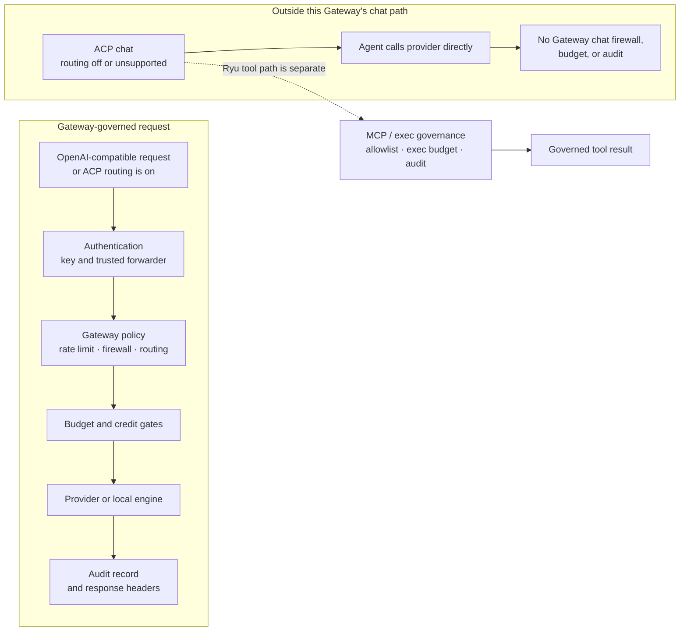
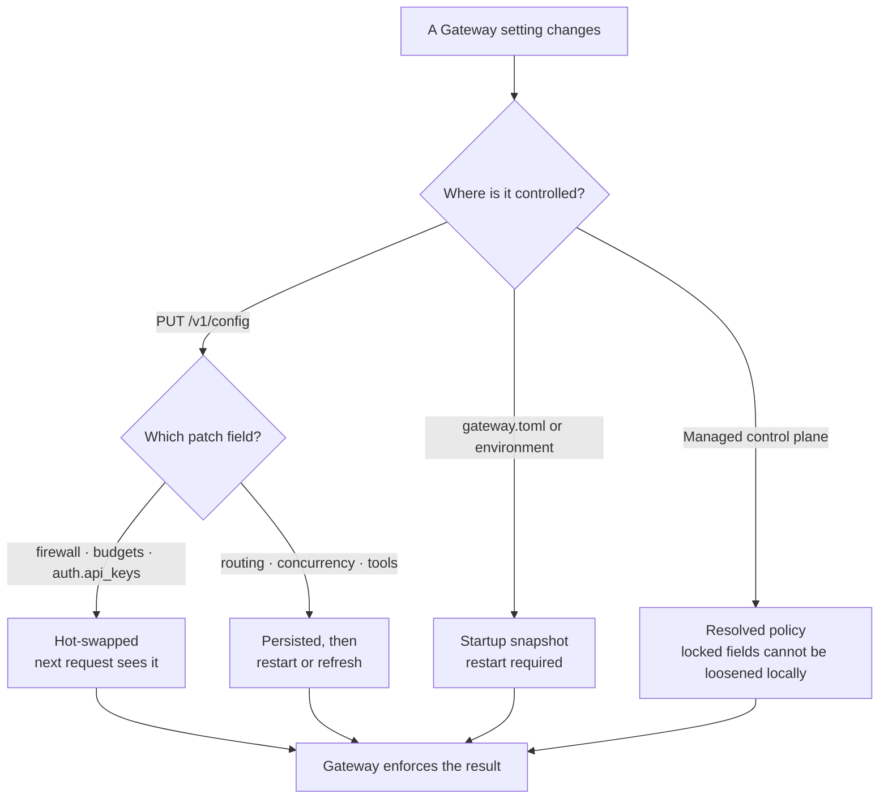

The Gateway reads one TOML file, layers environment variables on top, and exposes a thin runtime
API for live edits. When Core runs the Gateway as a managed sidecar, most of this is set for you;
when you run it standalone in front of your own agents, you own the file. For that standalone
setup, see [Gateway for any agent](/docs/gateway/gateway-for-any-agent).

## Credential purposes

Managed nodes do not use one bearer for every Gateway operation. Initial enrollment uses a
single-use bootstrap exchange. The response separates a **node-control** credential for lifecycle
and resolution calls from an **inference-relay** credential for model traffic. Each route declares
the purpose and operation it accepts; an ambiguous, missing, or wrong-purpose credential fails
closed. Core persists the pair before acknowledging bootstrap consumption, so a crash cannot adopt
credentials that were never made durable.

Standalone API keys remain separate from this managed lifecycle. They do not become control-plane
credentials, and a control credential cannot be used as an inference bearer.

## Where config comes from

The Gateway resolves `gateway.toml` from `GATEWAY_CONFIG` if set, otherwise from
`$config_dir/ryu/gateway.toml` (`GatewayConfig::config_path`, `apps/gateway/src/config.rs`). Values
from the file are the base; specific environment variables override individual keys at load time
(`from_env` in the same file). Writes through the API are persisted back to the same path using a
temp-file rename so a crash mid-write never corrupts the file (`GatewayConfig::save`).

```
gateway.toml          base config (TOML)
  + environment vars   per-key overrides applied at startup
  + PUT /v1/config      runtime edits, persisted back to the file
```

## Read the governance boundary

The setting you change and the agent path you use determine what the Gateway can enforce. An
OpenAI-compatible request, or an ACP agent with gateway routing enabled, crosses the Gateway policy
chain. An ACP agent whose routing switch is off (or whose client does not support the injected base
URL) can send its own model calls directly to a provider. Its Ryu MCP and exec tool path is still a
separate governed surface.



Use the per-agent routing switch to choose whether model egress enters the left branch. Do not
interpret that switch as a master off-switch for Ryu tool governance: ACP tool calls still use the
MCP bridge or governed exec front.

## The config sections

`gateway.toml` has one section per subsystem.

| Section | Controls | Documented |
|---|---|---|
| `[auth]`, `[[auth.api_keys]]` | Base auth, per-key limits, trusted forwarders | this page |
| `[providers.*]` | Per-provider API keys and base URLs | [Routing](/docs/gateway/routing) |
| `[routing]` | Model map, fallback chain, smart routing | [Routing](/docs/gateway/routing) |
| `[firewall]` | Detection toggles and policy | [Security](/docs/gateway/security) |
| `[budgets]` | Per-user, per-agent, and per-session charged-cost budgets (micro-USD) | [Reliability](/docs/gateway/reliability) |
| `[rate_limit]` | Request, token, and burst limits | [Reliability](/docs/gateway/reliability) |
| `[cache]`, `[semantic_cache]` | Exact and semantic caching | [Reliability](/docs/gateway/reliability) |
| `[circuit_breaker]` | Per-provider failure thresholds and reset timeout | [Reliability](/docs/gateway/reliability) |
| `[evals]`, `[audit]` | Sampling and the audit DB path | [Evals and audit](/docs/gateway/evals-audit) |
| `[compression]` | Egress compression | [Context compression](/docs/gateway/compression) |
| `[channels.*]` | Bot tokens and webhooks | [Channels](/docs/gateway/channels) |
| `[concurrency]` | Local-engine admission control | this page |
| `[exec_budget]` | Sandbox / tool execution rate caps | this page |
| `[tools]` | Unified tool loop (search-based) | this page |
| `[computer_use]` | Node-wide Ghost device-control permissions, including locked use | this page |
| `[composio]` | Composio integration and action allowlist | this page |
| `[credits]` | Platform-credits wallet debit hook | this page |
| `[control_plane]` | Control-plane relay, shared budgets, reporting | this page |

## Gateway settings in the desktop

The desktop Gateway dialog groups the controls that affect a selected node. In addition to the
Gateway TOML sections above, it includes **Hooks**, **Git**, **Worktrees**, and **Environments**.

The scope strip on these tabs follows the same effective-configuration idea used by managed MCP and
skill access:

```text
User override → Team policy → Organization policy → Node default
```

The most-specific declared field wins. An explicit off/deny value is still a value, so a user can
turn one hook off without removing the team's other settings. On a managed node, organization and
team layers are resolved by the control plane and Core applies them before a hook runs. On an
unmanaged node, those layers are shown as unavailable; the UI never presents a local value as an
organization policy.

### Hooks

Gateway → Hooks lists lifecycle hooks from supported configuration sources and installed plugins.
Hooks are grouped by source, owner, and lifecycle phase. Expand a hook to review its handler kind,
source path, matcher, priority, and required grant. The handler body is not sent to the desktop.

Trust and enablement are separate controls:

- **Trust** allows a reviewed handler to become eligible for execution.
- **Enable** allows a trusted handler to dispatch at its lifecycle boundary.
- The owning plugin must still be installed and enabled, its declared grants must be approved, and
  Core's sandbox must be available.

New third-party hooks require review by default. First-party hooks may be trusted by their built-in
policy. A user or authorized node administrator can create a local override; managed team and
organization policy is administrator-controlled. Core remains the enforcement point, so a client-side
toggle cannot authorize a hook by itself.

### Git, Worktrees, and Environments

**Git** stores defaults for branch prefixes, merge/review delivery, draft pull requests, force-push,
pull-request watching, and prompt guidance for commit and pull-request text. Guidance is text passed
to the relevant prompt; it is not an executable script.

**Worktrees** stores the fetch, cleanup, and retention defaults for managed worktrees. The filesystem
root is node-local because an absolute path cannot safely be shared across machines. Organization
and team policy can control portable cleanup settings but cannot distribute a node path.

**Environments** lists local projects and opens the existing project environment editor. Setup and
cleanup scripts, variables, and actions remain with the project on its node. Do not put plaintext
credentials in environment variables intended for managed distribution.

## Device settings

The `[computer_use]` section is the node-wide policy for Ghost, Ryu's device-control
provider. In the desktop, it appears as **Device settings** for the selected device
(advanced interfaces may still use the internal name Gateway settings).

```toml
[computer_use]
locked_use = false
```

`locked_use` is off by default. Turning it on grants Ghost permission to request the
platform's locked-session execution path; it does not unlock the operating system or
bypass its local safety and privacy controls. Ghost still needs the operating system
permissions and a provider path that supports locked use. If that path is unavailable,
device actions remain foreground-only.

## Auth and API keys

The `[auth]` block (`AuthConfig`, `apps/gateway/src/config.rs`) controls who may call the Gateway.

```toml
[auth]
require_auth = true
master_key = "ryu-master-secret"   # also GATEWAY_MASTER_KEY

[[auth.api_keys]]
key = "YOUR_GATEWAY_KEY"
name = "my-app"
org_id = "org_abc"
team_id = "team_xyz"
requests_per_minute = 10000        # per-key override of the global rate limit
tokens_per_minute = 500000         # per-key override
token_budget_total = 1000000000    # legacy lifetime token cap (0 = unlimited)
downgrade_to = "gpt-4o-mini"       # model used once the lifetime cap is hit
trusted_forwarder = false          # honor x-ryu-user-id / x-ryu-agent-id for budgets
```

Every request carries its key as a bearer token:

```bash
curl http://localhost:7981/v1/chat/completions \
  -H "Authorization: Bearer YOUR_GATEWAY_KEY" \
  -H "Content-Type: application/json" \
  -d '{"model": "gpt-4o", "messages": [{"role": "user", "content": "hi"}]}'
```

### Field reference

| Field | Type | Meaning |
|---|---|---|
| `require_auth` | bool | When `false`, all requests are accepted regardless of key. Default `false` (local dev) |
| `master_key` | string | A single key that bypasses all per-key limits and gates the admin surface |
| `api_keys[].key` | string | The bearer token clients send |
| `api_keys[].name` | string | Human label, surfaced in `GET /v1/config` |
| `api_keys[].org_id` / `team_id` / `project_id` | string | Tenancy tags carried through to budgets and audit |
| `api_keys[].requests_per_minute` | int | Per-key override of the global request rate limit |
| `api_keys[].tokens_per_minute` | int | Per-key override of the global token rate limit |
| `api_keys[].token_budget_total` | int | Legacy lifetime token cap (input + output). `0` is unlimited; per-agent/user/session spend caps use `[budgets]` |
| `api_keys[].downgrade_to` | string | Model swapped in once `token_budget_total` is exceeded. If unset, the request is rejected with `BudgetExceeded` |
| `api_keys[].trusted_forwarder` | bool | See below. Default `false` |

### Trusted forwarders

By default a key's budgets are keyed to the key itself, and any client-supplied `x-ryu-user-id` /
`x-ryu-agent-id` headers are ignored, so an untrusted caller cannot rotate identity headers to
evade its quota. Set `trusted_forwarder = true` only for an intermediary you control (Ryu Core
relaying a real end-user identity): those keys are allowed to pass `x-ryu-user-id` and
`x-ryu-agent-id`, which then drive per-user and per-agent budgets (`apps/gateway/src/config.rs`,
`ApiKeyConfig::trusted_forwarder`). Per-user and per-agent budget rules live under `[budgets]` and
are documented on [Reliability](/docs/gateway/reliability).

<Callout type="warn">
`require_auth` and `master_key` are environment-variable-only by design. The runtime API will not
change them (see below), preventing an accidental lockout where you disable auth or rotate the
master key over the wire and lock yourself out.
</Callout>

## Concurrency

`[concurrency]` admits requests to the **local** inference engine (llama.cpp, Ollama, etc.) up to a
configured slot limit and queues the rest with priority. Remote providers are not gated. This config
is **snapshotted at startup** and is not editable over `PUT /v1/config` - a change requires a
Gateway restart.

```toml
[concurrency]
enabled = true
local_max_in_flight = 4   # match the engine's --parallel slot count
local_max_queued = 64     # max waiting before 503 engine_overloaded
```

| Field | Default | Meaning |
|---|---|---|
| `enabled` | `true` | Master switch. When `false`, all local requests pass through ungated |
| `local_max_in_flight` | `4` | Max concurrent requests to the local provider. Set to your engine's `--parallel`. `0` = unlimited |
| `local_max_queued` | `64` | Max requests queued before the gateway returns `503 engine_overloaded` |

Interactive requests are served ahead of background fan-out (delegate calls, thread workers, scheduler). The gate is in the Gateway because it governs a shared resource; Core cannot see other callers' in-flight requests.

## Exec budget

`[exec_budget]` limits sandbox runs and MCP tool invocations over a rolling time window. Unlike
model-spend budgets, this counts executions and wall-clock time, not tokens. Counters reset at each window
boundary.

```toml
[exec_budget]
max_count = 0             # 0 = unlimited
max_wall_clock_secs = 0   # 0 = unlimited
window_secs = 3600
action = "notify"         # "notify" | "stop"
```

| Field | Default | Meaning |
|---|---|---|
| `max_count` | `0` | Max sandbox/tool executions per `window_secs`. `0` = unlimited |
| `max_wall_clock_secs` | `0` | Max total execution wall-clock seconds per window. `0` = unlimited |
| `window_secs` | `3600` | Rolling window size in seconds |
| `action` | `notify` | `notify` - log but allow; `stop` - deny with `429 budget_exceeded` |

## Tools

`[tools]` controls the unified search-based tool loop on the OpenAI-compat plane. The loop is
injected only when a request opts in via `x-ryu-tools` / `x-ryu-tool-search`; plain chat streams
are unaffected.

```toml
[tools]
enabled = true
max_rounds = 6
describe_top_n = 5
```

| Field | Default | Meaning |
|---|---|---|
| `enabled` | `true` | Master switch. Also overridable via `GATEWAY_TOOLS_ENABLED` |
| `max_rounds` | `6` | Maximum tool-call rounds before returning the last turn |
| `describe_top_n` | `5` | How many top search hits to describe per `tool_search` call |
| `always_on` | `[]` | Tool definitions always injected for every tool-active request |

## Composio

`[composio]` configures Gateway's managed Composio action-execution backend. Provider keys live
in Gateway's provider configuration and are never copied into app/satellite settings. This is separate from the
OAuth-backed **Composio Connect** remote MCP plugin, which does not use `api_key` or
`COMPOSIO_API_KEY`.

The managed backend is disabled unless `api_key` is set (or `COMPOSIO_API_KEY` is in the environment).

```toml
[composio]
enabled = true
api_key = "..."         # also COMPOSIO_API_KEY
entity_id = "default"  # also COMPOSIO_ENTITY_ID
max_rounds = 3
actions = ["GMAIL_SEND_EMAIL", "GITHUB_CREATE_ISSUE"]
```

| Field | Default | Meaning |
|---|---|---|
| `enabled` | `false` | Auto-enabled when `COMPOSIO_API_KEY` is set |
| `api_key` | - | Gateway-only Composio API key; app satellites never receive this value |
| `entity_id` | `"default"` | Per-user entity scoping connected accounts. The pipeline prefers `x-ryu-user-id` at runtime |
| `max_rounds` | `3` | Max agentic loop rounds |
| `actions` | `[]` | Allowlist of Composio action names the gateway may execute |

## Credits

`[credits]` enables the platform-credits wallet debit hook. After each metered model call, the
Gateway debits the request's organization wallet in the control plane. The hook is a no-op when
`enabled = false`. Managed deployments provide their service credential outside this file.

```toml
[credits]
enabled = false
base_url = "http://127.0.0.1:3000/api"  # defaults to control_plane.base_url
markup_bps = 0                          # platform markup in basis points (0 = pass-through)
wallet_empty_action = "stop"            # "stop" | "downgrade"
wallet_empty_downgrade_to = ""
timeout_ms = 3000

[credits.provider_billing.openrouter]
mode = "pass_through"                  # raw provider cost; other providers inherit markup_bps
```

| Field | Default | Meaning |
|---|---|---|
| `enabled` | `false` | Master switch. Also `GATEWAY_CREDITS_ENABLED` |
| `base_url` | inherits `control_plane.base_url` | Credits endpoint base. Also `GATEWAY_CREDITS_URL` |
| `markup_bps` | `0` | Platform markup in basis points applied to `costMicroUsd`. `0` = pass-through at cost. Also `GATEWAY_CREDITS_MARKUP_BPS` |
| `provider_billing.<provider>.mode` | `inherit_global` | `pass_through` charges that Gateway provider's raw cost without `markup_bps`; omitted providers inherit the global markup. The key is the actual Gateway provider id, not a Core catalog label. `GATEWAY_CREDITS_PASS_THROUGH_PROVIDERS` is a CSV shorthand. |
| `wallet_empty_action` | `stop` | `stop` - reject next request with `402`; `downgrade` - reroute to `wallet_empty_downgrade_to` |
| `wallet_empty_downgrade_to` | - | Model to route to on `downgrade`. Falls back to `stop` if unset |
| `timeout_ms` | `3000` | Per-debit POST timeout in milliseconds |

The debit is **post-call** (after the model call completes) and the budget gate is **pre-call**, so
an empty wallet blocks the next request rather than the one that exhausted it.

### Per-call rates

These are omitted from the block above because every one has a working default — set one only to
override it. All are also available as `GATEWAY_CREDITS_COST_PER_<NAME>`.

| Field | Default | Meaning |
|---|---|---|
| `cost_per_tool_call_micro_usd` | `300` | Per standard Composio tool execution, i.e. `$0.30` per 1,000. Billed at cost; override for a higher managed-app or premium-tool invoice |
| `cost_per_gpu_second_micro_usd` | `975` | `$0.000975`/sec, Replicate's published L40S rate. The base the media fallbacks below derive from |
| `cost_per_image_micro_usd` | `1950` | Flat fallback for one image generation — 2 GPU-seconds |
| `cost_per_video_micro_usd` | `58500` | Flat fallback for one video render — 60 GPU-seconds |
| `cost_per_tts_micro_usd` | `975` | Per speech synthesis — 1 GPU-second |
| `cost_per_stt_micro_usd` | `975` | Per transcription — 1 GPU-second |

Image and video are metered from the provider's **reported** compute time. Replicate returns
`metrics.predict_time` and fal returns `metrics.inference_time`; both are normalized to
`usage.compute_seconds` and priced at `cost_per_gpu_second_micro_usd`. Neither includes queue
wait, which neither provider charges for. The flat image and video rates are only a fallback for a
response that carries no timing at all. Audio and Voice Recognition have no metered path, so their flat rate is the
actual price rather than a fallback.

<Callout type="warn">
  A rate of `0` does not mean "free". The debit is guarded by `if cost > 0`, so a zero rate skips
  the debit entirely and silently while the provider still bills you. With `enabled = true`, an
  explicit `0` on any tool-call or media rate is a **startup failure**. To give a modality away deliberately, set
  `GATEWAY_CREDITS_ALLOW_FREE_MODALITIES=1`.
</Callout>

When a media provider does not report compute time, the debit uses the configured flat fallback and
records `taskLabel` as `<modality> (estimated cost)` in the ledger. A measured media debit keeps the
plain modality label and stores the reported duration separately.

## Control plane

`[control_plane]` connects the gateway to the control-plane API for shared budget reconciliation and
usage reporting. Disabled unless `gateway_key` is set (or `CONTROL_PLANE_KEY` is in the
environment).

```toml
[control_plane]
enabled = false
base_url = "http://127.0.0.1:3000/api"  # also CONTROL_PLANE_URL
gateway_key = "..."                      # also CONTROL_PLANE_KEY; also flips enabled
report_interval_secs = 60
audit_limit = 200
shared_budget_id = ""                    # also CONTROL_PLANE_SHARED_BUDGET_ID
cost_per_1k_micro_usd = 2000
```

| Field | Default | Meaning |
|---|---|---|
| `enabled` | `false` | Auto-enabled when `CONTROL_PLANE_KEY` is set |
| `base_url` | `http://127.0.0.1:3000/api` | Control-plane API base URL |
| `gateway_key` | - | Gateway credential (sent as `X-Gateway-Key`) to authenticate and resolve the org |
| `report_interval_secs` | `60` | How often to push a usage/audit report |
| `audit_limit` | `200` | Max audit rows per report push |
| `shared_budget_id` | - | Optional shared-budget ID to reconcile cross-gateway spend caps through the coordinator |
| `cost_per_1k_micro_usd` | `2000` | Estimated cost in micro-USD per 1k tokens for spend attribution |

<Callout type="info">
The `[control_plane]` section handles **reporting and shared budgets only**. Grant validation and
manifest signing (marketplace governance) are separate endpoints documented on
[Grants and Manifest Signing](/docs/gateway/governance).
</Callout>

## Policy alert delivery

Budget, session-budget, wallet-empty, and firewall rules can each request a notification tier when they match, orthogonally to the enforcement action they take. The Gateway **decides** the tier and stamps it on the response; Core **delivers** it. This keeps the Gateway (which owns "what is measured") out of the business of opening notification sockets (which Core owns).

### Alert tiers

`AlertTier` (`apps/gateway/src/config.rs`) is set per rule via an `alert` field on the budget rules, session budget, firewall config, and the wallet-empty action. It defaults to `Silent`, so a pre-existing config is unchanged.

| Tier | Wire value | Delivery |
|---|---|---|
| Silent | `silent` (default) | No alert |
| Warn | `warn` | Live SSE warning to the desktop only, no external fan-out |
| Fanout | `fanout` | Fan out to webhook / Telegram / Expo push |
| Email | `email` | Fan out AND send email to the node's configured recipients |

The Gateway only builds a stamp at `>= Warn`. When a matched rule's tier rides, the verdict is written to the `x-ryu-policy-alert` response header as `base64(json)` (`PolicyAlert`, `apps/gateway/src/policy_alert.rs`). It is stamped on **both** the success (2xx) response and the error response (a budget `402` or a firewall-block `403`), so a block-tier alert - which returns before any success response exists - is never dropped.

### How Core delivers

Core reads the header off every gateway-fronted response (`apps/core/src/policy_alerts/mod.rs`) and, when present and parseable, delivers it. A malformed header is a silent no-op, never fatal.

- **Dedupe.** The stamp carries a stable `dedupe_key` (a fixed sha256 over source / scope / subject / limit, deterministic across restarts). Core claims it atomically with a 300-second cooldown, so one chat turn's multi-iteration tool loop - which re-reads the same stamp each iteration - delivers once, not N times.
- **SSE mirror.** Every delivered alert is mirrored to the live desktop feed regardless of tier.
- **Fan-out per tier.** `Fanout` calls `notify_all` over the node's webhook / Telegram / Expo-push targets; `Email` additionally resolves the BYO SMTP transport (`resolve_transport`, `apps/core/src/email/mod.rs`, a lettre client) and sends to the configured recipients.

Core exposes the delivery config over these routes (`apps/core/src/server/mod.rs`):

| Route | Purpose |
|---|---|
| `GET` / `PUT /api/email/transport` | The node's non-secret SMTP transport config |
| `POST /api/email/test` | Send a test email over the configured transport |
| `GET` / `PUT /api/alerts/delivery` | The node's policy-alert delivery targets (fan-out channels + email recipients) |

Budget rules themselves are documented on [Reliability](/docs/gateway/reliability) and firewall policy on [Security](/docs/gateway/security); this section covers only the alert tier and its delivery.

<Callout type="warn">
Delivery is best-effort - a failing sink logs and drops so one channel never blocks the others. The self-host BYO SMTP transport needs a real mail relay to verify end to end and has not been exercised against a live relay. On a managed node the email leg goes through the control plane instead of the local SMTP sink.
</Callout>

## Key environment variables

These override `gateway.toml` keys at load time. Setting `GATEWAY_MASTER_KEY` also forces
`require_auth = true` (`apps/gateway/src/config.rs`).

| Variable | Purpose |
|---|---|
| `GATEWAY_CONFIG` | Explicit path to `gateway.toml`; otherwise `$config_dir/ryu/gateway.toml` |
| `GATEWAY_BIND` | The address the Gateway binds |
| `GATEWAY_MASTER_KEY` | The master key; also flips `require_auth` on |
| `OPENAI_API_KEY` / `OPENAI_BASE_URL` | OpenAI provider credentials |
| `ANTHROPIC_API_KEY` / `ANTHROPIC_BASE_URL` | Anthropic provider credentials |
| `OPENROUTER_API_KEY` / `OPENROUTER_BASE_URL` | OpenRouter provider credentials |
| `MODAL_API_KEY` / `MODAL_BASE_URL` | Modal serverless GPU provider. Both required; no default URL. Provider is only constructed when both are non-empty |
| `LOCAL_LLM_URL` | The local engine URL (Core sets this to the active engine) |
| `CORE_URL` / `CORE_TOKEN` | Reach Core for tool execution (set by Core's `gateway_spawn_env`) |
| `COMPOSIO_API_KEY` / `COMPOSIO_ENTITY_ID` | Composio integration; `api_key` also flips `composio.enabled` |
| `CONTROL_PLANE_URL` / `CONTROL_PLANE_KEY` | Control-plane relay; `CONTROL_PLANE_KEY` also flips `control_plane.enabled` |
| `CONTROL_PLANE_SHARED_BUDGET_ID` | Cross-gateway shared budget coordinator ID |
| `GATEWAY_FIREWALL_ENABLED` / `GATEWAY_FIREWALL_POLICY` | Firewall toggle and policy |
| `GATEWAY_TOOLS_ENABLED` | Unified tool loop master switch |
| `GATEWAY_COMPRESSION_ENABLED` / `GATEWAY_COMPRESSION_URL` | Egress compression toggle and service URL |
| `GATEWAY_COMPRESSION_TIMEOUT_MS` / `GATEWAY_COMPRESSION_MIN_MESSAGES` | Compression timeout and minimum message count |
| `GATEWAY_CREDITS_ENABLED` / `GATEWAY_CREDITS_URL` | Credits debit hook toggle and endpoint |
| `GATEWAY_CREDITS_MARKUP_BPS` | Platform markup on metered usage in basis points |
| `GATEWAY_SMART_ROUTING_ENABLED` / `GATEWAY_SMART_ROUTING_MODEL` | Smart routing toggle and classifier |
| `RYU_CRASH_REPORTS_ENABLED` | Opt-out crash reporting (default on). Core forwards the user's desktop privacy preference here |
| `RYU_DIAGNOSTICS_EXPORT_ENABLED` | OpenTelemetry diagnostics export (default off). Core sets this to `1` when the user enables telemetry |
| `TELEGRAM_BOT_TOKEN`, `SLACK_APP_TOKEN` + `SLACK_BOT_TOKEN`, `DISCORD_BOT_TOKEN`, `WHATSAPP_ACCESS_TOKEN` | Channel bot credentials (see [Channels](/docs/gateway/channels)) |

Managed deployments may add private service variables at runtime. They are not part of the
standalone configuration reference.

## Safety posture and Doctor

The desktop Gateway page and first-run onboarding expose one three-position safety posture slider.
It coordinates the controls that belong to Gateway and Core without changing provider credentials,
billing, or agent routing silently:

| Posture | Gateway | Core |
|---|---|---|
| **Guarded** | Firewall `Block`, inbound/outbound scans, redaction, and tool-result wrapping on | Command scan on, approval mode `Manual` |
| **Balanced** (default) | Same safety baseline with `Block` | Command scan on, approval mode `Smart` |
| **Autonomous** | Scans, redaction, and wrapping stay on; detections use `Sanitize` | Command scan on, approval mode `Off` |

Changing the slider shows a preview and requires an explicit **Apply**. If individual settings no
longer match a preset, the UI reports **Custom** rather than overwriting the operator's choices.
Claude Code, Codex, and other native agent traffic remain direct unless their Gateway routing is
explicitly enabled in the same card; posture changes do not opt those agents in or change which
credentials they use.

The Doctor checks configuration, security, performance, connectivity, and agent coverage. The
read-only audit is available to local admins at `GET /v1/doctor`; Core aggregates it with its
approval preferences and agent-routing coverage at `GET /api/gateway/doctor`. A report includes
stable check IDs, severity, the affected setting path, and a recommended action. It also identifies
`schemaVersion`, `rulesetVersion`, `profile: "lint"`, and `readOnly: true` so CI and integrations
can identify the contract they consumed. Existing drift warnings remain included in `GET /v1/config`
for compatibility.

The CLI exposes the same audit and an explicit safe-repair flow:

```bash
ryu doctor                 # read-only audit
ryu doctor --dry-run       # preview protective changes; writes nothing
ryu doctor --fix           # apply only the allowlisted protective changes
```

Desktop uses the same contract: **Run audit** → **Preview safe fixes** → **Apply safe fixes**.
Automatic repairs are intentionally narrow and idempotent: firewall activation/scanning,
redaction, and untrusted tool-result wrapping. Bind/auth choices, routing, approvals, providers,
budgets, and performance limits remain operator decisions. The fix response returns the planned and
applied setting paths so an automation system can audit exactly what changed.

## Runtime config over the API

Read and edit config without restarting the process:

```bash
# Read the live config (secrets are redacted)
curl http://localhost:7981/v1/config \
  -H "Authorization: Bearer $GATEWAY_MASTER_KEY"

# Patch firewall settings live
curl -X PUT http://localhost:7981/v1/config \
  -H "Authorization: Bearer $GATEWAY_MASTER_KEY" \
  -H "Content-Type: application/json" \
  -d '{
    "firewall": {
      "enabled": true,
      "policy": "warn_and_continue"
    }
  }'

# Patch budget rules live
curl -X PUT http://localhost:7981/v1/config \
  -H "Authorization: Bearer $GATEWAY_MASTER_KEY" \
  -H "Content-Type: application/json" \
  -d '{
    "budgets": {
      "rules": [
        {
          "subject": "user:default",
          "token_limit": 100000,
          "window_secs": 3600
        }
      ]
    }
  }'
```

`GET /v1/config` returns the live firewall, budgets, routing, and a redacted view of providers and
auth - provider `api_key` fields become `"***"` and API key values are masked, so secrets never
leave the process (`ConfigView` / `redact_providers` / `redact_auth`, `apps/gateway/src/api/config.rs`).

`PUT /v1/config` accepts a partial patch with any of `firewall`, `budgets`, `auth`, or `routing`
(`ConfigPatch`). It persists first, then applies the live changes, so a failed file write leaves
the running config untouched.

### What applies live vs on restart



| Patch field | Effect |
|---|---|
| `firewall` | Hot-swapped live |
| `budgets` | Hot-swapped live |
| `auth.api_keys` | Hot-swapped live (full replacement: any key not in the list is removed) |
| `routing` | Persisted, but takes effect only on the next Gateway restart |

The `ModelRouter` holds a snapshot of `RoutingConfig` taken at startup and is not live-swappable, so
every routing change (model map, fallback chain, smart routing) is a write-then-restart operation.

`[concurrency]` is also snapshotted at startup and is not patchable over the API. Changes to
`local_max_in_flight` or `local_max_queued` require a Gateway restart.

Provider credentials, `master_key`, and `require_auth` are not writable through `PUT /v1/config` at
all - they require an environment-variable change.

<Callout type="info">
Routing changes follow a write-then-restart pattern: persist via `PUT /v1/config`, then restart the
Gateway. When Core manages the Gateway it does the restart for you via `gateway.refresh()` after a
routing or compression policy change, so the desktop surfaces feel live even though the process
re-snapshots its routing config on the way back up.
</Callout>

### Admin authorization

Both `GET` and `PUT /v1/config` are admin surfaces gated the same way as `GET /v1/audit`. The master
key always passes. Without it, the only path through is a loopback peer while `require_auth = false`
- a remote caller always needs the master key (`require_local_admin`, `apps/gateway/src/api/config.rs`).

<Callout type="warn">
Loopback trust is neutralized when the mesh is on. Under userspace networking, inbound tailnet peers
appear as `127.0.0.1`, so `admin_loopback_allowed` returns false when `mesh_enabled()` is true and
the admin surface then requires the master key. Do not rely on no-auth loopback access on a
node with `RYU_MESH_ENABLED` set.
</Callout>

## From Core

When the Gateway runs as a Core sidecar, the desktop never talks to `/v1/config` directly. Core
relays it:

| Core route | Relays to | Notes |
|---|---|---|
| `GET /api/gateway/config` | `GET /v1/config` | Proxies the Gateway's exact status; returns a `502` with `reachable: false` when the Gateway is down |
| `PUT /api/gateway/config` | `PUT /v1/config` | Writes a validated TOML subset (firewall, budgets, auth, routing) |
| `GET /api/gateway/status` | read-only | Health, metrics, and a credential-redacted effective config; always `200`, with `reachable: false` when the Gateway is down |

Core attaches the gateway token as a bearer when relaying (`gateway_get_config`,
`apps/core/src/server/mod.rs`), so the desktop config surfaces work without the operator handling
the master key by hand.

<Callout type="warn">
The standalone front-of-agent setup (binding the Gateway, pointing an agent at its base URL, and
owning `gateway.toml` yourself) is documented on
[Gateway for any agent](/docs/gateway/gateway-for-any-agent). Some of that path is opt-in and not
yet live-verified end to end; carry the caveats on that page forward.
</Callout>

## Related

<Cards>
  <DocCard href="/docs/gateway/gateway-for-any-agent" />
  <DocCard href="/docs/gateway/routing" />
  <DocCard href="/docs/gateway/governance" />
  <DocCard href="/docs/gateway/security" />
</Cards>
