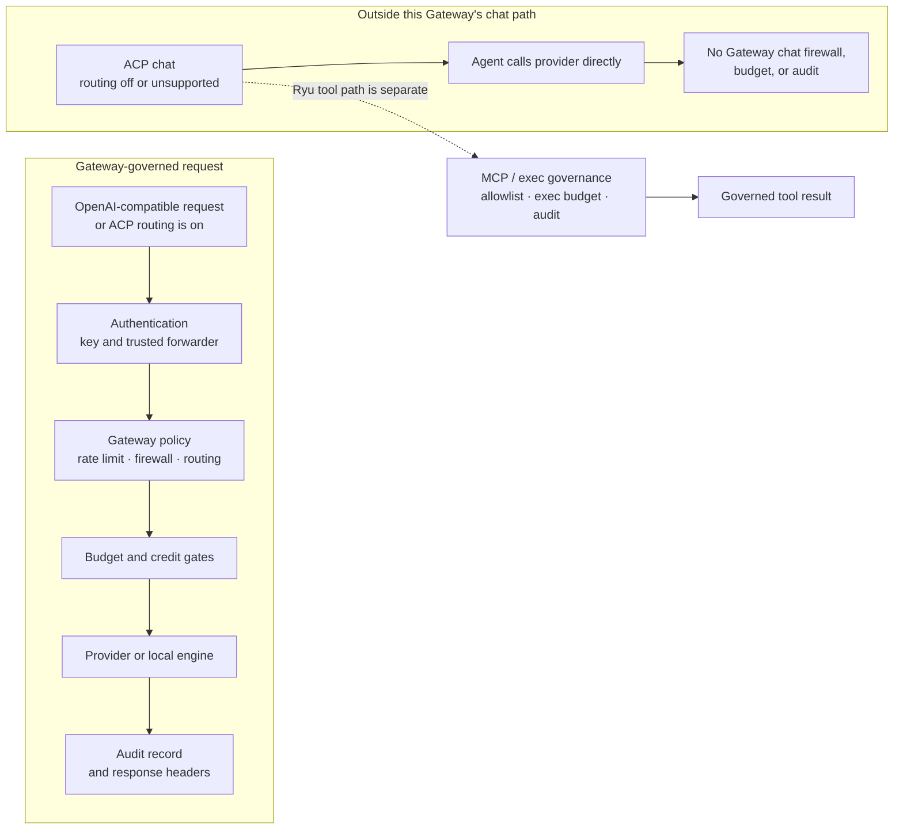

The Gateway reads one TOML file, layers environment variables on top, and exposes a thin runtime
API for live edits. When Core runs the Gateway as a managed sidecar, most of this is set for you;
when you run it standalone in front of your own agents, you own the file. For that standalone
setup, see [Gateway for any agent](/docs/gateway/gateway-for-any-agent).

## Credential purposes

Managed nodes do not use one bearer for every Gateway operation. Initial enrollment uses a
single-use bootstrap exchange. The response separates a **node-control** credential for lifecycle
and resolution calls from an **inference-relay** credential for model traffic. Each route declares
the purpose and operation it accepts; an ambiguous, missing, or wrong-purpose credential fails
closed. Core persists the pair before acknowledging bootstrap consumption, so a crash cannot adopt
credentials that were never made durable.

Standalone API keys remain separate from this managed lifecycle. They do not become control-plane
credentials, and a control credential cannot be used as an inference bearer.

## Where config comes from

The Gateway resolves `gateway.toml` from `GATEWAY_CONFIG` if set, otherwise from
`$config_dir/ryu/gateway.toml` (`GatewayConfig::config_path`, `apps/gateway/src/config.rs`). Values
from the file are the base; specific environment variables override individual keys at load time
(`from_env` in the same file). Writes through the API are persisted back to the same path using a
temp-file rename so a crash mid-write never corrupts the file (`GatewayConfig::save`).

```
gateway.toml          base config (TOML)
  + environment vars   per-key overrides applied at startup
  + PUT /v1/config      runtime edits, persisted back to the file
```

## Read the governance boundary

The setting you change and the agent path you use determine what the Gateway can enforce. An
OpenAI-compatible request, or an ACP agent with gateway routing enabled, crosses the Gateway policy
chain. An ACP agent whose routing switch is off (or whose client does not support the injected base
URL) can send its own model calls directly to a provider. Its Ryu MCP and exec tool path is still a
separate governed surface.



Use the per-agent routing switch to choose whether model egress enters the left branch. Do not
interpret that switch as a master off-switch for Ryu tool governance: ACP tool calls still use the
MCP bridge or governed exec front.

## Focused guides

Use the pages below to jump directly to the topic you need.

<Cards>
  <DocCard href="/docs/gateway/configuration-settings" />
  <DocCard href="/docs/gateway/configuration-access" />
  <DocCard href="/docs/gateway/configuration-operations" />
  <DocCard href="/docs/gateway/configuration-api" />
</Cards>
