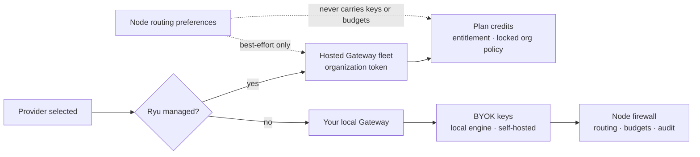

A node you host yourself can use **both** inference planes at once:

- the **Ryu (managed)** provider: included with your plan, billed against your organization's credits, and served by the hosted Gateway fleet that holds the provider keys;
- every **bring-your-own-key** provider (your OpenAI, Anthropic, OpenRouter or local engine keys), served by the Gateway that Core runs on your own machine.

They are not exclusive. Selecting the managed provider does not disable your local Gateway, and configuring your own keys does not stop you using the plan you pay for.

## Why the managed provider needs the fleet

The managed provider is deliberately pinned to Gateway routing and cannot be set to `direct`, so managed egress is always metered. But a **local** Gateway holds no Ryu provider keys. It only has whatever keys you gave it. So the managed provider has to reach the hosted fleet, which is where the pooled provider credentials and your organization's credit budget live.

Until you supply fleet coordinates, the managed provider falls back to your local Gateway. That is a safe default, not a working one: if you have not configured the fleet, pick a BYOK provider instead.



<Callout type="info">
Nodes provisioned as Ryu Cloud nodes are wired to the fleet for you. This page is for a machine you installed Core on yourself.
</Callout>

The organization selector in the desktop app controls which organization the Credits, Usage, and
billing pages display. It does **not** rewrite a node's saved fleet credential. The `rgw_…` token
is the billing authority for a self-hosted passthrough node and remains bound to the organization
that issued it. To move that node to another organization, issue a token from that organization's
Gateway keys page and replace the saved token (and fleet URL if needed). BYOK providers remain
local and charge the provider account behind the key stored on the node.

## Read usage without conflating billing

In the desktop app, open **Settings → Billing → Usage** to explore consumption with the same
scope model used by the rest of the app:

- **You** is your profile-wide usage, regardless of which organization or node served the request;
- **Organization** is limited to the selected organization's members and requests;
- **This node** is limited to the active node and includes requests handled locally, through BYOK,
  or through a self-hosted Gateway, even when they never touch Ryu's credit ledger.

Use the date-range picker, 15-minute/hourly/daily/weekly/monthly granularity, and provider/model
filters to compare traffic. The dashboard separates managed, BYOK, local, and self-hosted sources,
so **Credit spend** is shown only for managed requests. Local, BYOK, and self-hosted rows are
consumption data and are intentionally labeled **Not billed** by Ryu.

## Configure the fleet coordinates

You need two values, both scoped to your organization:

| Setting | Preference key | Environment variable |
| --- | --- | --- |
| Fleet base URL | `managed-gateway-url` | `RYU_MANAGED_GATEWAY_URL` |
| Organization token | `managed-gateway-token` | `RYU_MANAGED_GATEWAY_TOKEN` |

The token is an organization Gateway token (`rgw_…`). Issue one from your organization's Gateway keys page; it is shown once at issue time, so store it when you create it. Revoking it in the organization immediately stops that node from spending credits.

Both values are required. A URL without a token is refused rather than silently sent, because the fleet would reject an unauthenticated bearer anyway.

### From the desktop app

Open **Gateway settings → Network → Managed inference**, fill in the fleet URL and your organization token, and save. Both are stored on the node and take effect immediately, with no restart. Clearing both fields returns the managed provider to your local Gateway.

### Using environment variables

The simplest option, and the right one for a service unit or container. Environment values win over the stored preference, so this also pins a node against later changes:

```bash
RYU_MANAGED_GATEWAY_URL="https://<your-fleet-host>" \
RYU_MANAGED_GATEWAY_TOKEN="rgw_..." \
ryu-core
```

### Using preferences

Preferences persist across restarts and take effect immediately. Core re-reads both keys as soon as either is written, so no restart is needed:

```bash
curl -X PUT "http://127.0.0.1:7980/api/preferences/managed-gateway-url" \
  -H "content-type: application/json" \
  -d '{"value":"https://<your-fleet-host>"}'

curl -X PUT "http://127.0.0.1:7980/api/preferences/managed-gateway-token" \
  -H "content-type: application/json" \
  -d '{"value":"rgw_..."}'
```

If your node runs with a token set, add `-H "Authorization: Bearer $RYU_TOKEN"` to each call.

## Per-request routing preferences

After the fleet coordinates are configured, **Gateway settings → Network →
Managed request routing** can carry this node's preferences with each managed
request. You can choose an ordered fallback list and add custom firewall
patterns. The preference is best-effort: the fleet keeps the primary route,
drops providers outside its own funded chain, and applies firewall entries
additively. It never changes your organization's budget, provider keys,
entitlement, or locked guardrails.

The desktop stores the same atomic envelope under `node-routing-prefs`. For
headless setups, its value is JSON:

```json
{
  "fallback": ["anthropic", "openrouter"],
  "firewall": {
    "custom_patterns": [
      { "kind": "secret", "name": "internal_id", "regex": "id_[0-9]+" }
    ]
  }
}
```

The fleet may ignore a fallback that is not available or funded for your
organization. Clearing the preference restores fleet-global routing.

## What runs where

Once configured, selecting a provider decides which plane the request takes:

| Provider you select | Reaches | Paid with |
| --- | --- | --- |
| **Ryu (managed)** | hosted fleet | your plan's credits |
| **Ryu Gateway (governed)** | your local Gateway | your own keys |
| any BYOK provider (OpenAI, Anthropic, a local engine, …) | your local Gateway | your own keys |

Switching between them is just changing the active provider; nothing needs restarting and no keys move.

## What the fleet decides, and what stays yours

The hosted fleet resolves your token to an organization on every request and enforces the parts that protect the shared pool: your credit budget, your plan entitlement, and any organization-level firewall policy your admins authored. Those cannot be overridden from a client, by design. A node that could set its own budget could spend the organization's credits without limit.

Everything that is a local preference (which local engine is resident, your own
Gateway's provider list, and your BYOK keys) stays on your machine and is never
sent to the fleet. The routing envelope above is the deliberate exception: it
contains preferences only, not credentials or budget controls, and is clamped
by the fleet before use.

## Verifying it works

After configuring, select the managed provider and check that your organization's credit balance moves when you send a request. If it does not:

- confirm both values are set (a half-configured pair falls back to local);
- confirm the token has not been revoked in your organization;
- confirm your plan includes managed inference. Without that entitlement the fleet refuses managed requests rather than billing them.

## Related

<Cards>
  <DocCard href="/docs/gateway/managed-data-plane" />
  <DocCard href="/docs/gateway/routing-planes" />
  <DocCard href="/docs/gateway/configuration" />
  <DocCard href="/docs/billing/credits" />
</Cards>
