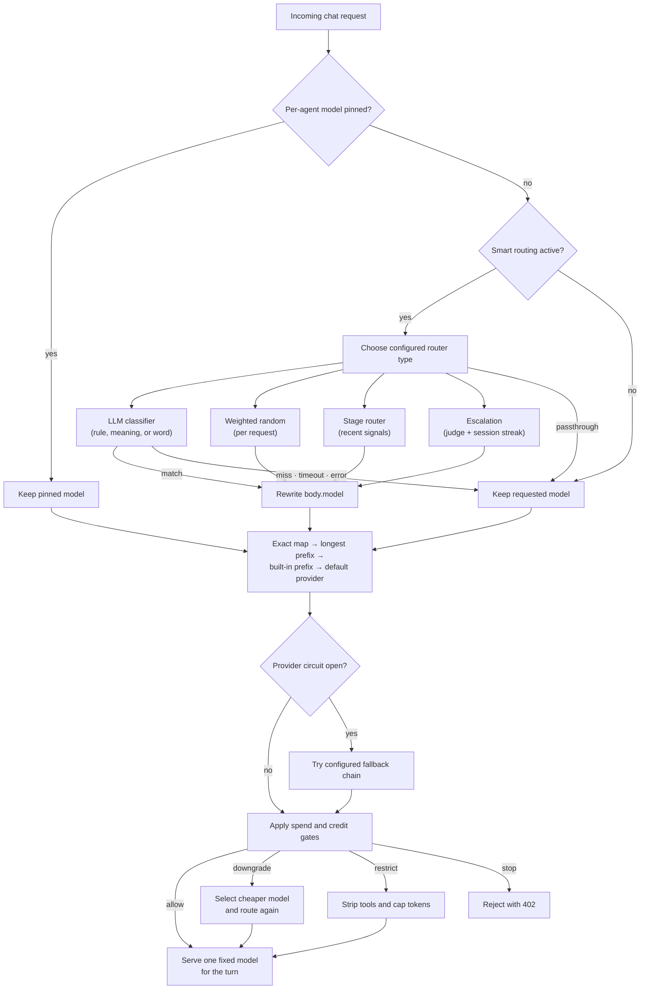

The router (`apps/gateway/src/router/`) decides which provider and model handles each request.
Routing is per-attribute: an agent's chat, image, and Audio calls can each go to a different provider.

## Provider selection

By default the router matches the model name against built-in prefix rules:

| Model prefix | Provider |
|---|---|
| `gpt-`, `o1`, `o3`, `o4`, `text-davinci` | OpenAI |
| `claude-` | Anthropic |
| `gemini-` | GenAi (native Gemini protocol) |
| `openrouter/` | OpenRouter (its own routing runs after the Gateway's guardrails) |
| `modal/` | Modal (serverless GPU compute) |
| `llama`, `mistral`, `mixtral`, `gemma`, `phi`, `qwen`, `deepseek` | Local engine |
| `zeroclaw`, `openclaw` | Core agents |

Resolution order: exact match in `model_map` wins, then longest prefix match in `model_map`, then built-in prefix rules, then `default_provider`.

## The strategies

On top of the prefix rules, several strategies layer in, all driven by `gateway.toml`.

- **Static model map** (`routing.model_map`) remaps an exact model name and can override the
  provider, for example rewriting a friendly name to a dated provider model.
- **Fallback chain** (`routing.fallback_chain`) tries alternative providers in order when the primary
  provider's circuit is open, emitting an `x-degraded` header when it does.
- **Eval-driven routing** (`routing.eval_routing`) splits traffic across candidate providers using
  their rolling eval scores: explore unscored candidates, then exploit the leader while reserving a
  slice for others. Selection is deterministic (a counter, not a random number).
- **Modality routing** (`routing.modality_map`) sends chat, image, Audio, and Voice Recognition to different
  providers and models.

## Smart model routing

The strategies above pick a provider from the *requested* model. Smart routing picks the
model itself before normal provider routing. The default **LLM classifier** uses plain-language
rules like *"coding or debugging → claude-sonnet-4-5"*, while the other router types split,
stage, escalate, or explicitly preserve the requested model.

It runs before the normal routing in `apply_smart_routing` (`apps/gateway/src/pipeline/mod.rs`):
`SmartRouter::resolve` (`apps/gateway/src/router/smart.rs`) chooses a target according to the
configured `router_type`. The chosen model rewrites `body["model"]` *before* `pre_process` runs,
so it then resolves its provider through the ordinary `ModelRouter`. Nothing about providers is
hardcoded: the target is any routable model id, including local models and `openrouter/…` slugs.

This is **Plane A** model routing - it rewrites the model inside one completion request. It is one of
two routing planes; the model-vs-agent split and the ownership rule are on the
[Routing planes](/docs/gateway/routing-planes) page.

### Router types

`router_type` selects the top-level model-selection algorithm. The existing classifier remains the
backward-compatible default; `strategy` only applies to `llm_classifier`.

The router families are informed by the provider-agnostic patterns in [NVIDIA NeMo
Switchyard](https://developer.nvidia.com/blog/route-ai-agent-workloads-across-models-with-nvidia-nemo-switchyard);
Ryu keeps each decision inside Gateway's existing fail-open and model-to-provider boundaries.

| Router type | What it does | Configuration |
|---|---|---|
| `llm_classifier` | Matches the request to a natural-language rule using `llm`, `embedding`, or `keyword`. | `rules`, `strategy`, and the matching strategy's model settings |
| `passthrough` | Keeps the model requested by the caller. Useful when the routing section is enabled but a deployment wants an explicit no-op. | No target settings |
| `random` | Chooses a target independently for each request using relative rule weights. | At least two target rules, each with `model` and optional `weight`; `random_seed` is optional |
| `stage_router` | Chooses a capable or efficient tier from recent tool/result and progress signals. | `stage_capable_model`, `stage_efficient_model`, picker, and confidence settings |
| `escalation` | Asks a judge about the current trajectory and latches a session to the strong tier after consecutive escalation verdicts. | Weak, strong, and judge models plus confirmation/window settings |

`random` is deliberately not session-sticky: the same conversation can move between weighted targets.
An optional seed makes the process-local sequence reproducible for tests and benchmarks, but it is
not a rollout or experiment assignment key. `stage_router` is a bounded local signal heuristic in
Ryu, so treat it as a pilot until its signals match your workload.

### Strategies

The `strategy` field (serialized `"llm" | "embedding" | "keyword"`, `RouteStrategy` in
`apps/gateway/src/config.rs`) chooses *how* a rule is matched. All three are opt-in and fail open
(any miss, timeout, or error keeps the originally requested model), and all resolve the classifier or
embedder *directly* - never as a governed chat turn - so routing can never recurse into routing.

| Strategy | How it matches | Cost | Notes |
|---|---|---|---|
| `llm` (default) | A cheap classifier model reads the message, enumerates the rules, and replies with the matching rule number - one LLM round-trip per uncached decision. | One extra completion | Requires a non-empty `classifier_model`. The classifier is itself resolved through the router, so it can be local, hosted, or an `openrouter/…` slug. |
| `embedding` | RAG: embed each rule's description once + the query, then route to the cosine-nearest rule above `similarity_threshold`. **No LLM call.** | One embedding per turn (cheap/local) | Reuses the semantic-cache embedder (`embed_text` / `cosine_similarity`) against the local `nomic-embed` sidecar. Rule embeddings are cached. |
| `keyword` | Case-insensitive significant-word match of a rule's description terms against the message. | Zero cost, zero network | The crude, fully-local fallback. |

### Configuration

Smart routing is configured under `routing.smart_routing` in `gateway.toml`
(`SmartRoutingConfig` in `apps/gateway/src/config.rs`):

| Field | Meaning | Default |
|---|---|---|
| `enabled` | Master switch | off |
| `router_type` | `llm_classifier` \| `passthrough` \| `random` \| `stage_router` \| `escalation` | `llm_classifier` |
| `strategy` | For `llm_classifier`: `llm` \| `embedding` \| `keyword` (how a rule is matched) | `llm` |
| `classifier_model` | The cheap model that sorts requests (**`llm` strategy only**) | local classify tier |
| `embedding_model` | Embedder for the `embedding` strategy; empty → `nomic-embed-text-v1.5` on the local sidecar | empty (falls back to the semantic-cache embedder) |
| `similarity_threshold` | Min cosine similarity for `embedding` to accept a rule | 0.35 |
| `random_seed` | Optional seed for a reproducible process-local `random` sequence | unset |
| `rules` | Ordered list of `{ description, model, weight }` entries; `description` and `weight` are used by `llm_classifier` and `weight` by `random` | empty (inert) |
| `default_model` | Model to use when `llm_classifier` matches no rule | none (keep requested model) |
| `stage_capable_model` / `stage_efficient_model` | The two targets for `stage_router` | empty |
| `stage_picker` | `capable_first` or `efficient_first` when signals are ambiguous | `capable_first` |
| `stage_confidence_threshold` | Signal confidence required to override the ambiguous-turn picker | 0.5 |
| `stage_recent_message_window` | Recent request messages considered by `stage_router` | 3 |
| `escalation_weak_model` / `escalation_strong_model` / `escalation_judge_model` | The routine, escalated, and judge targets for `escalation` | empty |
| `escalation_confirmations` | Consecutive `ESCALATE` verdicts before a session latches to strong | 2 |
| `escalation_recent_message_window` / `escalation_message_chars` | Transcript window and per-message cap shown to the judge | 28 / 500 |
| `cache_by_session` | Cache `llm_classifier` decisions by `x-ryu-session-id`; other router types have their own per-request or escalation state | on |
| `timeout_ms` | Classifier or escalation-judge timeout | 4000 |

Smart routing only runs when `enabled` is set and the selected type has the targets it needs
(`is_active` in `apps/gateway/src/config.rs`). `llm_classifier` needs rules and, for `llm`, a
classifier model; `random` needs at least two weighted targets; `stage_router` needs both tiers;
`escalation` needs weak, strong, and judge models. `passthrough` needs no targets. The rules
themselves are config-file-only. Like all routing config, changes are a startup snapshot and take
effect on the next Gateway refresh/restart.

For example, a reproducible 3:1 traffic split is:

```toml
[routing.smart_routing]
enabled = true
router_type = "random"
random_seed = 42
rules = [
  { description = "primary", model = "claude-sonnet-4-5", weight = 3.0 },
  { description = "candidate", model = "gpt-4o-mini", weight = 1.0 },
]
```

### Routing decision map

The router has several layers, but only one model should reach the provider for a turn. An explicit
per-agent pin wins first; smart routing can rewrite an unpinned request; deterministic provider
mapping and circuit fallback then resolve the destination. Budget `downgrade` is the deliberate
exception that can select a cheaper model after the initial decision.



### Per-agent override (`ryu_smart_route`)

Global `smart_routing` is the *default*. An individual agent can override it - the "both" config
scope: global as the fallback, per-agent as the override. Core stores a per-agent
`SmartRoutingConfig` (keyed by agent id) and, when forwarding that agent's OpenAI-compat chat request,
injects it as a private `ryu_smart_route` body field carrying the full config as JSON.

The gateway (`per_request_smart_router` in `apps/gateway/src/pipeline/mod.rs`) strips `ryu_smart_route`
before the provider call, builds or reuses one ephemeral `SmartRouter` per distinct config (hashed
JSON, cached in `AppState.per_agent_routers`), and uses it for that request only. An absent or
unparseable field falls open to the global router. Core sends the field only for agents that have an
override, so agents without one keep the global path unchanged.

On the desktop, edit smart routing under Gateway - Routing - Smart routing
(`SmartRoutingCard` in `apps/desktop/src/components/gateway/GatewayDialog.tsx`), which reads and
writes the routing config through the same config endpoint the rest of the dialog uses.

### Behavior and guarantees

- **Fails open everywhere.** An inactive config, an unparseable classifier reply, a classifier
  or judge error, an unusable target, or a timeout all keep the originally requested model, so a
  misconfiguration can never break chat.
- **Explicit pinning wins.** When Core forwards a carded agent's chat slot, that pinned model
  is an explicit user choice and smart routing never overrides it.
- **Eval routing is skipped** for a smart-routed request, so eval/A-B routing does not reassign
  the classifier's chosen provider.
- **Per-request versus per-session state.** `random` and `stage_router` decide independently for
  each request. With `cache_by_session` on (the default), `llm_classifier` caches against
  `x-ryu-session-id`; `escalation` uses that id only for its consecutive-verdict streak.
- **Observability.** The model that actually handled the request is returned in the
  `x-routed-model` response header (`apps/gateway/src/api/chat.rs`).

<Callout type="info">
  Ryu's `escalation` type is a trajectory-aware preflight: the judge reads the accumulated
  transcript before the current model call. It does not buffer a completed weak response and
  replay that response through the strong model, because the current Gateway routing hook chooses
  the model before provider execution. This keeps the behavior explicit instead of implying the
  full post-response Switchyard loop is already available.
</Callout>

The NVIDIA Switchyard **prefill** router is not exposed as a Ryu type yet. It requires access to
provider residual-stream activations, which the provider-neutral Gateway contract does not receive.

## Agent-auto (Plane B): picking the agent

Smart routing above is **Plane A** - it picks a *model* inside one governed completion. A separate,
higher-level route picks the *agent* that serves the turn. In the universal picker an **"Auto"** entry
sits above the agent list; selecting it sets the composer's agent to the sentinel `auto`, and Core
resolves the concrete agent per turn from your own rules, then continues exactly as if you had picked
that agent.

Agent-auto reuses the **same strategy vocabulary** as smart routing (`llm` / `embedding` / `keyword`),
but the rule *targets are agent ids*, not model ids. It is configured by the Core `agent-auto-routing`
preference:

```jsonc
{
  "enabled": true,
  "strategy": "embedding",          // llm | embedding | keyword - same vocabulary as Plane A
  "classifier_model": "gemma-3-270m-it-qat-Q4_0", // optional; blank uses the local classify tier
  "embedding_model": "",            // for embedding; empty -> default local embedder
  "similarity_threshold": 0.35,
  "rules": [
    { "description": "writing, refactoring or debugging code", "agent_id": "claude-code" },
    { "description": "quick web lookups and browsing",         "agent_id": "ryu" },
    { "description": "long-form research and analysis",         "agent_id": "gemini" }
  ],
  "default_agent_id": "ryu",        // when no rule matches
  "cache_by_session": true
}
```

<Callout type="info">
  The Plane B backend split (an OpenAI-compat agent's chat is governed by the Gateway; an ACP agent
  self-routes) and the **agent-auto** picker are shipped - see
  [Routing planes](/docs/gateway/routing-planes). Agent-auto's default LLM classifier is the local
  270M Gemma classify tier, so it adds a small local classification step rather than sending the
  user's turn to a second hosted model. If the classifier is unavailable or returns an unusable
  result, Core fails open to the configured default agent.
</Callout>

**Cross-harness session caveat.** Auto may pick a *different harness* than last turn (Ryu/Pi → Claude
Code → Gemini). ACP agents own stateful subprocesses, so switching agents starts a fresh session for
the newly-chosen agent (the previous one is kept warm for a switch-back). Conversation history is
**replayed** into the new agent as prior context, but live in-subprocess state is *not* - files an ACP
agent had open, its working buffers, and so on are lost across a harness switch; only the transcript
carries over. To avoid swinging harness every turn, `cache_by_session` classifies once per
conversation and reuses that pick, which prevents flapping.

### The auto routes, disambiguated

"Auto" is overloaded. These are four different things:

| Name | Plane | Picks | Config | Where it runs |
|---|---|---|---|---|
| Ryu smart-route | A | A **model** (rewrites `body["model"]`) | Gateway `smart_routing` (+ per-agent `ryu_smart_route`) | Gateway pipeline |
| Ryu agent-auto | B | An **agent id** | Core `agent-auto-routing` preference | Core, before backend dispatch |
| `openrouter/auto` | (neither) | An upstream model, chosen by OpenRouter | Just a model id in the request | OpenRouter, after the Gateway forwards |
| `openrouter/pareto-code` | (neither) | A coding model chosen by OpenRouter's Pareto Router | Just a model id in the request; optionally add the `pareto-router` plugin | OpenRouter, after the Gateway forwards |

`openrouter/auto` is not a Ryu router at all - it is a model id (it appears in `GET /v1/models`) that
the Gateway routes to the OpenRouter provider, which then selects an upstream model. It has no rules
and no Ryu-side classifier.

For coding tasks, `openrouter/pareto-code` uses OpenRouter's current coding shortlist and picks a
model from the requested quality tier, favoring the cheapest available model in that tier. It is
also a model id, so Ryu's firewall, budgets, routing, and usage accounting still run before the
request leaves the Gateway. OpenRouter documents the optional `pareto-router` plugin and its
`min_coding_score` setting in the [Pareto Router guide](https://openrouter.ai/docs/guides/routing/routers/pareto-router).

<Callout type="info">
Managed inference is not one undifferentiated supply. Which model you pick decides
which of your balances pays for the request — see
[Named credits](/docs/billing/credits#named-credits). If you hold granted credit
under a specific name, pick the matching entry in the model picker rather than a
generic auto-router, or the request is declined even though your total balance is
positive.
</Callout>

## How the gateway intercepts agent egress

Smart routing and agent-auto decide *what* runs. A separate question is *how* the Gateway gets in
front of an agent's model calls in the first place - the base-URL swap (`OPENAI_BASE_URL` /
`ANTHROPIC_BASE_URL` injection), the subscription-preserving passthrough proxy for Claude Code and
Codex, the per-agent `agent-gateway-routing` toggle, and the bypass list for agents that ignore the
base URL (Gemini CLI, OpenClaw, Hermes). That is documented in full on
[Gateway for any agent](/docs/gateway/gateway-for-any-agent) - start there to point an existing agent
at the Gateway.

## The model list

```
GET /v1/models
```

returns the routable models. The built-in list (`builtin_model_list` in `apps/gateway/src/router/mod.rs`) includes:

- OpenAI: `gpt-4o`, `gpt-4o-mini`, `gpt-4-turbo`, `o1`, `o3-mini`
- Anthropic: `claude-opus-4-5`, `claude-sonnet-4-5`, `claude-haiku-4-5`, `claude-3-5-sonnet-20241022`, `claude-3-5-haiku-20241022`
- Core agents: `zeroclaw`, `openclaw`
- OpenRouter: `openrouter/auto`, `openrouter/pareto-code`
- Local: `llama3.2:latest`, `mistral:latest`, `phi4:latest`, `deepseek-r1:latest`

Add your own with `routing.model_map`.

## Providers and credentials

Provider credentials come from environment variables or the config file.

| Provider | Env vars | Notes |
|---|---|---|
| OpenAI | `OPENAI_API_KEY` | `base_url` defaults to `https://api.openai.com/v1` |
| Anthropic | `ANTHROPIC_API_KEY` | `base_url` defaults to `https://api.anthropic.com` |
| OpenRouter | `OPENROUTER_API_KEY` | |
| Local | `LOCAL_LLM_URL` | Core sets this to the active local engine on startup |
| Modal | `MODAL_API_KEY` + `MODAL_BASE_URL` | Both required — no default URL exists; each Modal deployment has its own `*.modal.run` endpoint |
| GenAi | Per-provider keys in `providers.genai.keys` map | Keyed by adapter name, e.g. `"gemini"`. Falls back to each adapter's own env var if not set |

Set or clear provider keys at runtime through Core's `PUT /api/gateway/providers`.

### Modal

`modal/` routes to a Ryu Cloud GPU node's Modal inference app (serverless GPU). Use any `modal/<model-name>` form to offload heavy inference to Modal's GPUs (pay-per-second, scale-to-zero) while the always-on orchestration node stays on cheap CPU. The provider is OpenAI wire-compatible — it is activated only when both `MODAL_BASE_URL` and `MODAL_API_KEY` are configured.

### GenAi

`gemini-` routes to the `genai` backend, which handles native-format providers (primarily Gemini) that the Gateway does not implement by hand. This is the correct way to route to Gemini models — use a `gemini-` prefixed model id directly (e.g. `gemini-2.5-pro`) rather than an `openrouter/google/…` slug. Other providers supported by the `genai` adapter (e.g. `groq`, `xai`, `cohere`) can be reached via `routing.model_map` entries that pin `provider = "genai"`.
