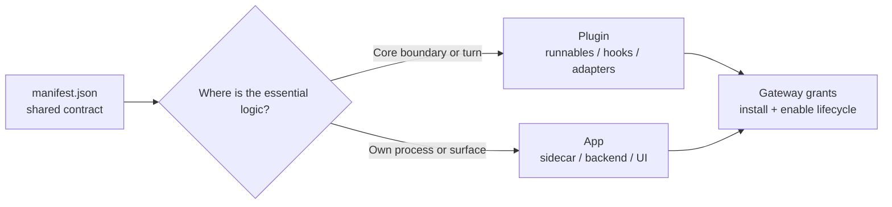
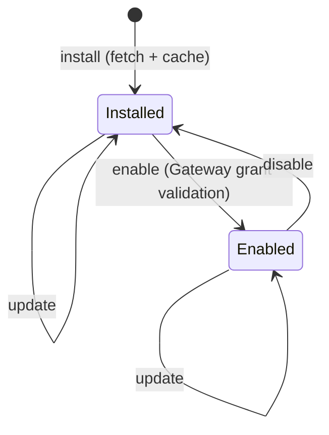

Once you have Runnables, choose whether you are shipping a **plugin** or an **app**. Both use the
same native `manifest.json` contract and the same install/enable lifecycle. A plugin's essential
logic runs at a Ryu boundary (a Runnable, hook, adapter, or policy); an app packages a product
process and/or surface (a sidecar, backend, widget, companion, or capability provider). The choice
is about ownership and runtime placement, not a separate app schema.



## The manifest

The canonical native manifest file is `manifest.json`. Older native installs may still use `ryu.json`
or a legacy `plugin.json`; an Agent Plugins `plugin.json` can also be present as a generated
interop file, identified by its Agent Plugins `$schema`. Keep `manifest.json` as the source of truth.

```json
{
  "id": "com.example.weather",
  "name": "weather-app",
  "version": "1.0.0",
  "runnables": [
    { "kind": "agent", "id": "weather-helper" },
    { "kind": "tool", "id": "get_weather" }
  ],
  "permission_grants": []
}
```

The manifest is Ryu's native runtime contract. When you need cross-host portability, the SDK derives
the Agent Plugins `plugin.json` and optional stdio `mcp.json`; when you publish through the Ryu
Marketplace, an outer `ryu.package.json` envelope declares the artifacts and produces a deterministic
`.ryupack` release. See [Extension schemas & folder layouts](/docs/extend/develop/extensions/schemas-and-layouts).

Each manifest is validated per-kind against a schema, so an agent entry is checked differently from a tool entry.

## Lifecycle and grants

<TryInRyu page="apps" />

Plugins and apps are installable and enable-on-the-fly, with permission grants. The lifecycle has
these operations:

- **install** - fetch and cache the app.
- **enable** - turn it on, with Gateway grant validation.
- **disable** - turn it off without uninstalling.
- **update** - move to a new version.
- **uninstall** - remove the package and its owned runtime artifacts.



<Callout type="warn">
  Enabling an app validates its grants against the Gateway. An app cannot quietly reach a model, tool, or surface it was not granted.
</Callout>

## Study the package layouts

Use the extension guide's examples to decide what belongs in your tree:

- a plugin can add `hooks/`, `adapters/`, `skills/`, `output-styles/`, or native MCP declarations;
- an app can add `backend/`, `sidecar/`, `ui/`, public mounts, and capability bindings;
- either can declare Runnables and publish through the same signed Marketplace package flow.

See [Extension schemas & folder layouts](/docs/extend/develop/extensions/schemas-and-layouts) and
[Portable packages](/docs/extend/develop/extensions/portable-packages) before choosing a release
layout.

## Knowledge check

First, the reflection prompts. Answer them in your own words.

- Which file is the canonical native Ryu manifest?
- What lifecycle operations can a plugin or app use?
- What happens to an app's grants when it is enabled?
- What separates a plugin from an app if they share the same manifest?

Then confirm the details with a quick self-test.

<Quiz
  questions={[
    {
      q: "Which file is the canonical native Ryu manifest?",
      options: [
        "manifest.json; older ryu.json/plugin.json names are compatibility forms",
        "plugin.json only, because Ryu does not have a native manifest",
        "app.json or package.json",
      ],
      answer: 0,
      explain:
        "manifest.json is canonical. Older native names remain readable for compatibility, while an Agent Plugins plugin.json is an interop projection rather than the native source of truth.",
      },
      {
      q: "What lifecycle operations can a plugin or app use?",
      options: [
        "Draft, review, publish, and archive",
        "Install, enable, disable, update, and uninstall",
        "Fetch, sign, verify, and list",
      ],
      answer: 1,
      explain:
        "The lifecycle operations are install, enable, disable, update, and uninstall. Enable validates grants through the Gateway before activation.",
    },
    {
      q: "What happens to an app's grants when it is enabled?",
      options: [
        "They are granted automatically with no checks",
        "They are validated against the Gateway",
        "They are copied from a built-in app",
      ],
      answer: 1,
      explain:
        "Enabling an app validates its grants against the Gateway, so an app cannot quietly reach a model, tool, or surface it was not granted.",
    },
    {
      q: "Which folder belongs in an app package when it owns an out-of-process service?",
      options: ["sidecar/ or backend/", "marketplace.json only", "secrets/ with credentials"],
      answer: 0,
      explain:
        "An app owns its process in sidecar/ or backend/ and declares the host seam in manifest.json. Secrets should never be committed into a publishable package.",
    },
    {
      q: "What determines whether a package is a plugin or an app?",
      options: [
        "Where its essential logic lives: at a Ryu boundary, or in its own process or surface",
        "Whether its manifest is named plugin.json or app.json",
        "Whether it contains more than one Runnable",
      ],
      answer: 0,
      explain:
        "Both use manifest.json. A plugin's essential logic runs at a Ryu boundary; an app owns a process or product surface.",
    },
    {
      q: "What is ryu.package.json used for in a Marketplace release?",
      options: [
        "It is the outer package envelope that declares artifacts for a deterministic .ryupack release",
        "It replaces the native manifest at runtime",
        "It stores provider keys for the app",
      ],
      answer: 0,
      explain:
        "manifest.json remains the native runtime contract. ryu.package.json is the outer release envelope used to assemble the signed Marketplace package.",
    },
    {
      q: "What does disabling an installed app do?",
      options: [
        "Turns it off without uninstalling it",
        "Deletes the package and all runtime artifacts",
        "Publishes an updated version",
      ],
      answer: 0,
      explain:
        "Disable deactivates an installed app while keeping it available to enable again. Uninstall is the separate removal operation.",
    },
  ]}
/>

Next: sign and ship your app in [Publishing](/docs/learn/academy/builder/publishing).
