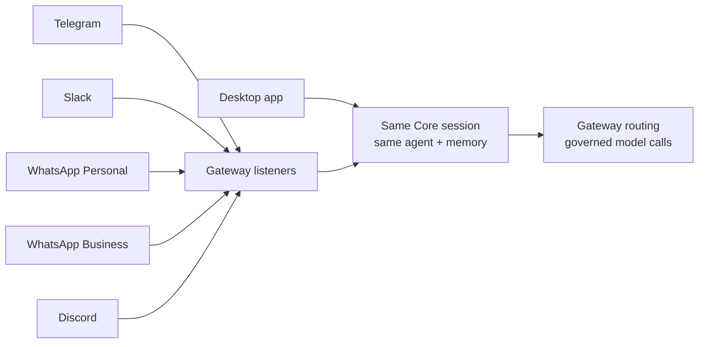

Channel bots put your agents into the chat platforms people already use: Telegram, Slack, WhatsApp Personal, WhatsApp Business, and Discord. The key idea is that a bot is not a separate, dumber agent. It is just another surface onto the same agent your desktop talks to.

## A bot is another surface

Inbound bot messages route through Core sessions, the same agent path, the same memory, and the same Gateway routing the desktop uses. So a question asked in a Telegram group gets the same agent, the same context, and the same governed model calls as a question asked in the desktop app.

- The agent path is shared, so behavior is consistent across surfaces.
- Memory is shared, so a bot conversation is not stranded.
- Gateway routing applies, so a bot's model calls are governed like any other.

## How you set them up

<TryInRyu page="channels" />

The desktop exposes Channels inside the Gateway settings dialog (Gateway -> Channels), where you do CRUD on bot configs. It talks to the control-plane server using your signed-in account, not a Core node directly. The Gateway runs the actual platform listeners, so once a config exists the Gateway is what connects to Telegram, Slack, and the rest.

<Callout type="info">
  Think of it as two roles: the Channels section in the Gateway dialog is where you describe a bot, and the Gateway is what actually listens and responds on the platform.
</Callout>

For Telegram, the desktop may show **Create a bot for me**. This managed path opens a QR code or
deep link in Telegram, waits for a bot owned by your Telegram account, and asks you to verify its
`@username` before connecting it. Use **Paste a token** when the managed option is unavailable or
when you want to reuse an existing BotFather bot.

## Organization-aware channel records

The Channels dialog now resolves the active organization when it creates a record. The Gateway's
enabled-channel view uses that same organization, so an enabled bot created while an organization is
active is served by that organization's Gateway. A team binding must belong to the same organization.
In a personal context, the record remains personal rather than being silently attached to a team.

<Callout type="info">
  If a bot is not receiving messages, first check that it is enabled, that the Gateway is running for
  the organization that owns the record, and that its platform credential is valid. A missing
  organization is no longer the expected result of creating it from the desktop.
</Callout>

## Knowledge check

First, the reflection prompts. Answer them in your own words.

- What does it mean that a bot is "another surface onto the same agent"?
- Which component runs the actual platform listeners?
- How does the active organization affect a channel bot created in the desktop?

Then confirm the details with a quick self-test.

<Quiz
  questions={[
    {
      q: "What does it mean that a channel bot is 'another surface onto the same agent'?",
      options: [
        "Each platform gets its own separate, simpler agent",
        "Inbound bot messages route through Core sessions using the same agent path, memory, and Gateway routing as the desktop",
        "Bots run a stripped-down model to save cost",
      ],
      answer: 1,
      explain:
        "A bot is not a separate, dumber agent. It is just another surface onto the same agent your desktop talks to, sharing the agent path, memory, and Gateway routing.",
    },
    {
      q: "Which component runs the actual platform listeners that connect to Telegram, Slack, and the rest?",
      options: [
        "The desktop Channels section in the Gateway dialog",
        "The Gateway",
        "Each platform's own webhook",
      ],
      answer: 1,
      explain:
        "The Channels section in the Gateway dialog describes a bot, but the Gateway is what actually listens and responds on the platform.",
    },
    {
      q: "What does the desktop Channels section in the Gateway dialog talk to when doing CRUD on bot configs?",
      options: [
        "A Core node directly",
        "The control-plane server, using your signed-in account",
        "The platform APIs directly",
      ],
      answer: 1,
      explain:
        "The Channels section in the Gateway dialog talks to the control-plane server using your signed-in account, not a Core node directly.",
    },
    {
      q: "How does the active organization affect a channel bot created in the desktop?",
      options: [
        "The record is associated with the active organization and served by that organization's Gateway",
        "The record is always personal and cannot be served by a Gateway",
        "The platform chooses an organization from the bot username",
      ],
      answer: 1,
      explain:
        "The Channels dialog resolves the active organization for the record, and the Gateway filters enabled records by that organization.",
    },
  ]}
/>

Next: spread work across machines in [multiple nodes](/docs/learn/academy/cloud/multi-node).
