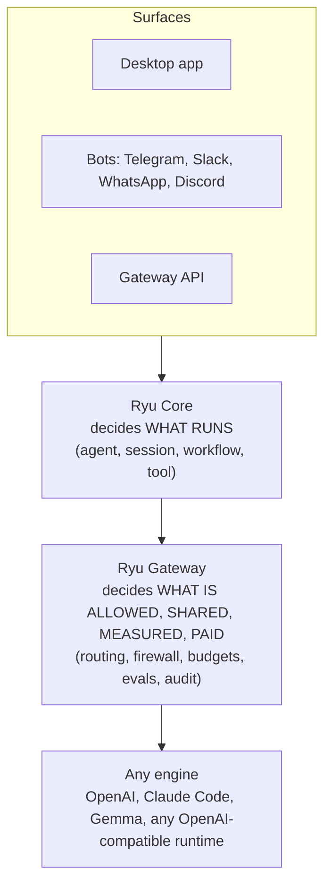

**Agents are powerful. Using them shouldn't be.** That sentence is the whole product.

Many engines can run agents, including OpenAI, Claude Code, Gemma, and other OpenAI-compatible
runtimes (services that use the OpenAI API format). Ryu is not another engine. Ryu adds controls
around the engine. It decides what an agent can reach, which tools it can use, what data is safe to
send, what it costs, and how good its output is.

## Why a control layer?

A raw engine is an engine block on a stand. It runs, but you cannot drive it anywhere. To get real
work done you need the rest of the car around it. In Ryu that car has three big pieces.

- **Core** decides **what runs**, including which agent, session, workflow, and tool.
- **Gateway** decides **what is allowed, shared, measured, and paid for**, including routing,
  firewall, budgets, evals, and audit.
- **Any engine** does the actual generation, and you are never locked to one.

Every model call follows the same path: a client sends the request to Core, Core decides what runs,
and the Gateway checks the call before it reaches an engine.

You will meet Core and the Gateway properly in later courses. For now, hold one idea - Ryu sits
**above** every model and every harness, so you are locked to none of them.

## Surfaces and layers, one Ryu system

Ryu shows up differently depending on the job you need to do.

- **Ryu Bot** - The fully managed consumer surface for everyday work. Account in, task in, result back.
- **Ryu Console** - The power-user and admin desktop surface for configuring and operating a Ryu node.
- **Ryu Platform** - The developer layer: SDKs, Core, Gateway, orchestration, routing, and governance.
- **Ryu Apps** - Extensions that add packaged capabilities and interactive surfaces.
- **Ryu Infra** - The deployment choice: Ryu Cloud managed or self-hosted in your environment.

This course follows the **Console** path, because it is the surface that exposes the runtime and
its configuration. Bot hides those controls for people who only need to give AI work.

## Nothing hardcoded

The single rule that runs through everything is this - **nothing is hardcoded, everything is
swappable**. The chat model, the embedding model, the voice and image models, the agent engine, the
retrieval strategy, the sandbox - each one is a sensible default you can replace, never a lock. Ryu
gives you batteries included so it works on install, and an exit ramp from every default so you are
never stuck.

<Callout type="info">
  This is the whole product in one sentence. Other tools own a model and a harness. Ryu sits above all of
  them and locks you to none.
</Callout>

## Knowledge check

First, the reflection prompts. Say the answers out loud or jot them down, in your own words.

- In one sentence, what does Ryu add on top of a raw engine?
- Which Ryu surface are you about to use in this course?
- What does "nothing hardcoded" mean for the model an agent uses?
- Which component decides what runs, and which component decides what is allowed?

Then confirm the details with a quick self-test.

<Quiz
  questions={[
    {
      q: "What is Ryu in relation to the engines that run agents?",
      options: [
        "Another engine that competes with OpenAI and Claude Code",
        "The orchestration and control layer built around any engine",
        "A faster local model you swap your engine for",
      ],
      answer: 1,
      explain:
        "Ryu is not an engine. It is the whole car built around them, the control layer that decides what an agent can reach, use, send, and cost.",
    },
    {
      q: "In Ryu, what does the Gateway decide?",
      options: [
        "Which agent, session, workflow, and tool runs",
        "What is allowed, shared, measured, and paid for",
        "How the engine generates each token",
      ],
      answer: 1,
      explain:
        "Core decides what runs; the Gateway decides what is allowed, shared, measured, and paid for, including routing, firewall, budgets, evals, and audit.",
    },
    {
      q: "Which Ryu surface is this course about?",
      options: [
        "Ryu Bot",
        "Ryu Console",
        "Ryu Platform",
      ],
      answer: 1,
      explain:
        "This course follows Ryu Console because it is the surface that exposes the runtime and its configuration.",
    },
    {
      q: "What does \"nothing hardcoded\" mean for the model an agent uses?",
      options: [
        "The default model can never be changed once installed",
        "Every default, including the chat model, is swappable and never a lock",
        "Ryu picks the model for you based on the cloud",
      ],
      answer: 1,
      explain:
        "Nothing is hardcoded and everything is swappable. Each default is a sensible choice you can replace, never a lock.",
    },
    {
      q: "How is responsibility split between Core and the Gateway?",
      options: [
        "Core decides what runs; the Gateway decides what is allowed, shared, measured, and paid for",
        "The Gateway runs agents and Core only stores settings",
        "Both components perform the same work from a shared config file",
      ],
      answer: 0,
      explain:
        "Core owns sessions, agents, workflows, and tools. The Gateway owns policy around their model and tool calls.",
    },
    {
      q: "What path does a model call follow through Ryu?",
      options: [
        "A surface sends it directly to an engine, which reports back to Core",
        "A surface hands it to Core, Core hands it to the Gateway, and the Gateway governs it before an engine",
        "The Gateway chooses a surface, then Core downloads an engine",
      ],
      answer: 1,
      explain:
        "Every model call moves from a surface to Core, then through the Gateway before it reaches the selected engine.",
    },
    {
      q: "Which Ryu layer is the developer entry point for building products?",
      options: ["Ryu Bot", "Ryu Console", "Ryu Platform"],
      answer: 2,
      explain:
        "Ryu Platform is the developer layer. SDKs connect products to Core and Gateway, while Infra determines where the node runs.",
    },
    {
      q: "What job belongs to the engine in Ryu's three-part model?",
      options: [
        "Deciding which workflow runs",
        "Enforcing budgets and audit policy",
        "Performing the actual generation",
      ],
      answer: 2,
      explain:
        "Core decides what runs, the Gateway governs the call, and the engine performs the actual generation.",
    },
  ]}
/>

Ready to install? Continue to [Install and first run](/docs/learn/academy/essentials/install-and-setup).
