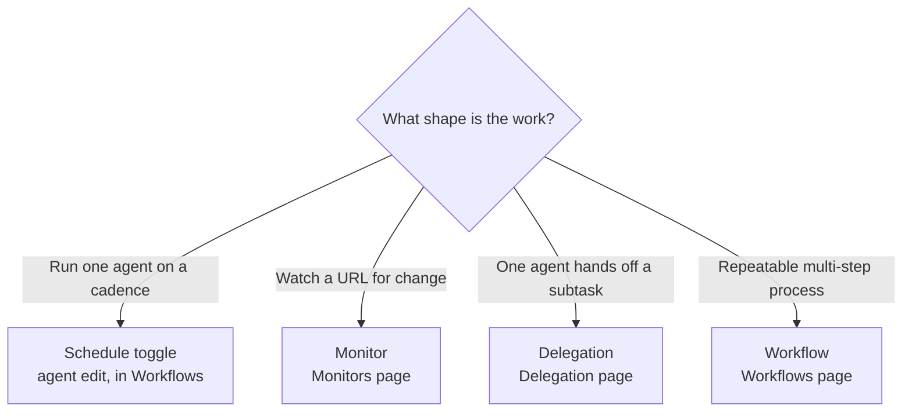

So far every action has been something you triggered by hand. This lesson is about getting Ryu to act without you in the loop. There are four tools for it, each suited to a different shape of work.

## Scheduled runs

<TryInRyu page="automations">Open Workflows in Ryu</TryInRyu>

Ryu can run an agent on a recurring schedule. Open the agent's edit page and use **Triggers →
Routines** to add a cron or interval routine. Each routine records its runs and can either start a
new durable chat every time or append to one persistent existing chat. The routine can also ask for
approval before each firing. Automations merged into Workflows, so the scheduler still lives there,
but agent routines are now directly editable from the agent surface.

Open **Calendar → Agenda** to review the list view. Its status-page overview starts with one global
24-hour strip for all scheduled jobs, then shows one strip per job with the job name, schedule, run
count, and current status. Green marks completed runs, red marks failures, and amber marks projected
scheduled runs. The chronological rows below keep each run's details readable.

The agent editor's **Run history** view links automated rows to their persistent transcripts. Use
**Run now** from **Routines** to test the saved target immediately; the result is written to the same
routine history as an automatic firing.

Only **Active** agents can be scheduled or used by a workflow, channel, or delegated run. New agents
start in **Trial**, where you can test them manually with read-only and preview behavior. If an
Active agent is moved back to Trial or Draft, Ryu disables its owned schedules without deleting the
schedule definition. Promote it again and review the schedule before enabling it.

Each schedule has an **Ask before each run** choice. Leave it off when the work is safe to run
automatically. Turn it on when you want a person to review every firing: when the time arrives, Ryu
creates one approval in the **Inbox** and waits there. It does not open a dialog that blocks the
desktop, and it does not run that firing until someone approves it. If the approval is left pending,
Ryu does not create duplicate approval cards for the same schedule tick.

This is the same distinction you should use for background work generally: configure the schedule
once, then let safe work run unattended. Approval is a queued decision for a person who is available
later, not a request for someone to be watching the clock.

## Monitors

The **Monitors** page watches a URL on a schedule and alerts you when something changes. You can monitor for:

- Price changes.
- Content diffs.
- Stock availability.
- Keyword presence or absence.
- Uptime.

The key behavior is that a monitor alerts only on a transition into the alert state, so you are not spammed every interval. You hear about it when something actually changes, then again only when it changes back.

When an alert fires, it fans out across:

- Desktop toast.
- Native OS notification.
- Mobile push.
- A per-monitor webhook (Slack or Discord).
- Telegram.

<Callout type="info">
  Pick the smallest check that captures what you care about. A keyword check on a single phrase is cheaper and quieter than a full content diff of the whole page.
</Callout>

## Delegation

Sub-agent delegation, on the **Delegation** page, lets one agent hand work to another. This is how a coordinating agent can pass a focused subtask to a specialist agent rather than doing everything itself.

## Workflows

Workflows, on the **Workflows** page, are multi-step DAGs (directed graphs of steps). A workflow can call tools and agents as steps, chaining them into a repeatable process.

Workflows also support human-in-the-loop resume. When a run reaches a point where it is awaiting input, it pauses and waits for you to provide what it needs, then continues.

<Callout type="warn">
  A workflow that is awaiting input is paused, not failed. Check the run and supply the requested input to let it continue.
</Callout>

## Choosing the right tool

- Recurring run of one agent - use **Triggers → Routines** on the agent's edit page (the schedules still run through Core's scheduler).
- Watch an external page for change - use a Monitor.
- One agent passing a subtask to another - use Delegation.
- A repeatable multi-step process across tools and agents - use a Workflow.

## Knowledge check

First, the reflection prompts. Answer them in your own words.

- Why does a monitor only alert on a transition rather than every interval?
- Name three places a monitor alert can be delivered.
- What does it mean for a workflow run to be "awaiting input"?

Then confirm the details with a quick self-test.

<Quiz
  questions={[
    {
      q: "Why does a monitor alert only on a transition into the alert state?",
      options: [
        "To save bandwidth on the URL fetch",
        "So you are not spammed every interval, only when something actually changes",
        "Because monitors run only once per day",
      ],
      answer: 1,
      explain:
        "A monitor alerts only on a transition into the alert state, so you hear about it when something changes, not every interval.",
    },
    {
      q: "Which of these can a monitor alert fan out to?",
      options: [
        "Only a desktop toast",
        "Desktop toast, native notification, mobile push, a webhook, and Telegram",
        "Email only",
      ],
      answer: 1,
      explain:
        "When an alert fires it fans out across desktop toast, native OS notification, mobile push, a per-monitor webhook, and Telegram.",
    },
    {
      q: "What does it mean for a workflow run to be awaiting input?",
      options: [
        "The run has failed and must be restarted",
        "The run is paused, waiting for you to provide what it needs before it continues",
        "The run is finished and saving output",
      ],
      answer: 1,
      explain:
        "An awaiting-input workflow run is paused, not failed. Supply the requested input and it continues.",
    },
    {
      q: "Which tool fits one agent passing a focused subtask to another?",
      options: [
        "A Monitor",
        "Delegation",
        "The scheduler",
      ],
      answer: 1,
      explain:
        "Sub-agent delegation lets one agent hand a focused subtask to a specialist agent rather than doing everything itself.",
    },
    {
      q: "What does an agent routine let you choose for its transcript?",
      options: [
        "A new chat every run or one persistent existing chat",
        "Only a new copy of the agent",
        "Only a monitor that watches the agent's chat page",
      ],
      answer: 0,
      explain:
        "A routine can create a durable transcript per firing or append every firing to one persistent chat.",
    },
    {
      q: "What happens when Ask before each run is enabled?",
      options: [
        "Ryu blocks the desktop with a dialog at every scheduled time",
        "Ryu creates one Inbox approval for the firing and waits without duplicating it",
        "The schedule runs first and asks for approval afterward",
      ],
      answer: 1,
      explain:
        "The scheduled firing waits on a queued Inbox approval. A pending decision does not create duplicate approval cards for the same tick.",
    },
  ]}
/>

Next: govern all of this - routing, guardrails, budgets, and audit - in the [Governing Ryu](/docs/learn/academy/governing) track.
