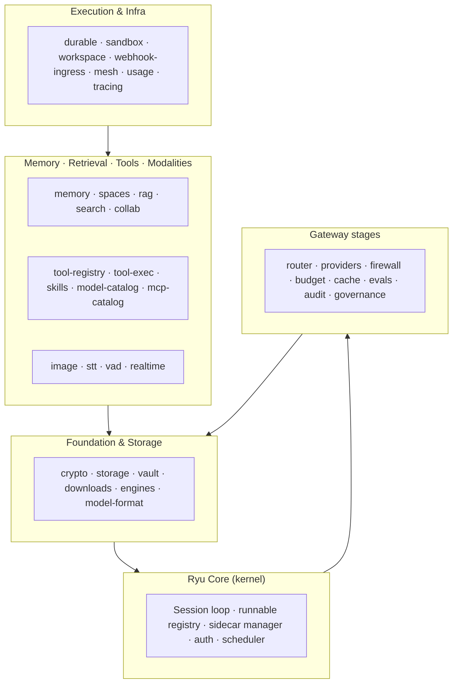

Ryu is not another agent — it's the infrastructure layer underneath the AI tooling
ecosystem. The layers every team rebuilds over and over again — **agents, memory, RAG,
model routing, sandboxes, voice, tools** — are not features bolted onto a monolith.
They are **primitives**: self-contained, swappable packages with a real interface, that
Core assembles at boot and that you can reuse, replace, or build on top of.

This realm is the map. Every primitive has its own page. The pages are grouped by what
the primitive is for, and each page tells you what the primitive does, the seam it swaps
behind, and where it lives.

## The idea

The one design rule that made this possible: *if code decides what runs — which agent,
session, workflow, tool — it is Core. If it decides what is allowed, shared, measured,
or paid for, it is the Gateway.* Everything below the kernel is a **swappable default,
never a lock**:

- **Every primitive fronts a trait or registry seam.** The concrete provider — local or
  cloud, in-process or sidecar — is chosen by name at boot. Swap the chat model, the
  embedder, the reranker, the sandbox backend, or the durable-execution engine without
  touching the code that uses it.
- **Primitives are assembled into apps.** An *app* ships a full surface (an
  out-of-process sidecar plus a companion UI) built on pre-built primitives. A *plugin*
  extends capabilities with net-new logic that runs inside the platform. See
  [Plugins vs Apps](/docs/develop/extensions/plugins-vs-apps).
- **Local AI is a primitive too.** The whole local stack — llama.cpp engine, embeddings,
  TTS/STT/VAD, image generation — is exposed through the same registry as cloud
  providers, so "local-first" is just a default you can swap.

## The layers at a glance

The full dependency DAG and the canonical layer model live in
[Capability Layers](/docs/start-here/architecture/capability-layers).

## Browse by category

- **Foundation** — the crypto, storage, and vault primitives everything else stands on.
  [crypto](/docs/primitives/crypto) · [storage](/docs/primitives/storage) ·
  [vault](/docs/primitives/vault) · [downloads](/docs/primitives/downloads) ·
  [engines](/docs/primitives/engines) · [model-format](/docs/primitives/model-format)
- **Memory & Retrieval** — durable memory, spaces, RAG, search, knowledge, collab.
  [memory](/docs/primitives/memory) · [spaces](/docs/primitives/spaces) ·
  [rag](/docs/primitives/rag) · [search](/docs/primitives/search) ·
  [knowledge](/docs/primitives/knowledge) · [collab](/docs/primitives/collab)
- **Tools & Skills** — the unified tool catalog, code-execution sandbox, model/MCP/skills
  catalogs, and the Composio seam. [tool-registry](/docs/primitives/tool-registry) ·
  [tool-exec](/docs/primitives/tool-exec) · [model-catalog](/docs/primitives/model-catalog) ·
  [mcp-catalog](/docs/primitives/mcp-catalog) · [skills](/docs/primitives/skills) ·
  [composio](/docs/primitives/composio)
- **Modalities** — image generation, speech, voice activity, realtime fan-out.
  [image](/docs/primitives/image) · [stt](/docs/primitives/stt) ·
  [vad](/docs/primitives/vad) · [realtime](/docs/primitives/realtime)
- **Execution & Infra** — durable execution, sandboxing, workspace, webhooks, mesh, usage,
  tracing, activity, email, notifications. [durable](/docs/primitives/durable) ·
  [sandbox](/docs/primitives/sandbox) · [workspace](/docs/primitives/workspace) ·
  [webhook-ingress](/docs/primitives/webhook-ingress) · [mesh](/docs/primitives/mesh) ·
  [usage](/docs/primitives/usage) · [tracing](/docs/primitives/tracing) ·
  [activity](/docs/primitives/activity) · [email-send](/docs/primitives/email-send) ·
  [notify](/docs/primitives/notify)
- **Feature capabilities** — the extracted products: hardware protocol, predictive typing,
  code evaluation, continual learning, output styles, app events.
- **Contracts** — the pure-data wire contracts shared across packages and processes.
- **Gateway stages** — the detection/decision engines behind the control layer: routing,
  providers, firewall, budgets, caching, evals, audit, governance, passthrough, channels.
- **Desktop automation** — screen perception, synthetic input, and capture for Ghost and
  Shadow.
- **SDK & bindings** — the SDK kernel and its C, Node, Python, Swift, Kotlin, and C#
  bindings.

## How primitives swap

Every primitive is consumed through a seam — a trait, a registry, or a constructor that
takes its dependencies. The pattern is the same across all of them:

1. **The crate is dependency-free from `apps/core`.** Kernel couplings invert through a
   narrow `*Host` trait (e.g. `SandboxHost`, `CryptoHost`, `RagHost`) that Core installs at
   boot.
2. **The concrete provider is chosen by name.** A backend registry maps a string id to an
   implementation — `select_backend`, `CredentialSourceRegistry`, `BudgetBackend`, and so
   on. Local defaults ship; cloud backends are opt-in swaps.
3. **Hot primitives run in-process.** Per-frame or per-request primitives (VAD, rate-limit,
   circuit-breaker) are never IPC-bound. Long-running or untrusted work moves to an
   out-of-process sidecar.

## Building on primitives

- The TypeScript side of the story — composable primitive clients (`rag`, `memory`, `tts`,
  `stt`, `image`, `durable`, `realtime`, `engines`) — lives in the
  [SDK](/docs/develop/sdk) and [SDK Primitives](/docs/develop/sdk/primitives).
- Apps built on primitives ship through the
  [marketplace](/docs/develop/extensions/marketplace); see
  [Plugins vs Apps](/docs/develop/extensions/plugins-vs-apps) for when to build which.
- For how the kernel assembles these at boot, see
  [Core vs Gateway](/docs/start-here/architecture/core-vs-gateway) and
  [Capability Layers](/docs/start-here/architecture/capability-layers).

## Related

<Cards>
  <DocCard href="/docs/start-here/architecture/capability-layers" />
  <DocCard href="/docs/start-here/architecture/core-vs-gateway" />
  <DocCard href="/docs/develop/sdk/primitives" />
  <DocCard href="/docs/develop/extensions/plugins-vs-apps" />
</Cards>
