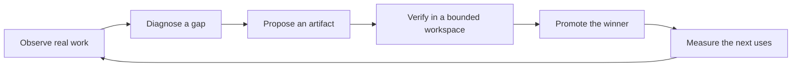

Ryu is most useful when it can improve the way it helps: capture what worked, identify a reusable
pattern, test a change against a baseline, and make the winner available for the next task. We call
that loop **recursive improvement**. RSI is the shorthand for the same idea: the system helps build
the system that builds the next version.

This is an operating model, not a claim that Ryu may rewrite its own security boundary or publish
unreviewed code. A complete loop has an objective, a baseline, bounded experiments, independent
evaluation, provenance, approval, and rollback.

## The loop

The artifact can be a skill, prompt, memory rule, workflow, deterministic tool, app, provider
route, or model adapter. The loop stays the same; only the change surface and proof requirements
get stricter.

## What Ryu already has

| Layer | Current Ryu surface | Role in the loop |
|---|---|---|
| Start | Onboarding activation and recommendations | Get a new node to its first useful task and first feedback signal. |
| Learn | [Learning](/docs/apps/learning) | Capture feedback and experience, then propose reusable skills through approval. |
| Experiment | [Research / Experiments](/docs/apps/research) | Run durable, bounded campaigns, compare variants, keep winners, and record reasoning. |
| Measure | [Evals & Audit](/docs/gateway/evals-audit) | Score behavior, retain attribution, and separate quality evidence from operational health. |
| Compose | [Skills and tools](/docs/learn/academy/operator/skills-and-tools) | Turn a successful procedure into a reusable capability. |
| Build | [Author a Ryu App](/docs/extend/develop/extensions/ryu-apps) | Package a tool and UI using the shared manifest and host contracts. |
| Drive Ryu | [Self-API](/docs/extend/develop/extensions/self-api) | Let an agent inspect and operate Ryu through an explicit, bounded interface. |

These pieces are valuable individually. Full RSI comes from connecting them with one improvement
record and one promotion policy rather than creating a second autonomous platform beside them.

## Start here

<Cards>
  <DocCard href="/docs/rsi/operating-model" />
  <DocCard href="/docs/rsi/learning-loop" />
  <DocCard href="/docs/rsi/experiment-loop" />
  <DocCard href="/docs/rsi/self-building" />
  <DocCard href="/docs/rsi/guardrails" />
  <DocCard href="/docs/rsi/roadmap" />
</Cards>

## The definition of done

Ryu has a real RSI loop when it can answer these questions for every promoted change:

1. What user or system objective was being improved?
2. What baseline was measured, on which fixed task set or trace sample?
3. What changed, and who or what proposed it?
4. Which tests, evaluators, policy checks, and browser or host checks ran?
5. Why was this candidate promoted, and what is the rollback target?
6. Did the next uses improve without violating privacy, security, cost, latency, or reliability limits?

If one of these answers is missing, the system has automation, not a trustworthy self-improvement
loop.
