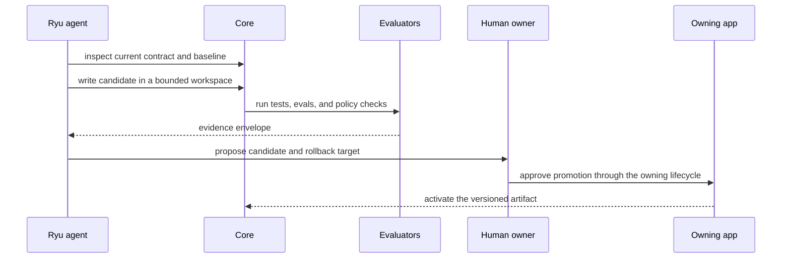

Ryu already has the pieces needed for an agent to operate on Ryu: an agent-facing
[Self-API](/docs/extend/develop/extensions/self-api), shared app and plugin contracts, and an
authoring path for [Ryu Apps](/docs/extend/develop/extensions/ryu-apps). The goal is to make that
capability useful without making “the model wrote some files” equivalent to “Ryu shipped code.”

## The capability ladder

Move up one rung only when the lower rung has reliable proof:

| Level | Artifact | Minimum gate |
|---|---|---|
| 1 | Skill or prompt | Human review, provenance, regression task set, and reversible activation. |
| 2 | Workflow or agent configuration | Schema validation, bounded execution, budget, approval, and replay. |
| 3 | Deterministic tool | Pure-input contract, case table, deny-all sandbox, repeatability, and install gate. |
| 4 | Companion or Ryu App | Valid manifest, self-contained UI bundle, shared primitives, bridge contract, and rendered proof. |
| 5 | Sidecar or service | Typed boundary, auth, lifecycle, migration, resource limits, integration tests, and operational owner. |
| 6 | Core, Gateway, security, or release behavior | Human-owned change, full repository gates, security review, and explicit release decision. |

The ladder is intentionally conservative. It lets Ryu build more of the product while keeping the
most consequential authority outside an unattended model loop.

## The self-building loop

For a new app, the practical sequence is: describe the domain, reuse the Ryu App shell and controls,
declare the manifest, build a single self-contained UI, test the bridge and states, run a real host
proof, and only then install or publish it. The [app reuse standard](/docs/extend/develop/extensions/app-reuse-standard)
defines the ownership and host-consistency rules.

## Build the tools Ryu needs

The most valuable self-built tools are not arbitrary code generators. They are small, testable
capabilities that make the next improvement loop cheaper and more trustworthy:

- **Task-set builder:** turn a real failure or repeated request into a redacted replay case.
- **Baseline runner:** run the current artifact against the same task and guardrail sets.
- **Evidence packer:** attach diffs, test results, scores, screenshots, and rollback information.
- **Regression miner:** find a representative case when a change breaks a prior task.
- **App contract checker:** validate manifests, capability declarations, shared UI usage, and bundle shape.
- **Release assistant:** prepare notes and checklists while leaving publication and signing to the owner.
- **Doctor:** explain an unavailable provider, sidecar, grant, or dependency without fabricating success.

These tools create leverage across every future app. Each should have a narrow input schema, bounded
side effects, deterministic cases where possible, and an explicit owner.

## What Ryu must not self-approve

An agent may propose a change to Ryu, but it must not be the sole authority that:

- grants itself access to credentials, identity, or another tenant;
- loosens Gateway policy, firewall, budgets, or approval requirements;
- changes the trust boundary or sandbox;
- promotes code that has not passed its declared tests and host proof;
- publishes a package, release, or mirror without the owning release decision; or
- deletes the evidence or rollback target for an earlier change.

The [platform consistency contract](/docs/start-here/architecture/platform-consistency) and
[security documentation](/docs/security) remain the authority for these boundaries.

## Dogfood the product honestly

“Ryu uses Ryu to build Ryu” should mean an auditable workflow, not a slogan:

1. A Ryu task creates or selects a Research campaign.
2. The agent uses existing Self-API and build tools to inspect the current product.
3. The candidate is written in a bounded workspace with a clear diff.
4. Tests, evals, contract checks, and rendered proof run against a baseline.
5. A human reviews the evidence and promotes the candidate through the owning app or repository.
6. The result is linked back to the campaign and becomes a new baseline only after activation.

That process can improve Ryu itself immediately while keeping Core and Gateway changes reviewable.
