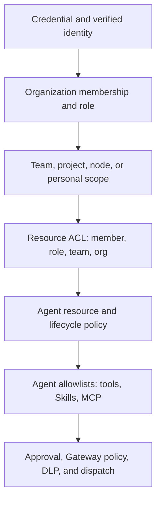

Ryu does not use one undifferentiated permission ladder. It has two related cascades that meet at the node and agent runtime:

1. **Authorization** decides whether a caller may reach a node, resource, or action.
2. **Managed availability** decides which content a node should have and which agents, Skills, or MCP servers may be used there.

The narrowest effective rule wins in both systems, except that a locked broader managed assignment cannot be replaced by a narrower one. A successful check at one layer never skips the layers below it.



## The scopes

| Scope | Authority | What it controls | Important boundary |
|---|---|---|---|
| Platform | Ryu release and plan gates | Whether a feature exists at all | An organization cannot enable a capability that the platform has not released or the plan does not provide. |
| Organization | Better Auth membership plus the control plane | Members, built-in/custom roles, organization feature defaults, Fleet baseline, billing, audit | Membership is not permission to use every node or resource. |
| Team | Better Auth team membership plus control-plane grants | Team-scoped roles, node enrollment, Fleet team assignments, team projects | A team grant does not widen into another team, personal scope, or organization scope. |
| Project | Organization project plus the node's local project mapping | Fleet project assignments and project-scoped rules | A local folder is mapped to a project on that node; its filesystem path is not sent to the control plane. |
| Node | Core/Gateway and the managed-node enrollment | The machine's bearer boundary, node ACL, local MCP registration, app lifecycle, node firewall, and signed desired state | A node policy is machine-wide. It is not automatically a user or agent grant. |
| User | Verified user identity and, for Fleet, the personal-node owner | Member-specific ACL overwrites, user-scoped Fleet assignments on a personal node, owned conversations and vault context | A user JWT identifies the caller; it does not bypass the node credential or resource ACL. |
| Agent | Core's persisted agent card and its exact resource ACL | Versioned definition, lifecycle, safety posture, model slots, persona, instructions, tools, Skills, memory, and policy bindings | The agent card narrows capability. It cannot grant a caller access the caller does not have. |
| Capability/action | Core registry plus Gateway policy | An individual MCP tool, Skill load, Space/conversation operation, app action, approval, DLP, and audit | Discovery is not a grant; the final dispatch check is authoritative. |

## Managed availability cascade

Managed content is resolved for each enrolled node in this order:

```text
organization → team → project → user
```

The control plane resolves the applicable assignment and sends a signed node snapshot. At one scope, `blocked` beats `required`, and `required` beats `optional`. A locked organization or team assignment prevents a narrower assignment from replacing it.

The assignment dispositions mean:

| Disposition | Apps, plugins, MCP, and Skills | Agents |
|---|---|---|
| Required | Install the pinned artifact and apply its declared activation/configuration | Require the referenced stable agent id to be present on the node; the agent definition and its history remain Core-owned. |
| Optional | Mark the artifact as an approved choice without installing it | Allow the referenced stable agent id without making it the default. |
| Blocked | Disable it and remove it from runtime discovery while preserving local data | Hide the agent, prevent its runtime entry and tool calls, and preserve its definition for an administrator to review or unblock. |

With no `agent` assignments, local behavior is unchanged. Once an administrator assigns one or more agent artifacts, those non-blocked agent ids form the node's available set; unassigned agents are not discoverable. Use the exact stable id from Core when authoring an agent artifact. A published agent template is installed explicitly first, then can be placed under Fleet availability policy.

This is separate from the per-agent allowlists:

- `AgentRecord.tools` narrows the MCP/tool ids that one agent can see and call. An explicit empty list means no tools; the default `*` means unrestricted current registry tools.
- `AgentRecord.skills` narrows the installed, active Skills that one agent can receive. A Skill disabled by Fleet cannot be re-enabled by an agent allowlist.
- An MCP server registered in Core is node-wide configuration. Fleet can block its server id; `gateway.configure` is required to register, update, or remove it.

On a shared organization node, a `user` Fleet assignment means the node's personal owner context. It is not a way for an arbitrary request body to select another user's assignment. Request-level identity and resource ACLs handle shared-node user access.

## Authorization and resource ACL cascade

Core evaluates an organization-bound request in this order:

1. Verify the node bearer, paired credential, delegation, or managed user JWT.
2. Resolve the caller's organization, team, personal-owner, and node scope.
3. Check the route's `resource.action` permission, such as `agent.view`, `agent.run`, or `gateway.configure`.
4. Check the target resource ACL, if the route names a resource.
5. Apply capability allowlists, lifecycle/safety/approval policy, Gateway firewall/DLP, and the final dispatch guard.

Resource ACL overwrites resolve from most specific to least specific:

```text
member → role → team → organization
```

The first matching tier decides. Within one tier, deny beats allow. A member exception can therefore override a role or team decision, but a valid agent ACL cannot override a node-scope denial.

The current resource kinds are served by `GET /api/acl/principals` and include Spaces, conversations, agents, workflows, and nodes. Agents use their exact id for `agent.view`, `agent.run`, `agent.edit`, and `agent.delete`; the collection is filtered through the same exact-agent ACL so a denied agent is not leaked by the picker. Skills and MCP servers are currently capability resources rather than independent ACL kinds: use Fleet block/availability, the agent allowlist, node MCP administration, and the Gateway action policy at their respective layers.

## Agent definitions and versions

An agent's definition is not the same object as a Fleet assignment. Core stores the full agent card and appends immutable source-history checkpoints when it is created or saved. The **Versions** tab and the agent version API can compare and restore the complete definition, including model slots, safety, tools, Skills, memory, persona, policy, and instructions. Restore is still an `agent.edit` action and is rejected for a locked agent or an invalid lifecycle transition.

Runs, transcripts, credentials, provider state, schedules, and plugin-owned preferences are not part of an agent configuration revision. This separation lets a regression test restore the exact behavior contract without rewinding operational history or secrets.

The [agent guide](/docs/surfaces/desktop/user-guide/agents) covers the editor and version workflow. [Managed fleet configuration](/docs/core/managed-fleet) covers signed desired state and Fleet assignments. [Permissions and roles](/docs/security/permissions) covers the shared permission vocabulary and handler gates.

<Callout type="warn">
Availability and authorization are intentionally separate. A Fleet assignment can make an agent or capability unavailable on a node, but it does not grant a member `agent.run`, a Skill access to a tool, or a caller access to another user's Space. Every runtime call still returns to Core and Gateway for the narrower checks.
</Callout>
