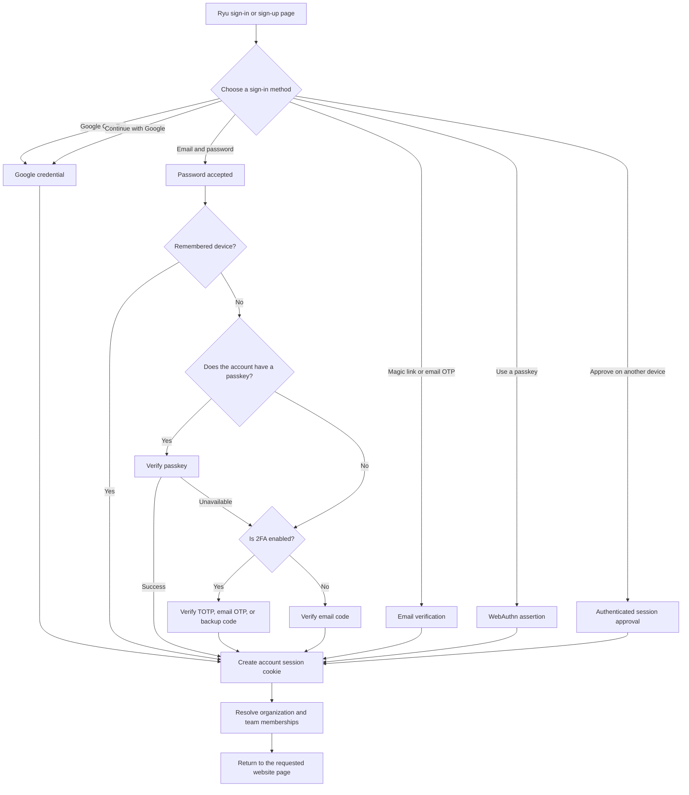

Part of the [Authentication and pairing](/docs/security/authentication-and-pairing) guide.

## 1. Website account sign-in

The website is the only place where Google One Tap is shown. It is a convenience around the normal
Better Auth account flow, not a separate identity system. The same account-linking, waitlist,
organization-provisioning, and session rules apply to the normal Google button, email/password,
magic link, email OTP, passkey, One Tap, and **Approve on another device**.

### Approve on another device

The website owns the account email field for this flow. Desktop, mobile, the browser extension, and
CLI keep their sign-in surfaces compact: they open the website and show a short approval code rather
than asking the user to enter an email again. Enter the email on the website, choose **Approve on
another device**, and Ryu sends a live approval request to the user's already signed-in website,
desktop, extension, or mobile session. The requester receives a one-time session grant after an
authenticated session approves the matching code. A browser redemption becomes the normal HttpOnly
website cookie; native and desktop clients keep their bearer in protected local storage.

If no signed-in session is currently open, the website can still complete the normal sign-in methods,
and the approval-code page remains available for a later retry. Account approval requests are scoped
to the account and expire automatically; approving one does not pair a Core node or grant access to
another account.

The browser app's former **Try Ryu without an account** path is temporarily disabled while the
waitlist is active. New anonymous sign-ins are rejected by the auth server, the browser build does
not render the guest action, and legacy anonymous browser sessions are removed instead of being
admitted as approved accounts. The browser app therefore requires normal account sign-in and the
same server-authoritative waitlist approval used by the website portal. This does not change the
separate public anonymous read-only surfaces documented below.

### Email address policy

Ryu validates email addresses at the Better Auth server boundary. Disposable mailboxes are not
accepted on account sign-up, email sign-in, verification, magic-link, and password-recovery routes.
Existing accounts remain usable, and provider-aware aliases such as Gmail dots or plus tags resolve
to the same normalized identity for email sign-in and recovery. Ryu keeps the address you registered
as the account address; the normalized value is an internal lookup key and is never returned as a
client profile field.

Use a durable mailbox you control if an address is rejected. This policy applies to email
authentication; it does not enable phone-number authentication.

For email-and-password sign-in, Ryu checks enrolled factors in a fixed order after the password is
accepted: **passkey**, then **2FA**, then an **email verification code**. A passkey account is asked
for its passkey even when 2FA is also enabled. If the passkey is unavailable, the user can continue
with 2FA; email is the last fallback when 2FA is not enabled. **Remember this device for 30 days**
is offered on the sign-in form. It is recorded only after a factor succeeds and then suppresses all
three follow-up challenges on that browser until the trust window expires.

The authenticated website portal applies the same boundary to its live `/chat` and `/apps`
surfaces: a valid session is not enough while an account is still waitlisted. The server checks
approval again on every API request, then forwards the caller's signed Better Auth identity to
Core alongside the node admission credential so organization and team policy remains enforced.
If the waitlist control plane cannot answer, protected portal surfaces fail closed; only an
explicitly configured admin account bypasses that control-plane check.

When a browser already has one or more Ryu account sessions, `/login` opens an account chooser
first. Choose an account to return to the requested page, or select **Log in to another account**
to continue through the normal sign-in form. **Create account** opens that same form in sign-up
mode. Each saved account can be removed from the browser after a confirmation step; **Log out of
all accounts** is also confirmed before every browser session is revoked.

One Tap is website-only. App flows do not start a browser prompt automatically: they use explicit
device authorization or an explicitly requested app handoff. Configure the public Google client ID
and authorized JavaScript origins as described in [environment variables](/docs/start-here/environment-variables).
See [Account security](/docs/surfaces/desktop/user-guide/account-security) for passkeys, One Tap,
2FA, and backup-code recovery.

### Password recovery

Forgot-password recovery uses Better Auth's Email OTP flow. Enter your account email on the sign-in
page, then enter the six-digit code sent to your inbox together with your new password. Codes expire
after five minutes; use **Resend code** if the first message does not arrive.

Enterprise organizations also have a **Continue with SSO** path. The employee enters a work email,
Ryu resolves the organization's verified OIDC or SAML provider, and the identity provider completes
the sign-in. Organization admins configure this under **Organizations → Security**; see
[Enterprise SSO and SCIM](/docs/security/enterprise-identity). Directory lifecycle management is a
separate SCIM integration and is not implied by SSO.

### Transactional email coverage

Ryu keeps the current Better Auth email-template vocabulary covered with branded React Email
renderers. The messages are sent only for the matching action, so a sign-in code is never presented
as a password-reset or email-verification code.

| Better Auth template | Ryu behavior |
|---|---|
| `verify-email` | Link sent after account creation to confirm the email address |
| `reset-password` | Compatibility renderer for older password-recovery links |
| `change-email` | New-address confirmation in Ryu's two-address email-change flow |
| `sign-in-otp` | One-time code for passwordless sign-in |
| `verify-email-otp` | One-time code for email verification |
| `reset-password-otp` | One-time code used by the current password-recovery flow |
| `magic-link` | One-click sign-in link |
| `two-factor` | One-time code for a second-factor challenge |
| `invitation` | Organization invitation |
| `application-invite` | Ryu application invitation, including an approved waitlist applicant |
| `delete-account` | Confirmation renderer is ready; self-serve deletion remains disabled until the full Ryu data cascade is enabled |
| `stale-account-user` | Security alert after a sign-in following at least 90 days of inactivity |
| `stale-account-admin` | Informational alert to configured Ryu administrators for the same dormant-account reactivation |

Stale-account alerts include the sign-in time and available device/IP details, and recommend
reviewing sessions if the access was not expected. Ryu never asks you to reply with a password or
one-time code by email. Account deletion is intentionally fail-closed while its cross-surface data-retention
behavior is being finalized; the available confirmation email must not be mistaken for an enabled
deletion endpoint.
