Ryu keeps credentials at the boundary where they are useful. An account session is not a node
credential, a node bearer is not a hardware token, and an MCP (Model Context Protocol) grant is not an organization-wide
permission slip.

This page is the map for every supported authentication journey. Each flow has four questions:

1. **Who proves their identity?**
2. **What credential is issued?**
3. **Which resource enforces it?**
4. **How is it revoked?**

## Credential map

| Credential or policy | Used by | Authorizes | Enforced by |
|---|---|---|---|
| **Account session** | Website, desktop, mobile, CLI, extension | A signed-in Ryu account and its memberships | Better Auth and the Ryu control plane |
| **Anonymous guest session** | Browser app | Temporarily disabled while the waitlist is active | Better Auth guest policy |
| **Device-grant bearer** | Desktop, mobile, CLI, extension fallback | A client session without a browser cookie | Better Auth's device authorization endpoint |
| **App handoff token** | Explicit website → extension or mobile handoff | One exchange for a client session bearer | Better Auth One-Time Token plugin |
| **Node bearer** | Core clients, remote desktop, local MCP bridge | One particular Core node | Core's node-auth and pairing layer |
| **Managed user JWT** | Desktop on an organization-bound managed node | The user's role plus organization, team, or personal-node scope | Core's JWKS verifier and route capabilities |
| **Hardware device token** | Paired Ryu hardware | One hardware device's relay connection | Core's hardware registry and relay |
| **Organization and team policy** | Cloud services and organization-bound nodes | Membership, roles, scopes, entitlements, budgets | Ryu control plane, Core ACLs, and Gateway |
| **Personal access token (classic or fine-grained)** | Scripts, integrations, and service clients | The Ryu capabilities minted onto that token | Better Auth API-key storage plus Ryu resource policy |
| **OAuth app or Ryu App grant** | User-owned OAuth clients or marketplace apps | The consented OAuth scopes or approved app grants | Better Auth OAuth plus Core app permissions |
| **Official MCP grant** | Remote MCP clients | Consented scopes for the official Ryu resource | Better Auth OAuth, hosted MCP, and Core delegation |
| **Plugin provider grant** | A plugin's remote MCP connection | One declared provider resource | Core OAuth broker and Identity Vault |

These credentials are deliberately not interchangeable. Signing in to Ryu does not silently pair a
local node, and pairing a node does not grant access to every organization or every other node. The
MCP endpoint choice and its credential are documented in [Ryu MCP](/docs/extend/mcp).

## The authorization chain

Ryu uses one human identity system and several deliberately separate workload credentials:

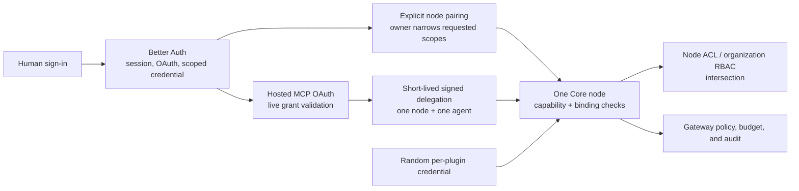

Better Auth is the authority for people, memberships, consented OAuth grants, and scoped credentials. It is
not a universal bearer for Core. A normal account session or OAuth access token cannot directly
control an unbound local or self-hosted node. A direct client must use the node's bearer or pair the
client. For an organization-bound managed node, Core also accepts the short-lived user JWT minted
from the current Better Auth session. A hosted MCP request instead exchanges its live OAuth grant
for a short-lived delegation bound to the exact destination.

Core then applies two independent filters: the credential's capability grant and the destination's
ACL or organization role. Effective access is their intersection. A broad organization role does
not widen a narrow client token, and a broad token does not bypass a node ACL.

### Paired capability bearers

Pairing requests declare scopes, optional identity/resource bindings, and an optional expiry. The
owner sees those values before approval and may remove scopes or shorten the expiry, but cannot
widen the request. New grants are restrictive by default; the node-owner bearer remains a separate
recovery and administration credential.

Core maps protected routes to a positive capability policy. Known read and mutation families use
different capabilities, MCP requests are also checked by JSON-RPC method, and unknown protected
routes fall back to owner-only. Revocation is per paired client, so removing one integration does
not require rotating the node-owner credential.

## 1. Website account sign-in

The website is the only place where Google One Tap is shown. It is a convenience around the normal
Better Auth account flow, not a separate identity system. The same account-linking, waitlist,
organization-provisioning, and session rules apply to the normal Google button, email/password,
magic link, email OTP, passkey, and One Tap.

The browser app's former **Try Ryu without an account** path is temporarily disabled while the
waitlist is active. New anonymous sign-ins are rejected by the auth server, the browser build does
not render the guest action, and legacy anonymous browser sessions are removed instead of being
admitted as approved accounts. The browser app therefore requires normal account sign-in and the
same server-authoritative waitlist approval used by the website portal. This does not change the
separate public anonymous read-only surfaces documented below.

For email-and-password sign-in, Ryu checks enrolled factors in a fixed order after the password is
accepted: **passkey**, then **2FA**, then an **email verification code**. A passkey account is asked
for its passkey even when 2FA is also enabled. If the passkey is unavailable, the user can continue
with 2FA; email is the last fallback when 2FA is not enabled. **Remember this device for 30 days**
is offered on the sign-in form. It is recorded only after a factor succeeds and then suppresses all
three follow-up challenges on that browser until the trust window expires.

The authenticated website portal applies the same boundary to its live `/chat` and `/apps`
surfaces: a valid session is not enough while an account is still waitlisted. The server checks
approval again on every API request, then forwards the caller's signed Better Auth identity to
Core alongside the node admission credential so organization and team policy remains enforced.
If the waitlist control plane cannot answer, protected portal surfaces fail closed; only an
explicitly configured admin account bypasses that control-plane check.

When a browser already has one or more Ryu account sessions, `/login` opens an account chooser
first. Choose an account to return to the requested page, or select **Log in to another account**
to continue through the normal sign-in form. **Create account** opens that same form in sign-up
mode. Each saved account can be removed from the browser after a confirmation step; **Log out of
all accounts** is also confirmed before every browser session is revoked.

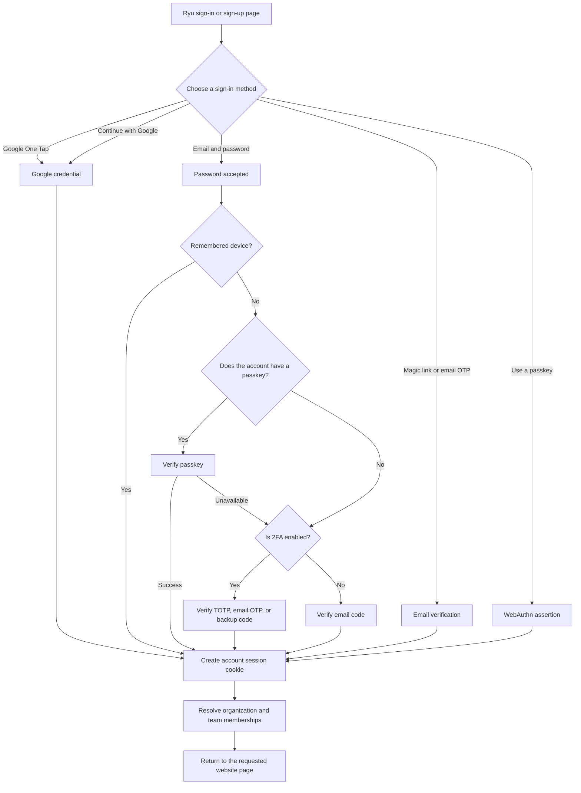

One Tap is website-only. App flows do not start a browser prompt automatically: they use explicit
device authorization or an explicitly requested app handoff. Configure the public Google client ID
and authorized JavaScript origins as described in [environment variables](/docs/start-here/environment-variables).
See [Account security](/docs/surfaces/desktop/user-guide/account-security) for passkeys, One Tap,
2FA, and backup-code recovery.

Enterprise organizations also have a **Continue with SSO** path. The employee enters a work email,
Ryu resolves the organization's verified OIDC or SAML provider, and the identity provider completes
the sign-in. Organization admins configure this under **Organizations → Security**; see
[Enterprise SSO and SCIM](/docs/security/enterprise-identity). Directory lifecycle management is a
separate SCIM integration and is not implied by SSO.

### Transactional email coverage

Ryu keeps the current Better Auth email-template vocabulary covered with branded React Email
renderers. The messages are sent only for the matching action, so a sign-in code is never presented
as a password-reset or email-verification code.

| Better Auth template | Ryu behavior |
|---|---|
| `verify-email` | Link sent after account creation to confirm the email address |
| `reset-password` | Link sent from password recovery |
| `change-email` | New-address confirmation in Ryu's two-address email-change flow |
| `sign-in-otp` | One-time code for passwordless sign-in |
| `verify-email-otp` | One-time code for email verification |
| `reset-password-otp` | One-time code for password recovery |
| `magic-link` | One-click sign-in link |
| `two-factor` | One-time code for a second-factor challenge |
| `invitation` | Organization invitation |
| `application-invite` | Ryu application invitation, including an approved waitlist applicant |
| `delete-account` | Confirmation renderer is ready; self-serve deletion remains disabled until the full Ryu data cascade is enabled |
| `stale-account-user` | Security alert after a sign-in following at least 90 days of inactivity |
| `stale-account-admin` | Informational alert to configured Ryu administrators for the same dormant-account reactivation |

Stale-account alerts include the sign-in time and available device/IP details, and recommend
reviewing sessions if the access was not expected. Ryu never asks for a password or one-time code
by email. Account deletion is intentionally fail-closed while its cross-surface data-retention
behavior is being finalized; the available confirmation email must not be mistaken for an enabled
deletion endpoint.

## 2. Device authorization for desktop, mobile, CLI, and extension fallback

Device authorization is the shared sign-in path for clients that cannot use the website's cookie.
The desktop, MCP bridge, and extension can call the Ryu auth service directly. Mobile can start the
same flow through its connected Core node. In every case, the browser is where the human signs in
and approves the client; the client polls for its own bearer and stores it locally. This bearer
identifies the user to Better Auth. It does not replace the node bearer used by direct Core MCP.
Desktop may then exchange that signed-in session for the short-lived managed
`userJwt` returned by the control-plane node list; that derived credential is a
separate, scope-checked managed-node path.

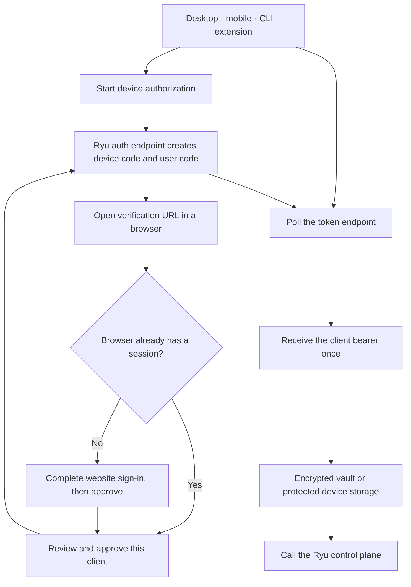

The device bearer identifies the client session. It is not the Core node bearer. Signing out or
revoking the session stops future control-plane calls, while removing a paired node client is the
separate action that stops access to that node.

## 3. Browser extension auto-authentication

The extension's primary sign-in button opens the website with an explicit extension app flow. If
the browser already has a valid session, the website skips another login and asks Better Auth for a
short-lived One-Time Token (OTT). If it does not, the user signs in once in the browser and the same
handoff continues.

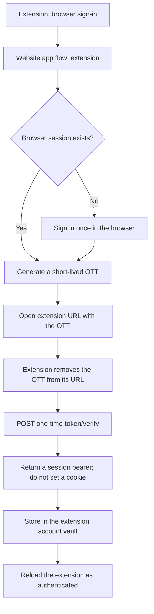

The OTT is single-use, expires after a short window, and is stored hashed by the server. The raw
session bearer is not placed in the extension URL. If browser handoff is unavailable, **Use an
approval code instead** runs the device-authorization flow.

The OTT is implemented by Better Auth's [One-Time Token plugin](https://better-auth.com/docs/plugins/one-time-token).

## 4. Explicit mobile web handoff

Mobile's normal sign-in remains device authorization. The native app also understands an explicit
`ryu://auth/callback` handoff when a web flow is opened for the mobile app. This is useful when a
browser session already exists and the user wants to bring it into the app without typing credentials
again.

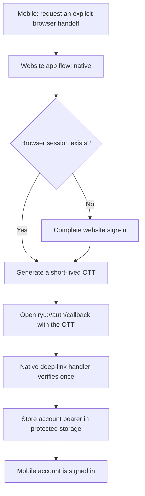

This is a session handoff, not hardware pairing. A mobile hardware flow still uses the device
nonce and per-device token below.

## 5. Core node pairing

Node pairing is intentionally owned by Core rather than Better Auth. It works locally and can work
without an account or network round trip. A client that cannot read the node's own token requests a
short-lived pairing code; an already-authenticated client approves or denies the human-visible code.

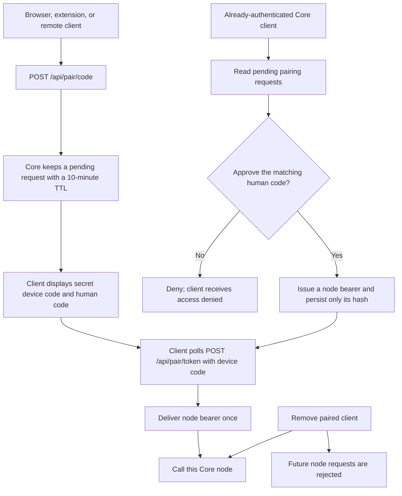

Approval is itself authenticated. Pairing lets a trusted client vouch for another client; it does
not turn an unauthenticated request into an organization grant. Revoking the paired client removes
the node credential without changing the user's cloud account session.

## 6. Hardware QR and BLE pairing

Hardware pairing uses a device-specific nonce, not an account OTT. The mobile app must already have
node access to register the hardware. Core validates the nonce, returns a per-device token, and the
app provisions that token over the authenticated BLE setup channel.

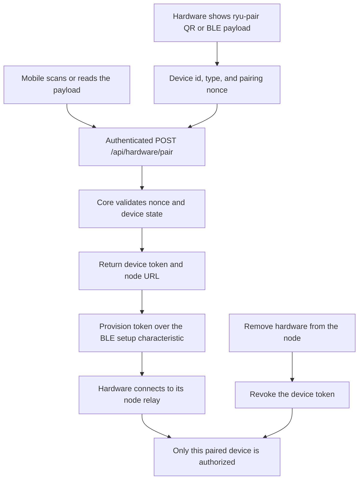

An account session, device-grant bearer, or app OTT must never be substituted for the hardware
device token. The device token can be revoked without signing the user out everywhere.

## 7. Choosing an MCP authentication boundary

Ryu has several MCP-shaped surfaces. They do not all need the same credential.

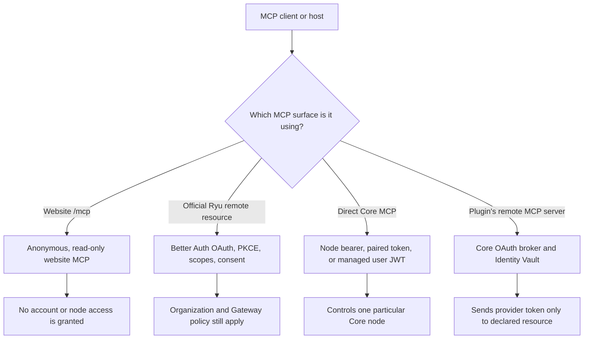

The public website MCP endpoint is intentionally anonymous and read-only. It is not the official
Ryu control plane and does not grant account or node access.

## 8. Official Ryu MCP OAuth

The official server-side MCP authorization service is the right place for a remote MCP client that
needs consented access to protected Ryu resources. The client discovers the authorization metadata,
uses PKCE, obtains user consent, and receives a scoped access token.

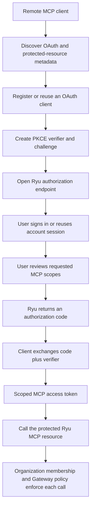

For a local or self-hosted direct Core MCP connection, use that node's bearer
or pairing flow. For a managed node selected by Desktop, Core accepts the
short-lived managed `userJwt` after checking organization, team, or personal
ownership. External MCP hosts should use this OAuth path; the hosted service
exchanges the grant for a short-lived exact-node delegation and does not forward
the original OAuth token to Core. See [MCP security](/docs/extend/mcp/security)
and the [Better Auth MCP plugin documentation](https://better-auth.com/docs/plugins/mcp).

## 9. Plugin remote MCP OAuth

When a plugin connects to another company's remote MCP server, the provider credential belongs to
that provider connection, not to the Ryu account session and not to the node bearer.

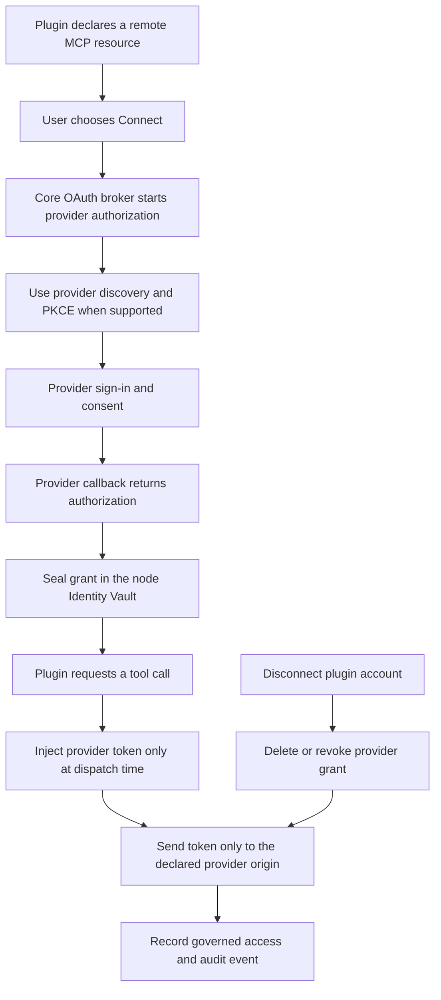

The model never receives the provider token. Removing the plugin connection revokes this provider
grant; it does not sign the user out of Ryu or revoke unrelated node clients.

## 10. Organization and resource enforcement

Authentication answers **who is calling**. Authorization answers **what that caller may do here**.
Every protected request continues through the relevant resource and policy layers after a token is
validated.

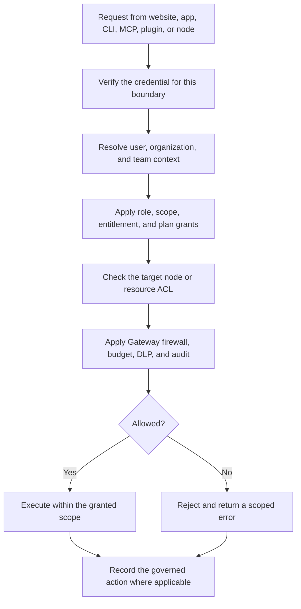

An organization membership does not automatically authorize every node. A team role or MCP scope
must still be usable on the requested resource, and Core/Gateway checks remain in force for local
execution.

### Authentication request controls

Better Auth applies database-backed request rate limits to the auth service. Ryu keeps a 60-second
global window and adds stricter rules for protocol endpoints that can mint credentials or poll for
approval:

| Endpoint family | Limit |
|---|---:|
| OAuth token exchange | 30 requests per minute |
| OAuth client registration | 10 requests per minute |
| Device code, token, approve, or deny | 10 requests per minute per bucket |
| SCIM provisioning | 120 requests per minute |

Credential sign-in, sign-up, password-change, email, and verification routes also retain Better
Auth's built-in sensitive-route limits. The service resolves request IPs from `x-forwarded-for` by
default; deployments behind a proxy should set `BETTER_AUTH_TRUSTED_PROXIES` only to the proxy
addresses that they control. Never trust arbitrary forwarded headers from the public internet.

## 11. Personal access tokens, OAuth apps, and Ryu Apps

Ryu follows the useful part of GitHub's credential split:

- **Classic tokens** have the full Ryu capability set available to the account's role. They are
  meant for trusted scripts and local tooling. They never become a browser session and do not
  bypass organization roles or billing checks.
- **Fine-grained tokens** let you choose the exact Ryu capabilities a token can use. Ryu clamps
  every selection to the creator's server-side role ceiling.
- **OAuth apps** are user-owned OAuth 2.1 clients. Their owner chooses the web or native client
  type, redirect URIs, and the scopes the client may request. Ryu uses Better Auth's PKCE-first
  authorization-code flow, and a confidential client secret is shown only when the app is created
  or its secret is rotated. Revoking consent immediately invalidates that app's access and refresh
  tokens.
- **Ryu Apps** are marketplace apps installed on a particular Core node. Their permission grants
  and external OAuth connections belong to that node, so the desktop app shows them under
  **Settings → Ryu apps**. Installing a Ryu App and authorizing an OAuth app are separate actions.

Account settings keeps **Connections**, **Sessions & devices**, **Ryu apps**, and **OAuth apps**
separate. The OAuth apps view also contains the developer view for apps you registered and the
authorized OAuth grants you can revoke.

Organization API keys remain organization-owned credentials. Organization members can view their
metadata, while owners and admins create or revoke them. They continue working when the person who
created them leaves.

Ryu returns a personal or organization token's plaintext only at creation time. Store it in the
integration's secret store and do not paste it into chat, an issue, a browser URL, or a
client-visible log. List and audit views show only safe metadata such as the name, prefix, scopes,
creation time, expiry, and last use.

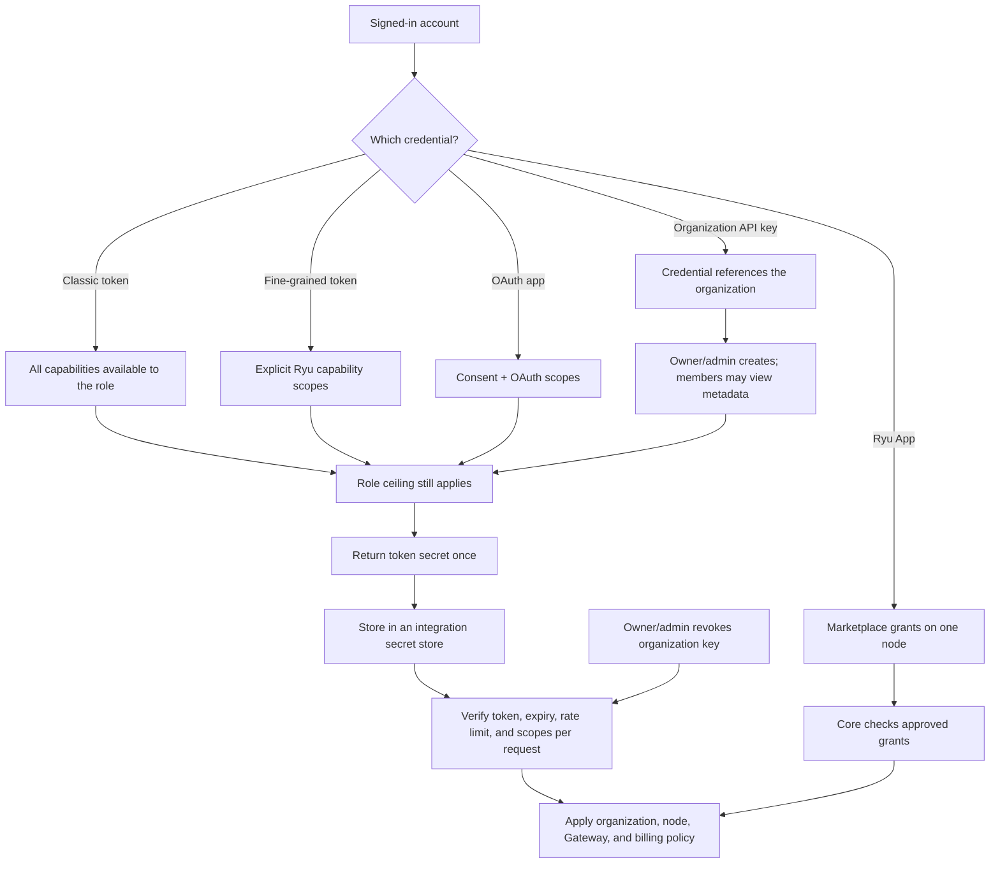

Ryu's organization roles can manage the Better Auth key record, but they do not grant Ryu
capability scopes. The control plane remains the authority for `resource:action` permissions, and a
requested key scope can only narrow the caller's server-side ceiling. Rotate a key when an
integration changes owners, and revoke it immediately if it may have been exposed.

## 12. Revocation and audit

Revocation is credential-specific. A user should revoke the layer that was lost instead of rotating
every credential in the system.

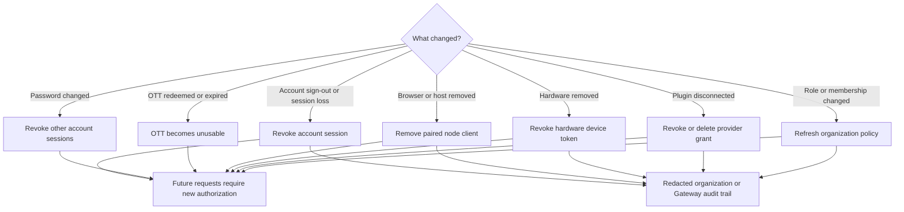

| Action | Stops | Does not automatically stop |
|---|---|---|
| Sign out or revoke an account session | That account bearer | A separately paired local node client |
| Change the account password | Other active account sessions | The current security-session flow or a separately paired local node client |
| Revoke a classic or fine-grained personal token | That personal integration | Other tokens or the account session |
| Revoke an organization API key | Every integration using that organization key | Other keys, sessions, or paired nodes |
| Revoke OAuth app consent | That app's access and issued tokens | The app registration itself |
| Delete an OAuth app | That app and its issued credentials | Other apps or the account session |
| Disable or uninstall a Ryu App | That app on the selected Core node | Its install on another node |
| Redeem or wait for an OTT to expire | That one app handoff | The browser session that created it |
| Remove a paired client | That client's access to one node | The user's cloud account |
| Remove hardware | That device's relay access | Other devices or the account session |
| Disconnect a plugin account | That provider connection | Other plugins or Ryu sign-in |
| Remove an organization member or role | Future org-scoped actions | Local-only node access unless separately revoked |

Ryu's organization audit view and Gateway audit trail are the product audit surfaces. They record
bounded, redacted control activity. Ryu does not currently claim full parity with Better Auth's
hosted Sentinel risk analytics; deployments that need retention, export, alerting, or additional
risk rules should build those as explicit Ryu policy features rather than treating an audit row as a
risk verdict.

## What is intentionally not combined

- **One-Time Token and hardware QR:** an OTT bridges an already-authenticated account session to an
  app; a hardware QR bootstraps a device-specific token.
- **Account session and node bearer:** the account belongs to the control plane; the node bearer
  admits a client to one Core instance.
- **Official MCP OAuth, direct Core MCP, and the stdio bridge:** hosted OAuth is
  exchanged for an exact-node delegation; direct managed Desktop requests use a
  short-lived `userJwt`; local/self-hosted direct MCP and the stdio bridge use a
  node bearer or pairing.
- **Plugin provider token and Ryu account session:** the provider token is sealed and sent only to
  its declared provider resource.
- **Organization membership and resource permission:** membership supplies context, while roles,
  scopes, entitlements, ACLs, and Gateway policy decide the requested action.

## Related documentation

<Cards>
  <DocCard href="/docs/surfaces/desktop/user-guide/account-security" />
  <DocCard href="/docs/extend/mcp/security" />
  <DocCard href="/docs/security/permissions" />
  <DocCard href="/docs/security/trust-model" />
</Cards>
