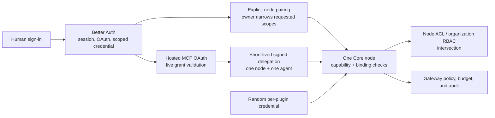

Ryu keeps credentials at the boundary where they are useful. An account session is not a node
credential, a node bearer is not a hardware token, and an MCP (Model Context Protocol) grant is not an organization-wide
permission slip.

This page is the map for every supported authentication journey. Each flow has four questions:

1. **Who proves their identity?**
2. **What credential is issued?**
3. **Which resource enforces it?**
4. **How is it revoked?**

## Credential map

| Credential or policy | Used by | Authorizes | Enforced by |
|---|---|---|---|
| **Account session** | Website, desktop, mobile, CLI, extension | A signed-in Ryu account and its memberships | Better Auth and the Ryu control plane |
| **Anonymous guest session** | Browser app | Temporarily disabled while the waitlist is active | Better Auth guest policy |
| **Device-grant bearer** | Desktop, mobile, CLI, extension fallback | A client session without a browser cookie | Better Auth's device authorization endpoint |
| **App handoff token** | Explicit website → extension or mobile handoff | One exchange for a client session bearer | Better Auth One-Time Token plugin |
| **Node bearer** | Core clients, remote desktop, local MCP bridge | One particular Core node | Core's node-auth and pairing layer |
| **Managed user JWT** | Desktop on an organization-bound managed node | The user's role plus organization, team, or personal-node scope | Core's JWKS verifier and route capabilities |
| **Hardware device token** | Paired Ryu hardware | One hardware device's relay connection | Core's hardware registry and relay |
| **Organization and team policy** | Cloud services and organization-bound nodes | Membership, roles, scopes, entitlements, budgets | Ryu control plane, Core ACLs, and Gateway |
| **Personal access token (classic or fine-grained)** | Scripts, integrations, and service clients | The Ryu capabilities minted onto that token | Better Auth API-key storage plus Ryu resource policy |
| **OAuth app or Ryu App grant** | User-owned OAuth clients or marketplace apps | The consented OAuth scopes or approved app grants | Better Auth OAuth plus Core app permissions |
| **Official MCP grant** | Remote MCP clients | Consented scopes for the official Ryu resource | Better Auth OAuth, hosted MCP, and Core delegation |
| **Plugin provider grant** | A plugin's remote MCP connection | One declared provider resource | Core OAuth broker and Identity Vault |

These credentials are deliberately not interchangeable. Signing in to Ryu does not silently pair a
local node, and pairing a node does not grant access to every organization or every other node. The
MCP endpoint choice and its credential are documented in [Ryu MCP](/docs/extend/mcp).

## The authorization chain

Ryu uses one human identity system and several deliberately separate workload credentials:

Better Auth is the authority for people, memberships, consented OAuth grants, and scoped credentials. It is
not a universal bearer for Core. A normal account session or OAuth access token cannot directly
control an unbound local or self-hosted node. A direct client must use the node's bearer or pair the
client. For an organization-bound managed node, Core also accepts the short-lived user JWT minted
from the current Better Auth session. A hosted MCP request instead exchanges its live OAuth grant
for a short-lived delegation bound to the exact destination.

Core then applies two independent filters: the credential's capability grant and the destination's
ACL or organization role. Effective access is their intersection. A broad organization role does
not widen a narrow client token, and a broad token does not bypass a node ACL.

### Paired capability bearers

Pairing requests declare scopes, optional identity/resource bindings, and an optional expiry. The
owner sees those values before approval and may remove scopes or shorten the expiry, but cannot
widen the request. New grants are restrictive by default; the node-owner bearer remains a separate
recovery and administration credential.

Core maps protected routes to a positive capability policy. Known read and mutation families use
different capabilities, MCP requests are also checked by JSON-RPC method, and unknown protected
routes fall back to owner-only. Revocation is per paired client, so removing one integration does
not require rotating the node-owner credential.

## Focused guides

Use the pages below to jump directly to the topic you need.

<Cards>
  <DocCard href="/docs/security/authentication-account" />
  <DocCard href="/docs/security/authentication-devices" />
  <DocCard href="/docs/security/authentication-mcp" />
  <DocCard href="/docs/security/authentication-organizations" />
  <DocCard href="/docs/security/authentication-tokens" />
</Cards>
