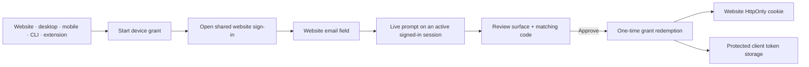
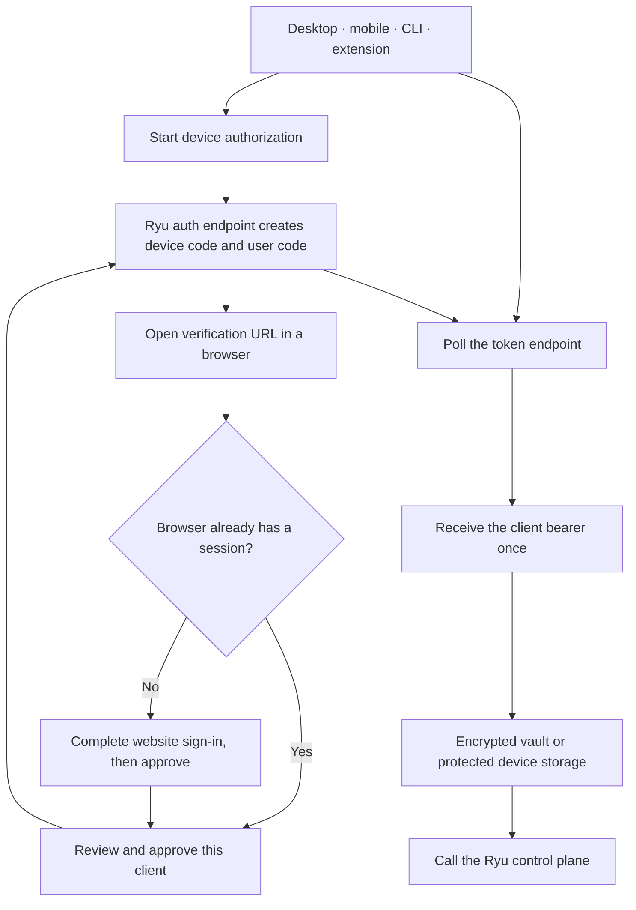
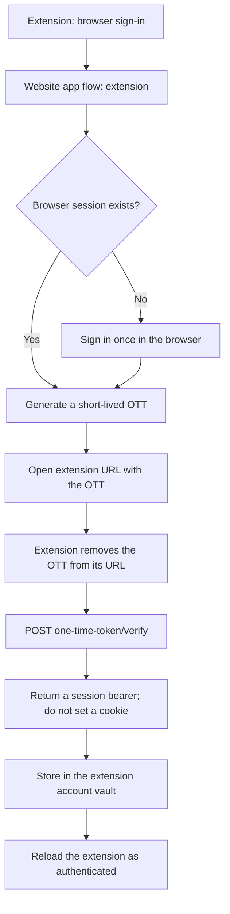
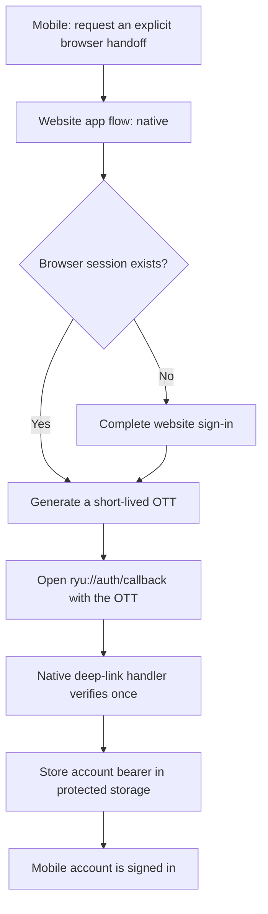
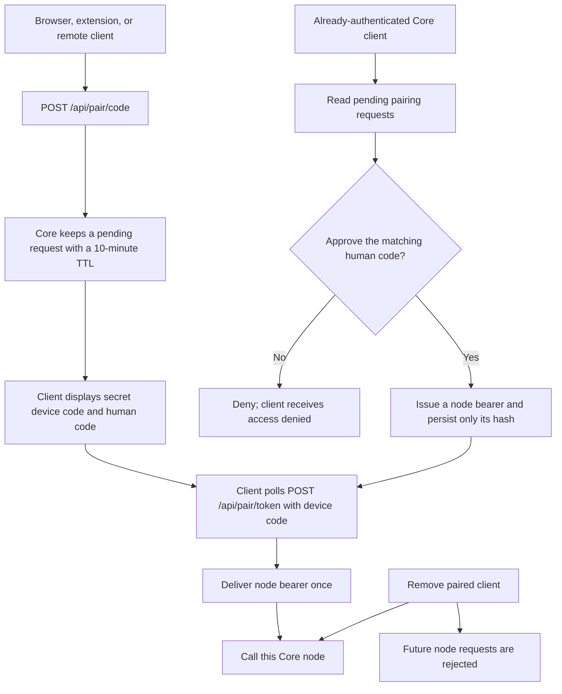
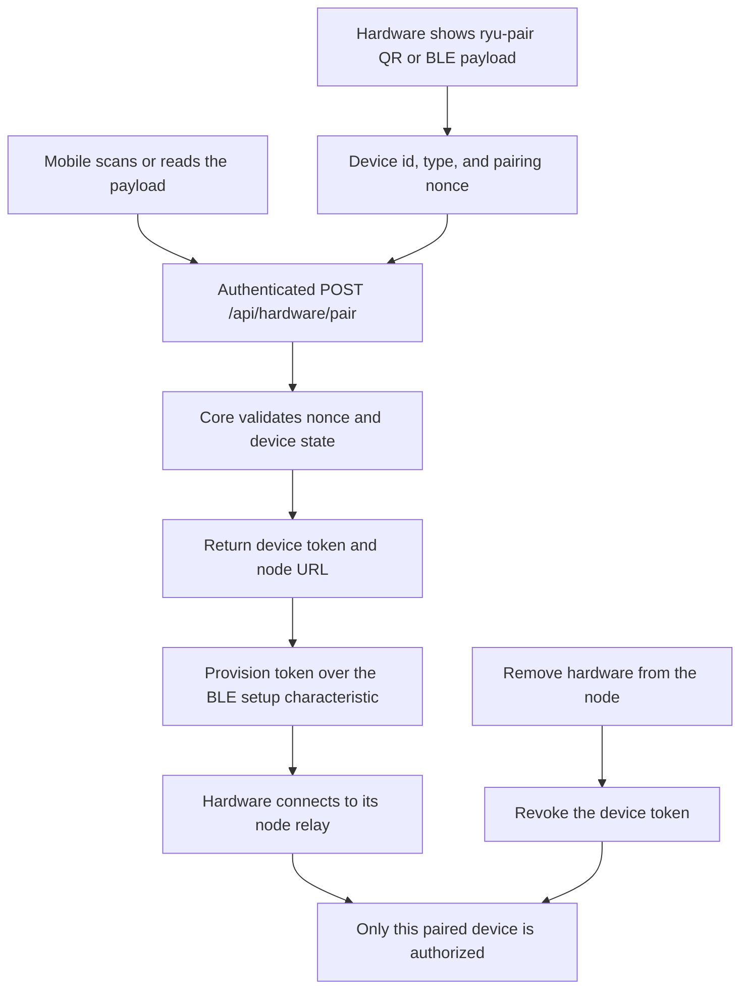

Part of the [Authentication and pairing](/docs/security/authentication-and-pairing) guide.

## 2. Website-centered approval for every client surface

The website is the shared human sign-in surface for desktop, mobile, the browser extension, and
CLI. Those clients do not duplicate the email field in their shells. They start a Better Auth device
grant, open the website with the client context, and show a short matching code while they wait.

If the account already has an active Ryu session, the website, desktop shell, extension, or foreground
mobile session receives an account-level approval prompt. The user reviews the requesting surface,
device label, and matching code before approving. The requester then receives a one-time session
grant. The website redeems its grant into the normal HttpOnly cookie; non-browser clients store their
bearer in protected local storage.

The prompt is deliberately account-scoped rather than node-scoped: a new client may not have a Core
node yet, and any already-signed-in session for the account can approve it. If no active session is
available, use the normal website sign-in methods or return to the code page later. Every request is
short-lived, one-time, and bound to its client id and account; an approval cannot pair a Core node or
authorize a different account.

## 3. Device authorization for desktop, mobile, CLI, and extension fallback

Device authorization is the shared sign-in path for clients that cannot use the website's cookie.
The desktop, MCP bridge, and extension can call the Ryu auth service directly. Mobile can start the
same flow through its connected Core node. In every case, the browser is where the human signs in
and approves the client; the client polls for its own bearer and stores it locally. This bearer
identifies the user to Better Auth. It does not replace the node bearer used by direct Core MCP.
Desktop may then exchange that signed-in session for the short-lived managed
`userJwt` returned by the control-plane node list; that derived credential is a
separate, scope-checked managed-node path.

The device bearer identifies the client session. It is not the Core node bearer. Signing out or
revoking the session stops future control-plane calls, while removing a paired node client is the
separate action that stops access to that node.

## 4. Browser extension auto-authentication

The extension's primary sign-in button opens the website with an explicit extension app flow. If
the browser already has a valid session, the website skips another login and asks Better Auth for a
short-lived One-Time Token (OTT). If it does not, the user signs in once in the browser and the same
handoff continues.

The OTT is single-use, expires after a short window, and is stored hashed by the server. The raw
session bearer is not placed in the extension URL. If browser handoff is unavailable, **Use an
approval code instead** runs the device-authorization flow.

The OTT is implemented by Better Auth's [One-Time Token plugin](https://better-auth.com/docs/plugins/one-time-token).

## 5. Explicit mobile web handoff

Mobile's normal sign-in remains device authorization. The native app also understands an explicit
`ryu://auth/callback` handoff when a web flow is opened for the mobile app. This is useful when a
browser session already exists and the user wants to bring it into the app without typing credentials
again.

This is a session handoff, not hardware pairing. A mobile hardware flow still uses the device
nonce and per-device token below.

## 6. Core node pairing

Node pairing is intentionally owned by Core rather than Better Auth. It works locally and can work
without an account or network round trip. A client that cannot read the node's own token requests a
short-lived pairing code; an already-authenticated client approves or denies the human-visible code.

Approval is itself authenticated. Pairing lets a trusted client vouch for another client; it does
not turn an unauthenticated request into an organization grant. Revoking the paired client removes
the node credential without changing the user's cloud account session.

## 7. Hardware QR and BLE pairing

Hardware pairing uses a device-specific nonce, not an account OTT. The mobile app must already have
node access to register the hardware. Core validates the nonce, returns a per-device token, and the
app provisions that token over the authenticated BLE setup channel.

An account session, device-grant bearer, or app OTT must never be substituted for the hardware
device token. The device token can be revoked without signing the user out everywhere.
