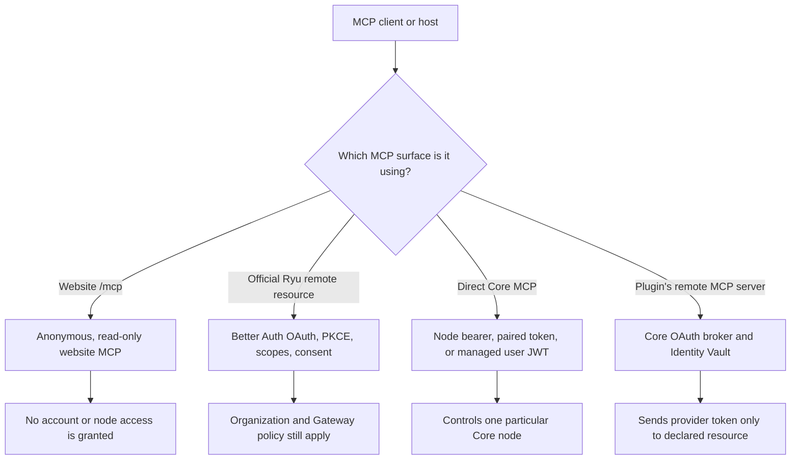
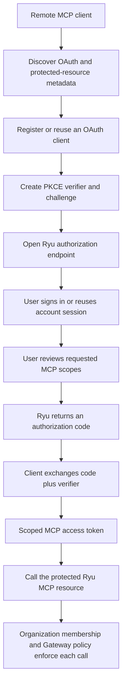
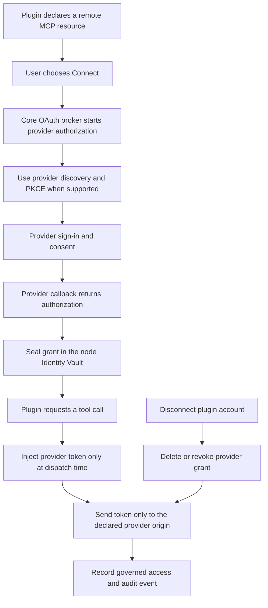

Part of the [Authentication and pairing](/docs/security/authentication-and-pairing) guide.

## 7. Choosing an MCP authentication boundary

Ryu has several MCP-shaped surfaces. They do not all need the same credential.

The public website MCP endpoint is intentionally anonymous and read-only. It is not the official
Ryu control plane and does not grant account or node access.

## 8. Official Ryu MCP OAuth

The official server-side MCP authorization service is the right place for a remote MCP client that
needs consented access to protected Ryu resources. The client discovers the authorization metadata,
uses PKCE, obtains user consent, and receives a scoped access token.

For a local or self-hosted direct Core MCP connection, use that node's bearer
or pairing flow. For a managed node selected by Desktop, Core accepts the
short-lived managed `userJwt` after checking organization, team, or personal
ownership. External MCP hosts should use this OAuth path; the hosted service
exchanges the grant for a short-lived exact-node delegation and does not forward
the original OAuth token to Core. See [MCP security](/docs/extend/mcp/security)
and the [Better Auth MCP plugin documentation](https://better-auth.com/docs/plugins/mcp).

## 9. Plugin remote MCP OAuth

When a plugin connects to another company's remote MCP server, the provider credential belongs to
that provider connection, not to the Ryu account session and not to the node bearer.

The model never receives the provider token. Removing the plugin connection revokes this provider
grant; it does not sign the user out of Ryu or revoke unrelated node clients.
