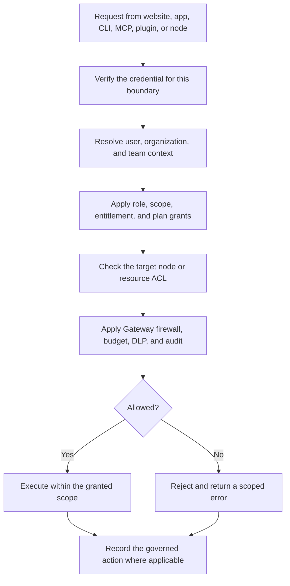

Part of the [Authentication and pairing](/docs/security/authentication-and-pairing) guide.

## 10. Organization and resource enforcement

Authentication answers **who is calling**. Authorization answers **what that caller may do here**.
Every protected request continues through the relevant resource and policy layers after a token is
validated.

An organization membership does not automatically authorize every node. A team role or MCP scope
must still be usable on the requested resource, and Core/Gateway checks remain in force for local
execution.

### Organization-owned feature controls

Organization owners and delegated feature managers can open **Organization → Features** to control
which Ryu surfaces are available inside that organization. The controls cover Marketplace apps and
plugins, engine browsing and updates, Bot and Console access, Ryu Box, Agent Inboxes, and
organization notifications.

Each feature has an organization default. A manager can also create a member-specific override for
one user; the effective value resolves as **member override → organization default → product
default**. Members can view their effective access but cannot change it. The Features page labels
each control as **API enforced** or **UI preference**: API-enforced controls are checked again by
their owning service, while UI preferences only control website presentation and do not replace
Core, node, or organization authorization at a mutation boundary. If the control-plane read fails,
the website hides organization-scoped surfaces until it can establish the effective value.

These controls are separate from Ryu's platform rollout flags. A platform rollout controls whether
Ryu exposes a capability globally; an organization control decides whether an organization lets its
own members use an available capability. An organization setting cannot enable a capability that
Ryu has not globally released, and it cannot change plan availability or billing entitlement.

### Signup password strength

Email/password signup uses one shared Zod policy in the browser and Better Auth server boundary. The
existing password field shows four live requirements — **at least 8 characters**, **one uppercase
letter**, **one number**, and **one symbol** — as a four-bar meter and checklist. Signup is rejected
until all four rules pass; passwords are never trimmed or normalized. Better Auth also keeps its
128-character maximum.

### Authentication request controls

Better Auth applies database-backed request rate limits to the auth service. Ryu keeps a 60-second
global window and adds stricter rules for protocol endpoints that can mint credentials or poll for
approval:

| Endpoint family | Limit |
|---|---:|
| OAuth token exchange | 30 requests per minute |
| OAuth client registration | 10 requests per minute |
| Device code, token, approve, or deny | 10 requests per minute per bucket |
| SCIM provisioning | 120 requests per minute |

Credential sign-in, sign-up, password-change, email, and verification routes also retain Better
Auth's built-in sensitive-route limits. The service resolves request IPs from `x-forwarded-for` by
default; deployments behind a proxy should set `BETTER_AUTH_TRUSTED_PROXIES` only to the proxy
addresses that they control. Never trust arbitrary forwarded headers from the public internet.
