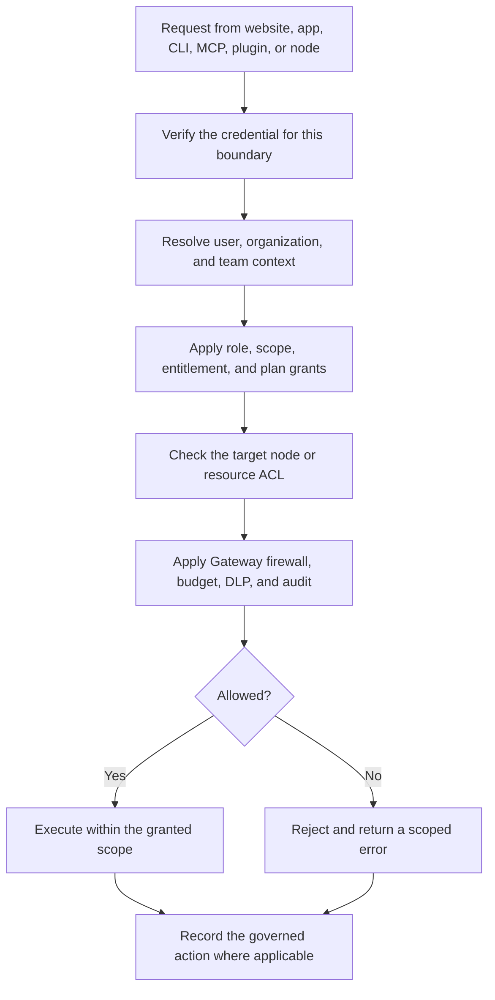

Part of the [Authentication and pairing](/docs/security/authentication-and-pairing) guide.

## 10. Organization and resource enforcement

Authentication answers **who is calling**. Authorization answers **what that caller may do here**.
Every protected request continues through the relevant resource and policy layers after a token is
validated.

An organization membership does not automatically authorize every node. A team role or MCP scope
must still be usable on the requested resource, and Core/Gateway checks remain in force for local
execution.

### Authentication request controls

Better Auth applies database-backed request rate limits to the auth service. Ryu keeps a 60-second
global window and adds stricter rules for protocol endpoints that can mint credentials or poll for
approval:

| Endpoint family | Limit |
|---|---:|
| OAuth token exchange | 30 requests per minute |
| OAuth client registration | 10 requests per minute |
| Device code, token, approve, or deny | 10 requests per minute per bucket |
| SCIM provisioning | 120 requests per minute |

Credential sign-in, sign-up, password-change, email, and verification routes also retain Better
Auth's built-in sensitive-route limits. The service resolves request IPs from `x-forwarded-for` by
default; deployments behind a proxy should set `BETTER_AUTH_TRUSTED_PROXIES` only to the proxy
addresses that they control. Never trust arbitrary forwarded headers from the public internet.
