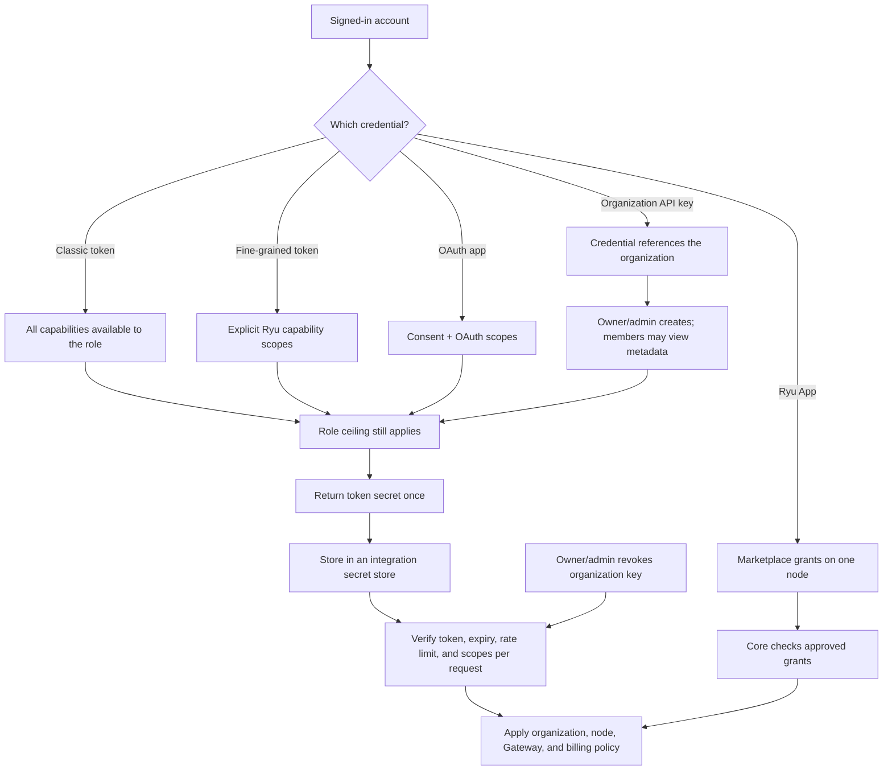
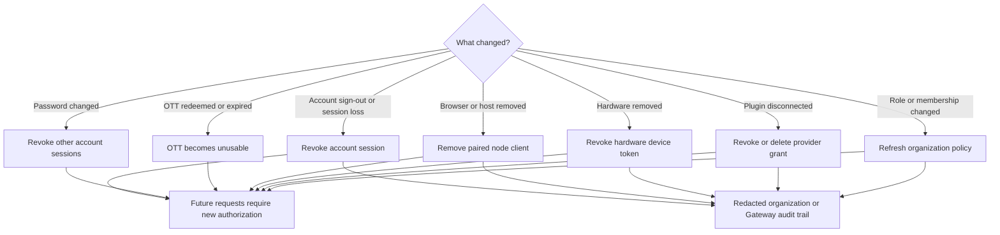

Part of the [Authentication and pairing](/docs/security/authentication-and-pairing) guide.

## 11. Personal access tokens, OAuth apps, and Ryu Apps

Ryu follows the useful part of GitHub's credential split:

- **Classic tokens** have the full Ryu capability set available to the account's role. They are
  meant for trusted scripts and local tooling. They never become a browser session and do not
  bypass organization roles or billing checks.
- **Fine-grained tokens** let you choose the exact Ryu capabilities a token can use. Ryu clamps
  every selection to the creator's server-side role ceiling.
- **OAuth apps** are user-owned OAuth 2.1 clients. Their owner chooses the web or native client
  type, redirect URIs, and the scopes the client may request. Ryu uses Better Auth's PKCE-first
  authorization-code flow, and a confidential client secret is shown only when the app is created
  or its secret is rotated. Revoking consent immediately invalidates that app's access and refresh
  tokens.
- **Ryu Apps** are marketplace apps installed on a particular Core node. Their permission grants
  and external OAuth connections belong to that node, so the desktop app shows them under
  **Settings → Ryu apps**. Installing a Ryu App and authorizing an OAuth app are separate actions.

Account settings keeps **Connections**, **Sessions & devices**, **Ryu apps**, and **OAuth apps**
separate. The OAuth apps view also contains the developer view for apps you registered and the
authorized OAuth grants you can revoke.

Organization API keys remain organization-owned credentials. Organization members can view their
metadata, while owners and admins create or revoke them. They continue working when the person who
created them leaves.

Ryu returns a personal or organization token's plaintext only at creation time. Store it in the
integration's secret store and do not paste it into chat, an issue, a browser URL, or a
client-visible log. List and audit views show only safe metadata such as the name, prefix, scopes,
creation time, expiry, and last use.

Ryu's organization roles can manage the Better Auth key record, but they do not grant Ryu
capability scopes. The control plane remains the authority for `resource:action` permissions, and a
requested key scope can only narrow the caller's server-side ceiling. Rotate a key when an
integration changes owners, and revoke it immediately if it may have been exposed.

## 12. Revocation and audit

Revocation is credential-specific. A user should revoke the layer that was lost instead of rotating
every credential in the system.

| Action | Stops | Does not automatically stop |
|---|---|---|
| Sign out or revoke an account session | That account bearer | A separately paired local node client |
| Change the account password | Other active account sessions | The current security-session flow or a separately paired local node client |
| Revoke a classic or fine-grained personal token | That personal integration | Other tokens or the account session |
| Revoke an organization API key | Every integration using that organization key | Other keys, sessions, or paired nodes |
| Revoke OAuth app consent | That app's access and issued tokens | The app registration itself |
| Delete an OAuth app | That app and its issued credentials | Other apps or the account session |
| Disable or uninstall a Ryu App | That app on the selected Core node | Its install on another node |
| Redeem or wait for an OTT to expire | That one app handoff | The browser session that created it |
| Remove a paired client | That client's access to one node | The user's cloud account |
| Remove hardware | That device's relay access | Other devices or the account session |
| Disconnect a plugin account | That provider connection | Other plugins or Ryu sign-in |
| Remove an organization member or role | Future org-scoped actions | Local-only node access unless separately revoked |

Ryu's organization audit view and Gateway audit trail are the product audit surfaces. They record
bounded, redacted control activity. Ryu does not currently claim full parity with Better Auth's
hosted Sentinel risk analytics; deployments that need retention, export, alerting, or additional
risk rules should build those as explicit Ryu policy features rather than treating an audit row as a
risk verdict.

## What is intentionally not combined

- **One-Time Token and hardware QR:** an OTT bridges an already-authenticated account session to an
  app; a hardware QR bootstraps a device-specific token.
- **Account session and node bearer:** the account belongs to the control plane; the node bearer
  admits a client to one Core instance.
- **Official MCP OAuth, direct Core MCP, and the stdio bridge:** hosted OAuth is
  exchanged for an exact-node delegation; direct managed Desktop requests use a
  short-lived `userJwt`; local/self-hosted direct MCP and the stdio bridge use a
  node bearer or pairing.
- **Plugin provider token and Ryu account session:** the provider token is sealed and sent only to
  its declared provider resource.
- **Organization membership and resource permission:** membership supplies context, while roles,
  scopes, entitlements, ACLs, and Gateway policy decide the requested action.

## Related documentation

<Cards>
  <DocCard href="/docs/surfaces/desktop/user-guide/account-security" />
  <DocCard href="/docs/extend/mcp/security" />
  <DocCard href="/docs/security/permissions" />
  <DocCard href="/docs/security/trust-model" />
</Cards>
