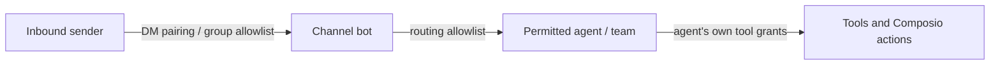

A channel (a chat surface, a bot connection, an inbound route) is an untrusted ingress: anyone who can find the bot can make it spend your model budget. Two independent layers gate it. **Access** decides whose messages are answered at all. **Routing allowlists** decide which agent a channel can address and, through that agent, which tools it can invoke.

Widening one does not widen the other.

## Access: who may talk to the bot

Every channel carries a DM policy and a group policy. They are separate because the consent that matters differs: a direct message is one person choosing to talk to your bot, while a group is a shared room where one member typing at the bot is not consent from everyone in it.

### Direct messages

| Policy | Behaviour |
|---|---|
| `pairing` (default) | An unrecognised sender is answered with a one-time **pairing code** and nothing else. Their message is not routed to any agent. Once an operator approves the code, that sender is paired and talks to the bot normally. |
| `allowlist` | Only pre-listed sender ids are admitted. Everyone else is dropped silently, with no enrolment path. |
| `open` | Every direct message is answered. Only appropriate when you are happy to pay for completions on behalf of anyone who finds the bot. |
| `disabled` | Direct messages are refused entirely; the bot works only in allowlisted groups. |

### Groups

| Policy | Behaviour |
|---|---|
| `allowlist` (default) | Only listed group/chat ids are served. |
| `open` | Any group the bot has been added to is served. |
| `disabled` | The bot never answers in groups. |

There is deliberately **no pairing flow for groups**. A pairing code proves one participant wants the bot; it says nothing about the rest of the room.

<Callout type="warn">
  Access is about *who is answered*. It is not a substitute for the routing allowlist below — a paired sender still reaches only the agent the channel is bound to, and only the tools that agent was granted.
</Callout>

## Why pairing replaced the bare allowlist

A channel with no configuration used to refuse every inbound message and explain itself only in a gateway log line. Enrolling someone meant reading their chat id out of that log and editing `RYU_CHANNEL_ALLOWED_USERS`. In practice that produced two bad outcomes: bots that appeared broken, and operators who set `RYU_CHANNEL_ALLOW_ALL=1` to make the problem go away.

Pairing keeps the property that mattered — **nobody is admitted until a human acts** — while moving enrolment out of the config file. The sender gets a code, the operator approves it, and the allowlist maintains itself.

The legacy environment variables still configure this:

| Environment | DM policy | Group policy |
|---|---|---|
| `RYU_CHANNEL_ALLOWED_USERS[_<PLATFORM>]` set | `allowlist` | `allowlist` (same list) |
| Unset, `RYU_CHANNEL_ALLOW_ALL=1` | `open` | `open` |
| Both unset | `pairing` | `allowlist` (empty, so closed) |

The per-platform key overrides the global one.

### Where pairing state lives

Paired senders are kept in a per-node file, not in the control-plane database. Two reasons: the same bot token running on another node is a different deployment with its own approvals, and the gateway must be able to gate inbound traffic **while the control plane is unreachable**. A gate that fails open when a dependency is down is not a gate.

A pairing code expires after 24 hours. Re-messaging the bot before then returns the *same* code rather than minting a second one, so an operator is never asked to choose between two codes that mean the same thing. A blocked sender never receives another code.

## Routing allowlists: what the channel can reach

Account-global, not node-scoped — they apply across nodes rather than being scoped to a single node. See [Channels in the Gateway dialog](/docs/gateway/channels) for where these are configured. A channel routes to a specific agent or team, and the allowlist on that route bounds the blast radius of whatever sends into the channel.

The channel cannot pick an arbitrary agent - only one its route permits - and the agent cannot reach a tool it was not granted. The layers compose.

## Composio is gateway-route-only

Composio actions are reachable only through the gateway route, never via a direct path that bypasses the allowlist. An agent's Composio actions are bound to its record, so a channel can only trigger them through an agent it is actually allowed to reach.

## Related

<Cards>
  <DocCard href="/docs/security/network-binding-auth" />
  <DocCard href="/docs/security/command-approval" />
  <DocCard href="/docs/gateway/channels" />
</Cards>
