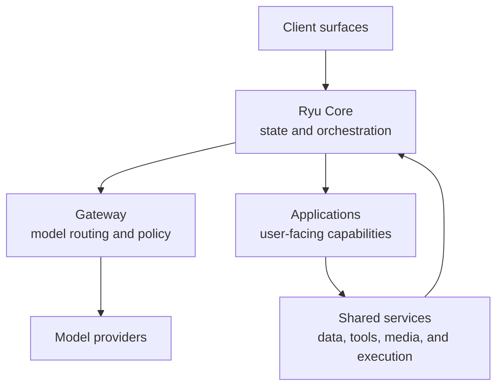
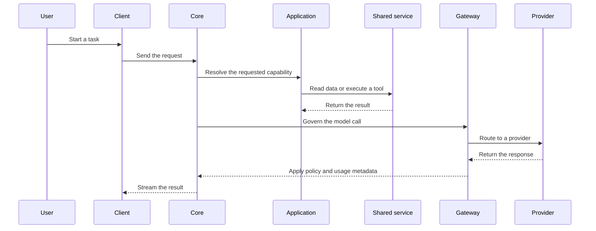

Ryu is organized in layers. The kernel/Core orchestrates runtime state, the Gateway governs model
calls, and applications build user-facing capabilities on top of those services.

This is a conceptual map of runtime responsibilities, not an inventory of internal packages. For
the supported extension points, see the [extension guides](/docs/extend/develop/extensions).

## The layer model

The Core owns conversations, identity, lifecycle, and the coordination of work. Shared services
provide durable data, tools, media, and execution capabilities. Applications compose those services
into product surfaces, while the Gateway keeps model calls governed and observable.

## Cross-layer dependencies

An application may request a shared service through the capability broker. The broker resolves the
service, applies grants and configuration, and keeps the application independent of a particular
implementation. Model calls always pass through the Gateway so routing, budgets, firewall rules, and
audit policy remain in one place.

## What remains in the kernel

Some responsibilities stay in Core because every authenticated request depends on them: session
coordination, lifecycle and capability resolution, identity, scheduling, and the connection to the
Gateway. Keeping those seams centralized avoids duplicated policy and lets applications remain
independently installable.

## Related

<Cards>
  <DocCard href="/docs/start-here/architecture/core-vs-gateway" />
  <DocCard href="/docs/start-here/architecture/runnable-model" />
  <DocCard href="/docs/extend/develop/extensions" />
</Cards>
