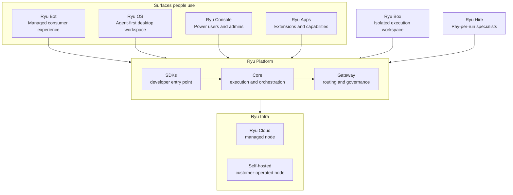

Ryu is one system with different surfaces for different jobs. **Ryu Bot** is the managed
consumer experience. **Ryu OS** is the agent-first desktop workspace. **Ryu Console** is the
power-user and admin workspace. **Ryu Gateway**, **Ryu Box**, and **Ryu Hire** are standalone
services that can also plug into the workspace. **Ryu Platform** is the developer layer. **Ryu Apps**
extend what Ryu can do. **Ryu Infra** is where the system runs: in Ryu Cloud or in your own environment.

These names describe different boundaries. They are not competing runtimes and they are not five
versions of the same interface.

## The product model

| Surface or layer | Audience | What it is for |
|---|---|---|
| **Ryu Bot** | Everyday teams | Use managed AI without configuring providers, nodes, or infrastructure. |
| **Ryu OS** | People moving between agent Apps | Arrange live work in a dock-and-window desktop with Mission Control. |
| **Ryu Console** | Power users and admins | Configure and operate a Ryu node, its models, tools, permissions, and Apps. |
| **Ryu Gateway** | Product teams and operators | Call models, tools, and Skills programmatically through a governed standalone service. |
| **Ryu Box** | Agent builders and operators | Give runs a persistent, isolated workspace for files, commands, and previews. |
| **Ryu Hire** | People with a one-off task | Recruit a managed specialist for one run and pay with credits, without installing it. |
| **Ryu Platform** | Developers and product teams | Build on the SDKs, Core, Gateway, orchestration, routing, and governance contracts. |
| **Ryu Apps** | Users, admins, and extension authors | Add packaged capabilities and user-facing surfaces to Ryu. |
| **Ryu Infra** | Operators and enterprises | Choose a Ryu-managed node in Ryu Cloud or run the node yourself. |

The public product pages are [Ryu Bot](https://ryuhq.com/bot), [Ryu OS](https://ryuhq.com/products/os),
[Ryu Console](https://ryuhq.com/console), [Ryu Gateway](https://ryuhq.com/products/gateway),
[Ryu Box](https://ryuhq.com/products/box), [Ryu Hire](https://ryuhq.com/products/hire), and
[Ryu Platform](https://ryuhq.com/platform).
Apps are documented in [Ryu Apps](/docs/extend/develop/extensions/ryu-apps). Deployment choices are
covered below rather than presented as another consumer interface.

## Ryu Bot

Bot is the fully managed consumer interface. A person creates an account, connects the sources
they approve, and gives Ryu work in plain language.

Bot intentionally does not expose:

- provider keys or model routing;
- node, Gateway, or infrastructure setup;
- evaluation and policy configuration;
- the full extension and operator surface.

Bot can still enforce simple access levels for the data and tools each Bot can use. The managed
workspace, model access, sandbox, and computer permissions remain controlled by Ryu and the
organization.

See [Ryu Bot Desktop](/docs/surfaces/desktop/bot) for the implementation-facing surface notes.

## Ryu Console

Console is the current Ryu desktop app under its public product name. It is the control surface
for people who need to understand and configure how Ryu runs work.

Console is where a power user or admin can:

- use a Ryu-managed model, a local model, or a provider they already pay for;
- configure a managed or self-hosted node;
- manage tools, Skills, Apps, permissions, and approval behavior;
- inspect runs, costs, context, and the records a workflow leaves behind.

Console gives access to controls that would make Bot noisy or unsafe for an everyday user. It is
not a separate runtime: it connects to the same Core and Gateway contracts used by the rest of
Ryu.

The technical desktop reference is [Ryu Console](/docs/surfaces/desktop). The [Island](/docs/surfaces/island)
is a separate companion surface and is not part of the Bot product.

## Ryu OS

Ryu OS is the desktop workspace view for people who want their agent Apps to feel like a place.
The dock opens Chat, Spaces, Tools, Skills, Apps, and Review as live windows. Mission Control
(`Cmd/Ctrl-K`) searches both Apps and open windows, so switching does not require closing the work
already in progress.

Ryu OS uses the same desktop tabs, Core sessions, Gateway policies, and permission checks as
Console. Its wallpaper and window chrome are presentation; they do not create a new runtime or
change what an App is allowed to do.

See [Ryu OS](/docs/surfaces/desktop/ryu-os) for the user-facing interaction model.

## Ryu services

The product realm also includes services that can be used without treating the desktop as the
only entry point:

- **Ryu Gateway** exposes governed model, tool, and Skill calls for an agent or another system.
  Programmatic execution still follows the allowlist, budget, and audit path described in
  [Programmatic tool calling](/docs/core/programmatic-tool-calling).
- **Ryu Box** provides a persistent, isolated execution workspace. It is the place a run works;
  it is not a model provider or a replacement for Gateway policy.
- **Ryu Hire** is the one-off path: choose a specialist, review the requested context and credit
  estimate, then run it without installing the agent or taking another subscription.

## Ryu Platform

Platform is the layer for building an AI product on Ryu rather than using Ryu only through its
interfaces.

### SDKs

The SDKs are the developer entry point. They let an application create sessions, call Ryu
capabilities, stream results, and connect its own interface to the runtime. SDKs are contracts;
they do not decide whether the underlying node is managed or self-hosted.

### Core

Core executes and orchestrates work. It owns the runtime behavior that turns a request into model,
tool, sandbox, memory, and workflow activity.

### Gateway

Gateway is the control point for calls entering and leaving Ryu. It handles concerns such as:

- model and provider routing;
- permissions and tool policy;
- budgets, rate limits, and cost visibility;
- firewall and data-boundary checks;
- evaluation hooks and audit records.

Core runs the work. Gateway governs the path. SDKs connect products to both.

See [Core vs Gateway](/docs/start-here/architecture/core-vs-gateway) for the ownership boundary
and [Gateway for any agent](/docs/gateway/gateway-for-any-agent) for the integration path.

## Ryu Apps

Apps are extensions, not another competing interface. An App can add a tool, workflow, data
surface, or interactive UI using Ryu's extension contracts.

Apps can be:

- installed and used from Bot when the capability is safe and simple enough for a managed user;
- configured and operated from Console;
- built and distributed by developers through Platform and the SDKs.

The App manifest and lifecycle are documented in [Ryu Apps](/docs/extend/develop/extensions/ryu-apps).

## Ryu Infra

Infra describes deployment, not product UX.

### Ryu Cloud

Ryu Cloud is the managed path. Ryu operates the node, the managed Core and Gateway, identity,
billing, and the surrounding operational services. Bot uses this path by default, while Console
and Platform can connect to the managed node when the account or organization allows it.

### Self-hosted

Self-hosted is the customer-operated path. The customer runs the Ryu node in its own environment
and controls its network, storage, model providers, and operational policies. Console can operate
the node, and Platform SDKs can build against it.

Managed and self-hosted are deployment choices for the same Ryu contracts. They are not separate
surfaces and they do not change what Core, Gateway, or the SDKs mean.

## Enterprise

Enterprise is a commercial operating model across Console, Platform, and Infra. Depending on the
deployment, it can include organization policies, SSO, provisioning, audit, private managed
infrastructure, self-hosting support, and service commitments.

Enterprise does not replace Bot, Console, or Platform. It determines how an organization governs,
deploys, and supports them.

## Which should I use?

| If you want to... | Start with... |
|---|---|
| Give AI everyday work without setting up a stack | [Ryu Bot](https://ryuhq.com/bot) |
| Arrange agent Apps in a desktop workspace | [Ryu OS](https://ryuhq.com/products/os) |
| Configure models, tools, permissions, or a Ryu node | [Ryu Console](https://ryuhq.com/console) |
| Call governed tools or Skills from another system | [Ryu Gateway](https://ryuhq.com/products/gateway) |
| Give a run an isolated persistent workspace | [Ryu Box](https://ryuhq.com/products/box) |
| Run a specialist once with credits | [Ryu Hire](https://ryuhq.com/products/hire) |
| Build an AI product on Core and Gateway | [Ryu Platform](https://ryuhq.com/platform) |
| Add a packaged capability or UI | [Ryu Apps](/docs/extend/develop/extensions/ryu-apps) |
| Decide where the node runs | [Ryu Infra](#ryu-infra) |
| Meet organization or deployment requirements | [Enterprise](#enterprise) |

## Related

<Cards>
  <DocCard href="/docs/start-here/architecture/core-vs-gateway" />
  <DocCard href="/docs/start-here/architecture/open-core" />
  <DocCard href="/docs/start-here/architecture/batteries-included" />
  <DocCard href="/docs/gateway/gateway-for-any-agent" />
  <DocCard href="/docs/extend/develop/extensions/ryu-apps" />
</Cards>
