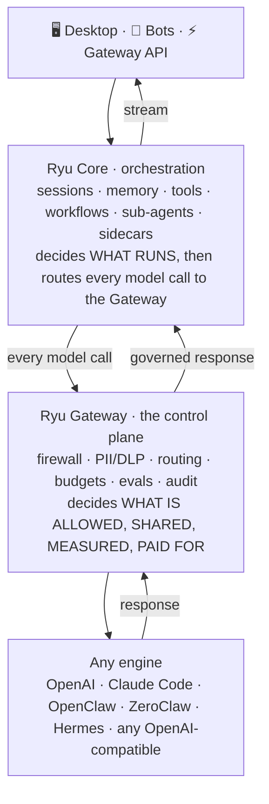
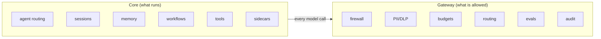
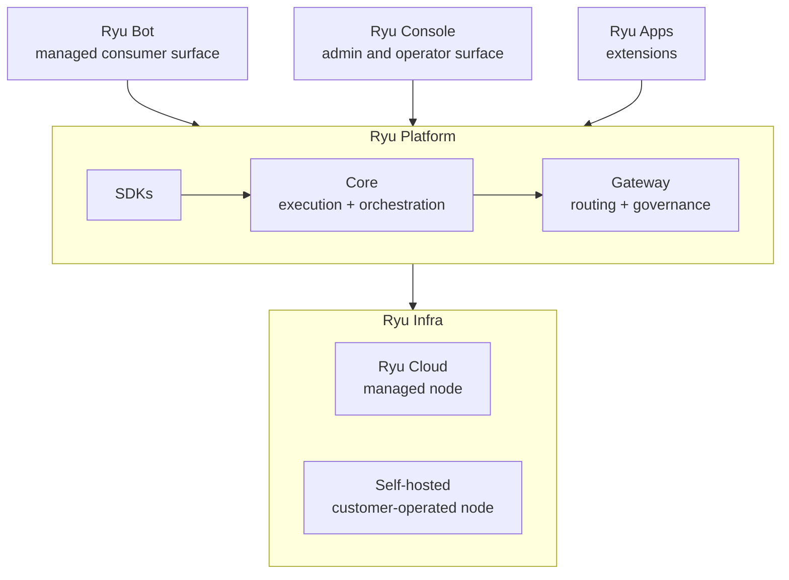

Ryu is a managed AI deployment platform for lean tech teams without a platform team. Bring the AI
agent or bot you already have, connect the tools and models it needs, and Ryu deploys it and keeps
it running in the cloud. The first deployment is designed to take minutes, not a new platform
project.

Agents are powerful, but using them should be straightforward. Engines already exist, including
OpenAI, Claude Code, OpenClaw, ZeroClaw, Hermes, and any OpenAI-compatible runtime. Ryu wraps them
with end-to-end infrastructure for AI agents.

The thesis is one sentence. Agents are commoditized; the orchestration and control layer around
them is not. The engines are interchangeable parts. What is durable is the layer that decides
what models an agent can reach, what tools it can use, what data is safe to send, what it costs,
how it is governed, and how good its outputs are. Ryu owns that layer.

## Nothing hardcoded, everything swappable

Ryu's wedge over the model vendors (OpenAI, Anthropic) and over every agent harness (Claude
Code, Codex, Pi, OpenClaw, LangChain, Mastra) is that we lock you to nothing. They own a model
and a harness. Ryu sits *above* all of them as the orchestration and control layer - the car
around any engine.

Every layer is a swappable default, never a lock:

| Layer | Pre-installed on a fresh install | Swap to |
|---|---|---|
| Chat and model | llama.cpp + Gemma 4 (local) | Ollama, vLLM, SGLang, MLX, any OpenAI-compatible, or a hosted provider |
| Embedding | `nomic-embed-text-v1.5` (GGUF, local) | any registry embedder |
| Reranker | BAAI `bge-reranker` | any registered reranker |
| RAG strategy | vector (sqlite-vec) | vector and GraphRAG |
| Agent engine | "Ryu" (Pi + the Gateway on top) | Claude Code, Codex, Gemini CLI, bare Pi, OpenClaw, Hermes, any ACP agent |
| Audio / Voice Recognition | OuteTTS, whisper.cpp / parakeet | KittenTTS, Pocket TTS, any Audio-sidecar backend |
| Image generation | stable-diffusion.cpp | any compatible engine |
| Sandbox backend | wasmtime (ephemeral) | Docker-detect (future) |
| Marketplace source | first-party + HF / skills.sh / MCP registry | any user-added `CatalogSource` |

The rule that produces this, in code: ship sensible defaults so it runs the moment you install,
but never hardcode a model, provider, or strategy. Everything routes through one swappable config
or registry. `DEFAULT_AGENT_ID` is `"ryu"`, the default chat model is overridable via the
`local-chat-model` preference, and even the data folder itself is relocatable
(see [Data and storage](/docs/surfaces/desktop/user-guide/data-and-storage)). This is `BYO everything,
zero lock-in` made literal.

## Orchestration above engines, not another engine

Ryu does not reimplement the agent loop. It wraps whatever engine you picked and hands every
model call to the Gateway for governance. The flow is the same on every request:

The single most important design rule, Core versus Gateway, falls straight out of this picture:
if code decides *what runs* it is Core; if code decides *what is allowed, shared, measured, or
paid for* it is Gateway. That split has its own page.

<Cards>
  <DocCard href="/docs/start-here/architecture/core-vs-gateway" />
  <DocCard href="/docs/start-here/architecture/runnable-model" />
  <DocCard href="/docs/start-here/architecture/capability-layers" />
</Cards>

## The five non-negotiable principles

Every change in Ryu is measured against these. They are why the architecture looks the way it does.

| Principle | What it means |
|---|---|
| **Orchestration-first** | Wrap whatever engine the user picked. Never reimplement the agent loop. |
| **Local-first and headless-first** | Core runs with no UI, no cloud, and no streaming required. It is a real local backend, not a thin client. |
| **Modular** | Everything beyond the gateway kernel is opt-in via config. |
| **BYO everything** | BYOA (agent), BYOK (key), BYOS (subscription). Zero lock-in. |
| **Encrypted by default, no telemetry by default** | Your data stays yours. Conversations and memory are sealed at rest; nothing phones home unless you opt in. |

<Callout type="info">
The local-first principle supports the governance layer. With no API key or setup, Ryu works
immediately and locally after install. See
[Batteries-included defaults](/docs/start-here/architecture/batteries-included) for what ships
out of the box, all of it swappable.
</Callout>

## Different surfaces, one Ryu system

Ryu separates the experience people use from the layers that make it run:

| Surface or layer | Audience | One-line pitch |
|---|---|---|
| 💬 **Ryu Bot** | Everyday teams | Managed AI without provider, node, or infrastructure setup |
| 🖥️ **Ryu Console** | Power users and admins | Configure and operate a Ryu node from the desktop |
| ⚡ **Ryu Platform** | Developers and product teams | Build on SDKs, Core, Gateway, orchestration, and routing |
| 🧩 **Ryu Apps** | Users, admins, and extension authors | Add packaged capabilities and interactive surfaces |
| ☁️ **Ryu Infra** | Operators and enterprises | Run Ryu Cloud managed or self-host the node |

Prompt-to-app builders solve a different layer. v0, Lovable, and Replit focus on generating,
iterating on, and publishing an application. A Ryu App is an installable extension that adds a
tool, workflow, data surface, or interactive widget to a running Ryu system, with the host keeping
the permission and Gateway path in control. A builder can create the project; Ryu Apps extend the
agent system that operates around it. See the public comparisons for [v0](https://ryuhq.com/compare/v0),
[Lovable](https://ryuhq.com/compare/lovable), and [Replit](https://ryuhq.com/compare/replit).

The business shape is open core plus managed cloud. Core and Gateway are the runtime and
governance contracts; Console is the operator UX; Ryu Cloud and self-hosting are deployment
choices. See [The Ryu product model](/docs/start-here/architecture/three-products) for the full
comparison and [Core vs Gateway](/docs/start-here/architecture/core-vs-gateway) for the ownership
boundary.

<Callout type="warn">
Ryu is a moving target. Some surfaces described across these docs are opt-in, off by default,
Cross-platform, or built but not yet live-verified against a running node. Each page carries its
own maturity caveats - read them before you rely on a feature, and treat a closed issue as a
claim, not proof.
</Callout>
